# 010：如何成熟你的应用安全项目

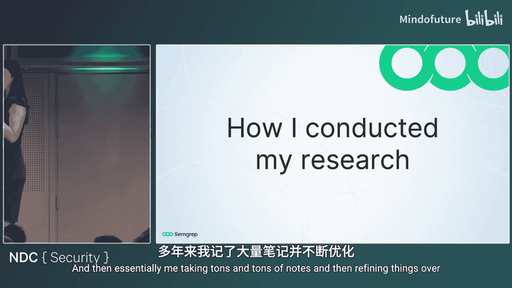

在本节课中，我们将学习如何评估和提升你的应用安全项目。我们将探讨三种常见的、但效果不佳的安全模型，分析它们失败的原因，并提供从零预算到充足预算的实用改进方案。目标是帮助你构建一个更有效、更高效且团队更满意的应用安全计划。

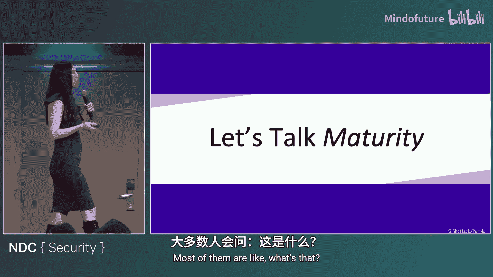

## 识别三种常见的安全模型

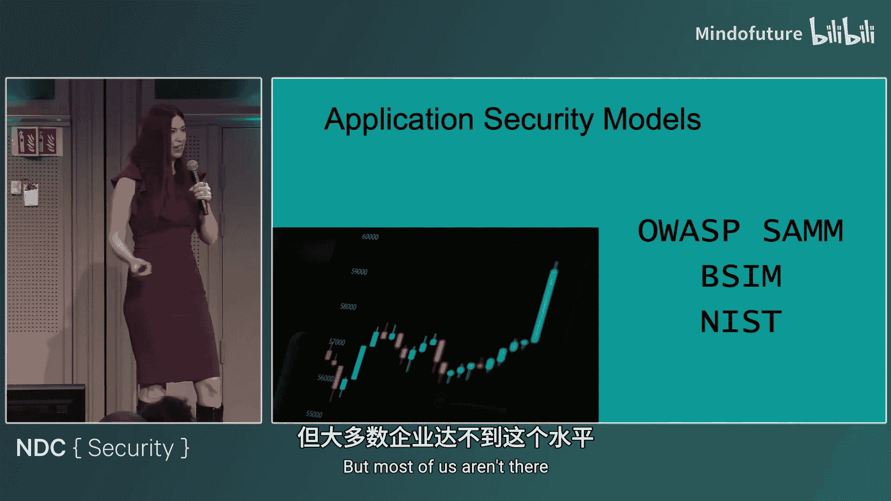

上一节我们介绍了课程概述，本节中我们来看看三种在实践中常见但效果不佳的应用安全模型。了解这些模型有助于你识别自己团队可能存在的问题。

### 模型一：仅对重要应用进行渗透测试

这种模型非常普遍，尤其是在资源有限的团队中。其核心做法是：每年仅对少数几个被视为“关键”或“高曝光度”的应用进行一次渗透测试，修复发现的高危漏洞，然后对其他大量应用的安全状况置之不理，直到下一年的测试周期。

这种模型通常伴随着以下特征：
*   **没有统一的系统开发生命周期**：各个开发团队使用不同的技术栈（如 Java, Ruby, Node.js）和开发方法（如敏捷、瀑布模型），导致安全实践难以统一。
*   **代码仓库分散**：代码存储在不同的平台（如 GitHub, Azure DevOps, GitLab），甚至有的团队使用陈旧的版本控制系统，增加了集中管理和自动化扫描的难度。

为什么这个模型效果不佳？主要问题在于**缺乏知识转移**。你花费重金聘请外部专家进行一次性的测试，但你的开发团队没有从中学习到如何避免同样的错误。没有配套的安全工具和流程支持，开发团队在下一次开发中很可能重复相同的安全漏洞。这就像每年请医生治疗一次重病，却不学习如何保持日常健康。

### 模型二：堆砌工具，但缺乏整合

这是目前最常见的一种模型。团队购买了大量的安全工具（如静态应用安全测试、动态应用安全测试、软件成分分析等），并试图将它们集成到开发流程中。

这种模型通常表现为：
*   **工具部分部署**：为大量开发者购买了许可证，但实际使用率极低（例如，仅9%的开发者会打开使用）。
*   **报告泛滥但修复率低**：各种工具生成大量漏洞报告，通过邮件分发给开发者，但真正被修复的问题寥寥无几。
*   **安全实践不一致**：安全团队可能只与少数几个“友好”或“高优先级”的团队深入合作，导致不同团队产出的代码安全水平参差不齐。
*   **缺乏有效沟通**：安全团队与开发团队沟通不畅，往往只是单向地发送漏洞报告，而没有坐下来共同讨论问题根源和解决方案。一个关键问题是：安全团队很少直接询问开发者“为什么不愿意修复这些漏洞？”

为什么这个模型效果不佳？因为你投入了大量资金，但安全状况却像**打地鼠游戏**一样零散且不可预测。工具未被充分利用，开发者感到沮丧，安全团队的努力未能转化为实际的安全提升，投资回报率很低。

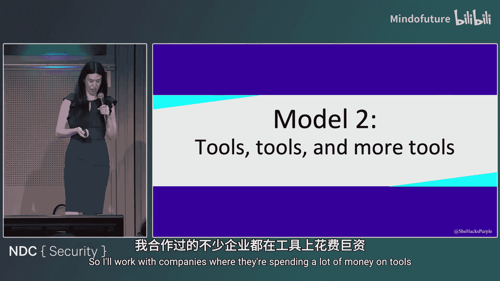

### 模型三：严格管控与巨额支出

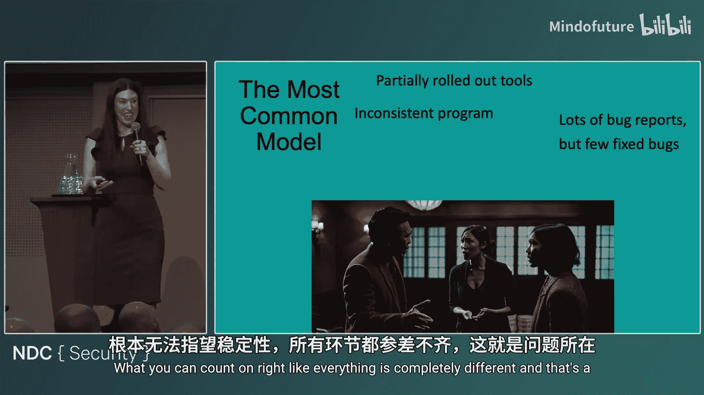

这种模型常见于大型、高度规范化的组织。安全流程被过度管控，充满了摩擦。

其特征包括：
*   **极高的流程摩擦**：即使是运行一次简单的扫描，也可能需要长达数周、涉及多级领导的审批流程，严重阻碍了工作效率和创新。
*   **工具齐全但效用低下**：拥有市场上几乎所有类型的安全工具（各种AST），但由于流程僵化，这些工具无法发挥应有作用。
*   **团队关系紧张**：安全团队与开发团队处于对立状态，沟通往往不愉快、不专业。双方都不满意，人员流失率高。
*   **安全状况并不令人满意**：尽管预算可能高达七位数，但过度复杂的治理结构使得团队无法灵活应对威胁，实际安全水平并未与投入成正比。

为什么这个模型效果不佳？因为它制造了**普遍的痛苦**，扼杀了敏捷性和协作精神。人们会因此离职，而组织并未获得与之匹配的安全收益。

## 如何改进你的安全模型

上一节我们分析了三种问题模型，本节中我们来看看如何针对性地改进它们，无论你的预算是多少。

### 成熟模型一：从零预算开始

如果你的团队处于“仅做渗透测试”的阶段且预算有限，可以采取以下免费或低成本措施来显著提升安全水平：

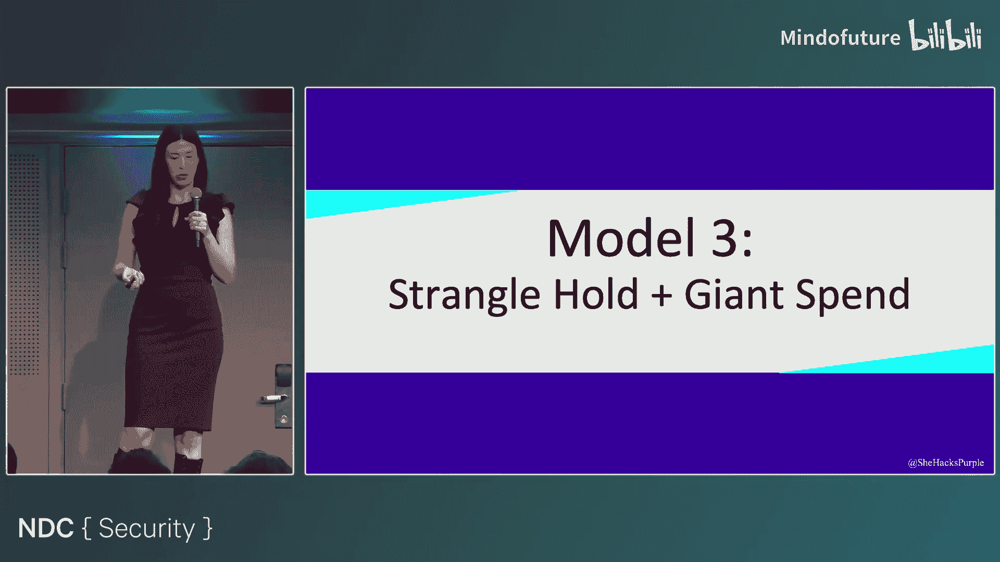

以下是零预算改进方案的具体步骤：
1.  **利用优秀的免费工具**：社区提供了大量强大的开源安全工具，例如 **Burp Suite (社区版)**、**OWASP ZAP**、**Bandit** (Python)、**FindSecBugs** (Java)、**npm audit** (Node.js)等。安全人员可以研究并推广这些工具给开发团队使用。
2.  **创建安全编码规范**：编写一份简明扼要的文档，告诉开发者你们期望的安全编码实践。明确的要求能大大提高获得预期结果的可能性。
3.  **制定安全需求清单**：在项目启动时，为不同类型的项目（如API、Web应用）提供一份核心安全需求清单。这能在开发初期植入安全考量。
4.  **尝试统一代码仓库**：尽可能将代码集中到同一平台（如统一的GitLab或GitHub企业实例）。这能极大简化自动化安全扫描的部署和管理。
5.  **推动统一的开发流程**：努力让各团队采用相似的系统开发生命周期（如都转向敏捷/DevOps）。流程一致后，安全实践才能更容易地集成进去。
6.  **对关键应用进行简易威胁建模**：无需复杂模型。可以采用 **“四问题框架”**：`我们正在构建什么？` `可能出什么问题？` `我们要怎么做？` `我们做得够好吗？`。围绕关键应用进行一小时的讨论就能获得巨大价值。
7.  **分享历史安全事件**：坦诚地与开发团队讨论过去发生的、与软件相关的安全事件。说明原因、影响及教训。这能极大地提升开发者的安全意识和参与度。
8.  **扫描代码中的秘密**：使用免费工具（如 **TruffleHog**, **Gitleaks**）扫描代码库，查找并移除硬编码的密码、API密钥等敏感信息，改用程序化方式访问。
9.  **为“重病”应用部署WAF**：对于漏洞太多、短期内无法彻底修复的应用，可以部署一个免费的Web应用防火墙（如 **ModSecurity**）作为临时“创可贴”，提供基础防护，为彻底修复争取时间。

完成以上步骤后，当你再次进行渗透测试时，报告将不再令人绝望。漏洞数量会减少，团队也有更多时间进行高质量修复。更重要的是，你的团队在整个过程中学到了知识，能力得到了提升。

### 成熟模型二：合理利用预算

如果你的团队已经在工具上投入但效果不彰，下一步是优化现有投资，并加强“人”的因素。

以下是拥有一定预算后的优化策略：
1.  **坚持基础工作**：继续执行零预算方案中的所有有效实践。
2.  **招聘专职应用安全人员**：这是最佳投资之一。招聘一位全职、懂技术、善于与开发者沟通的应用安全工程师。他能将许多免费方案落地执行。
3.  **投资付费的SAST工具**：在各类工具中，付费的静态应用安全测试工具通常能带来最大提升。它们比免费工具误报率更低，能提供更可信、更可操作的报告，从而建立安全团队的信誉。公式：`高质量报告 = 更少的误报 + 更可信的建议`。
4.  **重新评估所有工具**：利用续约周期，审视每个工具的使用率、开发者反馈和实际效果。与供应商重新谈判价格，或更换为更受团队欢迎、集成度更好的工具。
5.  **确保工具完全部署**：如果你为100个许可证付费，确保至少有90个被有效使用。与开发者沟通，找出使用障碍并解决。
6.  **提供建议和支持**：努力成为开发团队**可信赖的安全顾问**，而不仅仅是漏洞报告者。当开发者遇到安全疑问时，愿意放下手头工作提供帮助。这将彻底改变双方的合作关系。
7.  **建立规范的事件响应流程**：
    *   创建便捷的事件上报渠道。
    *   培训开发者和运维人员识别软件安全事件。
    *   制定清晰的事件响应流程，并确保所有相关方都了解自己的职责。
8.  **考虑扩展团队**：当从1人扩展到2人时，建议招聘两种不同类型的人才：一名**技术精湛的渗透测试员**和一名**善于沟通、流程构建和自动化的“亲和型”安全工程师**。两者结合能覆盖应用安全的各个方面。

### 成熟模型三：打破僵局，实现卓越

对于陷入过度管控和巨额支出的团队，目标是减少摩擦，提升效率，让安全成为赋能者而非阻碍者。

以下是向卓越安全项目迈进的关键步骤：
1.  **扩展你的项目规模**：通过招聘更多“亲和型”安全工程师，或启动一个**安全冠军计划**，让每个开发团队都有一名对接人，从而将安全影响力规模化。
2.  **将指南升级为标准**：将运行良好的安全实践（如安全编码指南）从“建议”升级为“公司标准”。这为新项目设定了明确的安全基线，并辅以支持帮助团队达标。
3.  **致力于提升开发速度**：将“为开发者提速”作为核心目标。自动化一切可以自动化的工作（如扫描、部署安全检查），提供自助服务工具。开发者会因此喜爱安全团队。
4.  **为特定技术制定专项方案**：为API、Serverless、GraphQL等特定技术栈制定专门的安全要求和工具链。
5.  **全面推行威胁建模**：将安全左移，在设计和架构阶段通过威胁建模发现并修复设计缺陷。这是花费巨额预算后值得大力投入的领域。
6.  **建立企业级秘密管理策略**：制定全公司统一的秘密管理政策，使用集中但隔离的密钥库，并设置提交前钩子防止秘密误提交。
7.  **实现持续自动化扫描**：将所有安全工具配置为对生产环境进行定期、自动化的扫描（如每周扫描代码秘密），并将告警自动化。目标是“自动化所有重复性工作”。
8.  **提供多样化的、不枯燥的培训**：针对大型团队，提供多种形式的培训（书籍、视频、音频、线下工作坊），考虑不同的学习风格和可访问性。
9.  **升级防护措施**：考虑将基础的WAF替换为更先进的**运行时应用自保护**或下一代智能WAF，并正确配置以同时防御入侵和数据外泄。
10. **专门处理应用安全事件**：确保事件响应团队接受过软件安全事件识别的培训，或有应用安全专家参与响应过程。
11. **采用数据驱动的方法**：为你的安全项目设定明确的、可衡量的目标（如“将关键漏洞平均修复时间缩短20%”），并持续收集和分析数据，用数据指导决策和优化工作。

## 总结与资源

本节课中我们一起学习了三种常见的应用安全项目模型及其缺陷，并探讨了从零预算到充足预算情况下如何逐步成熟和改进这些模型。核心在于从被动的、基于合规的检查，转向主动的、嵌入开发流程的、以支持和协作为核心的安全实践。

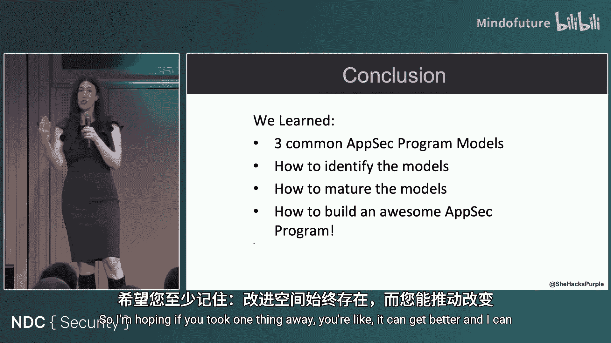

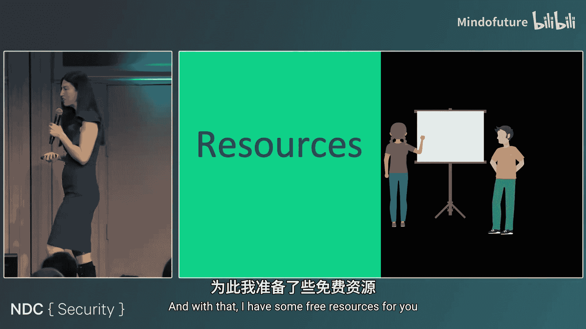

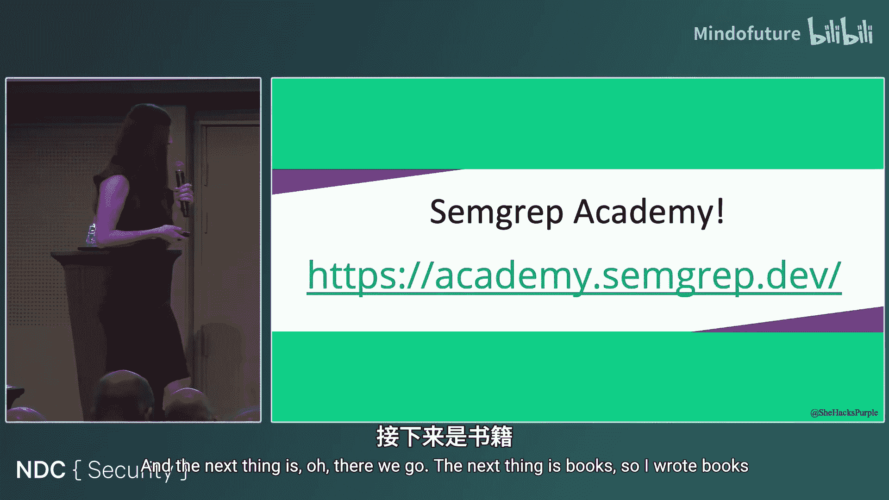

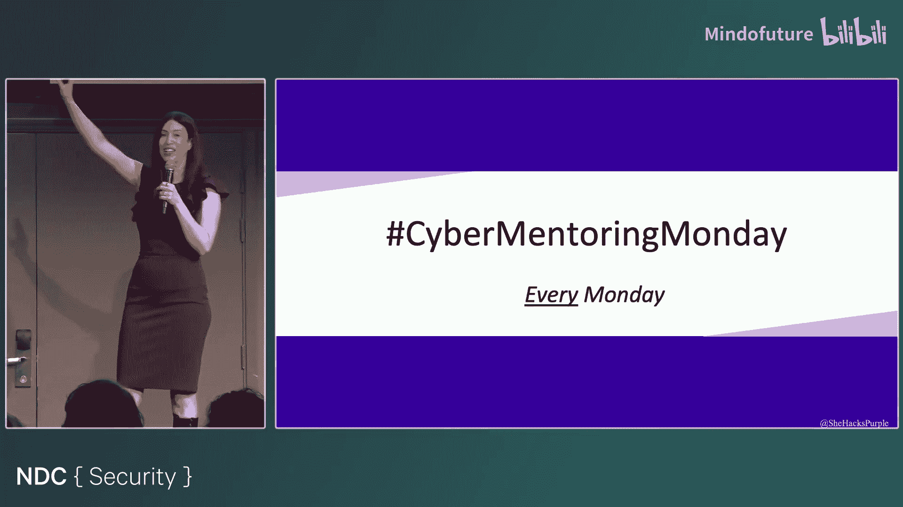

记住，无论起点如何，持续改进都是可能的。关键步骤包括：统一流程、加强沟通、善用工具（免费或付费）、自动化重复任务，并最终通过度量和目标来驱动项目走向卓越。

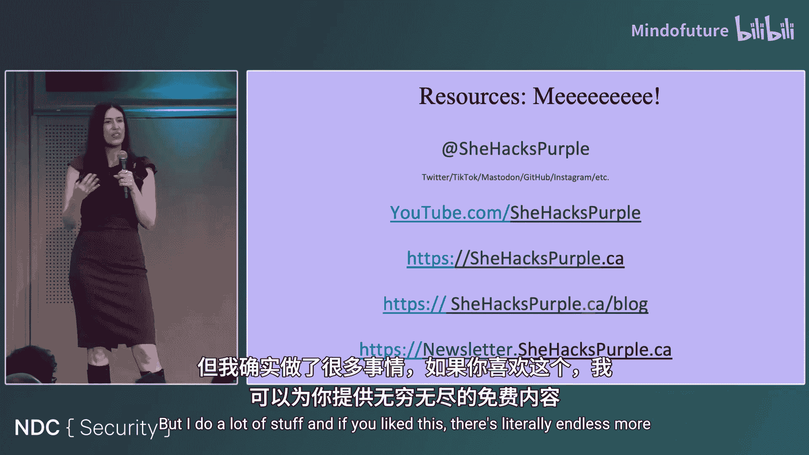

**免费资源**：
*   **SheHacksPurple Academy**：提供免费的应用程序安全、事件响应等在线课程。
*   **Cyber Mentoring Monday**：在社交媒体上使用此标签，寻找或提供职业导师机会。
*   **TLDR Sec Newsletter**：免费订阅，每周汇总最新的安全研究简报。

**作者信息**：Tanya Janca (SheHacksPurple)，开发者布道师，多本应用安全书籍作者，致力于让安全更易于理解和实施。

---
**总结**：构建成熟的应用安全项目是一个旅程。从识别当前所处模型开始，采取渐进式步骤——无论是利用免费工具、优化现有投资，还是打破组织壁垒——你都能显著提升软件的安全性、团队满意度，并最终获得更好的投资回报。安全不是终点，而是一个持续改进的过程。