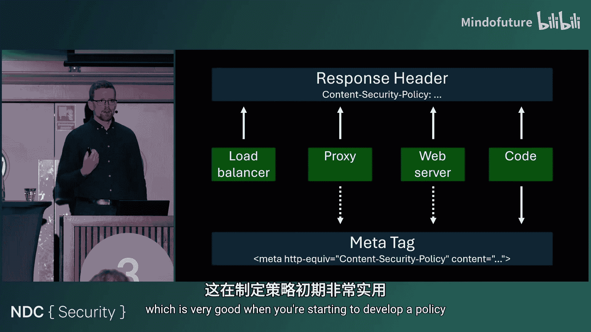
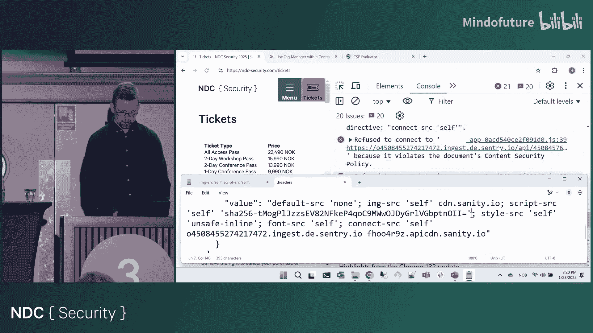
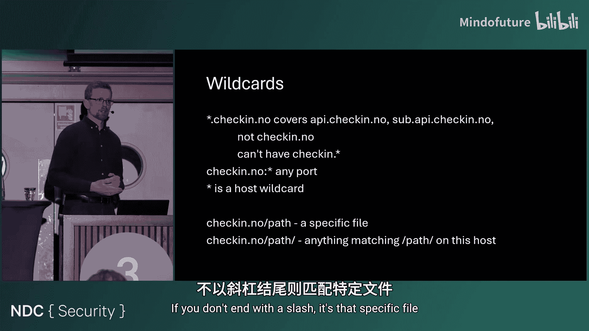
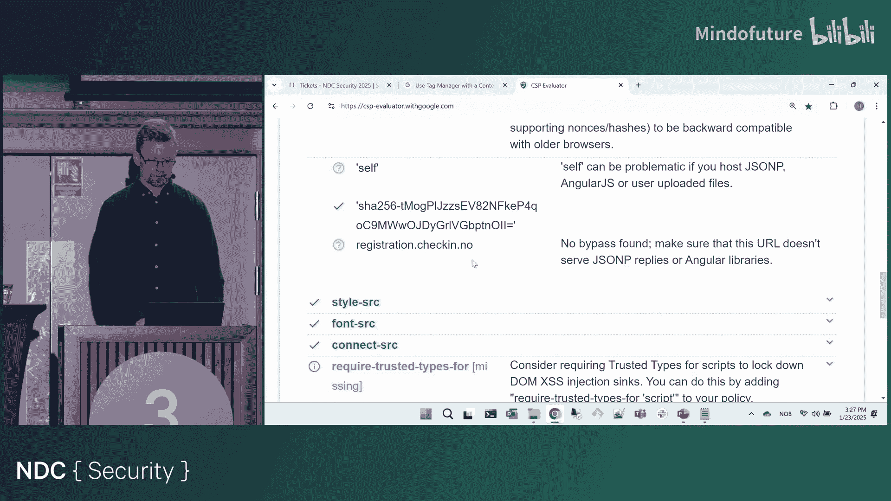
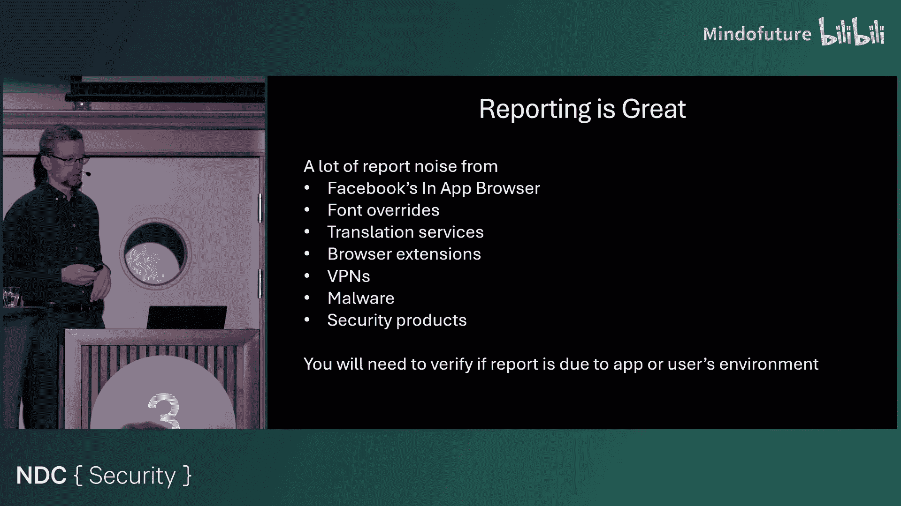
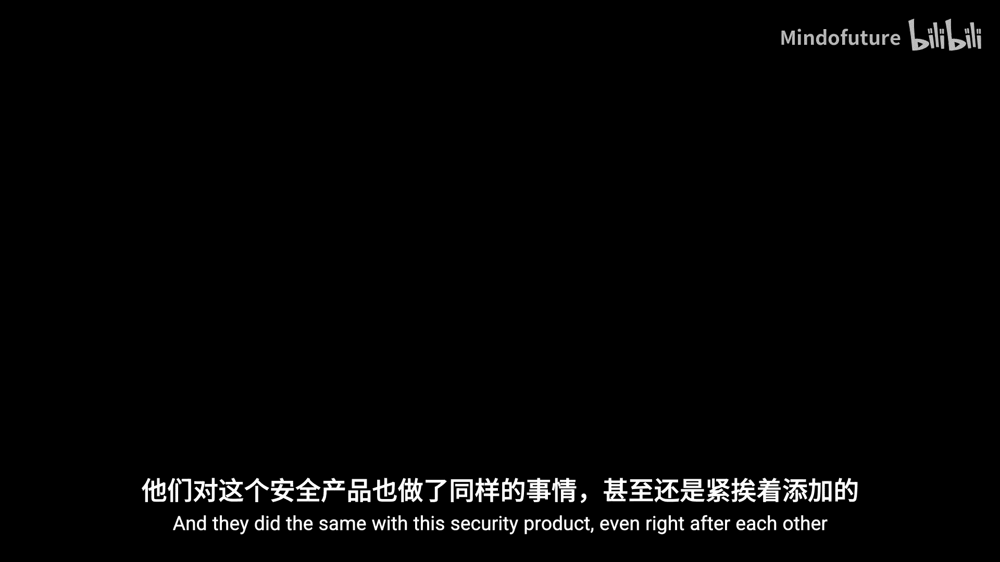
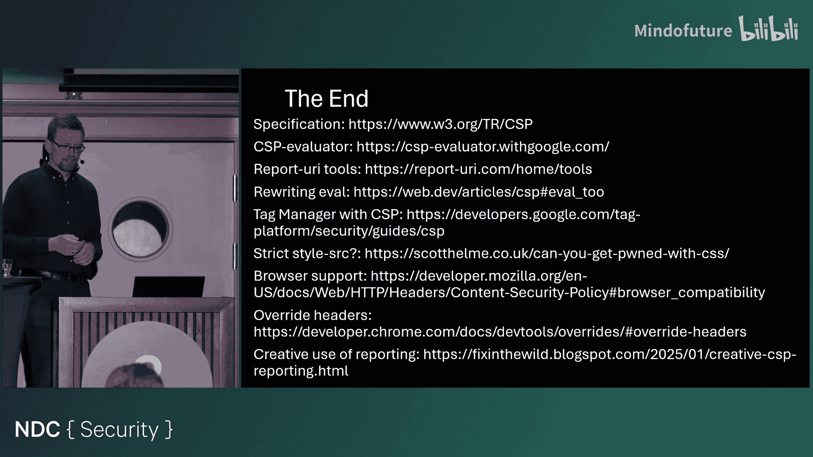

# 011：从入门到精通 🛡️


在本课程中，我们将学习内容安全策略 (CSP)。CSP 是一种强大的安全机制，用于保护你的 Web 应用免受跨站脚本 (XSS) 等多种威胁。我们将从基础概念开始，逐步深入到高级用法，包括如何构建、测试和优化一个有效的 CSP。

## 1：CSP 简介与核心概念

CSP 是一种通过 HTTP 响应头或 `<meta>` 标签传递给浏览器的安全策略。浏览器会强制执行此策略，以控制页面可以加载哪些资源。

CSP 的核心是**指令**和**源**。指令控制不同类型的内容，而源定义了这些内容可以来自哪里。

一个典型的 CSP 头看起来像这样：
```
Content-Security-Policy: default-src 'self'; script-src 'self' https://trusted.cdn.com;
```

在这个例子中：
*   `default-src 'self'` 是指令，它规定默认情况下只能从同源加载资源。
*   `script-src 'self' https://trusted.cdn.com` 是另一个指令，它允许脚本从同源和指定的 CDN 加载。

## 2：CSP 如何工作

让我们通过一个简单的网页例子来理解 CSP 的工作原理。

想象一个包含以下内容的网页：
*   来自同源的图片 (``)
*   来自外部域的脚本 (`<script src="https://xyc.com/lib.js">`)
*   内联样式 (`<style>body {color: blue;}</style>`)
*   一个 Data URL 图片 (``)

如果没有 CSP，所有内容都会正常加载。

现在，我们应用一个非常严格的 CSP：`default-src ‘none’`。这意味着“不接受任何来源”。结果，页面上所有内容都会被阻止加载。

这显然过于严格。我们可以将其改为 `default-src ‘self’`，允许同源资源加载。此时，同源的图片可以加载，但外部脚本、内联样式和 Data URL 仍然被阻止。



我们可以进一步细化策略。例如，添加 `script-src https://xyc.com` 来允许该特定域下的脚本。或者，使用 `style-src ‘self’ ‘unsafe-inline’` 来允许同源和内联的样式。

**关键点**：浏览器会为每个资源检查最具体的指令。例如，一个脚本会先检查 `script-src` 指令，如果该指令不存在，才会回退到 `default-src`。

## 3：策略级别、模式与指令分类



CSP 有三个级别（可理解为版本）。目前主流浏览器已普遍支持 CSP Level 3，因此我们可以专注于 Level 3 的特性。

策略有两种模式：
*   **强制执行模式** (`Content-Security-Policy`)：策略会被浏览器强制执行，违规资源将被阻止。
*   **报告模式** (`Content-Security-Policy-Report-Only`)：策略不会被强制执行，但所有违规行为都会生成报告发送到指定端点。这对于开发和测试策略非常有用。



CSP 指令主要分为几类：
*   **Fetch 指令**：控制页面可以加载哪些资源（如 `script-src`, `style-src`, `img-src`, `connect-src`）。这是我们关注的重点。
*   **文档指令**：控制页面的某些属性（如 `base-uri`）。
*   **导航指令**：控制页面可以跳转到哪里或可以被谁嵌入（如 `form-action`, `frame-ancestors`）。
*   **报告指令**：控制违规报告如何发送（如 `report-uri`）。
*   **其他指令**：一些特殊用途的指令，如 `upgrade-insecure-requests`（将 HTTP 请求升级为 HTTPS）。

## 4：源列表详解

指令的值由**源列表**构成。以下是一些关键的源关键字和模式：

*   `‘none’`：明确表示不匹配任何源。
*   `‘self’`：匹配当前页面的源（协议、域名、端口）。注意：它包含从 HTTP 到 HTTPS 的升级，以及到默认端口的匹配。
*   **主机源**：例如 `https://example.com`。你可以指定协议、主机名、端口和路径。
    *   `https://*.example.com`：使用通配符匹配所有子域名。
    *   **重要**：通配符 `*` 仅用于主机部分，不能用于协议（如 `*://example.com` 是无效的）。
*   **协议源**：例如 `https:` 或 `data:`。这类源范围很广，应谨慎使用。
*   **脚本和样式专用源**：
    *   `‘unsafe-inline’`：允许内联的 `<script>` 块或 `<style>` 块。**这会严重削弱 CSP 对 XSS 的防护能力**。
    *   `‘unsafe-eval’`：允许使用 `eval()`、`setTimeout(string)` 等动态代码执行函数。
    *   `‘nonce-<base64-value>’`：允许携带特定随机数（nonce）属性的脚本或样式标签。
    *   `‘<hash-algorithm>-<base64-value>’`：允许哈希值与指定值匹配的内联脚本或样式。



## 5：实战构建 CSP 策略

上一节我们介绍了 CSP 的组成部分，本节中我们来看看如何为一个真实网站（以 NDC 安全大会门票页面为例）从头开始构建一个 CSP。

我们将使用 Chrome 开发者工具的 “Override Headers” 功能来模拟添加 CSP 头，这是一个非常便捷的开发方法。

**初始策略**：我们从最严格的策略开始：`default-src ‘none’`。应用后，页面完全无法加载，因为所有资源都被阻止。

**逐步放宽**：我们需要根据浏览器控制台的错误报告，逐步添加必要的源。
1.  首先允许同源的基本资源：`img-src ‘self’; script-src ‘self’; style-src ‘self’; font-src ‘self’; connect-src ‘self’`。
2.  页面部分加载，但控制台报告内联样式错误。我们添加 `‘unsafe-inline’` 到 `style-src` 来暂时允许它们（后续应优化）。
3.  接着处理脚本错误。对于内联脚本，控制台会提供其 SHA 哈希值。我们可以将该哈希值（如 `sha256-...`）添加到 `script-src`。
4.  处理外部资源：根据错误，逐步将必要的域名添加到相应的指令中，例如 `img-src https://cdn.sanity.io`， `connect-src https://sentry.io`， `script-src https://checkin.no`。
5.  使用通配符简化多个子域名：`script-src https://*.checkin.no`。

**处理第三方服务**：像 Google Tag Manager 这样的服务需要添加多个特定域名到 `script-src` 和 `connect-src`。Google 提供了详细的文档说明所需的配置。

**最终检查**：在策略基本构建完成后，使用在线工具（如 Google 的 [CSP Evaluator](https://csp-evaluator.withgoogle.com/)）进行评估，它可以指出策略中可能存在的安全弱点或配置问题。

## 6：防御 XSS 与高级脚本控制

CSP 的主要目标是防御跨站脚本攻击。为了实现这一目标，我们需要对脚本加载进行严格管控。

**避免使用 `‘unsafe-inline’`**：允许内联脚本意味着攻击者可以利用注入点直接执行恶意代码，这几乎使 CSP 的 XSS 防护失效。最佳实践是将所有内联脚本移出到外部文件中。

**使用 Nonce 或 Hash**：对于无法移除的内联脚本，应使用 Nonce 或 Hash 机制来安全地允许它们。
*   **Nonce**：服务器为每个页面响应生成一个随机数，并将其添加到 CSP 头（如 `script-src ‘nonce-abc123’`）以及页面中需要执行的 `<script nonce=”abc123″>` 标签上。只有匹配的脚本才会执行。
*   **Hash**：计算内联脚本内容的哈希值，并将其添加到 CSP 头（如 `script-src ‘sha256-…’`）。只有内容完全匹配的脚本才会执行。

**`‘strict-dynamic’` 关键字**：这是一个更现代和强大的方法。当在 `script-src` 中使用 `‘strict-dynamic’` 时，浏览器会忽略所有主机源（如 `‘self’`, `https://example.com`），只信任通过 Nonce 或 Hash 显示的脚本。更重要的是，这些被信任的脚本通过 `document.createElement(‘script’)` 动态加载的其他脚本也会自动被信任。这非常适合现代单页面应用。

**其他加固措施**：
*   将 `object-src` 设置为 `‘none’`，以防止通过 `<object>`、`<embed>`、`<applet>` 标签执行脚本。
*   合理设置 `base-uri`，防止攻击者篡改页面中的相对 URL 基础地址。
*   使用 `frame-ancestors` 指令来防止点击劫持，它可以指定哪些页面可以嵌入当前页面（替代旧的 `X-Frame-Options` 头）。

## 7：报告机制与常见陷阱

CSP 提供了强大的违规报告功能，帮助你监控策略在真实环境中的执行情况。

**配置报告**：使用 `report-uri` 或 `report-to` 指令指定一个端点来接收 JSON 格式的违规报告。报告包含丰富的信息，如违规的页面 URL、被阻止的资源 URL、违反的指令、原始策略、以及脚本样本的前 40 个字符等，这对于调试和识别问题至关重要。

**报告模式的价值**：在正式实施强制 CSP 之前，先使用 `Content-Security-Policy-Report-Only` 模式部署策略。这样可以在不影响用户的前提下，收集真实的违规数据，了解策略需要如何调整，并观察是否有恶意注入尝试。



**常见陷阱**：
*   **多个策略**：如果服务器发送了多个 CSP 头，浏览器会同时应用它们。资源必须通过**所有**策略的检查，这可能导致意外的阻止行为。
*   **指令混淆**：不要混淆 `frame-ancestors`（谁可以嵌入我）和 `frame-src`（我可以嵌入谁）。
*   **过度宽松的主机源**：使用像 `https://*.example.com` 这样的通配符，或者允许公共 CDN（如 `https://cdn.jsdelivr.net`）用于脚本源，可能存在子域名接管或 CDN 被污染的风险。
*   **报告噪音**：你会收到来自浏览器扩展、翻译工具、公司安全代理甚至恶意软件的违规报告。需要建立流程来区分这些“噪音”和真正的应用问题。

## 8：如何制定一个“好”的 CSP

本节我们将通过分析一个反面案例，总结如何制定一个有效的 CSP。

**反面案例**：这是一个真实且过于宽松的 CSP 策略。
```
default-src https: blob: data: ‘self’ safari-extension:;
script-src ‘unsafe-eval’ ‘unsafe-inline’ https: blob: data: ‘self’ safari-extension: https://*.zoom.us ... (数十个域名，包括各种CDN、跟踪器，甚至一些可疑或恶意的域名);
```




**问题分析**：
1.  **根本性失效**：`script-src` 中包含了 `‘unsafe-eval’` 和 `‘unsafe-inline’`，这完全绕过了 CSP 对 XSS 的防护。
2.  **策略过于宽泛**：`default-src` 允许了 `https:`、`data:`、`blob:` 等协议，范围太大。
3.  **源列表冗长且危险**：`script-src` 包含大量域名，其中一些是公共 CDN（不可控），一些是通配符子域名（有接管风险），甚至混入了一些已知的恶意域名。这看起来更像是为了“让页面工作”而将所有报告过的域名无脑加入，而不是一个经过设计的安全策略。

**正确思路**：
制定 CSP 的目标不是创建一个与当前网站行为 100% 兼容的宽松策略。相反，**应该首先设计一个严格的安全策略**（例如，基于 `‘strict-dynamic’` 和非内联脚本），然后**反过来修改你的网站应用程序，使其能够适应并在这个严格策略下正常工作**。这可能意味着重构代码以移除内联脚本、与第三方服务提供商沟通获取 CSP 兼容的集成方式，或者更换不兼容的库。



## 总结

在本节课中，我们一起学习了内容安全策略的完整知识体系。我们从 CSP 的基本概念和工作原理入手，逐步深入到如何为真实网站构建策略，并重点探讨了其防御 XSS 的核心机制。我们还了解了利用报告模式进行监控和调试的方法，以及制定一个严格、有效策略的正确理念。

记住，一个强大的 CSP 是 Web 应用安全的重要基石，但它需要与安全的编码实践和架构设计相结合。从项目开始的第一天就考虑 CSP，并采用 `‘strict-dynamic’` 等现代方法，是构建真正安全应用的最佳路径。