# 012：植物大战僵尸——Web安全世界中的自动化测试


在本节课中，我们将学习如何利用你已经熟悉的普通测试框架（如Cypress、Playwright等）来编写安全测试，从而像在游戏《植物大战僵尸》中布置防御一样，保护你的Web应用免受攻击。我们将探讨如何将安全思维融入自动化测试流程，识别常见漏洞，并构建一个多样化的“防御花园”。

## 概述

我们将从安全测试的基本隐喻开始，了解为何以及如何使用现有的端到端测试工具来检测安全漏洞，例如SQL注入、跨站脚本（XSS）和访问控制缺陷。课程包含实际代码演示，并会讨论如何将此类测试集成到开发工作流中。

---

## 从游戏到安全：一个隐喻 🎮

上一节我们介绍了本课程的主题。本节中，我们来看看如何用《植物大战僵尸》这款塔防游戏来比喻网络安全。

在这个比喻中：
*   **僵尸** 代表威胁，即试图攻击我们应用程序的恶意行为者。
*   **植物** 代表缓解策略，即我们部署的防御措施，如测试、工具和最佳实践。
*   **草坪（游戏场地）** 代表我们的整个应用程序。
*   **房子** 代表应用程序中需要保护的核心资产，如敏感数据或特权功能。

就像在游戏中布置各种植物来防御不同僵尸一样，在安全中，我们也需要部署多样化的防御措施。自动化测试，就像游戏中的“土豆地雷”，可以作为一种有效的“防御植物”，在攻击者触发时“爆炸”并提醒我们存在问题。

---

## 为何使用现有测试框架？🤔

既然有专门的安全扫描工具，为什么还要用普通的测试框架来写安全测试呢？

以下是几个关键原因：
*   **降低成本与学习曲线**：你已经拥有这些工具并了解其用法。
*   **出色的信使**：测试能很好地集成到你的开发流程中，及时通知你问题。
*   **回归测试**：可以为已修复的安全漏洞编写测试，防止其再次出现。
*   **辅助重现**：测试运行器的可视化输出（如Cypress）或追踪文件（如Playwright）能帮助团队重现和修复问题。
*   **理解工具原理**：自己编写测试有助于理解专业安全工具在背后执行的操作。

当然，普通测试框架不能替代专业安全工具，但它们是一个强大的补充，尤其适合覆盖已知的攻击向量。

---

## 制定安全测试策略：优先级与风险 🗺️

在开始种植“防御植物”（编写测试）之前，我们需要规划花园的布局。这意味着要确定测试的优先级。

我们可以借鉴测试自动化的通用优先级思路，并将其应用于安全场景：

以下是制定优先级时需要考虑的问题列表：
1.  **最常使用的功能是什么？** 用户（或攻击者）最常接触的地方。
2.  **哪些问题如果出现会造成最大损害？** 对业务或数据影响最大的漏洞。
3.  **需要遵守哪些法律法规？** 例如GDPR、PCI DSS等。
4.  **自动化实现的成本与难度如何？** 使用现有框架通常成本较低。
5.  **业务价值是什么？** 结合利益相关者的需求进行微调。

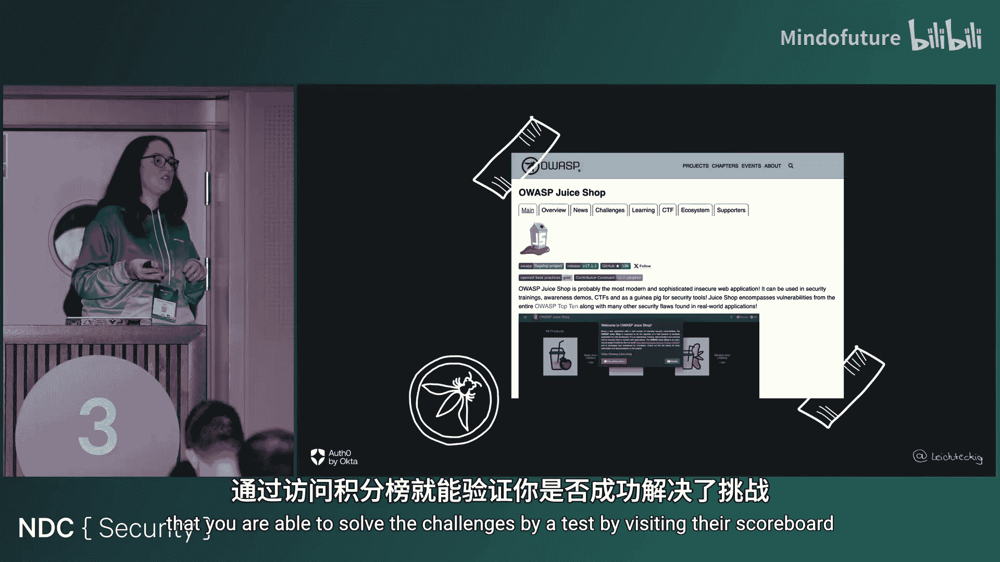

为了识别最常见的风险，我们可以参考权威资源，例如OWASP Top 10。它是一个由开放全球应用安全项目维护的十大最严重Web应用安全风险列表。从前端视角看，以下三项尤为重要：
1.  **失效的访问控制**：用户能够在其预期权限之外进行操作。
2.  **加密机制失效**：敏感数据因弱加密或缺乏加密而暴露。
3.  **注入**：将不受信任的数据作为命令或查询的一部分发送到解析器。

---

## 实战：编写“普通”安全测试用例 💻

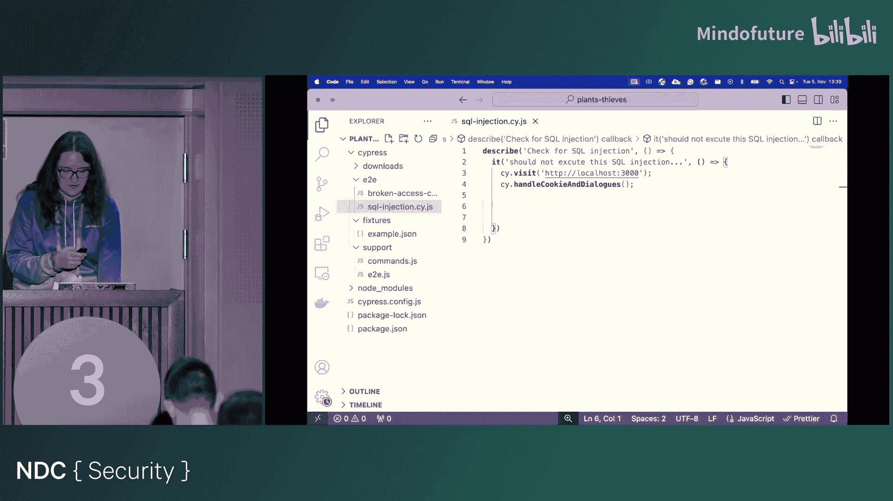

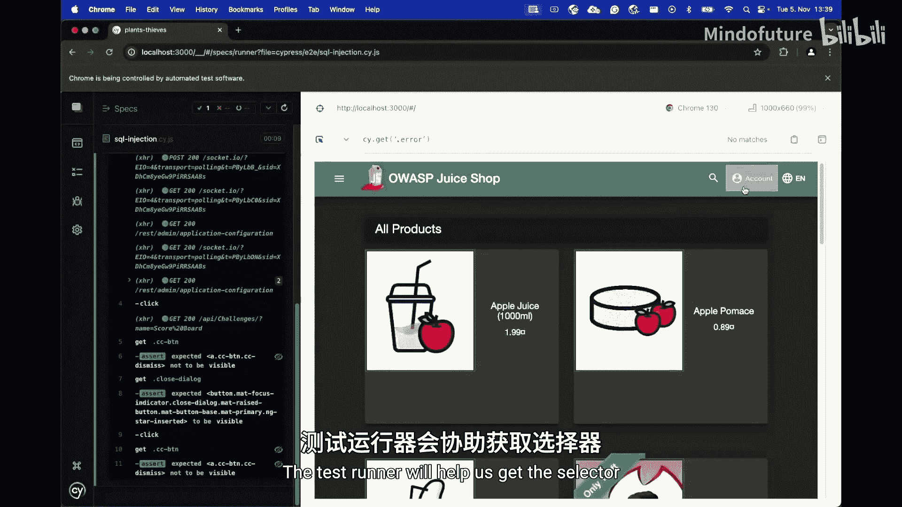

现在，我们进入实战环节。我们将使用端到端测试，因为它能模拟真实用户与整个应用栈的交互，更自然地发现安全问题。我们将以**Cypress**为例，但原理适用于Playwright、Selenium等其他框架。

我们将使用一个故意设计存在漏洞的应用 **OWASP Juice Shop** 作为测试目标。

### 测试1：检测SQL注入

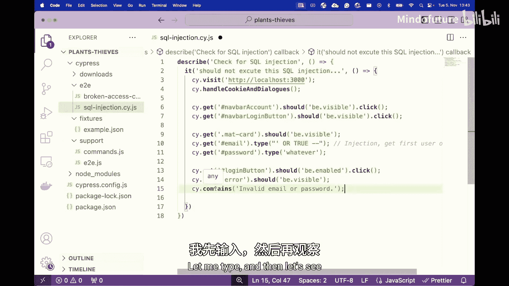

SQL注入是OWASP Top 10中的典型漏洞。我们可以通过端到端测试模拟攻击者向输入字段注入恶意负载。

```javascript
// 这是一个检测登录表单SQL注入的Cypress测试示例
describe('SQL Injection Test', () => {
  it('should not log in with SQL injection payload', () => {
    cy.visit('http://localhost:3000');
    cy.get('#navbarAccount').click();
    cy.get('#navbarLoginButton').click();
    cy.get('#email').type(`' OR 1=1--`);
    cy.get('#password').type('anything');
    cy.get('#loginButton').click();
    // 断言：期望出现错误信息，而不是成功登录
    cy.contains('Invalid email or password').should('be.visible');
  });
});
```
**核心逻辑**：我们向登录邮箱字段输入一个经典的SQL注入负载 `' OR 1=1--`。在安全的应用中，这应该导致登录失败并显示错误信息。如果测试通过（即没有找到错误信息），则说明应用可能存在SQL注入漏洞，攻击者可能绕过认证。

### 测试2：检测跨站脚本（XSS）

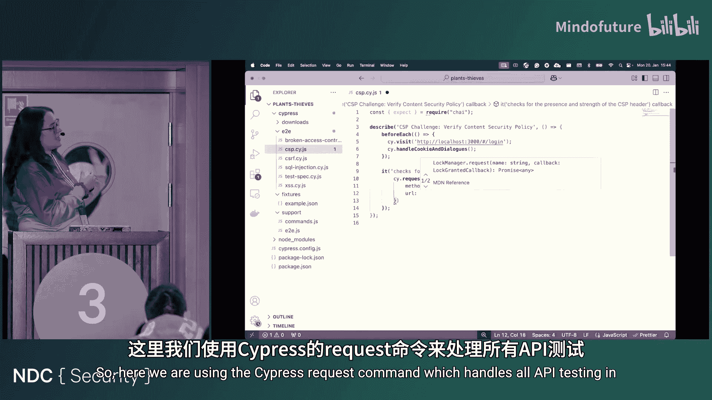

XSS攻击允许攻击者在受害者的浏览器中执行恶意脚本。我们可以测试输入字段是否正确地过滤或转义了脚本标签。

```javascript
// 这是一个检测搜索框XSS的Cypress测试示例
describe('XSS Test', () => {
  it('should not execute alert script in search box', () => {
    cy.visit('http://localhost:3000');
    // 监视window.alert方法
    const stub = cy.stub(window, 'alert');
    cy.get('#searchQuery').type('<script>alert("XSS")</script>');
    cy.get('.btn-search').click();
    // 断言：期望alert方法未被调用（即脚本未执行）
    expect(stub).not.to.have.been.called;
  });
});
```

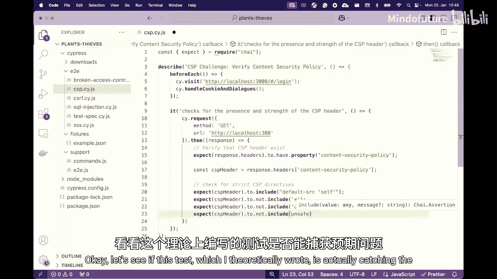

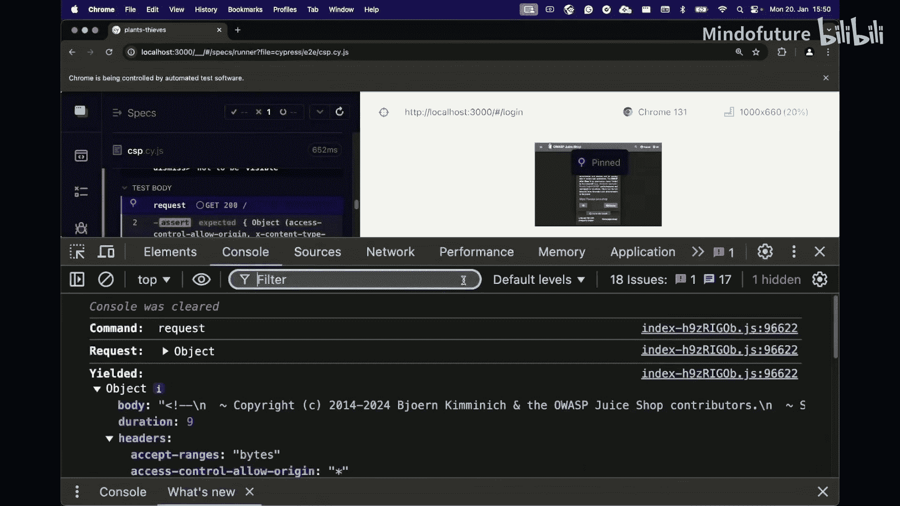

### 测试3：检查安全标头（如CSP）

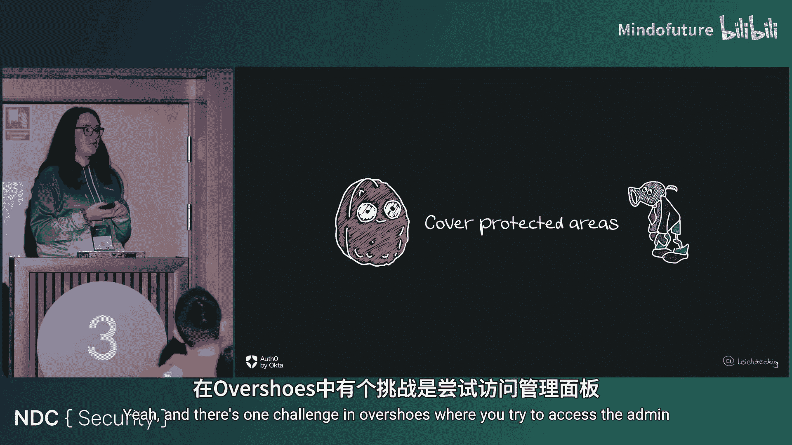

内容安全策略（CSP）头是缓解XSS等攻击的重要防线。我们可以使用测试框架的API测试功能来检查响应头。

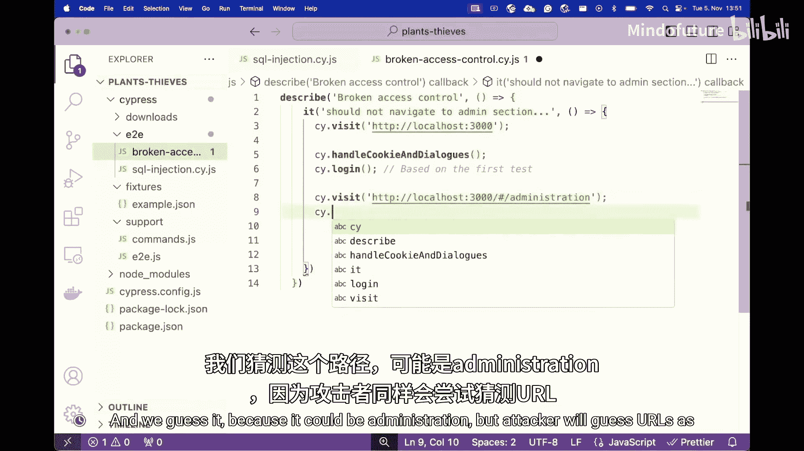

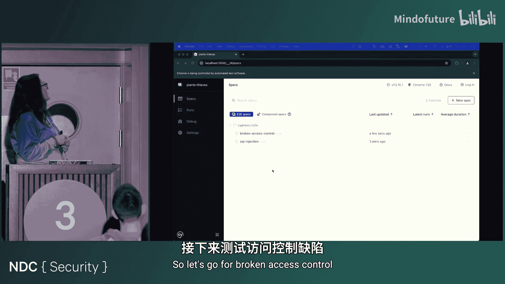

```javascript
// 这是一个检查CSP头的Cypress API测试示例
describe('CSP Header Test', () => {
  it('should have a secure Content-Security-Policy header', () => {
    cy.request('http://localhost:3000').then((response) => {
      // 断言1：响应应包含CSP头
      expect(response.headers).to.have.property('content-security-policy');
      const cspHeader = response.headers['content-security-policy'];
      // 断言2：CSP策略应包含`default-src 'self'`等安全指令
      expect(cspHeader).to.include(`default-src 'self'`);
      // 断言3：CSP策略不应包含不安全的指令，如`*`或`unsafe-inline`
      expect(cspHeader).not.to.include(`*`);
      expect(cspHeader).not.to.include(`'unsafe-inline'`);
      expect(cspHeader).not.to.include(`'unsafe-eval'`);
    });
  });
});
```

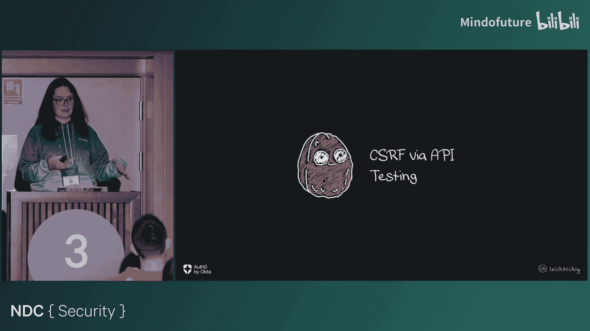

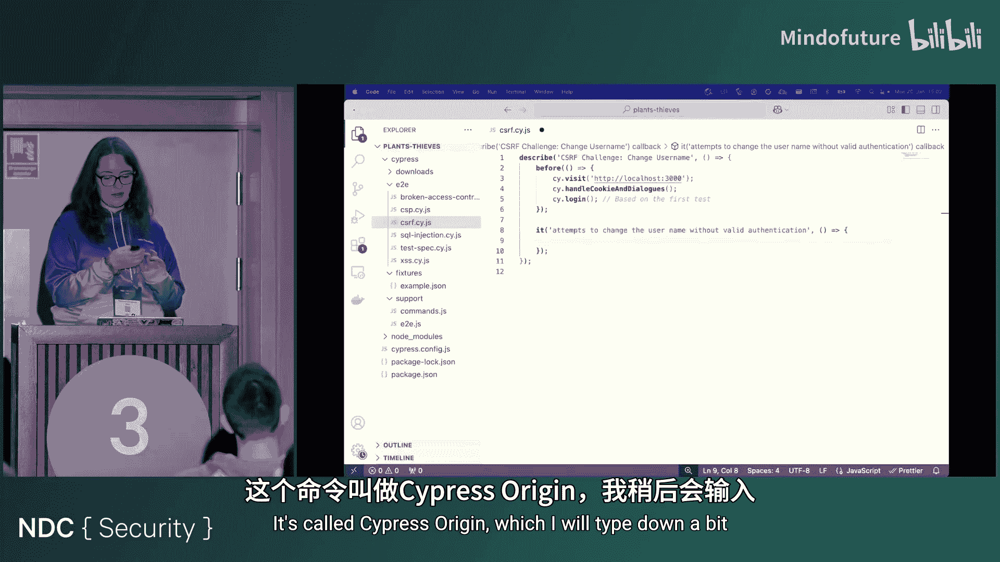

### 测试4：检测失效的访问控制

访问控制缺陷允许用户访问未经授权的资源。我们可以编写测试来模拟低权限用户尝试访问管理面板。

```javascript
// 这是一个测试未授权访问管理页面的Cypress测试示例
describe('Broken Access Control Test', () => {
  it('should not allow regular user to access admin panel', () => {
    // 假设我们已以便携用户身份登录
    cy.loginAsNormalUser();
    // 尝试访问管理员URL
    cy.visit('http://localhost:3000/#/administration');
    // 断言：期望看到“访问被拒绝”或403错误，而不是管理界面
    cy.contains('Access denied').should('be.visible');
    // 或者检查HTTP状态码
    // cy.request({url: 'http://localhost:3000/#/administration', failOnStatusCode: false})
    //   .its('status').should('eq', 403);
  });
});
```

---

## 优化测试：随机化与可持续性 🔄

我们不可能为每个输入字段测试所有可能的恶意负载。因此，需要优化测试策略。

以下是一些实现测试随机化和可持续集成的建议：
*   **利用测试框架特性**：例如，使用Cypress的`fixtures`功能存储不同的测试负载或路由，并在测试中随机选取。
*   **使用辅助库**：使用像`@faker-js/faker`这样的库生成多样化的测试数据。
*   **使用插件**：例如Cypress的`cypress-map`插件提供了`cy.sample()`命令，可以从元素集合中随机选取。
*   **集成到开发流程**：
    *   **开发阶段**：使用预提交钩子（pre-commit hooks）运行linter和SAST（静态应用安全测试）工具。
    *   **测试阶段**：在CI/CD流水线中运行我们编写的安全端到端测试、API测试，并集成DAST（动态应用安全测试）工具扫描。
    *   **部署阶段**：设置部署门禁，并定期进行渗透测试和生产环境监控。

---

## 超越端到端测试：其他测试类型 🧩

端到端测试只是工具箱中的一种。为了构建更健壮的防御，应考虑多种测试类型。

以下是可以用于安全测试的其他测试类型：
*   **单元测试/集成测试**：适合测试工具函数、API端点或组件级别的安全逻辑，执行速度更快。
*   **契约测试**：确保服务间的API契约不被破坏，避免意外暴露数据。
*   **基于属性的测试**：这是一种强大的方法。你定义系统应始终满足的**安全属性**（例如，“所有用户输入在存入数据库前必须被转义”），然后测试框架会自动生成大量随机输入来验证该属性。**fast-check**是一个优秀的JavaScript库。

```javascript
// 基于属性测试的伪代码概念
import fc from 'fast-check';
describe('Input Sanitization Property', () => {
  it('should always escape HTML special characters', () => {
    // 定义一个属性：对于任何随机字符串输入，经过清理函数后不应包含原始的危险字符。
    fc.assert(
      fc.property(fc.string(), (rawInput) => {
        const sanitized = sanitizeInput(rawInput);
        return !sanitized.includes('<script>') && !sanitized.includes('</script>');
      })
    );
  });
});
```

---

## 与专业工具结合：应对未知威胁 🛡️

我们编写的测试主要针对**已知的**攻击模式。为了应对**未知的**零日漏洞或复杂攻击，需要结合专业安全工具。

以下是一些可以集成的开源或免费工具类型：
*   **动态应用安全测试（DAST）**：如**OWASP ZAP**，可以配置为在测试运行时作为代理，主动扫描应用。
*   **静态应用安全测试（SAST）**：如**SonarQube**（社区版）、**ESLint安全插件**，在代码层面发现问题。
*   **软件成分分析（SCA）**：如**npm audit**、**OWASP Dependency-Check**，检查项目依赖中的已知漏洞。
    ```bash
    # 在CI流水线中集成依赖检查的示例命令
    npm audit
    npm outdated
    ```

---

## 总结与要点 🏁

本节课中，我们一起探索了如何利用普通的自动化测试框架来增强Web应用的安全性。

回顾一下，主要有以下四个要点：
1.  **测试自动化是安全策略的优秀补充**。无论你偏好使用现有框架还是专业工具，都应该对其进行投资。
2.  **将“有意识的测试用例”作为低垂果实**。从编写负向测试（如无效输入、未授权访问）和API测试开始，成本低，收益明显。
3.  **将自建测试与外部工具相结合**。自建测试覆盖已知攻击向量，专业工具帮助发现未知威胁，两者结合形成纵深防御。
4.  **利用所有测试类型**。不要局限于端到端测试。根据场景使用单元测试、集成测试，特别是探索基于属性的测试，以实现良好的覆盖率和随机化，同时保持合理的执行时间。

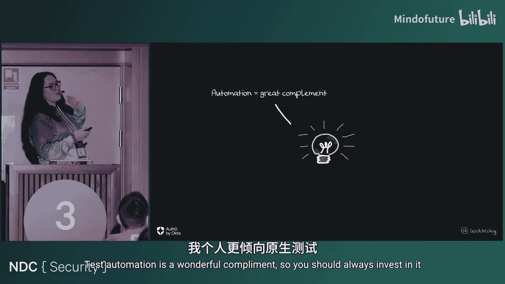

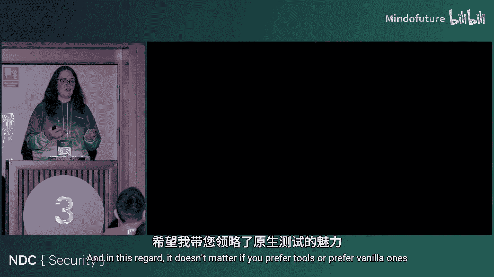

最终目标是构建一个像《植物大战僵尸》后期关卡那样多样化和强大的“防御花园”，结合最佳实践、自身技能、自动化测试和专业安全工具，让攻击者知难而退，让你能更安心地交付产品。

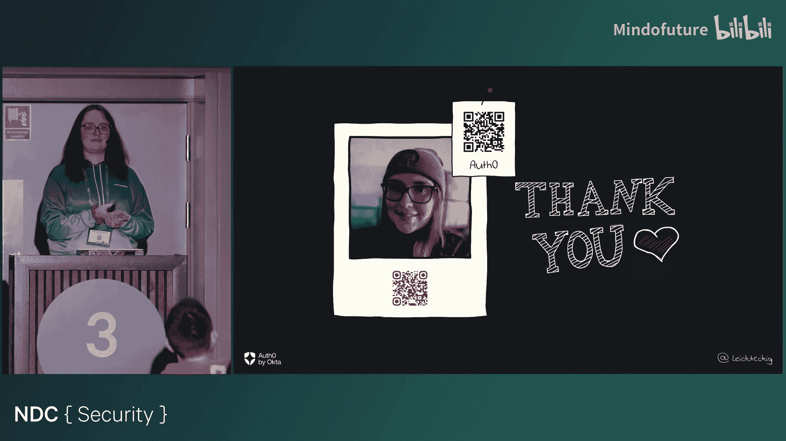

感谢你的学习！