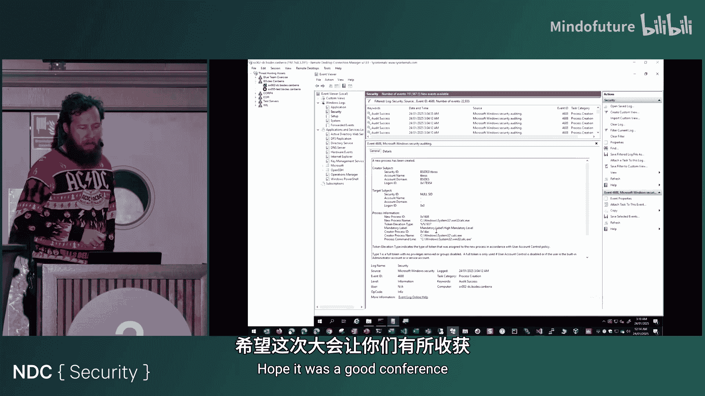

# 013：命令欺骗 - 你能信任进程创建日志吗？


在本节课中，我们将要学习一种名为“命令欺骗”的技术。这项技术允许攻击者篡改Windows系统中的进程创建日志，使得安全分析师无法看到攻击者实际执行的命令。我们将探讨其工作原理、影响范围以及当前安全工具的检测能力。

## 概述

命令欺骗是一种利用Windows进程创建机制的技术。它允许任何用户（无需管理员权限）在进程实际执行前，修改其命令行参数。这导致安全日志（如进程创建事件）记录的是被篡改的“虚假”命令，而非攻击者真正运行的恶意指令。这使得事件调查和威胁检测变得异常困难。

## 进程创建日志的重要性

上一节我们介绍了命令欺骗的基本概念。本节中我们来看看为什么进程创建日志对安全分析如此关键。

在Windows环境中，进程创建日志是我们检测恶意活动的主要依据。身份验证日志虽然有用，但缺乏上下文。当攻击者开始执行命令和进行操作时，进程创建日志（以及其中的命令行参数）提供了丰富的上下文信息。

以下是进程创建日志在不同安全产品中的表现形式：

*   **原生Windows事件日志 (Event ID 4688)**：包含时间戳、用户、进程名和命令行等信息。
*   **Sysmon日志 (Event ID 1)**：提供更丰富的信息，如可执行文件哈希、完整性级别和原始文件名。
*   **Microsoft Defender for Endpoint 设备进程事件**：包含更多事件上下文，例如发起命令的原始工作站信息。

所有这些日志的核心价值在于**命令行参数**。分析师可以从中提取攻击者使用的工具、参数和意图。例如，一个Base64编码的PowerShell命令可以在日志中被解码，以揭示其真实目的。

## 命令欺骗技术原理

上一节我们了解了进程创建日志的价值。本节中我们来看看攻击者是如何欺骗这些日志的。

这项技术的核心在于Windows的**进程环境块**。PEB是一个用户模式数据结构，当通过命令行执行任何程序时，Windows都会创建它。关键在于，创建进程的用户可以写入PEB的内存位置。

以下是该技术的执行流程：

1.  **创建挂起进程**：使用特定标志（如`CREATE_SUSPENDED`）创建一个新进程。此时，进程已被创建但未开始执行，Windows会记录此时的命令行（即“虚假命令”）到日志中。
2.  **定位并修改PEB**：获取新创建进程的PEB，找到其中存储命令行参数的内存地址。
3.  **覆写命令行**：将PEB中的命令行内存内容直接覆盖为攻击者想要执行的**真实恶意命令**。需要注意的是，覆写的内容必须与原始“虚假命令”占用相同的字节长度，因此通常需要用空格或其他字符填充虚假命令以达到所需长度。
4.  **恢复线程执行**：调用`ResumeThread`，让进程开始执行。此时，进程将运行我们写入PEB的恶意命令，但Windows不会为此生成新的日志。

关键问题在于：**Windows在步骤1记录日志，但攻击者在步骤3修改了将要执行的内容**。因此，日志与实际情况完全不符。

```c
// 概念性代码示例：修改PEB中的命令行
GetThreadContext(hThread, &ctx);
ReadProcessMemory(hProcess, (LPCVOID)(ctx.Rdx + 0x20), &peb, sizeof(PEB), NULL);
ReadProcessMemory(hProcess, (LPCVOID)(peb.ProcessParameters + 0x70), &cmdLine, sizeof(UNICODE_STRING), NULL);
WriteProcessMemory(hProcess, cmdLine.Buffer, spoofedCommand, spoofedCommandLength, NULL);
ResumeThread(hThread);
```

## 不同类型命令的欺骗效果

并非所有命令都能被完美隐藏。根据命令的执行方式，欺骗效果和可检测性也不同。以下是几种常见类型：

*   **复合命令**：例如 `cmd.exe` 调用 `powershell.exe`，后者再执行实际命令（如 `whoami`）。虽然初始的`cmd`命令被欺骗，但`powershell`创建新进程执行`whoami`的行为会被记录。这为检测留下了线索。
*   **纯PowerShell命令**：例如使用PowerShell cmdlet（如`Add-MpPreference`）直接在PowerShell会话中操作。如果通过命令欺骗启动PowerShell并运行此类命令，则**进程创建日志中完全看不到真实的cmdlet**。检测依赖于是否开启了PowerShell模块日志。
*   **内置工具命令**：例如直接使用`netsh`修改防火墙。这类命令完全在初始进程内执行，不产生新的子进程。如果使用命令欺骗，**安全日志中将完全缺失对此类操作的记录**，这是最危险的情况。

## 当前安全工具的局限性

上一节我们看到了命令欺骗对不同命令的影响。本节中我们来看看当前安全生态系统的应对情况。

我们对多种企业级终端检测与响应产品进行了测试，结果喜忧参半。

*   **EDR检测率**：在测试的6款主流EDR产品中，约50%能够检测到命令欺骗技术的执行行为（无论后续命令是什么）。另外50%则完全无法检测，攻击可以持续进行。
*   **绕过检测**：一个学生项目将原始工具用C语言重写后，成功绕过了之前能检测到的一款EDR产品。这表明许多EDR可能依赖简单的字符串或特征匹配，而非深入的行为分析。
*   **Microsoft Defender的误报**：Defender曾将命令欺骗工具检测为“Rosnam malware”，但这是一个泛化检测。重写后的工具版本成功绕过了该检测。更严重的是，Defender自身的检测告警界面中，显示的也是被欺骗的虚假命令，可能误导分析师。

## 日志增强与微软的回应

既然现有工具有限，我们能否通过增强日志来检测呢？我们尝试寻求微软的官方支持。

我们联系了Sysmon的作者Mark Russinovich，建议在日志中添加**进程创建时的线程状态标志**（例如是否以挂起状态创建）。理论上，这能帮助识别可疑行为。然而，现有的`Process Tampering`事件并不适用于此场景，且该建议未被采纳。

随后，我们通过MSRC向微软提交了安全报告。微软的回应是：该技术**未跨越安全边界**，因此不符合修复标准。微软认为，任何用户都可以修改自己进程的内存，这属于预期行为。虽然报告被标记为“有效”，但至今没有修复计划。


## 演示与总结

在本教程中，我们一起学习了命令欺骗技术。我们通过实际演示验证了其效果：

1.  使用欺骗后的命令添加防火墙规则，安全日志中只显示虚假的“Teams更新”命令，完全看不到`netsh`操作。
2.  运行一个通过`rundll32`执行远程PowerShell脚本的复合命令。虽然初始命令被欺骗，但后续PowerShell下载和执行的行为依然被记录，为检测提供了机会。

**总结**：
命令欺骗是一种强大且持久的攻击技术，它利用了Windows日志记录机制的根本性设计缺陷。它使得依赖进程创建日志进行检测和调查的安全团队面临巨大挑战。虽然部分EDR能够检测该技术本身，但覆盖并不全面。对于使用内置工具的攻击，日志层面几乎完全失效。目前，最有效的缓解措施是**启用并关联所有可用的日志源**，特别是**PowerShell模块日志**，并训练分析师不要盲目信任命令行日志，要结合其他行为证据进行判断。



---
*教程内容基于NDC Security 2025大会演讲《Spoofing Commands - Can You Trust Process Creation Logs?》整理。*