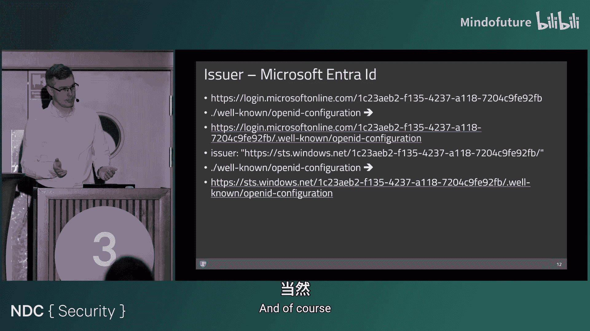
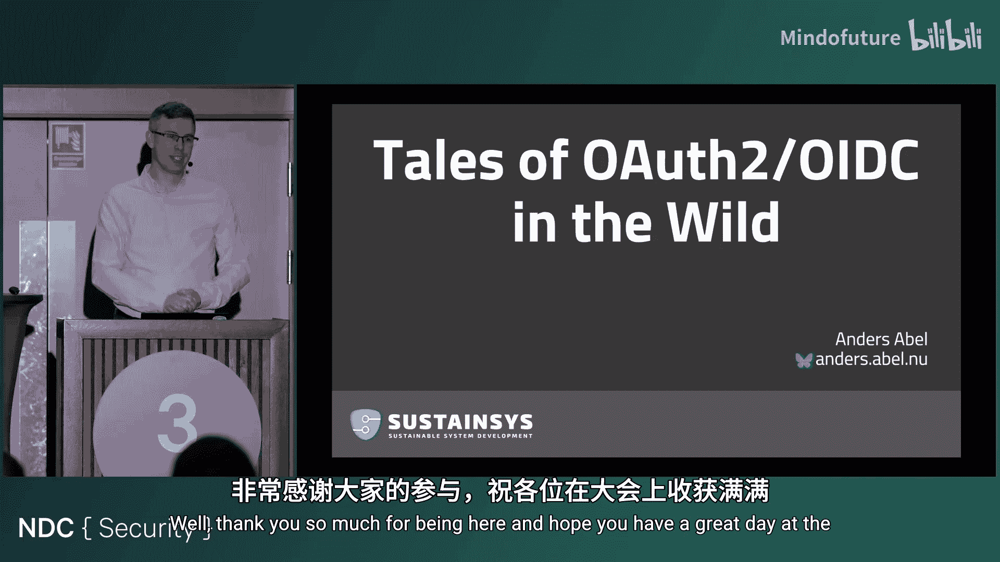

# 014：真实世界中的OAuth2与OIDC故事

在本节课中，我们将跟随Anders Abel的分享，深入探讨OAuth 2.0和OpenID Connect在真实应用场景中遇到的挑战、常见陷阱以及一些不符合规范的有趣案例。我们将从协议规范、令牌管理、会话注销到架构设计等多个维度，解析如何构建更安全、更健壮的身份认证与授权系统。

## 协议规范与复杂性

上一节我们介绍了课程概述，本节中我们来看看OAuth 2.0和OpenID Connect的规范基础及其复杂性。

OAuth 2.0的核心规范是RFC 6749。它主要关注如何代表用户获取访问令牌以调用API。然而，OAuth 2.0本身并不处理会话概念。用户登录意味着建立一个会话，并且在完成后可能还需要单点注销来销毁会话，这些都不是OAuth 2.0的一部分。

因此，OpenID Connect作为一层建立在OAuth 2.0之上的协议被引入。OpenID Connect提供了安全的会话建立、会话管理以及在注销阶段的会话销毁功能。

访问OpenID Connect的官方页面会发现，它并非单一规范，而是一系列规范的集合。其中一些规范由独立的工作组发布。

以下是当前主要的相关规范列表：
*   **RFC 6749**: OAuth 2.0核心框架。
*   **OpenID Connect Core**: 定义OpenID Connect的核心功能。
*   **RFC 7636 (Proof Key for Code Exchange)**: 修复代码替换攻击的风险，尤其在移动设备上。
*   **RFC 9207 (Authorization Server Issuer Identification)**: 修复另一种替换攻击。

这些扩展规范增加了新功能、更高的安全配置文件或适应不同类型的应用程序。但其中一些，如RFC 7636和RFC 9207，实际上是对原始流程的关键安全修复，是每个实现者都应该（或必须）实现的。

这意味着对于实现者来说，要跟上所有规范并不简单。

## 令牌大小管理

上一节我们讨论了协议的复杂性，本节中我们来看看一个直接影响应用性能和安全的问题：令牌大小。

在一次会议演讲中，有人开玩笑说令牌图片太大，因为令牌本身不应该太大。一个典型的Web应用在通过上游提供商认证登录后，会收到一个访问令牌和一个ID令牌。应用通常会在客户端设置一些Cookie来建立会话。当需要调用API时，必须随请求发送访问令牌，因此需要在客户端保存访问令牌。

事实证明，为了防止注销时的跨站请求伪造攻击，我们还需要保存ID令牌。过去存在一种“注销垃圾邮件”攻击，攻击者可以在隐藏的iframe中加载多个流行网站的注销端点，导致用户在访问某个页面后突然从所有地方登出。这看似是恶作剧，但也可能成为攻击的一部分。例如，如果攻击者发现了登录阶段的攻击方法，能够将用户登出就意味着用户必须重新登录，从而执行攻击。

由于我们需要在整个会话期间保留令牌以便注销和调用API，因此我们希望令牌尽可能小。

这是一个来自Microsoft Entra ID的真实ID令牌示例（经过部分删减）。可以看到其中包含了`groups`声明。在这个例子中只有四个组，这不算多。但Entra ID的一个特性是允许组嵌套，即组可以是其他组的成员。ID令牌的声明格式无法表达这种嵌套关系，因此Microsoft Entra ID会在将组列表放入ID令牌之前将其展开。

在大型企业中，用户展开后的组列表达到数百个是很常见的。拥有数百个组的令牌会带来问题。Entra ID意识到了这一点，为了确保令牌大小不超过HTTP头部大小限制，它对ID令牌中可以包含的组数量设置了上限——200个。对于一个JWT令牌来说，200个对象已经相当大了。

那么如何解决这个问题呢？OpenID Connect中有一个称为`userinfo`端点的机制。其思想是发送访问令牌以获取关于用户的实际有效载荷信息。这样做的好处是，我们可以将ID令牌减少到仅包含证明用户身份所需的协议细节和安全措施，最终只在其中保留用户主题ID。而所有其他信息，如名、姓、显示名、组成员资格等，都通过`userinfo`端点获取。

`userinfo`端点的另一个优点是，你可以在需要时随时查询。ID令牌仅在会话初始化时接收一次，对于长时间运行的会话，如果信息更新，除非重新登录，否则无法更新。而使用`userinfo`端点，你可以随时更新用户信息。

因此，`userinfo`端点是OpenID Connect中管理令牌大小、避免各种问题的关键机制。

让我们看看Microsoft Entra ID的`userinfo`端点响应示例（来自其文档）。文档说明响应中显示的声明是`userinfo`端点可以返回的所有声明，这些值与ID令牌中包含的值相同。这意味着他们虽然提供了`userinfo`端点，但仍然把所有信息都放进了ID令牌。不过，我们至少可以通过`userinfo`端点更新信息。

文档中关于`userinfo`端点的注意事项提到：“你无法添加或自定义`userinfo`端点返回的信息。要自定义身份平台返回的信息，请使用声明映射和可选声明来修改安全令牌配置。”给人的感觉是，Microsoft Entra ID的`userinfo`端点实现只是为了满足规范要求而做的最低限度的工作。

更有趣的是，文档提到限制令牌中的组数量，但指示应用程序查询Microsoft Graph API来检索用户的组成员资格（显然是在服务器端）。他们甚至提供了通过Microsoft Graph查询此功能的端点。那么，为什么他们不直接将`userinfo`端点与Graph API挂钩呢？原因不得而知。

## 注销流程的挑战

上一节我们探讨了令牌管理，本节中我们来看看身份认证流程的终点——注销，以及其中遇到的挑战。

如果一个Web应用有注销按钮，并重定向用户到提供商的`end_session`端点，IdentityServer会显示一个确认页面：“您确定要从IdentityServer注销吗？是/否”。出现这个页面的原因是存在跨站请求的风险。注销端点是一个GET请求，任何人都可能将用户重定向到该端点。因此需要这个包含正确防伪令牌的表单提交来防止跨站请求伪造攻击。

但这带来了尴尬的用户体验。用户点击注销按钮，本应同样具备跨站请求伪造防护。如果能够对用户进行身份验证，那么ID令牌就派上用场了。如果将ID令牌随注销请求或注销重定向一起发送，那么IdentityServer将不再显示确认页面，并且还能让IdentityServer知道是哪个客户端应用发起了注销，因为客户端ID就在ID令牌的`audience`参数中。

这允许IdentityServer重定向回来，从而提供良好的用户体验。点击注销意味着重定向，可能有一些屏幕闪烁，但最终用户会回到点击注销的应用中。这才是应有的做法。

然而，Microsoft Entra ID总是显示一个“选择账户”的页面：“您想从哪个账户注销？”，即使你提供了ID令牌提示，它仍然显示这个页面。客户端应用发送的ID令牌包含了用户标识符和请求注销的客户端应用信息。用户标识符就在那里，但Entra ID却问：“嘿，我不明白您想注销哪个？实际上要注销哪个？”事实上，无论你是否发送ID令牌提示，用户体验都是一样的。

进一步测试发现，如果在会话中有两个应用，从应用A发起注销，重定向回应用B会发生什么？事实证明，发起注销的应用和接受重定向的应用之间没有关联。因此，一个应用可以很容易地在注销时重定向到另一个应用。协议规范本应防止这一点。如果严格按照协议规范，每个客户端应用的注销后重定向URL都应该是预先注册的。

## 令牌颁发者问题

上一节我们讨论了注销流程，本节中我们来看看另一个关键概念：令牌颁发者。

规范包含一项强制性要求：支持发现的OpenID提供商必须在由颁发者字符串拼接路径`/.well-known/openid-configuration`处提供发现文档。这是OpenID Connect的一个杰出特性，因为这意味着如果我们拿到一个令牌，里面有颁发者信息，我们就可以去获取发现文档，从文档中获得用于验证令牌的公钥。

因此，只要一切符合规范，仅凭一个令牌，我们就能获得正确验证它所需的信息。例如，访问`demo.identityserver.com/.well-known/openid-configuration`，我们会得到一个发现文档链接，其中包含`jwks_uri`（公钥地址）和`issuer`（颁发者）。规范还要求，从发现文档中获得的OpenID提供商颁发者标识符必须与令牌中`iss`声明的值完全匹配。这是在验证令牌时的严格要求，所有内容都应与渠道保持一致。

这看起来不难做对，但你认为会有人搞错吗？欢迎来到Entra ID的世界。

如果我们有`login.microsoftonline.com/{tenant-id}`这样的URL（其中指定了租户），并添加`/.well-known/openid-configuration`，我们得到这个URL。访问它，我们期望颁发者应该是`login.microsoftonline.com/123...`。但在发现文档中，颁发者没有放在顶部，而是藏在下面：`sts.windows.net`。实际上，根据规范，这是可以的，因为初始URL `login.microsoftonline.com`只是一个他们提供的权威URL。规范并没有说你不能在多个位置提供发现文档。

但有趣的问题是，如果我们按照规范要求，将`/.well-known/openid-configuration`附加到我们从令牌中读取的`iss`值（`sts.windows.net/{tenant-id}`）上，我们应该在这个URL上也有发现文档。实际上，这个URL确实有发现文档，而且这次的颁发者匹配了。但令人惊讶的是，即使在单租户模式下也是如此。

当我们使用Microsoft Entra ID时，一个应用通常不仅验证到一个Entra ID实例，而是多个。例如，如果你是软件服务提供商，你会有自己的Entra租户，但也希望与客户的提供商联合。当然，你可以在所有客户的每个Entra ID中将你的客户端应用注册为应用注册。但这需要与每个租户沟通，正确设置客户端ID和密码，定期更新客户端密码等，非常繁琐。

Microsoft致力于简化 onboarding 过程。他们引入了这样一个概念：你可以在自己的租户中发布一个应用，并使其对其他人可用。然后所有配置数据都保留在你这里。如果你想更改重定向URI，只需在你的设置中更改，对方无需更新，因为他们本质上使用的是你的应用。

因此，与其让你的应用与所有这些逻辑上独立的上游提供商通信，为什么不添加一个新的虚拟提供商来处理所有其他提供商呢？这正是Microsoft所做的。他们添加了一个新的虚拟颁发者：`login.microsoftonline.com/common`。如果你使用这个颁发者，意味着“我希望能够访问任何租户，此应用允许任何Entra ID租户中的任何人访问”。

我们对这个通用颁发者也进行同样的发现文档查询。颁发者同样被隐藏，更靠下。它看起来像：`https://sts.windows.net/{tenantid}/`。这是一个模板字符串。规范中并没有模板的概念，规范要求必须完全匹配。我们尝试使用这个颁发者并附加`/.well-known`路径，结果返回“无效租户，未找到租户ID”。显然，这种方式行不通。方括号中的`{tenantid}`明显是一个模板。

回到通用端点，不指定租户ID，我们得到了某些内容。颁发者仍然是模板。在实际操作中，创建一个多租户应用并登录后，得到的ID令牌的解码载荷显示，即使权威机构以通用端点开头，令牌的颁发者却是用户账户的实际租户ID。他们还将租户ID作为一个单独的声明提供。不清楚为什么这样做，因为租户ID已经出现在颁发者URL中了。

总结一下：我们获取发现文档，发现带有模板字符串的颁发者。规范说，从发现文档中获得的OpenID提供商颁发者标识符必须与令牌中`iss`声明的值完全匹配。但我们得到的`iss`声明是实际值。因此，如果我们想与Entra ID多租户功能协作，就无法完全符合规范，我们必须移除颁发者验证。然后我们将租户ID作为一个单独的声明处理。在实际的生产代码中，可以看到他们设置了`ValidateIssuer = false`。这可能被认为不安全，因为它依赖于Microsoft拥有所有人的相同签名密钥这一事实。本质上，我们从一个地方获取签名密钥，然后就可以用这些密钥验证任何租户颁发的令牌。但这仍然不是理想的做法。

那么，更好的方案是什么？回顾我们的图形表示，问题在于我们向这个虚拟的通用OpenID提供商发起登录，但响应却直接来自实际的提供商。更好的方式是拥有一个虚拟提供商，客户端应用始终与同一个虚拟提供商交互，颁发者就是这个虚拟提供商，租户ID仅作为一个声明。或者，为什么需要这个虚拟提供商呢？其中一个租户是我们的主租户，应用注册就在这里创建，为什么不让这个主租户连接到其他逻辑实例呢？如果我们重新安排并添加更多客户端应用，这就是“联合网关”模式。这是我经常推荐的OpenID Connect架构模式。这可能也解决了另一个问题：为什么在现有设置中无法使用Entra ID访客账户，但在这个模式下应该是可能的。

不幸的是，Microsoft在颁发者问题上还有其他“有趣”的做法。例如，在将本地Microsoft ADFS与Azure API管理结合使用的项目中（一个来自本地遗留时代，一个现代云产品），ADFS的颁发者是`https://adfs.example.org/adfs`。他们创建这个URL作为颁发者，可能是为了让发现文档遵循ADFS中其他路径的模式。但访问令牌的颁发者却是另一个URL。实际上，它对访问令牌和ID令牌使用了不同的颁发者。如果你有一个正常的客户端库和一个下载发现文档的API，它会去检查这个URL。因此你必须处理这个问题。不过有一个修复方法：可以配置“联合服务标识符”，将其更改为与顶层URL相同。但有一个缺点：这个标识符是ADFS实例的全局标识符。通常，如果你在ADFS中添加OpenID Connect支持，很可能已经有许多遗留应用程序在使用ADFS进行WS-Federation或SAML 2.0认证。现在，OpenID Connect要求你更改联合服务标识符，这将破坏所有现有的客户端应用。如果是全新设置，确保它们匹配是很容易的，但这仍然不是最理想的情况。

## 单点注销的必要性

上一节我们提到了Entra ID的注销问题，本节中我们更深入地探讨单点注销的重要性。

如果我们在一个应用中建立了会话，通常会在两端都有Cookie表示会话：客户端应用有一个会话，身份提供商也有一个会话。如果我们点击注销并简单地移除本地Cookie，然后用户尝试访问受保护资源，通常会发起单点登录流程，用户将直接拿回Cookie，重新登录。这就好比家里的饼干罐，如果饼干被孩子吃了，但饼干能重新出现，那会是好事吗？

在实际生产系统中，这曾是一个真实的错误报告。在瑞典的医疗保健系统中，IDP登录存在会话，并且还涉及智能卡，这意味着只要用户在终端中插入智能卡，单点登录就会工作。如果他们拔掉卡，会话Cookie在某些情况下可能仍然存在。我们在应用中实现了单点注销，但身份提供商没有实现单点注销。这意味着我们只清除了自己的Cookie。然后，一些非常认真的医疗保健专业人员点击链接测试是否还能访问患者记录，结果发现确实可以。

因此，如果我们有单点登录，就始终需要单点注销。没有单点注销，就无法真正注销，因为用户可能被重新登录。

查看IdentityServer的发现文档，会看到有一个`end_session_endpoint`，用于重定向用户。另一个相当流行的平台是Google。它的发现文档实际上相当短，但搜索后发现，没有`end_session_endpoint`。你可以注销你的Google账户，但必须手动访问`accounts.google.com`来发起。Google显然不希望使用这个端点来注销。

对于个人设备，例如我的个人手机，我一直保持登录Google账户，这没问题。但是，如果我借用你的设备处理一些紧急工作然后归还，我会认为在归还电脑前我已经按了注销。这个房间里的每个人都知道，如果我们借用别人的电脑登录，我们会使用隐身窗口以确保关闭后一切都被清除。但普通用户不会这样做。普通用户可能只是登录，点击注销，然后就认为安全了。所以，在我看来，这是一个安全问题。

## 云身份服务的局限性

上一节我们讨论了协议层面的问题，本节中我们来看看架构概念，特别是云身份服务提供商的局限性。

这是一个来自一家公司的架构图（大约15年前）。当时Azure AD B2C刚推出，他们决定使用它，因为从信任角度来说，让微软这样的成熟公司管理用户凭证是个好主意。他们还需要支持其他提供商。因此，这是一个结合了消费者账户和企业对企业联合账户的应用。

受雇推广微软产品的顾问建议使用新的、优秀的Azure AD B2C。但是，客户端应用需要颁发访问令牌并使用访问令牌调用API，而Azure AD B2C无法很好地做到这一点。所以，他们决定在中间使用IdentityServer。这里的问题是，为什么一定要用Azure AD B2C呢？Azure AD B2C还有一些其他特性，比如“策略”，你可以有登录策略或注册流程策略，它们通过不同的端点定义，并且实际上会反映在生成的令牌中。因此，根据用户是注册、找回密码还是仅仅登录，返回的令牌会有不同的颁发者。我们已经看到了令牌颁发者可能带来的问题。

另一个有趣的案例涉及Okta（但也见于其他提供商如Entra ID、Auth0、AWS Cognito）。表面上看，这是一个良好的架构：两个客户端应用使用共享API，通过Okta实现单点登录，Okta与多个上游提供商联合。但在客户的架构图中，还有更多内容：一个“ID转换层”，这是一个内部服务，用于将来自Okta的任何信息转换为其内部身份标识。

在典型的“联合网关”架构中，联合网关的角色是屏蔽客户端应用，使其免受所有上游提供商复杂性的影响。客户端应用应从联合网关获得统一的内部身份定义，然后由联合网关负责与上游提供商交互并进行转换。事实证明，Okta（在此案例中）无法完全满足他们的所有要求，因此他们不得不插入另一个转换层。我时不时会看到各种云提供商无法提供足够灵活性的类似情况。Entra ID肯定也有这个问题。

我甚至有一个关于AWS Cognito的更糟糕的故事。客户使用AWS Cognito作为Web应用的身份提供商。最终客户（我客户的客户）拥有这个设置。我负责那个Web应用，最终客户来说他们想迁移到AWS Cognito，所以我们需要能够使用它。他们将把他们的AWS Cognito实例连接到他们的CRM系统，目的是用户能够使用Google或Facebook登录，但只有那些实际存在于CRM系统中并与该组织有现有关系的用户才被允许登录。他们本质上希望实现：如果你尝试登录但不在CRM系统中，你将被重定向并停留在CRM系统的注册页面，在那里你可以请求注册然后被允许进入。

事实证明，AWS Cognito可以配置为从CRM系统获取标识符并查询CRM系统，但无法改变认证流程。最终，我们不得不在客户端应用层面实现代码，检查传入的用户是否有CRM ID声明。如果没有，我们必须阻止他们并将其重定向回CRM。但他们已经有一个已建立的会话。这再次说明，云提供商在他们擅长的领域非常出色，但如果你想要任何超出他们预设功能的东西，往往会导致相当尴尬的变通方案。

对于像Entra ID这样的服务，如果你需要一个方盒子，它是一个完美打磨的方盒子。Auth0也是如此。但如果你想改变任何东西，比如颜色或许可以，但如果你想真正调整它，是不可能的。你需要另一种解决方案。

## 规范本身的缺陷

到目前为止，我一直在批评各种产品，分享遇到的一些不兼容案例。但作为最后一点，我想谈谈规范本身的问题。尽管我喜欢这些规范，但它们并非完美无缺。

让我们从RFC 7617开始，它是对RFC 2617（HTTP基本认证）的澄清。基本认证从用户获取用户名和密码，通过连接用户ID、单个冒号字符和密码来构造用户密码。由于方案限制，用户名中不允许包含冒号，但密码可以。然后使用UTF-8编码用户密码，并使用Base64编码该八位字节序列。

在需要客户端在后通道（例如令牌端点）向授权服务器进行身份验证的流程中，客户端可以使用基本认证。RFC 6749中甚至描述了一点。但OAuth 2.0有自己的定义：客户端ID使用`application/x-www-form-urlencoded`编码算法进行编码，客户端密码使用相同的算法编码并用作密码。

最近这就出现了一个bug：有人报告说，包含加号字符的客户端密码在使用基本认证时无法与IdentityServer一起工作。原因是，该客户使用了基本认证，而加号在`x-www-form-urlencoded`编码中具有特殊含义，实际上代表空格字符。所以它不工作。问题是，为什么OAuth 2.0要有自己的定义？他们并没有让我们的生活变得更轻松。

## 总结

本节课中，我们一起学习了OAuth 2.0和OpenID Connect在真实世界应用中的多个关键方面：

1.  **协议的复杂性**：OAuth 2.0与OpenID Connect是一系列不断演进的规范，实现者需要关注核心规范及关键的安全扩展（如PKCE和颁发者标识）。
2.  **令牌管理**：过大的令牌（尤其是包含大量声明的ID令牌）会带来性能和安全问题。积极使用`userinfo`端点是管理令牌大小、获取最新用户信息的推荐做法。
3.  **注销流程**：完整的单点登录必须配套单点注销，否则会留下安全漏洞。实现时需注意跨站请求伪造防护和提供流畅的用户体验。
4.  **颁发者验证**：颁发者的一致性验证是安全的关键。但一些主流云服务商（如Microsoft Entra ID）的实现方式（多租户模板、ADFS双颁发者）可能与规范存在差异，迫使开发者做出权衡。
5.  **云服务的局限性**：公有云身份服务（如Entra ID, Okta, Auth0, AWS Cognito）通常是高度优化的“黑盒”，对于标准场景非常有效，但缺乏灵活性。当业务需求超出其预设功能时，往往需要引入额外的架构层（如联合网关）或进行复杂的变通。
6.  **规范细节**：即使协议规范本身，也存在模糊或不一致的地方（如基本认证的编码细节），这要求开发者在实现时仔细阅读规范并进行充分测试。

构建健壮的身份系统需要深入理解协议规范、了解不同提供商的特性与局限，并在架构设计上保持灵活性和前瞻性，以应对不断变化的需求和安全挑战。