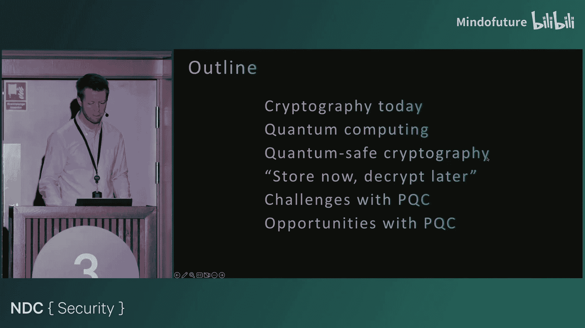
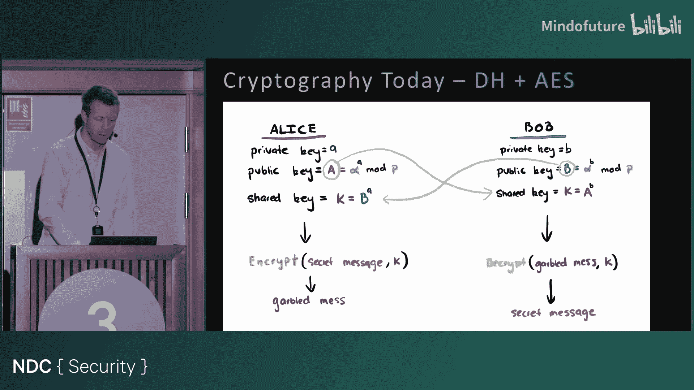
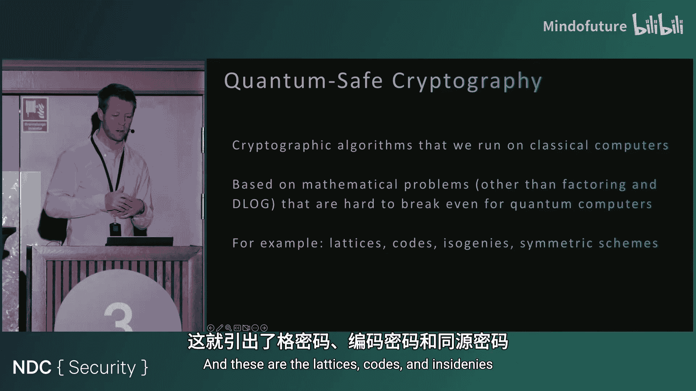
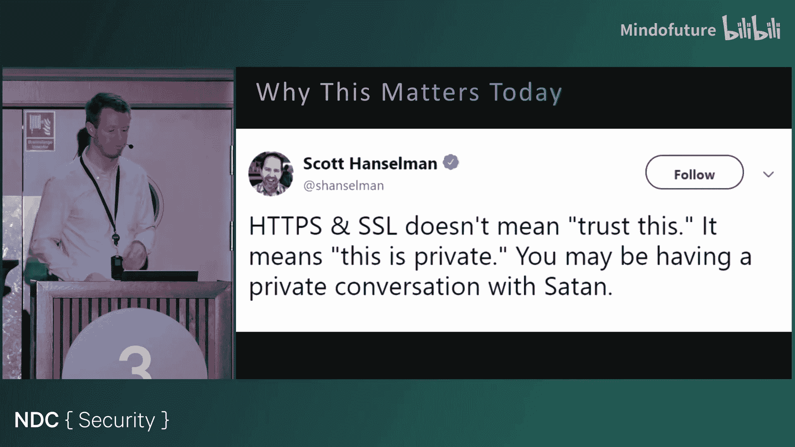
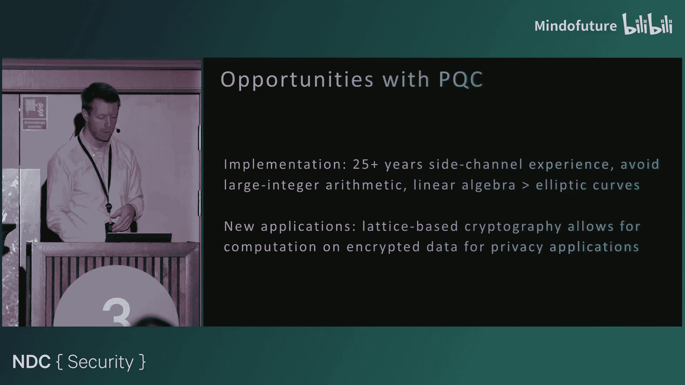
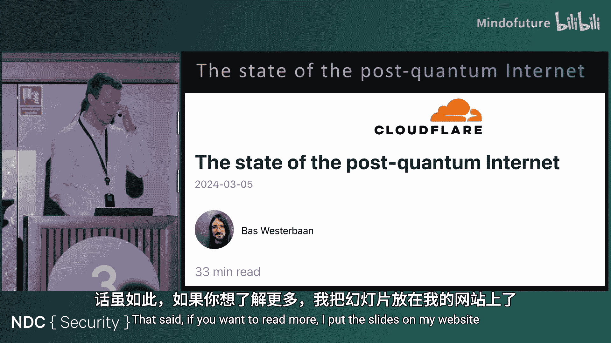
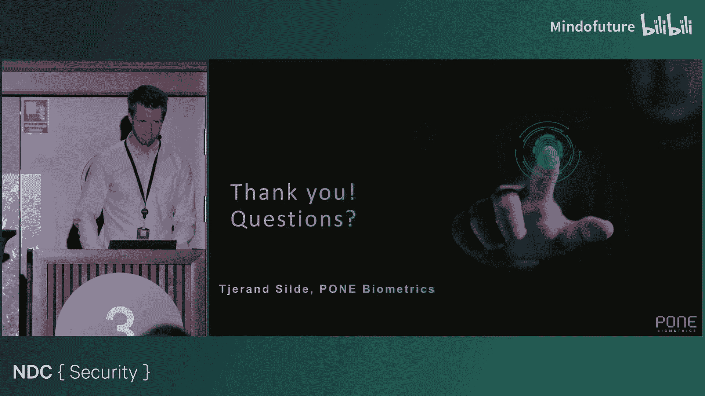

# 015：挑战与机遇

在本节课中，我们将要学习量子安全密码学（也称为后量子密码学）的基本概念。我们将探讨量子计算如何影响当前的加密算法，了解即将到来的新标准，并分析在向新密码学过渡过程中面临的挑战与机遇。

## 密码学基础回顾

上一节我们介绍了课程概述，本节中我们来看看现代密码学的基础知识。密码学主要分为两大类：公钥密码学和对称密钥密码学。

公钥密码学允许双方在不共享秘密的情况下进行安全通信。以下是其核心应用：

*   **公钥加密**：任何人都可以使用接收者的公钥加密消息，生成密文。只有拥有对应私钥的接收者才能解密并读取消息。
*   **数字签名**：发送者使用私钥对消息的哈希值（指纹）进行签名。任何人都可以使用对应的公钥验证签名的真实性。

对称密钥密码学要求通信双方预先共享一个密钥。该密钥用于加密和解密消息。一个常见的应用场景是，在访问网站时，双方首先通过迪菲-赫尔曼密钥交换协议建立一个共享密钥。

迪菲-赫尔曼协议的安全性基于**离散对数问题**的困难性。其核心公式可简化为：给定公开的生成元 `g` 和模数 `p`，以及公开值 `A = g^a mod p`，对于攻击者而言，从 `A` 反推出秘密指数 `a` 在计算上是不可行的。

类似地，RSA 算法的安全性则基于**大整数质因数分解**的困难性。

## 当前密码学算法及其依赖问题

上一节我们回顾了密码学的基本分类，本节中我们来看看当前广泛使用的具体算法及其依赖的数学难题。

当前主流的公钥密码算法主要基于两类数学问题：

1.  **因式分解问题**：RSA 算法基于此，用于加密和签名。
2.  **离散对数问题**：这包括基于模运算的迪菲-赫尔曼密钥交换、数字签名算法，以及更高效的椭圆曲线版本。

这些协议的安全性完全依赖于这些数学问题的计算困难性。我们通常用“比特安全”来衡量安全性。例如，128比特安全意味着攻击者需要尝试大约 `2^128` 次操作才能破解。

对称密钥算法（如 AES）和哈希函数（如 SHA-256）的设计原理不同，它们不依赖于特定的数论问题，而是通过复杂的混淆和扩散操作来确保安全。目前，针对它们的最佳攻击仍然是暴力破解。

这些算法广泛应用于我们的数字生活，例如：
*   安全通信：Signal, WhatsApp, iMessage
*   网络连接：TLS/SSL 协议
*   数字身份认证：政府服务登录
*   移动支付：各类支付应用

在这些应用中，通常结合使用公钥密码学（用于建立安全连接和身份验证）和对称密钥密码学（用于后续高效的数据加密传输）。

## 量子计算的威胁

上一节我们了解了当前密码学的基石，本节中我们来看看为何这些基石在未来可能不再稳固。核心威胁来自于量子计算的发展。

量子计算机使用量子比特进行计算。与传统比特（非0即1）不同，量子比特可以处于叠加态，同时表示0和1的某种概率组合。此外，量子比特之间可以发生纠缠，使得对一个量子比特的操作能瞬间影响另一个。

这种计算方式在特定问题上具有巨大潜力。对于密码学而言，有两个量子算法尤为关键：

1.  **肖尔算法**：这是一个高效的量子算法，可用于求解整数分解和离散对数问题。**理论上**，它能够破解所有基于因式分解和离散对数问题的公钥密码体系。
2.  **格罗弗算法**：该算法可以对未排序数据库进行平方根级别的加速搜索。这会影响对称密钥算法和哈希函数的安全性，例如，将 AES-128 的理论安全强度从 `2^128` 降低到 `2^64`。

总结量子计算的影响：
*   **公钥密码学（RSA， 椭圆曲线）**：**完全失效**。肖尔算法使其不再安全。
*   **对称密钥密码学（AES）和哈希函数**：**安全性减弱**。需要增加密钥长度和输出长度来维持同等安全强度（例如，从 AES-128 升级到 AES-256）。

因此，我们需要寻找能够抵抗量子计算机攻击的新密码学方案，即**后量子密码学**。

## 后量子密码学简介

上一节我们看到了量子计算的威胁，本节中我们来看看应对之道——后量子密码学。后量子密码学是指在经典计算机上运行，但能够抵抗量子计算机攻击的密码算法。

后量子密码学基于新的数学难题，这些难题被认为即使对于量子计算机也是困难的。主要的研究方向包括：

*   基于格的密码学
*   基于编码的密码学
*   基于超奇异椭圆曲线同源的密码学
*   基于对称密码原语（如哈希函数）的签名方案

其中，基于格的密码学是目前最主流且即将被标准化的方向。其核心是**容错学习问题**。

LWE问题可以简化为一个线性代数问题：给定一个公开的矩阵 `A` 和一个向量 `b = A * s + e mod q`，其中 `s` 是短秘密向量，`e` 是短错误向量。从公开的 `(A, b)` 中恢复出秘密 `s` 是困难的。

基于LWE问题，可以构造加密和签名方案：
*   **加密**：公钥是一个LWE样本 `(A, b)`。加密时，用公钥构造一个新的LWE样本并叠加消息。解密时，用私钥 `s` 进行计算并去除噪声恢复消息。
*   **签名**：其结构类似于椭圆曲线签名。签名者使用私钥和随机数来回答一个由消息和公开参数生成的挑战。

## 新标准与性能分析

上一节我们介绍了后量子密码学的核心思想，本节中我们来看看即将到来的具体标准和它们的性能特点。

美国国家标准与技术研究院主导了后量子密码学标准化进程。2022年，首批算法被选定，其中包括：

1.  **CRYSTALS-Kyber**：将被标准化为 **ML-KEM**，用于密钥封装（相当于密钥交换）。
2.  **CRYSTALS-Dilithium**：将被标准化为 **ML-DSA**，用于数字签名。

以下是它们与当前算法的粗略尺寸对比：

| 算法类型 | 示例算法 | 公钥尺寸 | 签名/密文尺寸 |
| :--- | :--- | :--- | :--- |
| 当前公钥算法 | RSA-3072 | ~384 字节 | ~384 字节 |
| 当前公钥算法 | 椭圆曲线 (P-256) | 32 字节 | 64 字节 |
| 后量子算法 | ML-KEM (Kyber) | 800 字节 | 768 字节 |
| 后量子算法 | ML-DSA (Dilithium) | 1312 字节 | 2420 字节 |

**主要挑战**：后量子密码学的密钥和签名尺寸显著大于当前算法，这可能会影响网络协议的性能和带宽。然而，在计算速度上，基于格的算法通常比椭圆曲线算法更快。

## “现在窃取，以后解密”攻击与迁移时间线

上一节我们讨论了新算法的性能，本节中我们探讨一个紧迫的安全威胁和行业迁移的时间线。

即使量子计算机尚未问世，我们也需要立即关注后量子密码学。原因在于“现在窃取，以后解密”攻击。攻击者可以今天截获并存储加密通信数据，等到未来量子计算机成熟时再进行解密。这对于需要长期保密的数据（如国家机密、医疗记录、电子投票信息）构成严重威胁。

因此，数据需要保持安全的时间长度、迁移到后量子密码学所需的时间，以及量子计算机可能被造出的时间，这三者构成了一个关键的时间窗口。

美国国家安全局已经发布了明确的时间线，要求与政府相关的系统在 **2030-2033年** 之前完成向后量子密码学的迁移。欧盟则更倾向于采用**混合模式**，即同时运行传统和后量子算法，只要其中一个是安全的，整体通信就是安全的。

一些应用已经开始部署：
*   **Signal**：在新会话初始化时使用混合密钥交换。
*   **iMessage**：采用定期的后量子密钥更新。
*   **TLS 1.3**：Cloudflare 等服务商已支持后量子密钥交换，目前约30%的互联网流量已受其保护。
*   **FIDO/Passkey**：研究证明，可以在现有框架内添加后量子签名支持。

## 挑战、机遇与总结

上一节我们看到了迁移的紧迫性和初步实践，本节中我们来总结全面过渡所面临的主要挑战和潜在机遇。

**面临的挑战：**
*   **尺寸与性能**：更大的密钥和签名尺寸对协议设计、网络带宽和存储提出挑战。
*   **新的数学基础**：基于格等新问题的密码学，其安全分析和实现方式与旧算法不同，需要更深入的理解。
*   **实现复杂性**：新算法可能以意想不到的方式出错，侧信道攻击防护需要从设计之初就考虑。
*   **标准与互操作性**：不同国家或组织可能推荐不同的算法或参数，确保全球互操作性是一大挑战。

**潜在的机遇：**
*   **抢占先机**：早期布局后量子安全的产品和服务，可以在法规生效时获得市场优势。
*   **代码清理**：迁移过程是淘汰老旧、不安全密码算法的绝佳机会。
*   **更好的基础**：线性代数比椭圆曲线更易于理解和实现，可能催生更安全、高效的实现。
*   **高级应用**：基于格的密码学天然支持同态加密等高级隐私计算技术，为安全数据协作打开了新的大门。

**本节课中我们一起学习了：**
1.  当前密码学如何依赖于因式分解和离散对数问题。
2.  量子计算机如何利用肖尔算法和格罗弗算法威胁这些基础。
3.  后量子密码学如何基于如容错学习等新难题来应对威胁。
4.  即将标准化的 ML-KEM 和 ML-DSA 算法及其性能特点。
5.  “现在窃取，以后解密”攻击的紧迫性以及行业迁移的时间线。
6.  向新密码学过渡过程中的主要挑战和未来机遇。

量子安全密码学的时代已经来临。无论量子计算机何时成为现实，为我们的数字未来做好准备，现在正当其时。