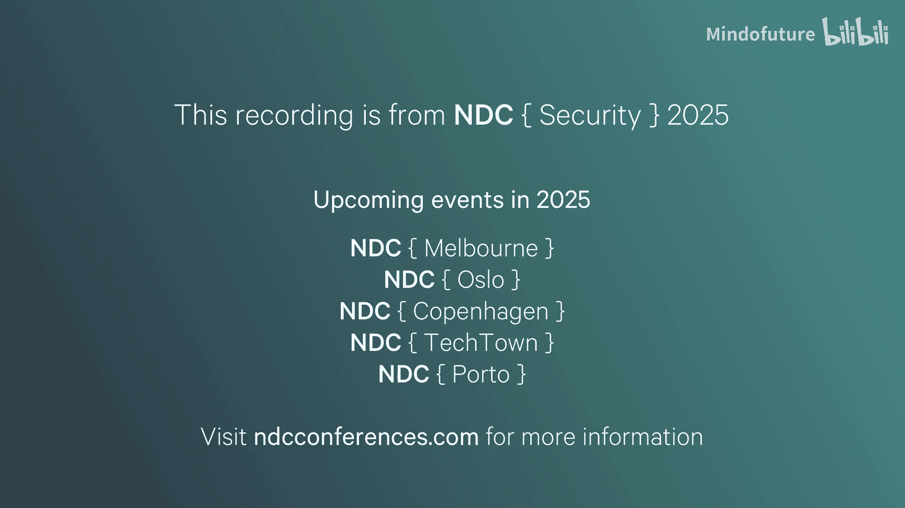
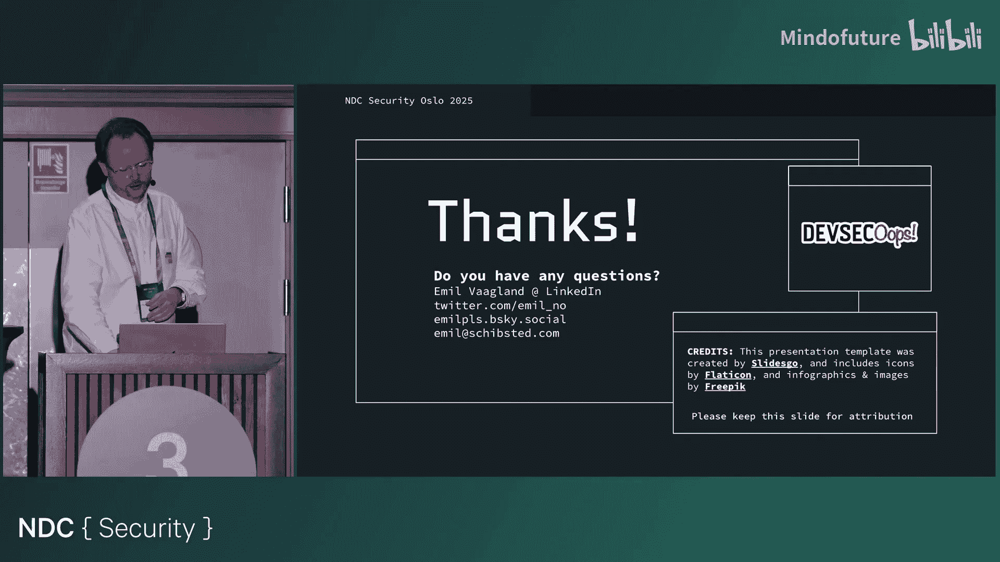

# 016：从DevSecOops到安全成功——FINN.no的漏洞赏金效应

在本节课中，我们将学习FINN.no如何通过实施漏洞赏金计划，成功地从安全困境（DevSecOops）转向安全成功。我们将探讨该计划的运作方式、带来的实际效果，以及它如何成为其应用安全计划的核心组成部分。

## 概述：FINN.no与安全挑战

FINN.no是挪威最受欢迎的在线市场，用户可以买卖从房屋、汽车到手机等几乎所有物品。其平台由约1100个应用程序组成，拥有超过250个Kubernetes入口端点和更多暴露的API端点。公司拥有约500名开发者，他们可以自由选择任何语言和框架来构建应用，只要能够打包为容器并部署到平台即可。这种灵活性带来了巨大的攻击面，也意味着生产环境中存在漏洞的可能性很高。

## DevOps生命周期与DevSecOops

上一节我们介绍了FINN.no的技术环境，本节中我们来看看他们面临的安全挑战是如何在DevOps流程中产生的。

传统的DevOps生命周期理念是让开发者能够自行部署、监控和运维应用。安全社区希望融入这一运动，因此提出了DevSecOps。其定义通常是在各个阶段“撒上”一些安全活动，以期提高安全性。

然而，当规模扩大时，这种做法很容易变成“DevSecOops”。团队会淹没在大量的误报警报中，向开发者发送大量噪音，忙于处理琐事而非真正降低风险。

在FINN.no，他们拥有多个漏洞发现来源：
*   **代码层面**：使用CodeQL进行高级静态代码分析，并检查依赖项和密钥。
*   **动态层面**：使用Detectify进行24/7的Web应用扫描，并进行攻击面监控。
*   **云安全**：使用多种云安全工具。
*   **人工层面**：进行传统的渗透测试和漏洞赏金计划。
*   **内部发现**：来自开发者或安全团队的内部报告，例如威胁建模或代码审查。

他们尝试追踪这些不同来源，并相互进行基准测试。核心关注点是那些**已验证可在生产环境中被利用的漏洞**，而非自动化工具产生的大量误报或技术上正确但不可利用的发现。

## 传统渗透测试的局限性

在引入漏洞赏金计划之前，FINN.no主要依赖传统的渗透测试。在DevOps和快速发布兴起之前，他们采用“发布前测试”模式，这在每年只发布一两次时是合理的。

但随着发布频率增加到每周数次，这种模式无法扩展。从2014年到2018年，他们每年进行两次大型应用渗透测试，每次约1.5周。这无法跟上每周数千次部署的速度。因此，漏洞预测变得模糊，很可能存在大量未被发现的漏洞。

Emil在2019年加入时计算发现，已发现漏洞的平均暴露时间长达**800天**，其中最老的漏洞已在生产环境存在近**11年**。2014-2018年间的渗透测试平均每次发现约15个漏洞，成本高昂，且发现的漏洞类型单一，主要是跨站脚本（XSS），缺少SQL注入、SSRF等OWASP Top 10中的其他高风险漏洞。

## 漏洞赏金计划的引入与“漏洞赏金效应”

上一节我们看到了传统安全测试的瓶颈，本节中我们来看看FINN.no如何通过漏洞赏金计划打破这一局面。

在2019年启动私有的漏洞赏金计划后，他们观察到了“漏洞赏金效应”。发现的漏洞在**多样性**上大幅增加。原因很简单：现在每周都有大量人员查看网站，而不是每年一两次，相当于在目标上投入了更多“眼球”。

漏洞赏金计划本质上是众包安全测试。公司将其托管在平台上，邀请安全研究员（黑客）参与。研究员阅读测试范围后开始测试，提交报告。公司根据漏洞的影响评估其价值并支付赏金。计划可以是公开或私有的，FINN.no一直保持私有以维持报告质量。

该计划的优势包括：
*   **持续测试**：获得更频繁的安全评估。
*   **更多发现**：总体上发现更多漏洞。
*   **更多样化**：发现各种类型的漏洞，覆盖所有希望找到的漏洞类别。

对于FINN.no，该计划仅在生产环境测试，非常适合面向最终用户的服务。但对于银行ID验证流程或后台管理界面等场景，他们仍然会进行渗透测试。两者都有其适用的场景。

## 如何运行一个成功的赏金计划

一个常见问题是支付多少赏金。FINN.no根据漏洞的严重性和业务影响支付。对于市场而言，防止欺诈至关重要，因此泄露用户邮箱、电话号码或导致账户接管等漏洞都被视为严重。赏金起价为100美元，最高6000美元。虽然这在挪威语境下看似不少，但与大型科技公司数十万美元的最高赏金相比仍属较低。过去5-6年，他们总共支付了约20万美元，中位赏金在200-400美元之间。

既然无法在赏金金额上与巨头竞争，他们就在其他方面竞争。核心原则是：**友善且高效**。

以下是他们吸引和激励研究员的关键做法：
*   **友善与尊重**：在沟通中保持友好和尊重。
*   **宽松的范围界定**：如果提交的漏洞不在明确范围内但具有实际影响，他们会接受并将其加入范围。这与某些直接修复却不支付赏金的项目形成对比。
*   **协作确定影响**：与研究员合作确定漏洞的最大影响，而非一味试图降低其严重性。他们经常因此提高赏金金额。
*   **快速的响应时间**：这是最有效的策略之一。当研究员在提交报告后几小时内就得到回复，他们会非常满意并更有动力继续测试。FINN.no曾是该平台上响应速度最快的项目之一。

快速的响应带来了积极循环。一位研究员因得到及时回复而备受鼓舞，成为了该年度为FINN.no提交有效漏洞最多的研究员，赚取了丰厚赏金，公司也获得了许多高质量的漏洞。

## 漏洞赏金计划的实际影响与数据

上一节我们介绍了成功运行计划的要点，本节中我们通过具体数据来看看其实际效果。

启动赏金计划后，漏洞发现速度大幅提升。例如，一个关于Spring Boot Actuator端点（可导致账户接管）的严重漏洞在某个周六晚上被报告。安全团队迅速验证，并幸运地联系到一位已订阅平台通知的首席工程师。该工程师在漏洞被验证的同时就部署了修复，几乎形成了一场“竞速赛”。漏洞在几小时内就被关闭，研究员也非常满意。

从年度数据来看，提交量呈过山车式变化。第一年非常繁忙，但并非所有报告都有效。随着时间的推移，有效报告的比例保持较高且稳定。在资金方面，第一年花费约1.5万美元发现了24个有效漏洞，这比一次应用渗透测试便宜，但发现的漏洞却多得多，性价比极高。

关于报告类型，除了被接受的漏洞，也会收到因无影响或公司决定不修复等原因不被接受的报告。这部分比例一直较低。2024年，为了提升沉寂项目的活跃度，他们开始每周随机邀请100名研究员，这虽然增加了报告数量，但也降低了平均报告质量，使其更接近公开项目的水平。

运行私有项目有助于维持质量，但邀请随机研究员会引入低质量报告。处理这些报告并不总是费时，有时甚至有趣。例如，有研究员提交了通过浏览器控制台执行XSS的“漏洞”，这更像是“自我XSS”。对于此类报告，他们会礼貌拒绝。

偶尔也会遇到不愉快的交互。例如，有研究员提交了三个明显是垃圾信息的高危报告，导致平台因赏金池耗尽而自动暂停项目。在周六处理时，安全团队发现这些报告涉及一些早已不存在的旧域名，毫无影响。在将其关闭为“不适用”后，研究员威胁要在Twitter上公开质疑。为了避免在周末陷入网络争论，团队最终将其关闭为“不接受”。这类极端情况仅发生过一次。

## 赏金计划带来的额外收益与战略洞察

漏洞赏金计划的影响远不止直接发现漏洞。它显著缩短了漏洞的平均暴露时间，从过去的近三年降至几周或几个月。同时，发现漏洞的总数在下降，这可能是因为项目对研究员吸引力下降，但也可能意味着平台本身变得更“坚固”。

一个有趣的发现是：在收到的360份有效报告中，只有**2个**是由可被利用的开源依赖漏洞引起的。这表明，过分追求“零可被利用依赖”可能不如专注于修复自身代码中的漏洞来得实际。当然，管理依赖风险仍是最佳实践，但资源分配需要权衡。

该计划还成为了FINN.no应用安全计划的关键组成部分。当所有开发者都能访问赏金平台并跟踪报告时，安全漏洞意识得到了前所未有的提升。这些真实的漏洞数据也被用来指导安全工作的优先级。例如，他们有很多XSS漏洞需要修复，但自2014年以来就再未发现过SQL注入。因此，他们无需对开发者进行大量的SQL注入培训。这主要归功于他们使用的主流JVM语言框架多年来采用了**安全默认配置**，例如数据库库会自动编码输入，开发者无需手动处理，从而从根本上消除了这类漏洞类别。

他们还将漏洞数据“武器化”，用于创建内部CTF挑战。这些基于真实赏金漏洞的挑战极大地提升了开发者的参与度和安全意识。

## 漏洞赏金与其他安全工具的对比

尽管漏洞赏金计划是FINN.no最具成本效益的活动，他们仍然同时使用代码扫描、动态扫描等其他工具。原因是不同工具发现不同类型的漏洞，重叠有限，共同使用能提供更好的安全保证。

一个关键数据是：自2019年以来，赏金计划发现的20个严重漏洞中，只有**5个**可能通过代码扫描发现。这意味着，即使代码扫描达到100%覆盖率，也会错过另外15个严重漏洞。而当两者结合时，才能发现更多的漏洞。

我们来做一个不那么公平但有趣的“苹果与橘子”的对比：
*   **代码扫描（如CodeQL）**：需要构建应用，集成到CI/CD中，可能破坏构建，耗费大量工程精力。产生的发现缺乏上下文，可能是技术正确但不可利用的噪音，成本高，且不保证发现所有问题。
*   **漏洞赏金计划**：范围明确，黑客无处不在。能获得大量真实、可被利用的发现。开发者只与这些真实发现交互，因此对其信任度更高。

传统的建议是，在启动赏金计划前，应先做好威胁建模、代码扫描、动态扫描等所有基础工作。但对于大型组织，这可能需要数年时间。Emil的“辛辣”建议是：**不要等待**。直接启动一个私有赏金计划，立即开始真正的风险降低。唯一的要求是能够接收报告，并能在合理时间内修复漏洞，避免被重复报告淹没。效果会立竿见影。

另一个对比是 `security.txt` 文件与漏洞赏金计划。`security.txt` 是一个告知研究人员如何报告漏洞的文本文件。多年来，FINN.no通过它收到的有效报告极少，大多是垃圾邮件。相比之下，赏金计划带来了大量报告。有趣的是，Emil甚至通过LinkedIn收到的真实漏洞报告都比通过 `security.txt` 多。核心观点是：达到一定规模的公司都应该有一个漏洞赏金计划，因为这才是当今真实漏洞流向的地方。仅仅拥有 `security.txt` 是远远不够的。

## 如何启动你自己的漏洞赏金计划

现在，我们来谈谈如何启动一个漏洞赏金计划。这其实很简单：
1.  **准备预算**：获取一些资金。
2.  **选择平台**：测试不同的平台，看功能是否合适。平台可能会推销托管分类服务，但如果购买，响应速度可能会变慢。建议自行处理，以保持黑客的积极性。
3.  **设定赏金**：根据业务影响设定赏金级别。可以参考其他项目的标准进行对齐。
4.  **界定范围**：从小范围开始，随着项目成熟再逐步扩大。
5.  **前期测试（可选）**：有些人建议在启动前先做渗透测试。FINN.no做了三次，但在赏金计划启动后的第一年，仍然发现了117个新漏洞。两者都做当然更好。
6.  **结合自动化扫描**：进行24/7扫描以捕获低悬果实，并用于对比不同安全工具的效果。
7.  **内部沟通与推广**：告知整个组织，处理可能的扫描噪音，向开发者开放平台访问权限，从而免费构建安全文化。

## 平台选择的关键要素与报告披露的价值

选择一个合适的平台至关重要，以下是一些“必备”功能：
*   **与SSO集成**：便于无缝管理开发者访问权限，避免手动操作的麻烦。
*   **良好的API**：易于使用，没有繁琐的速率限制或认证方法。需要能够导入报告（例如，将从其他工具发现的漏洞导入，避免重复），并能够导出数据用于自定义分析。
*   **自动化潜力**：例如，可以根据Kubernetes标签自动将报告分配给正确的团队。
*   **报告披露功能**：允许在内部或公开披露已修复的报告。这对于知识共享、建立社区、展示公平性（例如，对同类漏洞支付相同赏金）非常有价值。最大的影响在于**绕过测试**：研究员会查看已披露的旧报告，并尝试绕过修复措施。

FINN.no有一个关于正则表达式（Regex）过滤的典型案例。他们使用Regex来阻止外部访问内部后端路径（如 `/metrics`, `/health`, `/actuator`）。在启动赏金计划7天后，他们就收到了第一个绕过报告（利用分号字符）。该报告被披露后，次年1月又收到了两个新的绕过报告，夏季再次收到一个。这个存在了3年的漏洞，历经多次代码扫描、动态扫描和渗透测试都未被发现，却在赏金计划启动7天后被发现，并在一年内被多次绕过，这充分展示了报告披露和众包测试的强大效果。

## 经验教训与总结

最后一个例子是关于依赖混淆攻击。在2021年该攻击被普及后，FINN.no的安全团队迅速在所有包管理系统中进行了缓解，并发布了一篇详细的博客文章，甚至开源了一个名为 `artifactor` 的工具。

然而，一年半后，他们仍然收到了一个关于NPM依赖混淆导致远程代码执行的报告。问题在于：他们虽然构建了检测工具，却**忘记自动化运行它**。更具讽刺意味的是，提交报告的研究员在报告中引用了他们自己发布的那篇博客文章作为修复参考。

这个教训是：**有时写博客文章比创建工具更有效**（如果工具不被使用的话）。当然，事后他们立即开始了该工具的24/7自动化运行。

**本节课总结：**

我们一起学习了FINN.no的“漏洞赏金效应”。该计划已被证明是他们最具性价比的安全活动，并成为应用安全计划的核心成分。他们仍然进行其他所有安全活动，以捕获长尾漏洞。但他们也相信，**为不同漏洞类别推行安全默认配置**，可能比试图到处推行代码扫描更有效，因为所需努力相似。

启动一个漏洞赏金计划相对容易且影响深远，每个大型公司都应该考虑拥有一个。在不支付顶级赏金的情况下取得成功的关键，就是 **“保持友善，行动迅速”**。