# 019：第一只计算机蠕虫

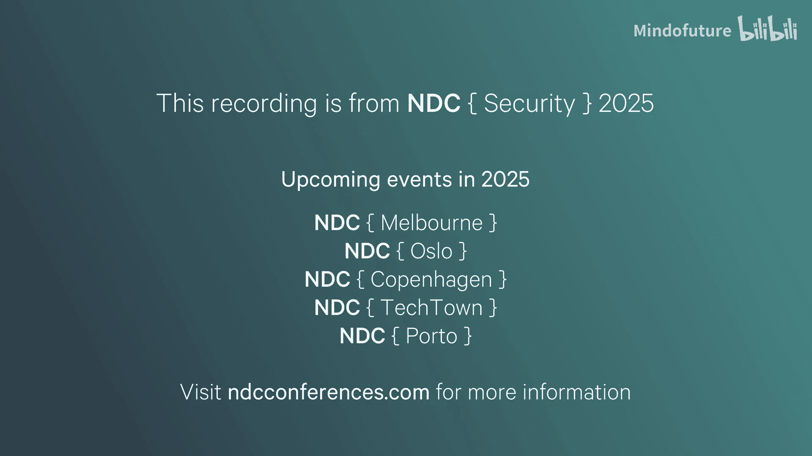

在本节课中，我们将回顾互联网时代第一起重大的安全事件——莫里斯蠕虫。我们将了解它的诞生背景、技术原理、造成的巨大影响以及后续的法律与个人结局。通过这段历史，我们可以更好地理解网络安全的基本概念和其持久的重要性。

## 事件背景与序幕

上一节我们介绍了课程的主题。本节中，我们来看看莫里斯蠕虫事件发生的时代背景。

1988年11月2日深夜，一封来自NASA雇员P.E.的电子邮件写道：“我们目前正遭受攻击。”这场攻击始于傍晚6点，某种软件侵入了伯克利大学计算机实验室的电脑，而伯克利远非唯一的受害者。似乎每一所大学、大型公司，甚至NASA、NSA和美国国防部的计算机都成为目标。北美各地的计算机陷入瘫痪，常规的故障排除手段，如清除运行进程甚至重启计算机，都只能带来暂时的缓解。计算机不断地被重新感染。

技术社区很快意识到，这是一种能够在网络上快速自我复制和传播的软件。这是许多计算机用户第一次遭遇“计算机蠕虫”。更令人担忧的是，该蠕虫利用了目标计算机上多个不同系统的漏洞，甚至能够冒充用户并通过远程Shell传播自身。

那么，这究竟是一场什么性质的攻击？是来自苏联或其他美国敌对国家的网络攻击，还是来自美国内部的秘密行动？正如我们将要看到的，事实并非如此。它实际上是由康奈尔大学一名研究生编写的、约3000行存在些许缺陷的代码所导致的结果。

## 演讲者与黑客文化溯源

我是Håvard，目前是Kapa的一名软件开发人员。虽然安全并非我的日常主要工作，但我经常接触到相关内容。我对历史也很感兴趣，并与朋友共同制作了一个探讨我们领域历史事件的播客。

黑客和恶意软件文化几乎与计算机本身的历史一样悠久。早在1962年，当MIT安装了一台多用户计算机时，Alan Shaer就遇到了一个大问题：他必须与同事共享计算时间。为了获得更多时间，他经常篡改内核。当他的内核访问权限被撤销后，他想出了其他办法。当时，所有用户的密码都存储在一个人类用户无法访问的文件中。而这台计算机的一个功能是，为了避免浪费时间在计算机上阅读文件，用户可以要求将文件打印并送到办公室。打印机当然需要访问计算机上的所有文件。于是，Shaer简单地要求将密码文件打印出来送到他的办公室，并随后登录他人的账户，有时还会留下一些粗鲁的信息以示“到此一游”。

我们今天讨论的事件常被称为“伟大的蠕虫”，有时也被称作“第一只蠕虫”，但它实际上并非第一只。蠕虫是一种完全独立的恶意软件，而病毒则通过修改计算机上现有的软件或文件来工作。第一只蠕虫早在70年代就已出现，当时它们被称为“爬行者”，是一种在计算机间移动的软件，目的是“抓住蠕虫”。因此，第一批反病毒软件也随之诞生，常被称为“收割者”，用于追踪这些“爬行者”。在整个70年代和80年代，出现了许多病毒和恶意软件，但它们数量稀少，很少针对广大受众或对公众产生重大影响。直到1988年，恶意软件、蠕虫和病毒才真正进入大众的视野，因为互联网是使病毒和恶意软件受到重视所缺失的关键一环。

## 1988年的互联网环境

当时的互联网并非我们今天所熟知的样子。在美国、挪威和英国，计算机通过Arpanet连接。就我们的目的而言，我们可以将Arpanet视为今天的互联网——一个连接计算机、可以跨网络发送信息的系统。其最初目的是连接重要的国防设施，但研究人员很快看到了通用网络的用途。

互联网起初发展缓慢，但确实在稳步增长。美国的顶尖大学和研究机构迅速采用了这项技术并探索其潜力。当时的互联网几乎没有“大门”，一切都相互连接，人们似乎喜欢这种方式。这使得跨研究机构获取和更新彼此计算机上的数据变得容易，合作相当简单。这是一个相当紧密的社区，至少在初期是如此。然而到了1988年，网络已经变得相当庞大，人们开始难以把握其规模。

当时的安全观念可以引用一句话来概括：“保护计算机系统很容易。你只需断开所有拨号连接，只允许直接有线终端。将机器及其终端放在一个屏蔽房间里，并在门口安排警卫。”人们意识到了互联网连接的危险，但重点仍然放在计算机的物理安全上。互联网连接在当时更像是一种实用工具，而非基础设施的关键部分。

## 蠕虫的创造者：罗伯特·莫里斯

现在，让我们认识一下改变这一切的人。罗伯特·塔潘·莫里斯（朋友们称他为RTM）可能是70、80年代成长起来的人中，最深入浸润计算机文化尤其是网络安全的一位。罗伯特以他的父亲——老罗伯特·莫里斯命名。老莫里斯在数学方面获得荣誉，并在AT&T著名的研究机构贝尔实验室实习后，投身于计算机科学事业。他对密码学特别感兴趣，并开发了许多至今仍可识别的软件安全算法和模式。他是Unix早期版本的贡献者，例如`/etc/passwd`文件就是他的工作成果。后来，他成为了NSA的助理主任。

而他的儿子，小罗伯特·莫里斯，在书中被描述为神童。通过父亲在贝尔实验室的关系，他很小就接触了计算机。他轻松完成了基础教育，在哈佛获得学士学位后，几乎立即转到纽约州伊萨卡的康奈尔大学攻读研究生。正是在康奈尔，他开始了那项定义其短暂却引人注目经历的工作——蠕虫。

据估计，莫里斯用了大约一个月时间创建这个程序。在他发现康奈尔大学运行的计算机中存在某些安全漏洞后不久，他便开始了这项工作。整个程序编译后大约3200行代码。至于他创建蠕虫的动机，至今仍有争议。法庭上提供的理由包括：他想证明系统和互联网用户的行为有多么不安全，并认为发布一个概念验证是最好的方式；另一个更利他的理由是，他想测量互联网的规模，因为当时互联网已超出任何人的控制，无人确切知道其大小。然而，后者难以令人信服，因为蠕虫的感染率远未达到10%，且它只利用了互联网上特定类型操作系统的漏洞。更可能的原因，或许是出于“这样的软件能否被编写出来，尤其是我能否编写出来”的技术挑战与好奇心。

## 蠕虫的传播与应对

无论动机如何，蠕虫在傍晚6点左右从一台远程访问的哈佛大学计算机上被释放。他没有在康奈尔释放，而是黑进了自己在哈佛的旧账户并从那里释放。

根据Donn Seeley的论文《蠕虫之旅》，我们可以梳理出蠕虫传播的时间线：
*   释放后24分钟，蠕虫抵达西海岸。
*   40分钟后，伯克利大学被感染。
*   晚上8点前，马里兰大学被击中。
*   大约8点，MIT报告了首例感染。
*   晚上8点半，伯克利的研究人员开始注意到计算机速度变慢，以及一些程序出现异常行为。
*   晚上9点前，犹他大学被击中，首次sendmail攻击发生，计算机进程数达到上限。

犹他大学的系统管理员开始检测并尝试清除计算机上运行的蠕虫，但大约20分钟后证明这是徒劳的。晚上11点半，为NASA工作的Peter Yee发出了我们在开头看到的那条消息。当时，他和许多同事碰巧在伯克利参加一个会议，一个临时工作组迅速组建起来，开始剖析这只蠕虫。

他们发现，可以将蠕虫的能力分为如何攻击新计算机以及如何防御自身。在防御方面，其核心是尽量不被机器上的用户察觉。蠕虫试图尽可能少地占用机器资源，并且不破坏计算机或其上的文件。每只蠕虫占用的资源并不多，它还通过重命名进程和频繁更改ID来隐藏自己。然而，它最大的防御源于一个设计缺陷：一旦蠕虫感染计算机，它实际上会变成一个导致计算机完全无法使用的“分叉炸弹”。

## 蠕虫的运作机制

上一节我们看到了蠕虫的传播和初步分析。本节中，我们来深入看看它的具体运作机制。

为了解释蠕虫如何变成分叉炸弹，下图展示了蠕虫感染计算机后运行的一些检查流程：

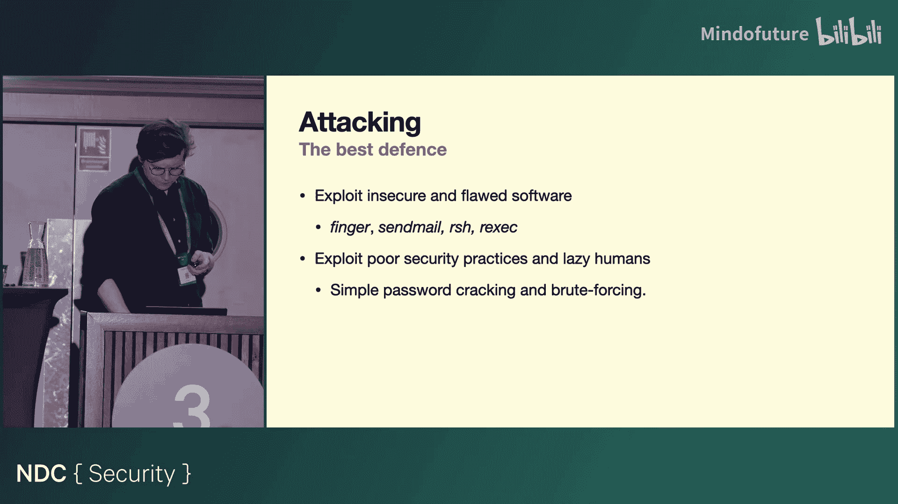

一旦感染计算机，它会运行一个程序来检查计算机上是否有其他蠕虫。如果没找到其他蠕虫，它会继续感染过程。如果找到了其他蠕虫，它会以 **1/7** 的概率仍然允许该蠕虫运行。如果通过了这1/7的检查，它会继续感染；在 **6/7** 的情况下，它会失败并设置一个“请退出”标志，在一段时间后慢慢终止。

蠕虫能够传播并成为分叉炸弹的原因是，莫里斯没有预料到蠕虫的实际表现会如此之好，导致同一台计算机上遭受的攻击次数过多，使得 **1/7** 的存活概率远高于维持少量蠕虫在PC上运行所需的值。引入这个概率的原因未知，猜测可能是为了即使被人类发现，也能让蠕虫在机器上保持存活。

然而，最好的防御是进攻。蠕虫通过利用计算机上软件和用户行为中的多个不同漏洞来工作。

## 漏洞利用详解：密码破解与远程执行

让我们稍微看一下蠕虫的代码，以理解我的意思。

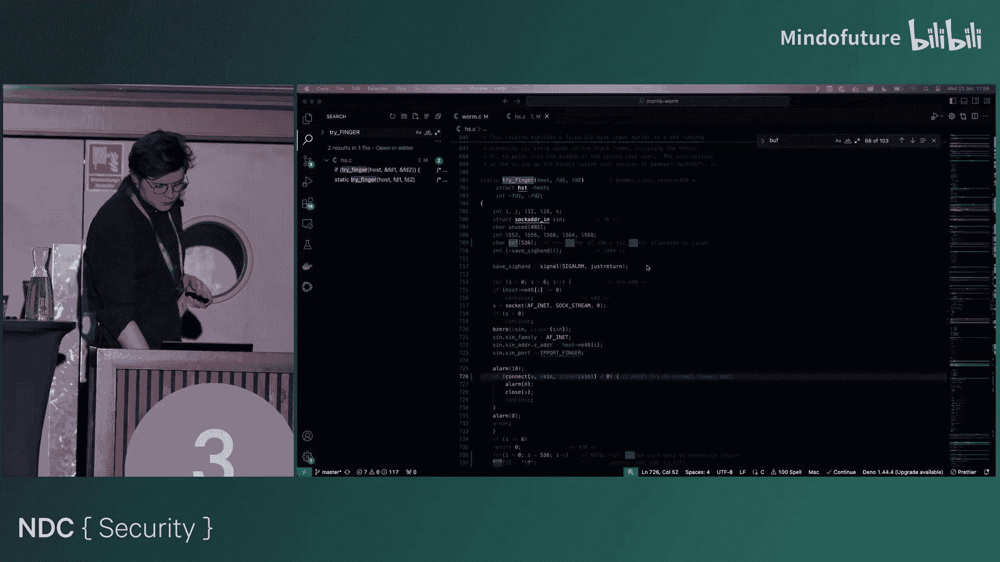

当蠕虫感染后，它首先会检查其他蠕虫。如果进入下一阶段，它会启动一个简单的密码破解算法。它会扫描计算机上的某些文件，寻找`/etc/passwd`文件、hosts文件、与其他计算机的连接，并开始寻找用户名和其他可用于辅助密码破解的信息。当时的安全实践非常差，人们经常使用用户名作为密码。蠕虫会尝试将用户名、用户名重复两次、用户名倒序等作为密码。这个破解算法会分几个阶段工作，每次找不到可用密码时就扩大搜索范围。这就是为什么它在主循环中被多次调用。

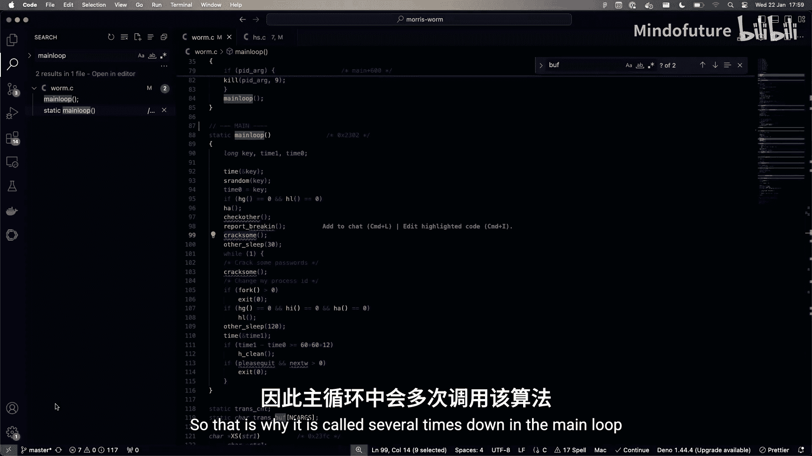

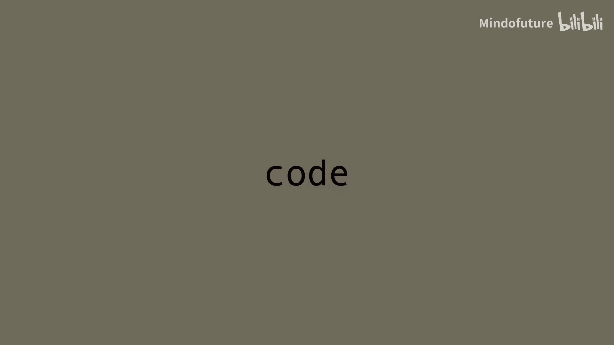

一旦找到任何密码，它会尝试使用这些信息，通过两种程序传播到其他计算机：
1.  **远程执行（rexec）**：通过简单的用户名-密码方案在另一台机器上执行命令。密码通常以明文形式存储在用户的`.forward`、`hosts`文件或`/etc/passwd`文件中，便于用户查找，但也容易被蠕虫获取。
2.  **远程Shell（rsh）**：甚至更不安全。它通过一个主机白名单方案工作，服务器维护一个可以访问它的白名单用户文件。如果蠕虫获取了这个文件，它就突然拥有了网络中许多用户的信息，可以更容易地传播到其他计算机。

## 漏洞利用详解：缓冲区溢出与Sendmail

莫里斯还发现了两个程序中的严重漏洞：`finger`和`sendmail`。`finger`是一个用户信息查询程序，它简单地打印出计算机上用户的信息。`finger`守护进程的工作方式是：接收客户端的请求，将数据存储在一个512字节的缓冲区中，然后在服务器机器上本地运行`finger`，使用C语言中的`gets()`方法读取缓冲区，然后将从`finger`得到的响应发送回客户端。如果我们查看`gets()`的文档，会看到这样的警告：“**`gets()`不检查边界**”。这就引入了缓冲区溢出漏洞。

那么，如果你发送的不是512字节，而是536字节呢？那么，攻击就开始了。

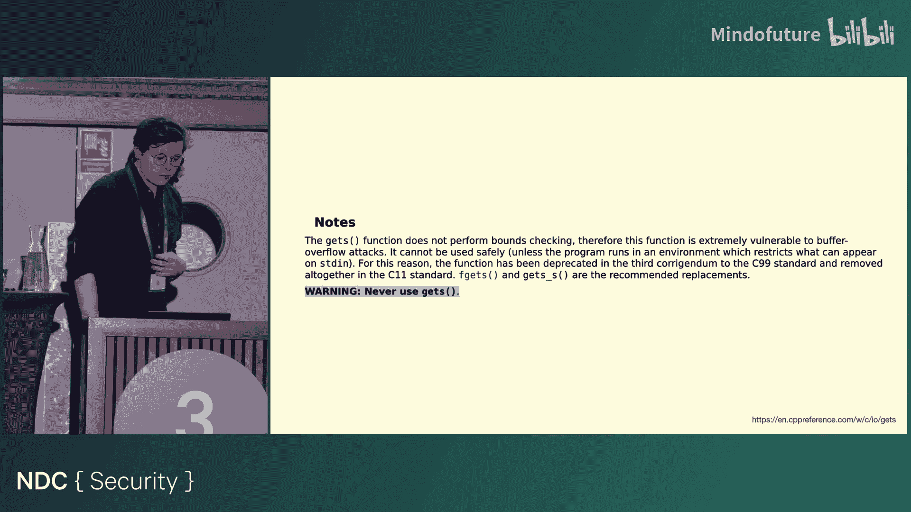
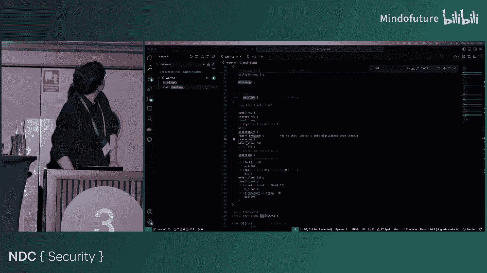

蠕虫代码会分配一个536字节的缓冲区，发送到运行`finger`服务器实例的端口。前512字节基本上填充垃圾数据，最后24字节则填充这条命令：**在目标机器上启动一个远程Shell**。在缓冲区溢出攻击中，这会覆盖服务器机器上分配的内存。当`gets()`执行完毕后，它会继续沿栈向下执行，并命中这条命令，而不是之前在那里的任何代码。因此，现在不是正常执行`finger`的功能，而是打开了一个远程连接，获得了对服务器机器的完全访问权限。

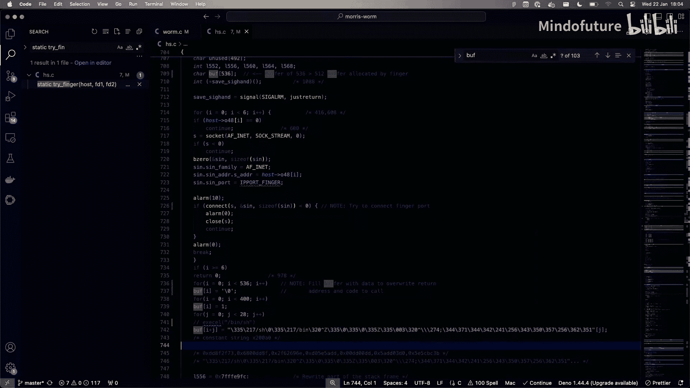

蠕虫利用的最后一个漏洞存在于`sendmail`系统中。`sendmail`是一个与SMTP交互的程序。SMTP是一种有趣的基于动词的协议，用于发送电子邮件。它被称为简单邮件传输协议。协议中还有一个`DEBUG`动词可用，如果实现该协议的程序允许的话。对莫里斯来说幸运的是，当时非常流行的Unix BSD 4.2和4.3发行版中预装的`sendmail`是以DEBUG模式编译的。

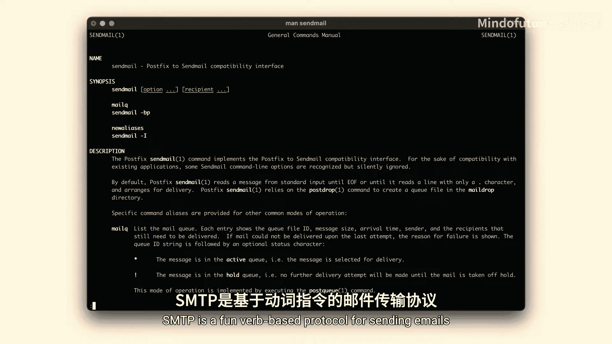

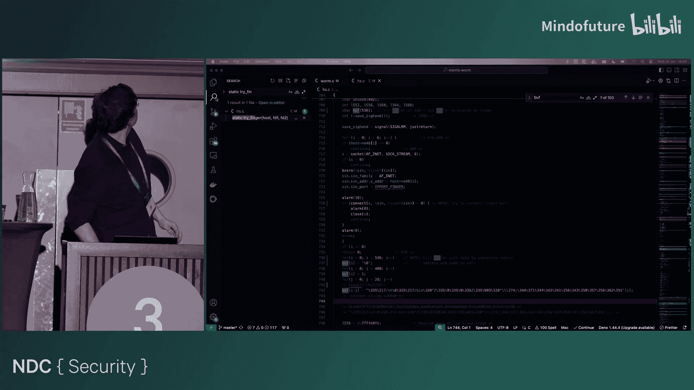

这开启了一些有趣的行为。

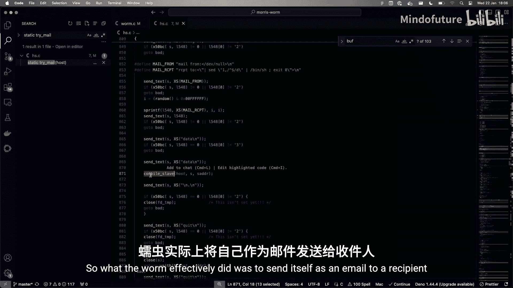

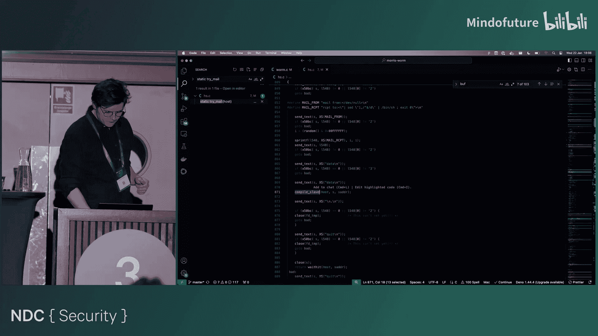

由于某些原因，当`sendmail`以调试模式编译时，你可以在收件人字段发送命令，而不是收件人电子邮件地址。例如，你可以要求收件人打开一个新的命令解释器并运行某些内容。当然，这个“某些内容”就是作为电子邮件正文发送的、已编译的蠕虫版本。因此，蠕虫所做的就是将自己作为电子邮件发送给收件人，然后要求收件人立即执行邮件正文中的蠕虫。

## 事件的平息与影响

然而，人们很快发现了这些不同的漏洞。它们在蠕虫传播后的夜晚被不同的社区在不同时间发现。但由于许多人关闭了远程连接、基本处于离线状态且不接受任何呼叫，信息共享变得极其困难。电子邮件也基本无法使用。

幸运的是，就在蠕虫爆发时，伯克利的一个年度工作组会议即将开始。因此，大约40名系统管理员在事件发生时就在镇上。他们很快聚集起来，开始研究如何修复和发现所有不同的问题。MIT的一个工作组也迅速聚集起来，开始抵御蠕虫的所有不同技术攻击向量。

人们几乎从11月3日夜晚一直工作到第二天全天。大约一天后，足够多的人要么完全离线，要么留在线上的人发现了所有不同的补丁、修复了漏洞并修补了他们的系统。几天后，他们开始反编译源代码，得以展示、讨论并找出蠕虫的所有内部工作原理。

很难评估事件造成的实际损失。如前所述，蠕虫本身没有任何危害，但它确实造成了大量的时间损失。在某些地方，由于人们不想冒任何风险，甚至下令完全清除计算机内存，导致更多的时间损失，在某些情况下甚至导致数据丢失。但事实上，我们并不真正了解蠕虫的影响。美国审计总署估计损失在10万到1000万美元之间，这说明了当时大家有多么不确定。另一个有争议的数字是，大约有6000台计算机被感染，约占当时北美联网计算机的10%。

一个有趣的细节是，为什么它只影响了北美？因为当时连接欧洲和北美只有一根电缆。当你在挪威，深夜接到美国同事的电话警告你有病毒在传播时，你会做唯一明智的事情：拔掉插头。这正是Paul Spning在接到同事警告电话后所做的。蠕虫可能不会传播到挪威或英国，因为其代码中有防止进行所谓“异国连接”（例如尝试连接连接欧洲和北美的卫星）的部分。然而，如前所示，该软件也被证明存在缺陷。所以我们不知道，因此直接拔掉插头是稳妥的。而且，你什么时候能有这种机会呢？

其他媒体也注意到了所发生的事情。这实际上是主流出版物首次在领域期刊和研究论文之外，将这个计算机网络称为“互联网”。当《纽约时报》得知黑客的身份，并且他的父亲是NSA的助理主任时，这成了一个更加引人注目的新闻故事。《纽约时报》在逮捕莫里斯的过程中也发挥了重要作用，尽管无论如何他都会被抓住。莫里斯很快注意到了他所造成的破坏，并通过朋友试图联系、道歉甚至提供帮助。当然，这很困难，因为太多人已经离线。他的一位朋友认为联系报纸是明智之举，于是联系了《纽约时报》，却不小心说漏了嘴，透露用户名为RTM的人就是蠕虫的创造者。据说（但无法证实）调查人员随后可以通过`finger`查询发现哈佛和康奈尔系统上的RTM用户，从而将蠕虫的传播归咎于莫里斯。几天后，他被FBI带走。

## 法律后果与后续发展

在1988年，这实际上构成犯罪吗？这是前所未有的事件。那么，他是否做了违法的事？如果他在1986年之前传播蠕虫，他可能会逃脱惩罚。然而，当《计算机欺诈和滥用法案》（CFAA）于1986年写入法律后，个人在未经适当授权或超出授权范围的情况下故意访问受保护的计算机就变成了非法行为。

因此，这成了一场审判。莫里斯成为第一个根据CFAA被审判和定罪的人。在法庭文件中，你可以看到关于法律措辞的有趣讨论，特别是关于莫里斯是否真的“超出了他的授权”，因为他已被康奈尔大学授予互联网访问权限，当时网络上还没有真正建立授权层级。然而，法庭不同意这种辩护。但由于蠕虫相对无害，并且他可以通过代码证明其中没有恶意意图，只是导致其过度复制的错误，他仅被判处10，050美元罚款和400小时社区服务。他也被康奈尔大学开除（并非法院强制，但大学很难为当时世界上最臭名昭著的黑客提供互联网接入辩解）。

但生活还在继续，尽管有时需要隐姓埋名。莫里斯从事件中恢复过来，但试图保持低调。如前所述，他被康奈尔开除，但并未被禁止攻读计算机科学学位。在他的刑期和一小段缓刑结束后，他被他的母校哈佛大学重新录取，并在那里完成了博士学位。随后，他于1999年被MIT聘为助理教授，至今仍在MIT。你甚至可以在YouTube上找到他的一些讲座录像，尽管他从未提及蠕虫，他讲授的是分布式系统。

教学并非他唯一的成就。他与朋友（最著名的是Paul Graham）共同创立了一个成功的电子商务平台，名为Viaweb（因为它通过网络工作）。该平台在互联网泡沫前被雅虎收购并更名为Yahoo Stores。如果你感兴趣，这项服务至今仍然可用。他还资助了一个名为Y Combinator的初创企业孵化器。莫里斯和他的朋友们也是Lisp编程语言家族的坚定支持者，并构建了该语言的几种方言。作为概念验证，他们使用这种语言创建了一个名为Hacker News的新闻聚合网站。我想我最初正是在Hacker News上读到关于这次事件的报道的，形成了一个美妙的循环。

## 总结与启示

在本节课中，我们一起学习了互联网安全史上的一个里程碑事件——莫里斯蠕虫。我们回顾了其产生的背景、利用的多重技术漏洞（包括密码破解、缓冲区溢出和sendmail调试模式漏洞）、造成的广泛影响以及其创造者罗伯特·莫里斯的人生轨迹。

如果你从未从事过安全工作，可以从这个事件中获得很多启示。更有趣的或许是屏幕顶部的那个玩笑话：“当我研究发生在20、30、40、50年前的IT历史事件时，有一点反复出现：**得到的教训并没有真正改变**。”我认为，即使今天，我也可以冒充安全专家，向世界各地的大公司提出这些安全建议，而且不会偏离太远。人们往往会忘记，或者更糟糕的是，甚至没有出生在这些事件发生的年代。

这次事件发生在约37年前，而蠕虫利用的不同攻击向量至今仍然存在，人类的行为模式也没有根本改变。今天的互联网工作原理与1988年时仍然相似，只是规模更大，我们对连接在网上的其他人了解得更少。因此，在我们卷起袖子推出“互联网2.0”之前，恐怕我们不得不每天与所有这些威胁共存。不幸的是，没有什么是绝对安全的，重要的是不要忘记这一点。

我将用Y Combinator创始人页面上关于罗伯特·莫里斯的一句话作为结束：“**1988年，他对缓冲区溢出的发现首次将互联网带入了公众的视野。**”

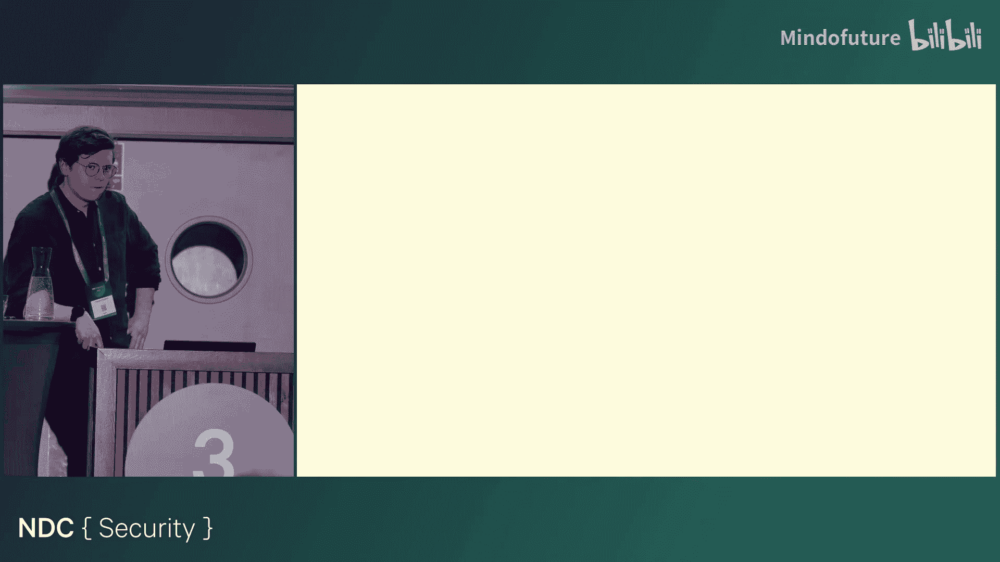

**问与答**
*   **问**：关于《计算机欺诈和滥用法案》（CFAA），它是否是因为某起特定事件而颁布的？
*   **答**：我很确定CFAA的颁布并非直接因为本案所涉及的原因。然而，我认为它是由于不同大学的入侵事件以及人们在未经适当授权的情况下访问计算机而催生的。该法律最初的措辞似乎并未预见到远程访问计算机的情况，因此法律条文非常侧重于对计算机的物理访问，而这正是当时大多数人主要关心的问题。

谢谢大家前来，希望能在会后派对上见到各位。😊