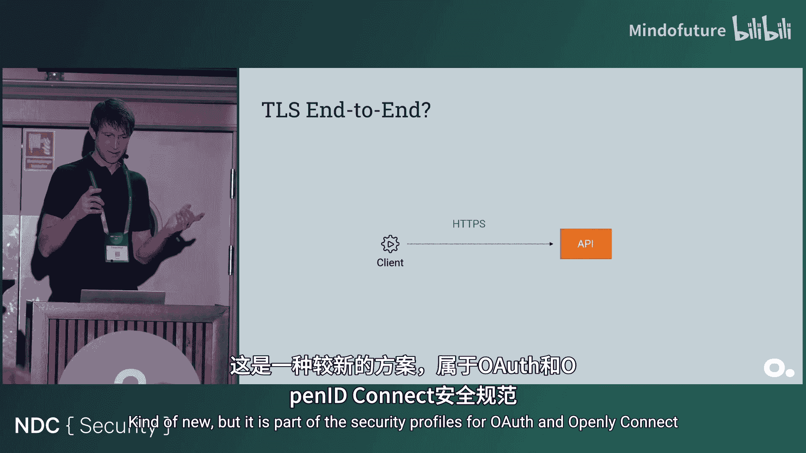
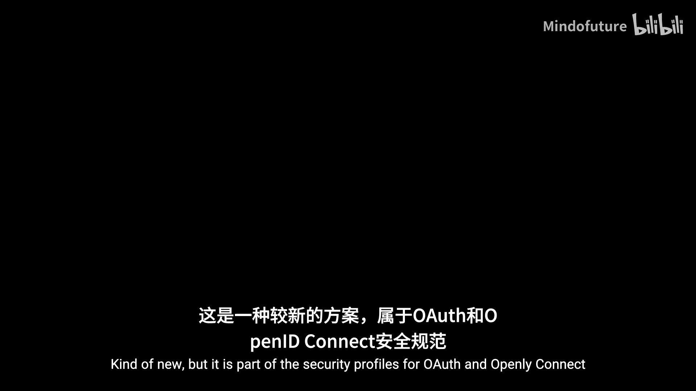
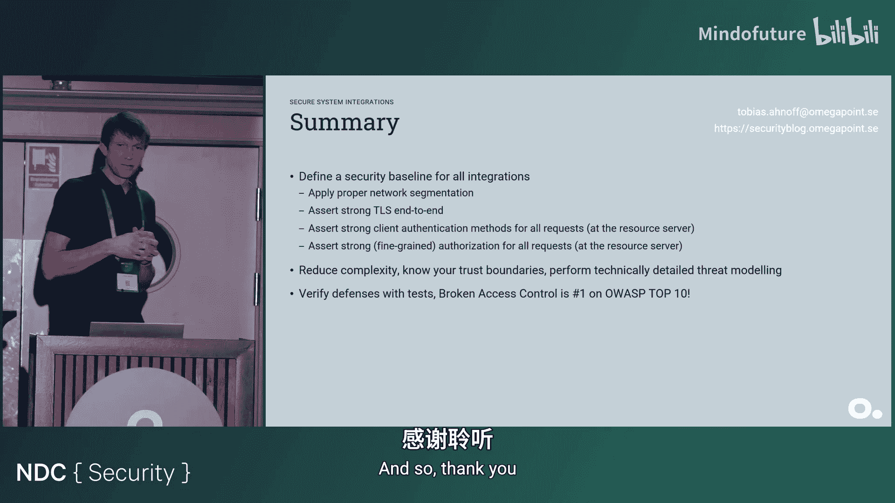

# 020：构建安全的系统集成

在本课程中，我们将学习如何为不同类型的系统集成（如API、文件传输和消息队列）设计和实施强大的安全措施。我们将从基础概念开始，逐步深入到高级安全模式，确保您能理解并应用这些原则来保护您的系统。

---

## 网络与传输层安全

我们从一个简单的场景开始：一个客户端需要安全地访问服务器上的资源，例如一个API。最基本的安全措施可以分为两类：**基础设施层安全**和**应用层安全**。本节我们先探讨基础设施层的防护。

### 基础设施防护

攻击者会在互联网上寻找目标。因此，第一条原则是：**除非必要，否则不要将API公开暴露在互联网上**。尽可能使用私有网络，这可以避免大量针对公共端点的垃圾请求。

然而，即使应用了网络隔离，也绝不能假设网络内的所有客户端都是可信的。网络防御只是第一道防线，我们需要在其之上叠加更多安全措施。

### 传输层安全

强大的传输层安全（TLS）是后续应用层防御的基石。它为所有请求提供**机密性**和**完整性**保护。

对于现代系统集成，应尽可能要求仅使用 **TLS 1.3**。如果因遗留系统必须支持 **TLS 1.2**，则必须对其进行加固配置。有许多优秀的指南可供参考。在纯机器对机器（M2M）的集成场景中，可以进一步限制仅使用特定密码套件。

评估TLS配置是否安全至关重要。在渗透测试中，我们常使用像 **SSL Labs** 这样的工具来扫描和评估公共端点的TLS配置。

### 端到端TLS的挑战

理想情况下，TLS应在客户端和服务器之间端到端地建立。但在实际架构中，我们通常会在服务前部署防火墙或网关等安全产品，以利用其高级安全功能（如流量检查）。这通常意味着TLS需要在网关上终止。

如果网关在检查后，以明文HTTP协议将流量转发给内部服务，就会在内部网络创建一大片不安全的区域。一旦攻击者进入该网络，就可以读取和篡改流量。

解决方案是让网关在检查后，**重新加密**发往后端服务的流量。这样，只要妥善保护执行重新加密的网关节点，我们就可以将其视为安全的“端到端”TLS。在现代的Kubernetes环境中，默认行为是在Ingress控制器处终止TLS，因此也需要特别注意内部流量的加密问题。

---

## 客户端认证与授权

上一节我们确保了通信管道的安全。本节中，我们来看看如何确认客户端的身份（认证）以及它能做什么（授权）。

### 客户端认证方法

TLS默认提供服务器认证。在M2M场景中，我们同样需要安全地认证客户端。**双向TLS** 支持这一点，它要求客户端也提供证书。

双向TLS非常强大，它同时提供了端到端的机密性、完整性和强客户端认证。然而，管理大量客户端证书的公钥基础设施（PKI）可能成本高昂且耗时，因此并非所有组织都能轻松采用。

除了双向TLS，还有基于应用层的非对称认证方法。以下是主要的客户端认证方法分类：

*   **弱认证方法（对称密钥）**：
    *   **API密钥**：一个共享的密钥字符串。
    *   **HTTP基本认证**：使用用户名和密码（也是共享密钥）。
    这些方法被认为是“弱”的，因为密钥一旦泄露，任何人都可以冒充客户端。
*   **强认证方法（非对称密钥）**：
    *   **双向TLS**：如前所述，使用客户端证书。
    *   **私钥JWT**：这是一种较新的、基于行业标准的方法。客户端生成公私钥对，并创建一个JWT（JSON Web Token），用私钥签名。服务器使用客户端的公钥验证该JWT。这避免了管理完整PKI的复杂性，但仍需建立分发和注册公钥的基础设施。

### 引入OAuth 2.0客户端凭证流

即使我们解决了客户端认证问题，通常还需要更细粒度的**授权**控制。如果只有一个API端点和单一客户端，那么认证即授权。但现实往往更复杂。

OAuth 2.0的**客户端凭证流**是处理机器对机器授权的行业标准。其流程如下：

1.  客户端向**授权服务器**认证自己（使用上述强认证方法）。
2.  授权服务器验证通过后，向客户端颁发一个**访问令牌**。
3.  客户端使用该访问令牌来访问受保护的API资源。

这个流程简单直接，避免了用户授权中的复杂重定向。然而，这里引入的访问令牌默认采用 **Bearer（持有者）模式**：任何获得该令牌字符串的实体都可以使用它访问API。这与API密钥有相似的安全隐患。

那么，引入OAuth带来了哪些实际安全提升呢？

*   **标准化**：拥有RFC规范、官方威胁模型和成熟的框架支持。
*   **细粒度授权**：访问令牌可以包含范围（`scope`）等元数据，支持更精细的访问控制决策。
*   **令牌生命周期管理**：可以颁发短期令牌，遵循最小权限原则。
*   **客户端密钥轮换**：可以在授权服务器端轮换客户端密钥，而无需API服务器停机。
*   **持有者证明令牌**：这是解决Bearer令牌缺陷的更强机制，我们稍后会详细讨论。

为了安全地使用OAuth，我们必须遵循最佳实践和安全规范，例如金融级API的 **FAPI 2.0** 安全规范。它明确要求使用**持有者证明令牌**和**非对称客户端认证方法**。

---

## 持有者证明令牌

上一节我们提到了Bearer令牌的弱点。本节将深入探讨两种解决此问题的强安全机制：**双向TLS持有者证明**和**演示持有者证明**。

### 双向TLS持有者证明

这种模式结合了双向TLS和OAuth客户端凭证流：

1.  客户端必须使用双向TLS向授权服务器认证。
2.  授权服务器在颁发的访问令牌的 `cnf`（确认）声明中，嵌入客户端证书的指纹哈希。
3.  客户端访问资源服务器时，也必须使用**相同的客户端证书**建立双向TLS连接。
4.  资源服务器验证访问令牌的签名，并比较TLS连接中的客户端证书指纹与令牌 `cnf` 声明中的指纹是否匹配。

这样，即使访问令牌被盗，攻击者没有对应的客户端私钥，也无法通过资源服务器的TLS客户端认证，从而无法使用该令牌。令牌被“约束”在了特定的客户端上。

### 演示持有者证明

对于无法部署双向TLS的环境，**演示持有者证明** 提供了应用层的替代方案。其核心流程如下：

1.  客户端生成公私钥对。
2.  在向授权服务器请求令牌时，客户端创建一个JWT（称为DPoP Proof），使用私钥签名，并将其与令牌请求一起发送。
3.  授权服务器验证DPoP Proof，并在颁发的访问令牌的 `cnf` 声明中嵌入客户端公钥的哈希。
4.  客户端访问资源服务器时，需为**每个请求**创建一个新的DPoP Proof（使用同一私钥签名），并在Proof中嵌入访问令牌的哈希。
5.  客户端将**访问令牌**和**DPoP Proof**一同发送给资源服务器。
6.  资源服务器验证两者：令牌的签名以及DPoP Proof的签名和令牌哈希绑定关系。

通过这种方式，访问令牌同样被约束到了持有特定私钥的客户端上，即使令牌泄露也无法被重放。

---

## 扩展到其他集成模式

到目前为止，我们主要讨论了HTTP API的安全。本节我们将安全基线应用于其他常见的集成模式：**文件共享**和**消息传递**。

我们假设一个需要高安全性的环境（如金融、医疗），我们的安全基线是：网络分段、强TLS、非对称客户端认证和细粒度授权。

### 文件共享集成

有时需要通过对象存储（如AWS S3、Azure Blob）共享文件。一个常见模式是API生成一个指向文件的**安全链接**（如预签名URL），客户端通过该链接直接下载。

如果仅依赖安全链接，这本质上又变成了一个“持有者令牌”——任何获得链接的人都能访问文件，造成了数据路径上的薄弱环节。

**解决方案**：
*   **首选**：所有文件访问都通过受保护的API代理，将存储置于私有网络。
*   **备选**：如果必须直接访问存储，则应：
    *   对存储桶应用相同的网络分段保护。
    *   使安全链接为一次性或与特定请求/客户端绑定（短期有效）。
    *   在存储网关处要求客户端进行双向TLS认证（如果客户端已具备证书）。

### 消息队列集成

对于消息队列（如Kafka， RabbitMQ， Azure Service Bus），同样应用安全基线：

*   **网络分段**：尽可能将消息队列服务置于私有网络。
*   **强TLS**：启用并加固传输加密。
*   **强客户端认证**：使用服务支持的最强认证方法（如客户端证书、SASL机制）。
*   **细粒度授权**：为不同的客户端配置最小权限的队列/主题访问策略。
*   **消息签名**：在多方向同一队列发送消息的场景中，可能需要额外的消息级签名，以验证消息来源。

### 管理复杂性：架构图与威胁建模

保护单一路径可能不难，但在大型组织中管理成百上千个不同集成的安全性则极具挑战。**复杂性是安全的天敌**。

保持对系统理解的關鍵是维护清晰的**架构图**和进行**威胁建模**。架构图应能体现代理、网络边界、认证方式等安全关键信息。威胁建模则从攻击者视角分析系统，识别所有可能的入口点和薄弱环节。

例如，一个架构图可能显示主要API使用双向TLS保护，但消息队列却因成本或配置错误而公开暴露。此时，如果为一个新客户端简单地颁发了一个连接字符串（密钥），就会在系统最敏感的部分（消息总线）创建一个弱入口，与强保护的API入口形成鲜明对比。

通过持续的威胁建模，团队可以理解所有通信路径的安全强度，并在设计新集成时做出明智的风险决策。

---

## 代码层面的信任边界

从开发者视角看，我们需要构建即使没有基础设施保护也能保持安全的API（零信任）。安全防护应尽可能早地在应用层实施。

通常，我们在API端点（应用层）进行功能级授权、输入验证和对象级授权。业务逻辑和数据库访问则在服务层进行。

问题在于，当系统引入像消息队列监听器这样的组件时，它可能直接调用服务层逻辑，绕过了API层的安全防护。这导致**信任边界**扩大——服务层现在需要直接面对可能不可信的调用者。

为了缩小信任边界，我们需要进行重构：

*   将**对象级授权**等与领域逻辑紧密相关的检查，下沉到服务层。
*   在服务层的入口处，也实施**功能级授权**和**强类型输入验证**。

重构后，无论调用来自API还是消息队列，都会经过相同的授权和验证逻辑，信任边界被有效控制在服务层内部。这体现了**纵深防御**原则：我们在网关、API层和服务层都设置了安全关卡。

---

## 验证与测试

拥有一个安全的设计还不够，我们必须验证实现是否正确。许多团队直到渗透测试时才发现授权漏洞。

不应等待外部测试来发现配置错误和缺陷。团队应主动进行安全测试，例如：

*   **负面测试用例**：验证当令牌缺少必要范围时，API是否正确地返回 `403 Forbidden`。
*   **遵循安全框架**：利用如 **OWASP ASVS**（应用安全验证标准）和 **CSA CCM**（云安全联盟云控制矩阵）等框架进行系统化验证。CCM涵盖了集成的全生命周期管理（如服务商管理、账户管理、监控和下线），而ASVS则提供了详细的应用安全要求。
*   **性能与可用性测试**：安全性也包括抵御拒绝服务攻击的能力，确保系统在高负载下仍能正常运行并实施恰当的DDoS防护。

通过结合这些测试、安全框架和合规性要求（如FAPI 2.0），我们可以构建出**安全与合规并重**的系统集成。

---

## 总结

在本课程中，我们一起学习了构建安全系统集成的完整路径。关键要点总结如下：

1.  **定义安全基线**：为任何集成考虑四个关键方面：
    *   **网络分段**：尽可能限制暴露面。
    *   **强传输层安全**：理解TLS在何处终止与重新加密，确保端到端强度。
    *   **强客户端认证**：优先使用非对称方法（双向TLS、私钥JWT）。若使用对称密钥，则需配合严格的密钥管理和轮换策略。
    *   **细粒度授权**：在资源服务器端实施，遵循零信任原则，不假设前置环节已完成安全检查。

2.  **控制复杂性**：
    *   使用**架构图**和**威胁建模**来理解整个系统及其集成点。
    *   明确并努力缩小**信任边界**。

3.  **持续验证**：
    *   不要依赖渗透测试作为唯一的安全验证手段。
    *   主动实施安全测试，并参考 **OWASP ASVS**、**CSA CCM** 等安全框架来确保设计和实现的正确性。

通过应用这些原则，您可以系统地设计和实现能够抵御常见威胁的安全、合规的系统集成。