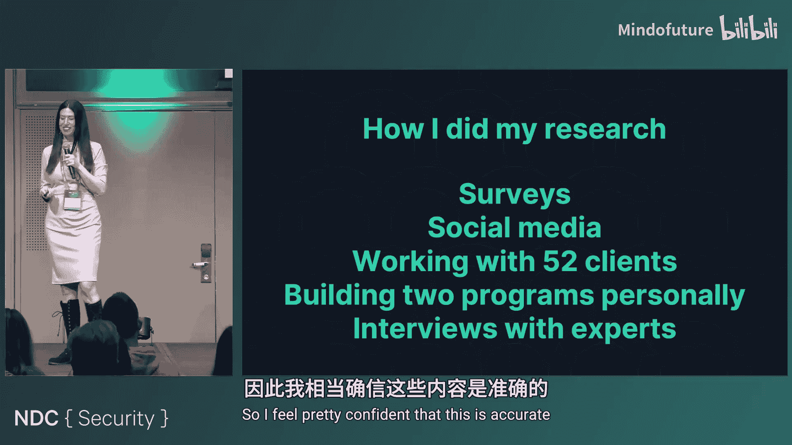
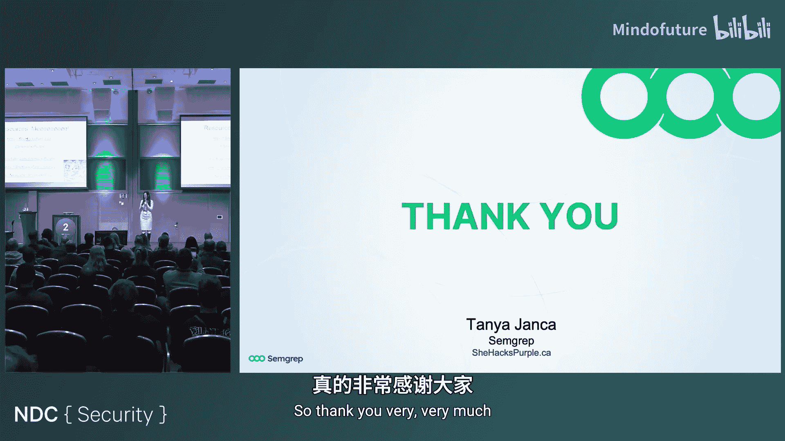

# 022：安全冠军计划常见错误与最佳实践

在本教程中，我们将学习如何建立和维护一个成功的“安全冠军”计划。安全冠军计划是安全团队与开发团队之间的一座关键桥梁，旨在提升安全意识、改善沟通并规模化安全实践。然而，超过半数的此类计划最终会失败。我们将深入探讨导致失败的常见陷阱，并提供清晰、可操作的策略来避免它们，确保你的计划能够蓬勃发展。

## 为什么需要安全冠军计划？🤔

上一节我们介绍了本教程的目标，本节中我们来看看启动安全冠军计划的核心动机。理解“为什么”是成功的第一步。

安全团队启动此类计划通常出于以下几个具体目标：

*   **减少摩擦**：改善安全团队与开发团队之间的关系，使协作更顺畅。
*   **规模化安全实践**：在安全团队人力有限的情况下，通过赋能开发团队来扩大安全工作的覆盖范围。
*   **改善安全文化**：在整个组织内培养更积极的安全态度和意识。
*   **建立信任与友好关系**：这是有效沟通和协作的基础。如果开发人员不信任安全团队，他们就不会主动报告问题。
*   **更主动地修复漏洞**：希望开发人员能更主动、更迅速地响应和修复安全问题。
*   **接收安全事件报告**：鼓励开发人员在发现潜在安全事件时，第一时间联系安全团队。
*   **避免安全事件**：通过早期介入和指导，在问题发生前就将其解决。
*   **培养未来的应用安全人才**：安全冠军是招聘应用安全团队成员的最佳来源之一。
*   **成为首选咨询对象**：希望开发人员遇到安全问题时首先咨询内部安全团队，而不是外部论坛。
*   **提升员工满意度与留任率**：参与此类计划的员工通常工作更投入、更快乐，离职率也更低。

## 哪些地方可能出错？🔍

了解了目标之后，我们来看看实践中常见的陷阱。认识到这些潜在问题，是避免它们的关键。

安全冠军计划可能因多种原因而失败。以下是一个常见问题的列表：

*   **节奏不可持续**：计划推进过快，导致团队无法跟上或 burnout。
*   **职责不明确**：安全冠军和安全团队双方都不清楚各自的期望和责任。
*   **“被自愿”的志愿者**：强制指定人员担任安全冠军，导致他们缺乏动力和热情。
*   **招募失败**：无法吸引开发人员自愿加入计划。
*   **职责不切实际**：期望安全冠军承担过多或本属于安全团队的全职工作。
*   **缺乏高层支持**：没有获得管理层的口头、财务或资源上的支持。
*   **缺乏度量指标**：没有收集数据来衡量计划的成功与否和投资回报率。
*   **教育计划不佳**：培训内容与冠军的实际需求脱节，或不知道教什么。
*   **冠军缺乏动力**：冠军成员无所事事，不参与任何活动。
*   **社交氛围不佳**：活动组织 awkward，缺乏社交技巧，导致参与度低。
*   **人员流动率高**：冠军频繁离职，需要不断培训新人，成本高昂。

## 如何避免陷阱并取得成功？🚀

现在我们已经明确了问题所在，接下来让我们逐一探讨解决方案，学习如何构建一个稳健且富有成效的安全冠军计划。

### 1. 设定可持续的节奏

一个激进的启动计划往往难以持久。解决方案是**从慢开始**。

以下是具体建议：

*   **每月最多举办一次活动**：开发人员有本职工作，时间有限。
*   **提前规划（例如6个月）**：制定一个内容日历，明确每个月的主题（例如：跨站脚本、安全头、注入攻击等）。
*   **评估资源是否充足**：确保在应对安全事件的同时，仍有足够资源运行冠军计划。
*   **征求同行意见**：将你的计划草案拿给其他安全团队的同事看看，获取外部视角，避免对自己过于严苛。

### 2. 明确目标与职责

模糊的期望是失败的温床。必须**设定清晰的目标并告知所有人**。

安全冠军的职责可以包括以下一项或多项，但务必具体：

*   **为同事提供安全建议**：成为团队内的安全顾问，处理常见问题，复杂问题上报。
*   **创建和维护积极的安全文化**：在团队内推动安全优先的思维。
*   **进行威胁建模**：负责对新功能或重大变更进行威胁建模。
*   **在开发生命周期中添加安全检查点**：确保安全评审、渗透测试等环节按时进行。
*   **甄别扫描器结果**：分析SAST/DAST工具的结果，区分真/误报，并确定修复优先级。
    *   **SAST**（静态应用安全测试）：分析源代码的安全漏洞。
    *   **DAST**（动态应用安全测试）：测试正在运行的应用程序的安全漏洞。
*   **构建安全工具和功能**：利用开发技能帮助自动化安全流程或构建安全特性。
*   **担任联络员**：定期与安全团队沟通，同步团队动态和需求。
*   **发起安全修复**：推动团队内安全漏洞的修复工作。
*   **向安全团队同步未来计划**：提前告知技术选型或架构变更，以便安全团队介入指导。
*   **帮助实施或自动化安全工具**：协助部署和配置安全工具。
*   **推广新的应用安全项目和工具**：作为试点用户，帮助评估和推广新工具。
*   **进行安全代码审查**：在同行评审中关注安全问题。

### 3. 吸引而非强制招募

“被自愿”的冠军往往表现不佳。关键在于**吸引和招募**。

以下是如何吸引志愿者的方法：

*   **征求志愿者**：公开邀请，而非强制指派。
*   **倾听并采纳反馈**：让冠军参与决策，让他们感到被重视。
*   **举办有趣的活动**：如技术分享、研讨会（可邀请外部讲师或播放会议演讲视频）。
*   **邀请参加外部安全社区活动**：例如OWASP本地分会会议，进行团队建设。
*   **创建内部通讯**：分享安全知识、趣闻和更新。
*   **适度分享“秘密”**：在信任的基础上，分享真实的安全事件案例（经脱敏）能极大体现其价值并建立信任。
*   **分享有用的资源**：根据冠军的技术栈，推荐相关的播客、文章等。
*   **进行一对一交流**：定期喝咖啡聊天，了解他们的需求和困难。
*   **组织团队建设活动**：让冠军们彼此熟悉，建立社群感。

### 4. 成功招募参与者

如果没人愿意加入，计划就无法开始。你需要主动**推销**这个角色。

以下是招募策略：

*   **解释对冠军个人的好处**：提升简历价值、通往高级开发或安全职业的路径、保护用户和公司的成就感。
*   **持续宣传**：在开发会议、邮件签名、内部通讯中反复提及。
*   **通过安全培训师推介**：在培训中让讲师宣传冠军计划。
*   **一对一邀请**：私下联系你认为合适的人选，说明原因。
*   **利用实体公告**：在厨房冰箱等公共区域张贴有趣的招募告示。
*   **举办“开放办公时间”或“影子计划”**：让感兴趣的人可以来观摩你的工作。
*   **有节制地群发邮件**：避免 spam，每月在新闻通讯中提及即可。
*   **强调无需前置安全知识**：承诺会提供所有必要的培训。
*   **请经理推荐（但强调自愿性）**：明确告知经理不能强制指派。

### 5. 设定现实的期望

要求冠军完成安全团队的全部工作是不现实的。需要**公平和具体**。

请自问：

*   **这现实吗？** 他们能否在每周1-2小时的投入下完成？
*   **角色互换你会接受吗？** 做两份工却只拿一份薪水？
*   **期望是否具体？** 明确告知需要投入的时间和工作内容。

### 6. 争取高层支持

没有资源的草根计划举步维艰。你需要**主动推销**其价值。

具体做法：

*   **向管理层进行专题汇报**：阐述计划的价值和投资回报。
*   **展示投资回报**：例如，避免一次安全事件能节省多少成本。
*   **制定正式的项目计划**：呈现一个结构化的方案。
*   **引入外部顾问**：借助专家的信誉和经验。
*   **展示成功案例**：引用其他公司（如Datadog）的成功故事。
*   **不要假设管理层了解**：耐心解释什么是冠军计划以及它能带来什么。

### 7. 建立度量指标

无法衡量就无法管理。**收集数据并展示成果**。

可以度量的方面包括：

*   **等级体系**：建立类似“腰带”（白带、黄带、绿带）的等级，记录达标人数。
*   **学习平台完成度**：跟踪课程完成情况。
*   **参与度**：会议出席率、活动参与度。
*   **安全状况对比**：有冠军的团队与无冠军的团队的安全指标对比。
*   **目标达成率**：计划设定的具体目标（如100%威胁建模覆盖率）是否达成。
*   **冠军职责完成情况**：他们负责的任务（如漏洞修复SLA）完成得如何。

### 8. 规划有效的教育

培训内容应与冠军的实际职责紧密相关。**聚焦于他们需要掌握的技能**。

教育形式可以多样化：

*   **播放优秀的会议演讲录像**：组织观看并讨论。
*   **外包培训**：邀请朋友、外部讲师或专业培训公司。
*   **采用安全培训平台**。
*   **聘请专门运营冠军计划的公司**。
*   **获取并演绎他人的演讲材料**（需获得许可）。
*   **组织桌面推演练习**。

### 9. 激励冠军成员

不活跃的冠军形同虚设。需要**持续激励和调整**。

解决方法：

*   **重申目标和职责**：集体沟通，了解障碍。
*   **创建奖励机制**：对表现优异者给予认可和奖励。
*   **替换不活跃者**：让更有意愿的人有机会加入。
*   **分享积极指标**：公开表扬优秀冠军的贡献，树立榜样。
*   **持续进行互动**：坚持举办吸引人的活动。

### 10. 营造良好的社交氛围

尴尬的会议会吓跑参与者。**提升沟通和主持技巧**。

改善方法：

*   **参加沟通技巧培训**：阅读相关书籍（如《超级沟通者》）。
*   **引入擅长此道的顾问或社区经理**。
*   **接受不完美**：只要保持尊重，有些“古怪”是可以接受的。

### 11. 降低人员流动率

频繁更替冠军成本高昂。关键在于**提升参与感和价值感**。

保留冠军的策略：

*   **持续进行互动活动**。
*   **清晰传达他们创造的价值**：定期分享因他们的工作而避免的安全事件或提升的安全指标。
*   **明确期望**：确保他们理解并认同自己的角色。
*   **建立反馈循环**：定期一对一沟通，了解他们的体验、职业发展需求，并据此调整计划。

## 总结与资源 📚

在本教程中，我们一起深入探讨了安全冠军计划。我们了解到，如果缺乏明确的目标和用心的设计，此类计划很容易失败。我们详细分析了十一种常见的失败模式，包括节奏过快、职责不清、强制参与、缺乏支持等，并针对每一项提供了具体的解决策略。

成功的核心在于：**设定清晰、可实现的目标；以可持续的节奏推进；通过吸引而非强制来招募；提供相关培训；建立信任和良好的沟通；并用数据来证明价值。**

最后，以下是一些免费资源，可供你进一步学习和启动自己的计划：

*   **Shevira Academy**：提供免费的网络安全课程。
*   **作者关于安全冠军的系列博客文章**：包含了多年的实践经验总结。
*   **《安全冠军成功指南》**（由Dustin编写）：该领域的经典参考资源。

希望本教程能帮助你建立和维护一个蓬勃发展的安全冠军计划，从而显著提升你组织的安全态势和文化。祝你成功！