# 023：多云下的安全风险


在本教程中，我们将学习 GitHub Actions 在安全方面的核心概念、常见配置错误以及如何利用这些错误。我们将从 GitHub Actions 的基础安全模型开始，逐步深入到与云服务（如 Azure、GCP、AWS）的联合身份验证集成，并揭示其中潜藏的风险。

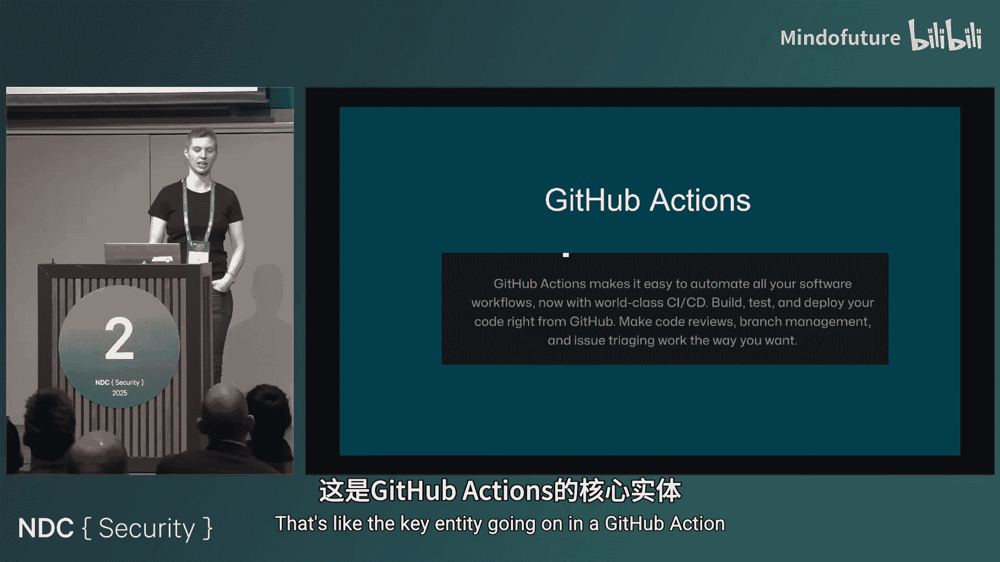

## GitHub Actions 安全模型

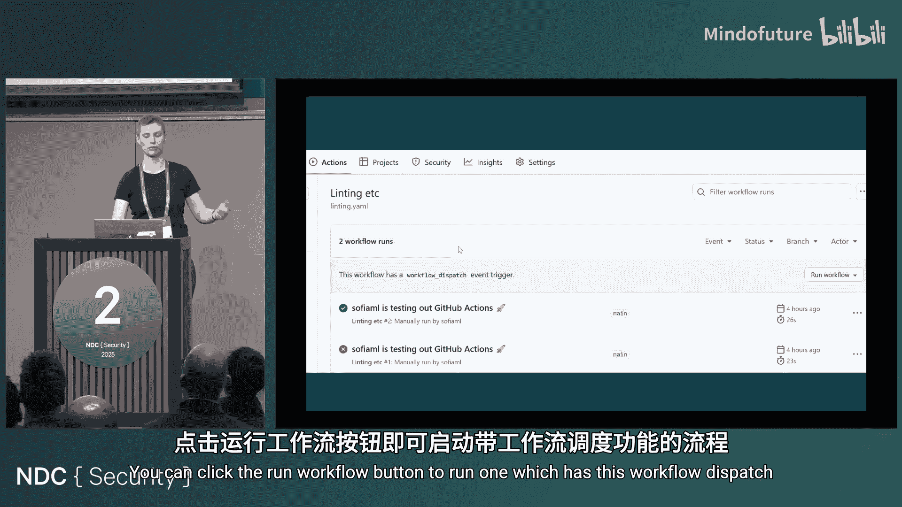

首先，我们需要了解 GitHub 仓库的基本权限模型。这有助于我们理解攻击者（例如拥有特定权限的开发者）可能采取的行动。

在 GitHub 仓库中，主要有三种权限角色：
*   **读取权限**：用户可以查看代码、提交问题。
*   **写入权限（协作者）**：用户可以提交代码、创建分支、修改工作流文件。
*   **管理员权限**：用户拥有仓库的完全控制权。

上一节我们介绍了权限模型，本节中我们来看看一个对“读取权限”用户也有效的攻击向量：脚本注入。

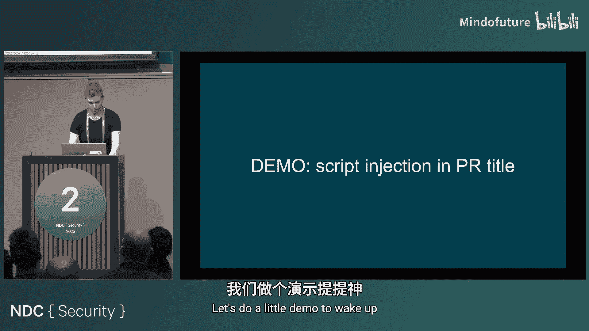

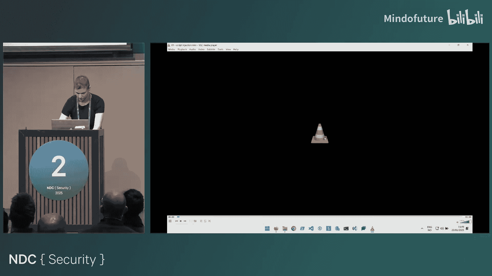

## 脚本注入漏洞

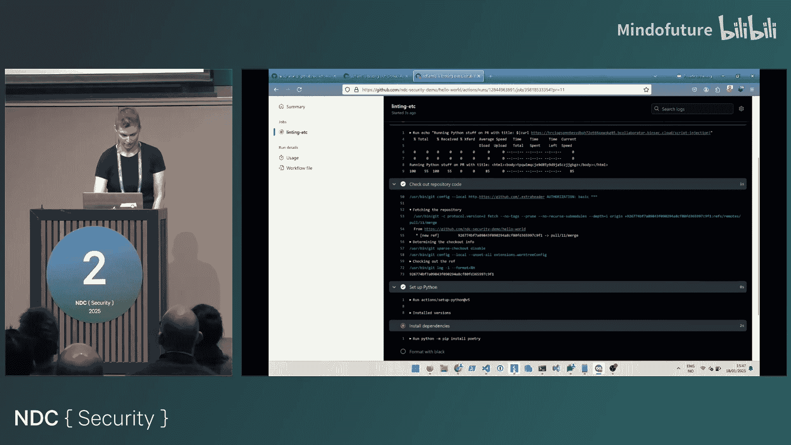

脚本注入发生在用户可控的值被直接嵌入到工作流步骤中时。攻击者可以利用 GitHub 上下文变量（如 `${{ github.event.issue.title }}`）进行代码注入。

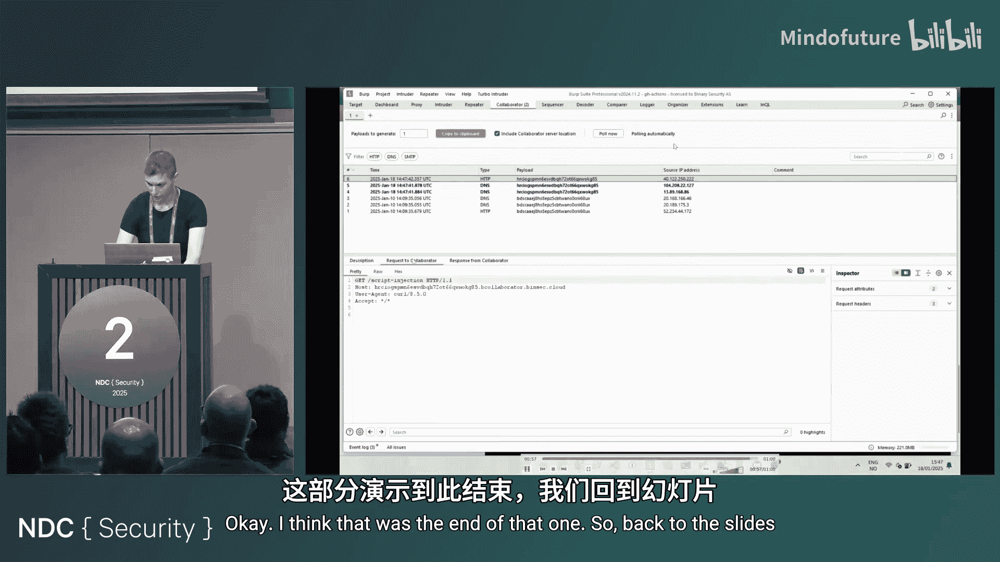

以下是易受攻击的工作流示例：
```yaml
name: Vulnerable Workflow
on:
  issues:
    types: [opened]
jobs:
  echo-title:
    runs-on: ubuntu-latest
    steps:
      - name: Print issue title
        run: echo "New issue: ${{ github.event.issue.title }}"
```
如果攻击者提交一个标题为 `test $(id)` 的问题，`id` 命令将会被执行。

**修复方法**：始终使用 `env` 上下文来安全地传递变量。
```yaml
      - name: Print issue title safely
        env:
          TITLE: ${{ github.event.issue.title }}
        run: echo "New issue: $TITLE"
```
从此刻起，我们将假设攻击者拥有“协作者”权限，这意味着他们可以直接修改仓库中的工作流文件。

## 分支保护与工作流控制

一个自然的问题是：如果部署是由 `main` 分支触发的，而我是协作者，难道我不能直接把恶意代码推送到 `main` 分支吗？

这引出了分支保护规则。以下是关键的防护措施：
*   **要求通过拉取请求合并**：禁止直接推送到受保护分支。
*   **要求最新提交获得批准**：防止在批准后注入恶意代码。
*   **要求批准者非最后推送者**：防止自我批准恶意代码。

然而，即使有分支保护，协作者仍然控制着工作流文件本身。他们可以创建一个新分支，修改工作流的触发条件（例如，从 `on: push: branches: [main]` 改为 `on: push: branches: [hacker-branch]`），然后在该分支上运行修改后的工作流。

**核心结论**：你无法在工作流文件内部建立针对协作者的安全防护，因为他们可以修改或删除这些防护。

## 秘密管理

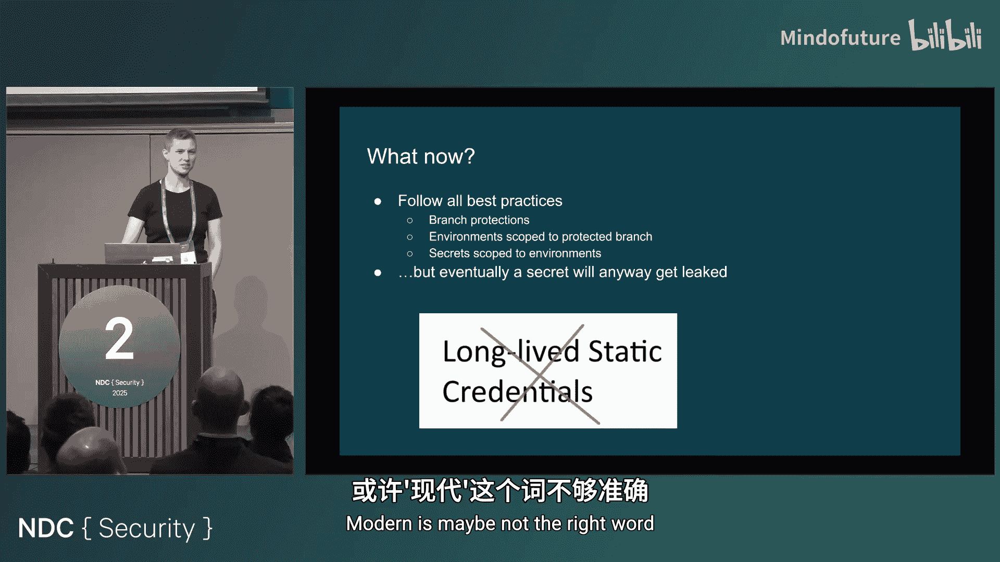

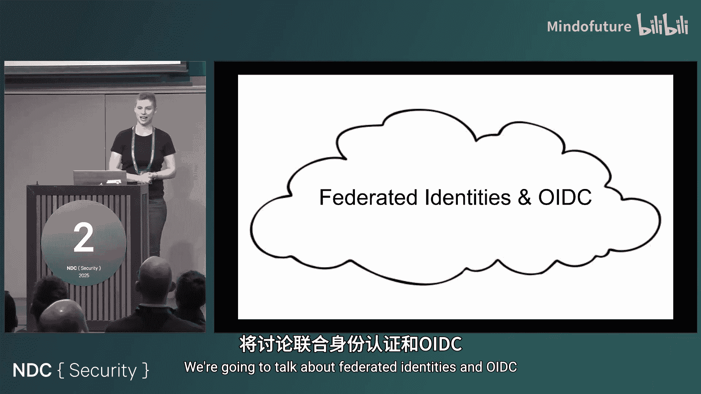

GitHub 允许在多个层级存储秘密：仓库级、环境级和组织级。

仓库级秘密对协作者是可见的。如果协作者修改工作流来输出秘密，他们就能窃取这些凭据。
```yaml
      - name: Steal secrets
        run: echo "${{ toJson(secrets) }}" | base64
```

**最佳实践**：将敏感秘密存储在**环境**中，并将环境配置为仅允许从受保护的分支（如 `main`）运行。这样，即使协作者尝试在非保护分支上运行工作流来读取环境秘密，操作也会被阻止。

上一节我们讨论了静态凭据的风险，本节中我们来看看更现代的解决方案：联合身份验证。

## 联合身份验证与 OIDC

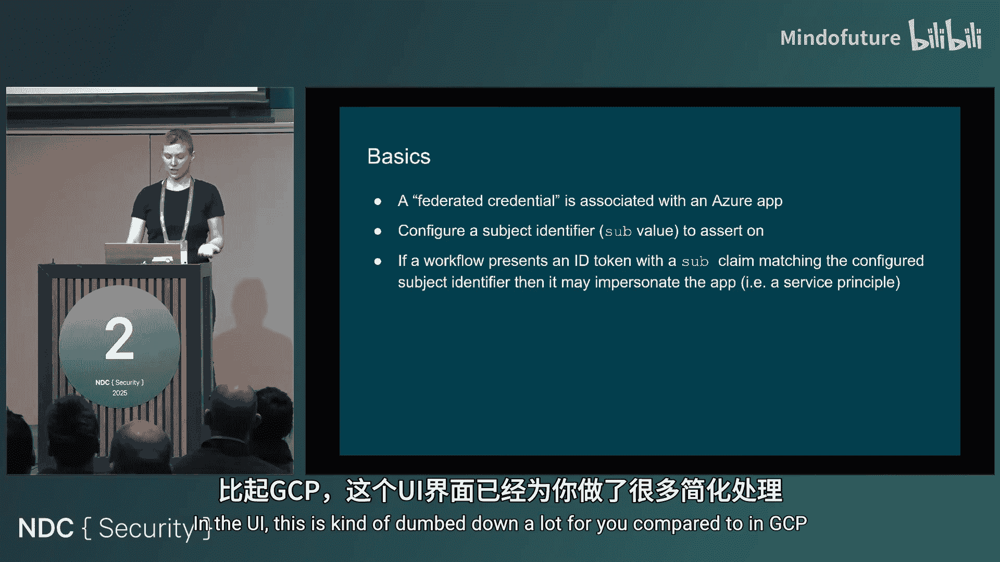

联合身份验证使用 OpenID Connect 协议实现无密码认证。在 GitHub Actions 场景中：
1.  GitHub Actions 作为身份提供商，生成一个包含声明（claims）的 ID 令牌。
2.  工作流将此令牌发送给云提供商（如 Azure）。
3.  云提供商验证令牌由 GitHub 签发，并根据其中声明（主要是 `sub` 主题声明）决定授予哪些权限。

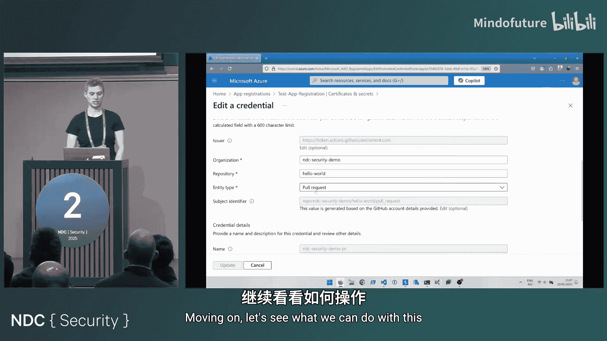

`sub` 声明的格式通常类似：`repo:组织/仓库:environment:环境名` 或 `repo:组织/仓库:ref:refs/heads/分支名`。

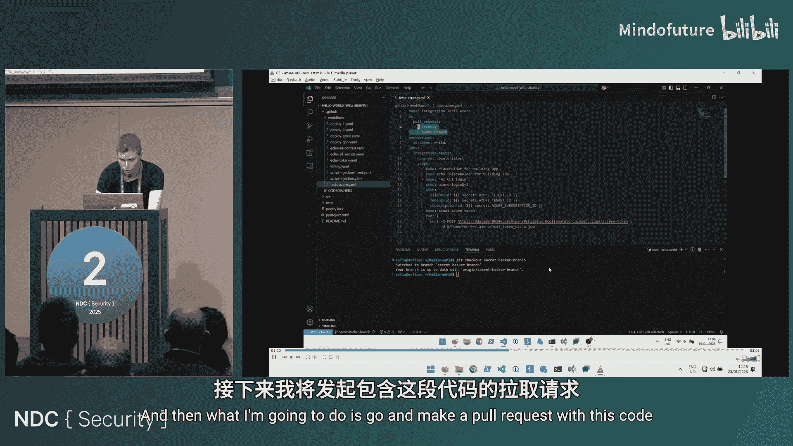

以下是配置联合身份验证时各云平台的主要差异：
*   **GCP**：称为“工作负载身份联合”。你需要配置属性映射，通常将 `assertion.sub` 映射为主属性。
*   **Azure**：称为“联合身份凭据”。UI 会引导你选择实体类型（环境、分支、拉取请求等）并自动生成 `sub` 值。
*   **AWS**：称为“身份联合”。你需要配置信任策略，指定允许的 GitHub 组织和仓库。

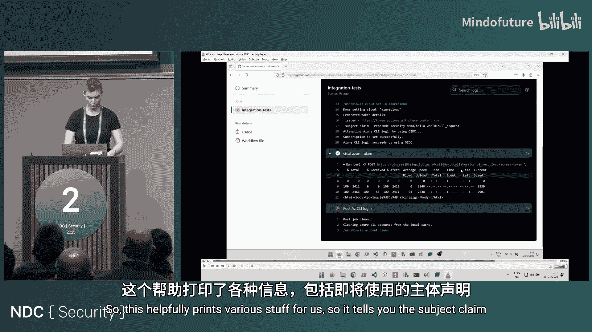

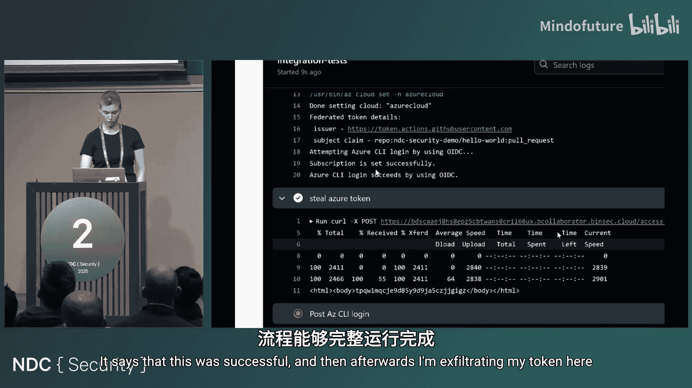

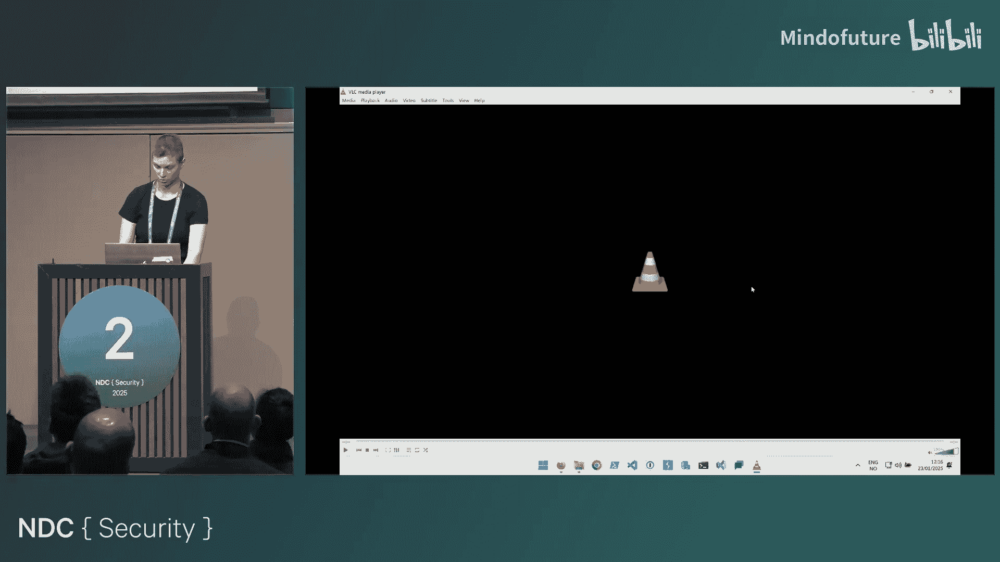

## 危险的配置模式

配置联合身份时，`sub` 声明的匹配是简单的字符串比对，这导致了多种错误配置：

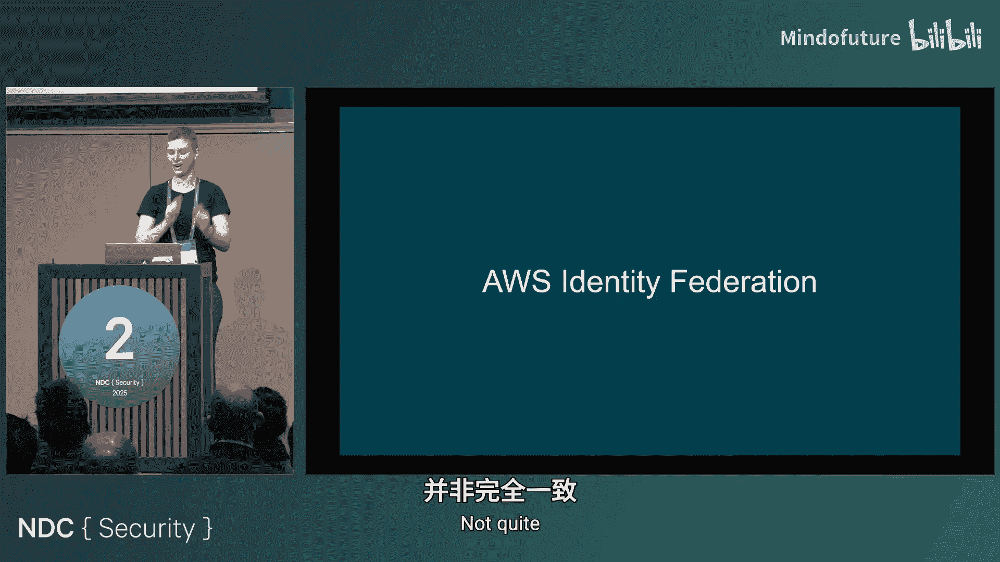

1.  **使用拉取请求实体类型（Azure）**：`sub` 值形如 `repo:org/repo:pull_request`。这**没有内在保护**，任何来自该仓库的拉取请求（甚至是草稿）都能获得权限。
2.  **错误使用通配符（AWS）**：例如，将 `sub` 配置为 `repo:my-org/*` 是安全的。但如果错误地配置为 `repo:my-org*`（漏了斜杠），攻击者可以创建名为 `my-org-attacker` 的组织来匹配。
3.  **手动配置 `sub` 时的顺序错误**：如果你自定义 `sub` 格式，例如 `environment:prod:repo:org/repo`，那么攻击者可以在自己的仓库创建一个名为 `prod:repo:org/repo` 的环境来匹配。
4.  **断言目标未受保护**：断言 `sub` 必须包含 `ref:refs/heads/main` 是好的，但前提是 `main` 分支在 GitHub 端确实受到了保护。否则，攻击者可以直接推送代码到 `main` 分支。

## 可重用工作流与终极绕过

为了真正保护核心工作流，GitHub 建议使用**可重用工作流**，将其存放在一个访问权限严格控制的独立仓库中。你可以通过 `job_workflow_ref` 声明来确保只有来自这个安全仓库的特定工作流才能获得云凭据。

然而，这并非万无一失。如果这个“安全”的可重用工作流内部存在**间接代码执行**的途径，攻击者依然可以绕过防护。

**一个真实案例**：一个安全的可重用工作流用于执行 `terraform plan` 和 `terraform apply`（仅允许在 `main` 分支）。攻击者可以在自己仓库的 Terraform 代码中，使用 `local_file` 数据源或 `external` 数据源，在 `terraform plan` 阶段读取之前步骤中缓存的 Azure 访问令牌。
```hcl
# 攻击者仓库中的 Terraform 代码示例
data "local_file" "token" {
  filename = "/home/runner/.azure/accessTokens.json"
}
output "stolen_token" {
  value = data.local_file.token.content
}
```
这样，即使工作流文件本身是安全的，且 `apply` 阶段受到保护，攻击者依然在 `plan` 阶段通过 Terraform 的功能窃取了令牌。

## 总结与最佳实践

本节课中我们一起学习了 GitHub Actions 与云身份联合场景下的安全风险。核心问题源于复杂的配置和简单的字符串匹配机制。

以下是关键的安全建议：

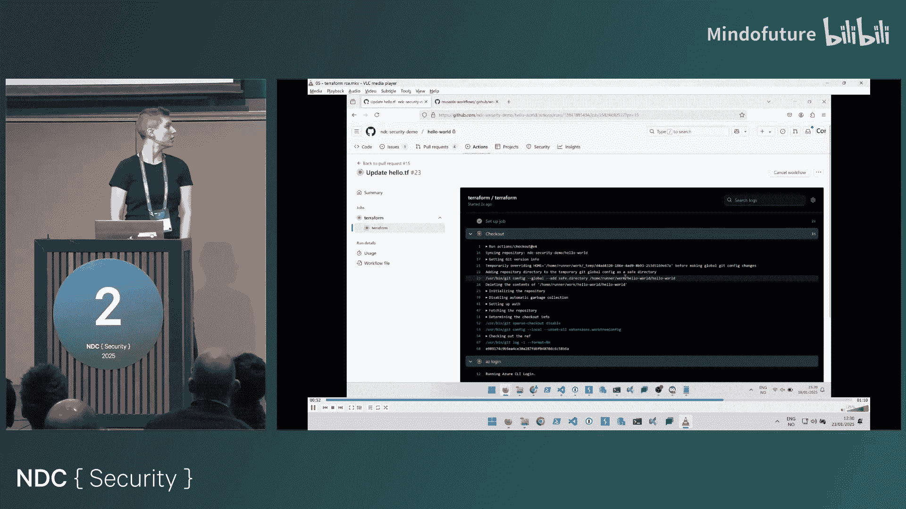

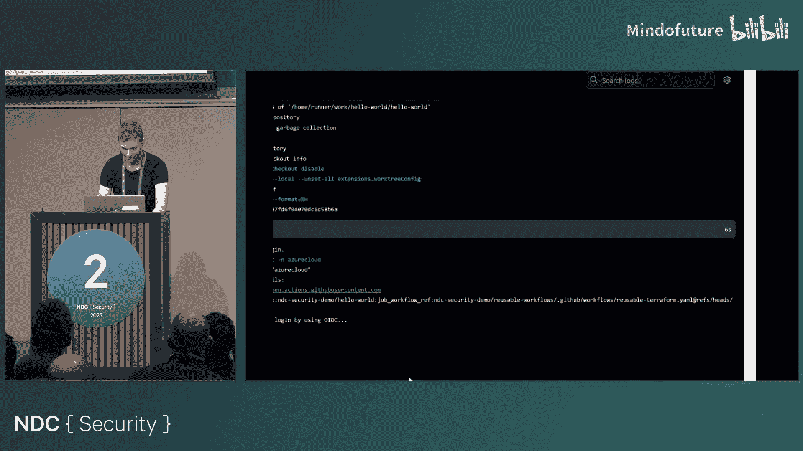

**GitHub 配置方面：**
*   使用分支保护规则保护你的主分支。
*   使用环境来存储秘密，并将环境限制在受保护的分支上运行。
*   在工作流步骤中，始终使用 `env` 上下文来传递用户输入，避免脚本注入。

**云身份联合配置方面：**
*   **避免使用通配符**，除非你完全理解其含义。
*   **尽可能具体地限定 `sub` 声明**，例如包含具体的仓库名，而不仅仅是组织名。
*   如果你断言的是分支或环境，**确保它们在 GitHub 端是受保护的**。
*   对于可重用工作流，**确保其内部没有让调用者执行代码的途径**。

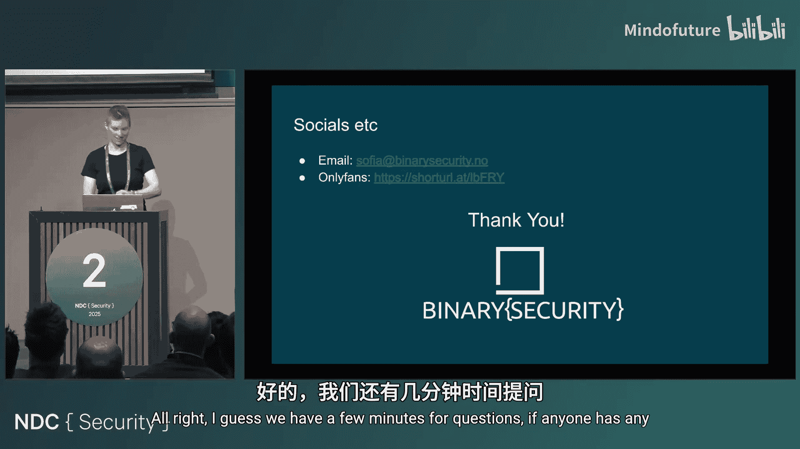

**通用原则：**
*   **遵循最小权限原则**：授予工作流和服务主体的权限应恰好够用，而非过度授权。这是我们在客户评估中最常见的问题。

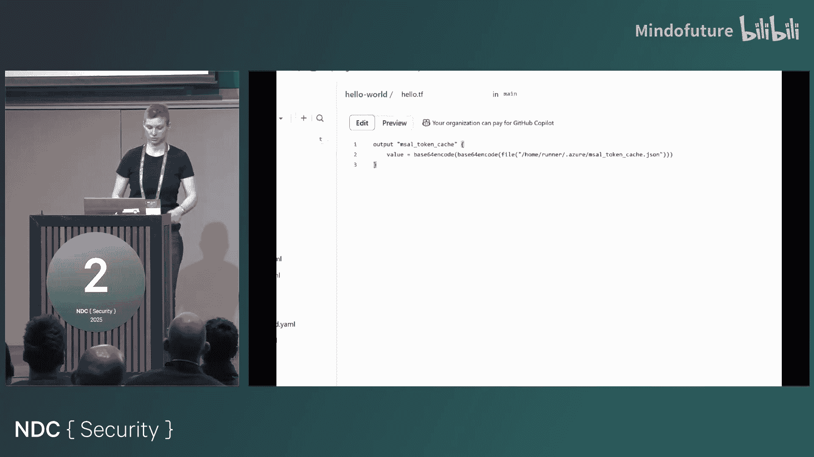

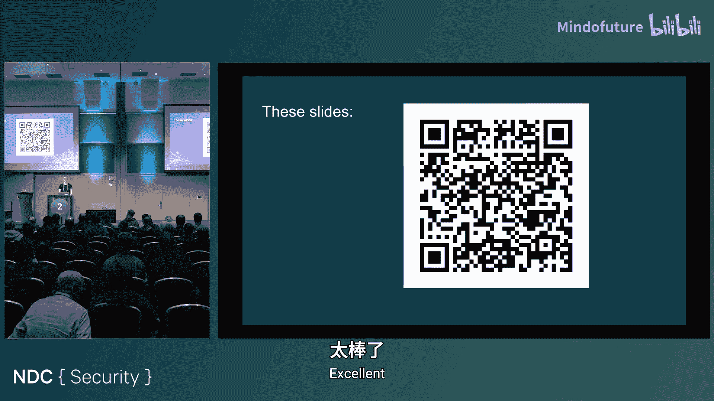

通过理解这些机制和陷阱，你可以更好地配置安全的 CI/CD 流水线，降低因配置错误导致的安全风险。