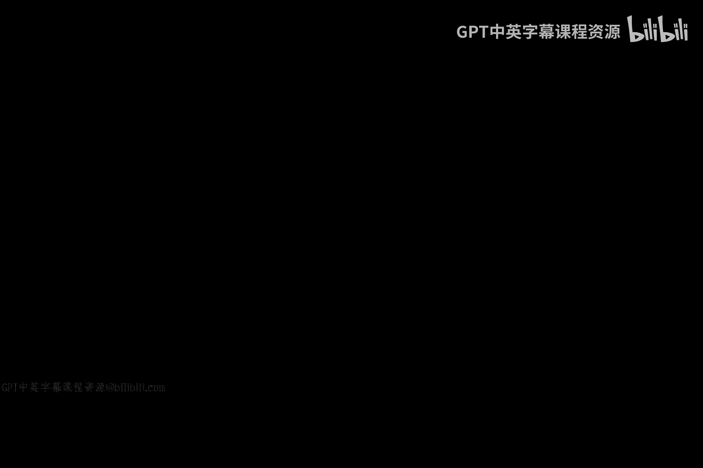
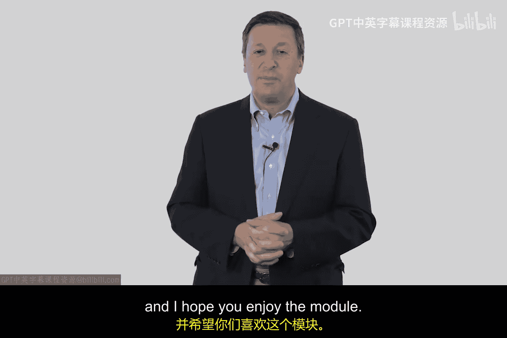
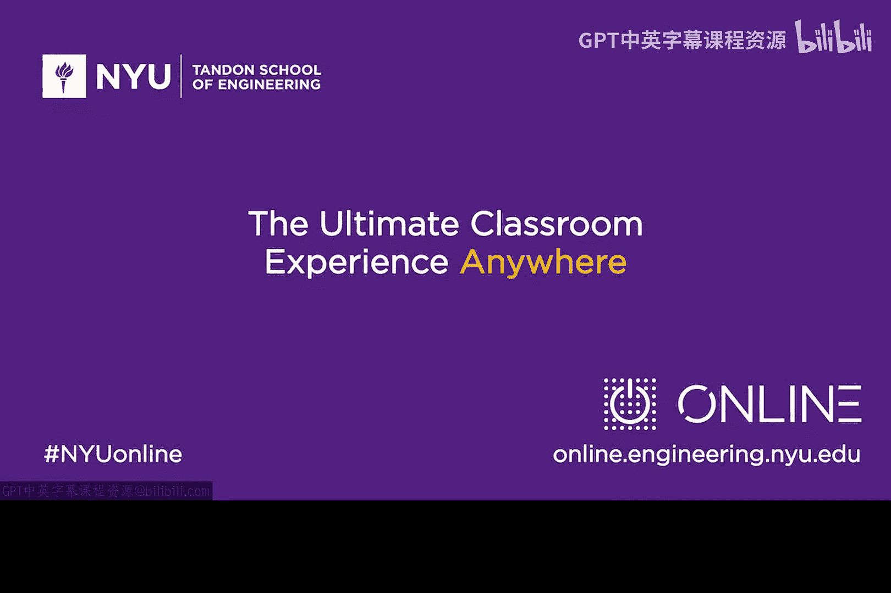

# 001：作业与阅读 📚

在本节课中，我们将介绍本模块的学习目标，并列出相关的阅读材料和视频资源，以帮助你从黑客视角理解基本的网络安全威胁与攻击方法。

上一节我们明确了模块目标，本节中我们来看看需要配合学习的资料。以下是推荐的阅读材料和视频清单，请在学习过程中参考。

## 必读论文

*   **《Smashing the Stack for Fun and Profit》**：这是一篇由名为“Aleph One”的黑客所写的经典论文。建议你仔细阅读。
*   **《Reflections on Trusting Trust》**：这是肯·汤普森在贝尔实验室工作期间发表的图灵奖获奖演讲。同样建议你研读。

## 可选书籍

如果你希望进一步扩展知识，可以考虑以下两本可选书籍：

*   **《From CIA to APT: An Introduction to Cybersecurity》**：这是由我本人和我儿子马特合著的一本电子书。建议配合本模块阅读前两章。这本书在亚马逊网站有售，你也可以尝试从图书馆借阅。阅读此书并非强制要求。
*   **一本优秀的TCP/IP书籍**：我建议你为自己准备一本好的TCP/IP参考书。具体选择哪本由你决定。有些书价格较高，有些或许可以在线找到。我推荐理查德·史蒂文斯的著作。如果你认为学习TCP/IP知识对夯实你的技术背景有帮助，那么阅读其《TCP/IP Illustrated》第一卷的第1章和第2章会很有益处。这本书也值得收藏在你的专业书库中。

## 推荐观看视频

此外，还有一个我认为你会觉得很有趣的视频推荐给你：

*   **查理·米勒及其合作伙伴在谷歌的演讲**：该视频讲述了远程利用乘客车辆的相关内容。你可以在YouTube上搜索“DefCon 23”来找到这个演讲视频。我们分享这些资源，供你观看学习。

---

本节课中，我们一起学习了本模块的配套学习资料，包括两篇必读的经典论文、两本可选的扩展书籍以及一个推荐观看的技术演讲视频。希望你能跟随这些阅读材料和视频进行学习，并享受这个模块的学习过程。