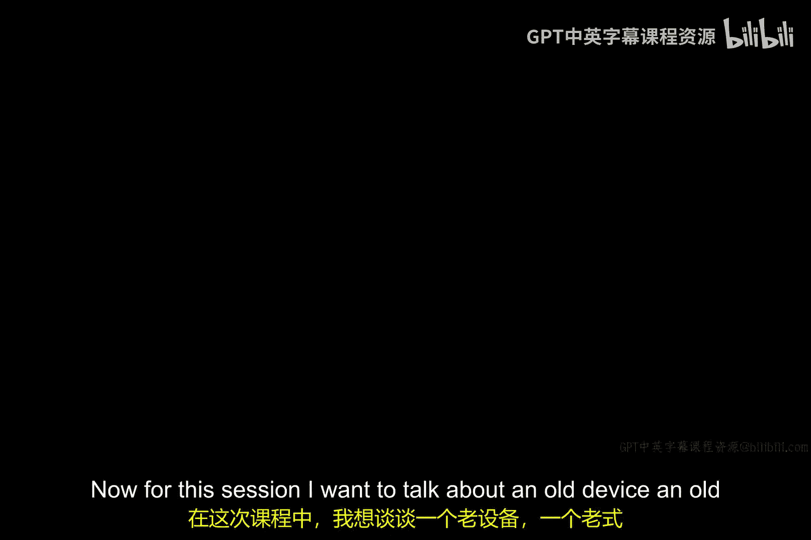

# 002：老式苏打机黑客攻击案例

## 概述
在本节课中，我们将通过一个老式苏打贩卖机的真实案例，来探讨网络安全中的一个核心概念：**问题的简单性与解决方案的复杂性往往不成正比**。这个生动的例子将帮助我们理解，在安全领域，一个看似微小的漏洞可能需要付出巨大的代价来修复。

## 案例描述：老式苏打贩卖机
本节中，我们来看看这个案例的具体情况。这是一种在20世纪70到80年代常见的苏打贩卖机。它有一个垂直的玻璃门，投币后，一个金属外壳会打开，顾客可以伸手拿到瓶装汽水的瓶口。

## 被发现的漏洞
以下是这种设计存在的安全漏洞：
作为小孩子，我们发现因为能够接触到瓶口，所以可以用一个开瓶器和一根吸管，插入瓶中喝光汽水。我们经常用这种方法“攻击”这些机器。这个攻击方法非常简单直接，一旦知道原理，任何人都能立刻实施。

## 解决方案的困境
上一节我们介绍了攻击方法，本节中我们来看看如何防御。如果要求你解决这个问题，你会怎么做？思考一下。为了阻止这种攻击，可以采取的措施包括：
1.  **重新设计机器**：这是正确的根本解决方案。事实上，这类机器后来被重新设计，如今已很难见到。
2.  **张贴警告告示**：例如，写上“嘿，孩子们，别再用开瓶器和吸管偷喝汽水了”。但这等于告诉所有人攻击方法，是一个糟糕的告示。如果试图含糊其辞，比如“嘿，孩子们，停止做你们知道的那件事”，这又显得荒谬可笑。在网络安全领域，我们称这类公告为“安全公告”，撰写一份有效的安全公告本身就很困难。
3.  **安装监控摄像头**：这或许有效，但必须确保摄像头是真的。如果是假的，孩子们会识破。如果是真的，则需要连接设备、回看录像。考虑到70年代一瓶可乐可能只卖25美分，是否值得花费上千美元安装监控系统？这显得很不划算。
4.  **将机器移入店内**：但这会导致销售收入下降。

## 核心概念：系统的健壮性
思考得越深入，就越会意识到：**这是一个简单的攻击，但解决方案却不简单**。这将成为我们整个课程中反复出现的主题。你会看到许多看似直接的问题，例如Alice想向Bob证明自己的身份，听起来很简单，但为了实现它，我们需要设计复杂的协议。

在某些领域，这被称为**健壮性**。一个系统，如果小问题只需要小解决方案，那么它是健壮的。当问题与解决方案的规模成比例增长时，这就是一个健壮的系统。

反之，当一个小问题需要一个巨大的解决方案，或者情况相反时，我们就说这个系统可能不够健壮。

## 总结
本节课中，我们一起学习了通过老式苏打机的案例来理解网络安全的基本挑战。请记住这个核心观点：**安全漏洞的利用可能很简单，但彻底修复它却可能非常复杂和昂贵**。在后续的学习中，当你评估不同攻击方式及其缓解方案时，可以时常思考：我们面对的是否是一个“小问题、大解决方案”的困境？这能帮助我们更好地理解安全设计的权衡与难点。