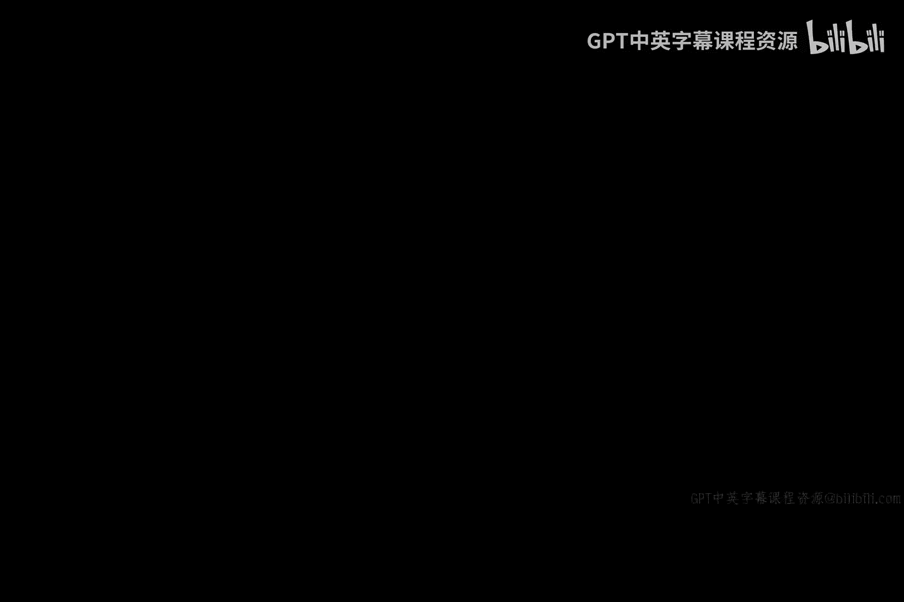
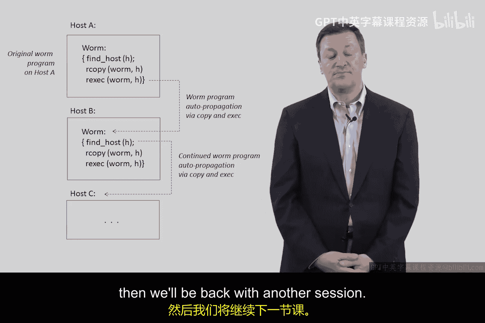

# 003：简单蠕虫程序 🐛

在本节课中，我们将要学习一种名为“蠕虫”的程序。我们将了解它的基本概念、工作原理、历史案例，并思考其潜在的危害性。

## 概述

蠕虫是一种恶意软件。它与病毒类似，但有一个关键区别：蠕虫能够自我复制和传播。这意味着一旦蠕虫程序在一台计算机上运行，它可以自动寻找网络中的其他计算机进行感染，而无需人工干预。这种自我传播的能力使其极具破坏性。

## 蠕虫程序的三步模型

一个典型的蠕虫程序可以简化为三个核心步骤。对于程序员而言，这甚至可以看作是三行代码的逻辑。

### 第一步：寻找目标

蠕虫程序运行在一台计算机上时，首先需要找到网络中另一台可以连接的计算机。
在早期，这可能通过查询Unix主机文件实现。如今，更常见的方法是生成或遍历TCP/IP地址，例如形如 `192.168.1.100` 的地址，以此定位下一个目标机器。

### 第二步：复制自身

找到目标计算机后，蠕虫需要将自己复制到那台机器上。
复制的方式多种多样，可以通过浏览器漏洞、利用各种运行时环境的缺陷，或者直接利用软件漏洞上传可执行文件。

### 第三步：执行程序

成功复制到新机器后，蠕虫程序便会开始执行。
思考一下，当它在新机器上运行时会发生什么？它会重复第一步，再次寻找下一台可以连接的计算机，然后复制自身并执行。如此循环往复，形成连锁反应，在网络中快速传播开来。

## 历史案例：莫里斯蠕虫

我们第一次见识到这类程序的威力是在1988年。当时，美国新泽西州一位名叫罗伯特·莫里斯的年轻人编写了一个本质上遵循上述三步模型的程序。他无意中将这个程序释放到了互联网上，结果导致了大规模的网络瘫痪，引发了关于责任与安全的早期大讨论。这个程序后来被称为“莫里斯蠕虫”。通过搜索“Morris Worm”，你可以了解更多关于这一历史事件的信息。

## 深入思考：蠕虫的潜在危害

回顾我们讨论的蠕虫三步模型，请进一步思考：攻击者可能会在何处插入额外的代码或功能，以使蠕虫更具破坏力？

例如，在蠕虫程序访问一台机器、复制自身之后，正式执行之前，它可以先执行一些恶意操作。以下是一些可能的增强功能：

*   **窃取信息**：检查并窃取系统密码，或搜索机器上的敏感文件。
*   **安装后门**：在受感染机器上安装一个后门程序，为攻击者提供长期访问权限。
*   **发动攻击**：将受感染机器变为“僵尸网络”的一部分，用于发起分布式拒绝服务攻击。
*   **加密勒索**：对用户文件进行加密，然后索要赎金。

## 总结

本节课我们一起学习了蠕虫程序的基本原理。它的核心模型非常简单，仅包含**寻找目标、复制自身、执行程序**这三个步骤。然而，正如我们在其他讨论（例如旧的自助售货机例子）中提到的，描述起来简单的事物，一旦被编写出来，要阻止它却非常困难。莫里斯蠕虫事件就是一个深刻的教训，它告诉我们，即使没有恶意意图，技术上的疏忽也可能造成巨大的破坏。希望通过本节课，你能对网络蠕虫有更清晰的认识。