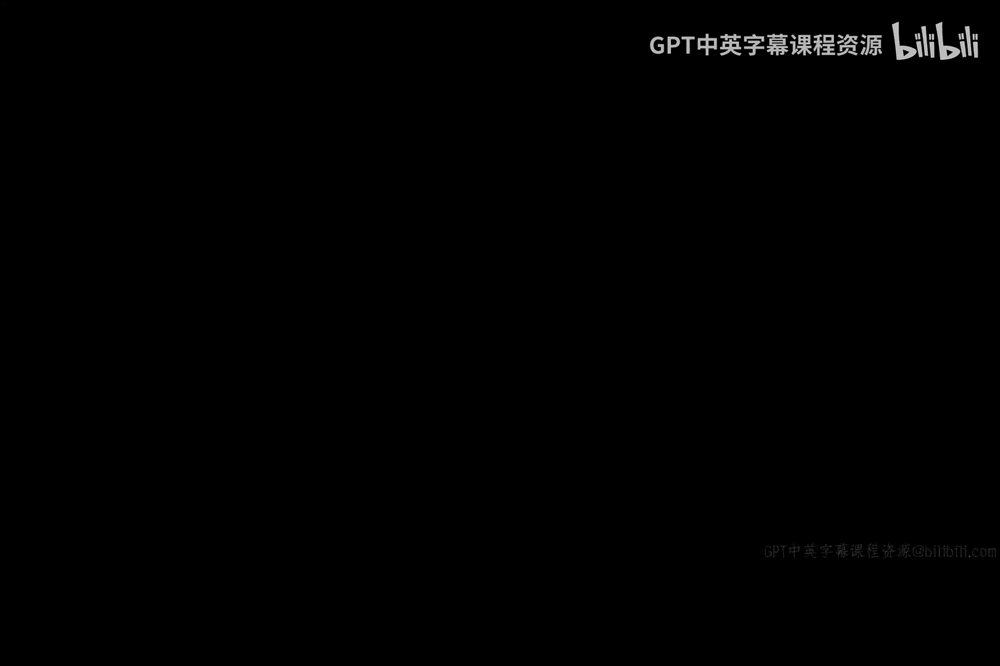

# 005：恶意编译器程序




在本节课中，我们将探讨一个深刻且影响深远的网络安全概念：软件信任问题。我们将从一个由计算机科学先驱提出的思想实验开始，了解恶意编译器如何悄无声息地植入后门，并最终理解为什么“我们无法完全信任任何软件”。

在开始本节内容之前，我想先介绍一下我的背景。我成长于贝尔实验室，那是一个在60、70和80年代令人惊叹的技术环境，是学习计算、网络和软件的绝佳之地。那个团队开发出的一个产品，就是我们今天所熟知的 **Unix** 操作系统。它是你手机上大多数技术的基础，iOS 和 Android 都是 Unix 的衍生品，Linux 也是。即使你深入 Windows 内核，也会发现一个符合 POSIX 标准的软件组件，这同样源自 Unix。可以说，你所有计算机上运行的软件，几乎都源于贝尔实验室。

我提到这一点，是因为当时那里有几位天才，其中两位构建了 Unix。其中一位名叫 **肯·汤普森** 的人获得了图灵奖。图灵奖相当于计算机科学界的诺贝尔奖。他在获奖演讲中谈到了特洛伊木马，以及如何让它们在代码审查中变得“隐形”。

你可能还记得上一节我们讨论过，如何在登录程序中查找被插入的特洛伊木马。通过检查代码，我们就能发现它。但肯·汤普森提醒了我们一个更深层的问题。让我先提供一些背景知识。

## 程序编译的基本流程

当编写软件时，你需要一个翻译器（如编译器或汇编器）将其转换为可执行的代码。为了简化，这个过程可以概括为：

**源代码** -> **编译器/翻译器** -> **目标代码/可执行文件**

这个流程对程序员来说应该很熟悉。

## 传统的木马植入方式

肯·汤普森指出，如果我们有干净的源代码，通过干净的编译器，就会得到干净的目标代码。一切正常。如果我们像之前讨论的那样，在源代码中直接插入一个带有秘密后门密码的木马，然后通过干净的编译器编译，就会得到“脏的”目标代码。之前我们说，要发现这种木马，就去审查源代码。例如，你会在代码中看到类似这样的检查：

```c
if (password_is_valid(user_id, password) || strcmp(password, "ABC123") == 0) {
    // 允许登录
}
```

在代码审查中，你就能发现它。

## 肯·汤普森的“隐形”木马构想

但肯·汤普森提出了一个天才的想法：为什么不**让编译器自己来插入这个木马**呢？

这意味着，编译器在翻译**干净的**源代码时，会在翻译过程中**自动插入**那段“脏的”恶意代码。这样，生成的“脏的”目标代码，其对应的源代码看起来却是完全干净的。

这个构想的含义非常深远。以前我们认为，只要审查源代码就能发现木马。我们承认，现实中我们运行的99%的程序（比如手机上下载的App），我们并不会去审查其源代码。但理论上，如果你能审查，你就有可能发现其中奇怪的密码检查逻辑。

然而，如果木马被植入在**编译器**中，你几乎永远没有机会去审查翻译工具内部的代码。这种可能性微乎其微。

## 软件信任的危机

这引出了一个我们作为计算机科学家、工程师、商人和学生必须理解的深刻问题。肯·汤普森说：

> **你不能信任任何不是你完全亲手编写的软件，包括其周围所有的翻译工具。**

由此得出的推论是：**你无法信任软件**。这是计算机科学中一个令人沮丧的事实。如果你从未听过这个观点，希望你现在是坐着的。这个“我们无法信任软件”的概念相当震撼。

在某种程度上，这解释了我们将要学习的这个“疯狂”的网络安全行业。你可能会想：为什么我需要监控软件的行为？为什么我必须在系统周围搭建防护脚手架？为什么不能一开始就把它做对？

原因正是因为我们无法信任软件。这几乎是每一个我们所见的黑客攻击的根本原因。事实证明，要让软件完全正确是异常困难的。

你建造一栋大楼，它就应该是一个稳固的结构。你不会在大楼周围搭建系统，以防它倒塌，那太荒谬了。然而对于软件，我们开发软件并部署它，然后我们围绕它构建网络安全措施，以阻止或捕获它出错时的行为。这是一个关于系统和信任的根本性问题。在我们后续的课程中，请牢记这一点。

## 如何降低编译器风险？🤔

现在，为了检验我们关于这个“翻译器问题”的学习成果，让我们像往常一样思考：如何阻止这类攻击？

上一节我们讨论自动售货机时，我们想了各种办法（贴纸条、装摄像头），效果都不太好。在讨论简单的登录程序时，我们得出结论：代码审查可能是最好的方法。

那么现在，我给大家一个小测验：**我们如何降低编译器中被植入特洛伊木马的风险？**

以下是三个选项：
1.  **测试编译器**：运行大量测试用例。
2.  **施加严格的合同或法律约束**：要求我们购买编译器的供应商签署协议。
3.  **面试多家不同的编译器供应商**：在购买翻译器时进行多方比较。

我们来逐一分析，哪个选项可能有效降低风险？

*   **测试**：会遇到和我们之前讨论过的同样问题——可能性太多，通过测试发现问题的几率极低。所以这个方法行不通。
*   **多家供应商**：与多家不同供应商洽谈或许是个好主意，可能降低概率，但并非根本解决。
*   **合同约束**：有趣的是，正确答案很可能是 **B**。这意味着，你应该要求软件提供商签署一份合同，承诺其代码中没有此类恶意内容。这样，即使他们想植入，至少也得在合同上撒谎，这会增加他们的心理负担和法律责任。

这是一种奇怪的现象：计算机科学家、软件工程师、经理最终不得不诉诸于让软件供应商举手发誓他们没有做坏事，而实现这一点的工具是一份合同。这有点讽刺，因为我们通常喜欢用技术功能来解决安全问题，而这里我却用合同来“修复”它。

## 总结

本节课我们一起探讨了由肯·汤普森提出的“恶意编译器”思想实验。我们了解到，木马不仅可以隐藏在应用源代码中，甚至可以隐藏在生成这些应用的**编译器**本身，这使得通过常规代码审查几乎无法察觉。这个思想实验深刻地揭示了**软件供应链**的信任危机，并引出了“无法信任非亲手编写的软件”这一根本性原则。这也解释了为什么网络安全不能仅仅依赖于“构建完美软件”，而必须包含持续监控、防御和审计在内的多层防护体系。最后，我们思考了通过法律合同来约束供应商，作为缓解此类高级威胁的一种非技术性但必要的手段。


