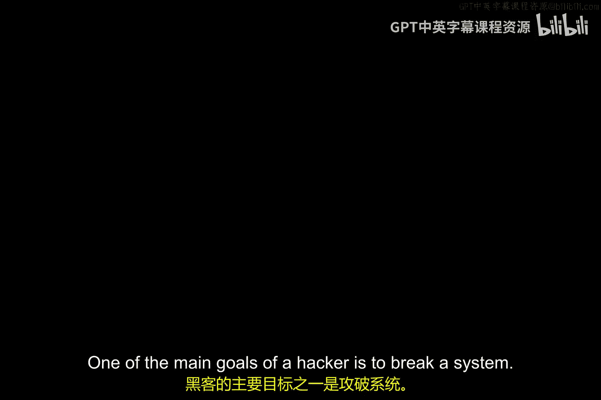
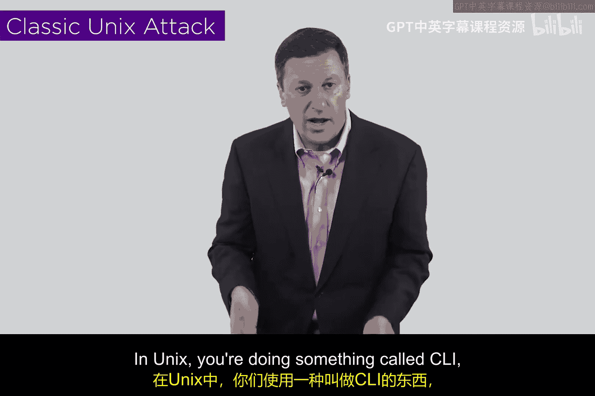
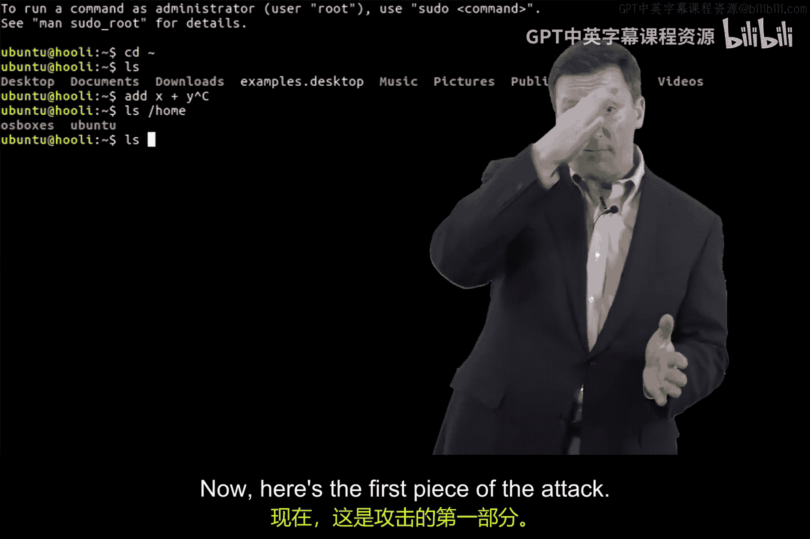

# 006：典型的Unix内核攻击 🔓



在本节课中，我们将学习一种经典的Unix系统攻击方法。这种攻击利用了系统多个看似无害的特性，当它们被组合使用时，却能导致严重的安全漏洞。我们将分步解析这个攻击的原理，了解黑客如何通过操纵命令行参数和程序权限来获取系统内核的访问权。

## 攻击目标与背景

黑客的主要目标之一是攻破系统。目前，最流行的系统之一是Unix，它是Linux、iOS、Android等系统的基础。这里所说的“Unix”是一个泛指，涵盖了该家族的所有相关系统。

接下来，我将介绍一种在90年代曾奏效的攻击方式，它能够获取Unix底层系统（内核）的访问权限。理解这个过程可能有些复杂，我会分阶段讲解，并辅以图表材料帮助你理解。请尝试跟随我的思路，理解这个攻击的每一步。

## 攻击的核心原理

这个攻击的关键在于，它利用了多个单独看来都正常的系统特性。但当这些特性被组合起来时，就会产生问题。

上一节我们介绍了攻击的背景，本节中我们来看看构成这个攻击的第一个核心特性。

### 特性一：自定义内部字段分隔符



在Unix中，用户通过命令行界面（CLI）输入命令，即通过键入字母、空格和参数来操作，而非点击。这些用于分隔命令和参数的空格（或制表符）被称为“空白字符”。



有趣的是，在Unix中，除了空格和制表符，你几乎可以指定任何字符作为分隔符。例如，路径名中常用的斜杠字符“/”也可以被定义为分隔符。

以下是实现这一点的简单命令，它涉及一个叫做“内部字段分隔符”的变量：

```bash
IFS=" /t/"
```

这个命令将IFS变量设置为同时包含空格、制表符和斜杠。这是攻击的第一阶段。你可能会问，为什么会允许这样做？Unix的设计者提供了这种灵活性，允许用户创建非常规的命令行界面。

### 特性二：Set-UID权限提升

我们将用到的第二个特性叫做“Set-UID to root”。这是Unix的一个功能，允许一个低权限运行的程序临时提升到高权限（root）去执行某些操作，然后再降回低权限。

例如，在一个共享系统上，普通用户不能直接修改密码文件。但当用户执行`passwd`命令修改自己的密码时，该程序会通过Set-UID机制临时以root权限运行，从而有权修改受保护的密码文件，完成后再切换回用户权限。Set-UID允许程序提升其执行权限。

### 特性三：开源系统与代码审查

Unix系统通常是开源的，这意味着其源代码可以被公开阅读和审查。攻击者可以利用这一点，去寻找那些使用了Set-UID提升权限的程序，并从中找到一段以高权限运行的代码。

例如，攻击者可能会找到一段在高权限下执行类似 `exec("/bin/some_program")` 的代码。识别出这段代码是攻击的第三阶段。

### 特性四：Shell脚本与命令执行

Unix shell允许用户将命令写入文件并作为程序执行。例如，我可以创建一个名为`steal_shell`的脚本文件。

需要知道的是，在Unix中，“shell”（如`/bin/sh`）是用户与操作系统交互的界面，本身也是一个程序。我可以在脚本中编写命令，将系统的shell程序复制到另一个位置。

## 组合攻击：分步解析

现在，让我们把以上所有特性组合起来，看看攻击是如何发生的。

首先，我执行命令，将斜杠“/”添加到内部字段分隔符中。
```bash
IFS=" /t/"
```

接着，我在我的家目录下创建一个名为`bin`的脚本程序。该程序的内容是复制系统的shell（例如`/bin/sh`）到一个新文件，比如`hack_shell`。
```bash
# 文件 ~/bin 的内容
cp /bin/sh /home/myuser/hack_shell
chmod +s /home/myuser/hack_shell  # 可选，为其也设置Set-UID权限
```

然后，我运行那个具有Set-UID权限的程序。当该程序提升到root权限后，它会执行类似 `exec("/bin/myprogram")` 的代码。

关键点来了：由于我们在第一步将“/”定义为了字段分隔符，系统在解析`exec`的参数时，不再将`/bin/myprogram`视为一个完整的路径。根据IFS的设置，它会被拆分成“bin”和“myprogram”两个独立的字段。

此时，系统会在当前环境变量`PATH`指定的目录中寻找名为`bin`的可执行文件。而攻击者预先在家目录下放置的恶意脚本`~/bin`很可能位于`PATH`环境变量包含的路径中（或者通过其他方式让系统找到它）。

于是，具有root权限的Set-UID程序，没有执行预期的`/bin/myprogram`，反而执行了攻击者准备的恶意脚本`~/bin`。这个脚本以root权限运行，成功地将真正的系统shell复制到了攻击者可控的位置，并可能为其设置Set-UID权限。这样，攻击者就获得了一个具有root权限的shell副本，从而完全控制了系统。

让我们再梳理一遍这个精妙的组合：
1.  **溶解路径**：通过修改IFS，使系统将路径分隔符“/”当作普通分隔符处理。
2.  **放置陷阱**：在家目录创建一个与路径组件同名的恶意脚本（如`bin`）。
3.  **触发陷阱**：运行一个合法的Set-UID程序，该程序本意是执行某个路径下的程序（如`/bin/xxx`）。
4.  **权限劫持**：系统错误解析路径，转而执行了攻击者的恶意脚本`bin`，并且是以root权限执行，从而完成敏感操作（复制shell）。

## 总结与思考

本节课中我们一起学习了一种经典的Unix内核攻击。它并不要求你记住所有步骤以应对测验，重要的是理解其背后“特性组合产生漏洞”的核心思想。

这个例子说明了安全漏洞的复杂性。黑客攻击并非总是简单的；它需要深入理解系统内部机制。然而，一旦攻击方法被设计出来并自动化，使用它就可能变得非常简单。这也提醒我们，即使自己不是漏洞的发现者，运行来源不明的程序也可能带来巨大风险。

如果你对这方面感兴趣，互联网上有大量关于黑客技术和安全研究的资源。但请务必谨慎，不建议任何人下载黑客工具并对真实网络进行非法测试。作为学习的一部分，确保只从可靠、合法的资源获取知识，这将有助于你的个人学习计划。


这种分析有助于我们培养安全思维：在设计或审查系统时，需要仔细考虑不同功能模块之间可能产生的意外交互，从而构建更健壮的防御体系。