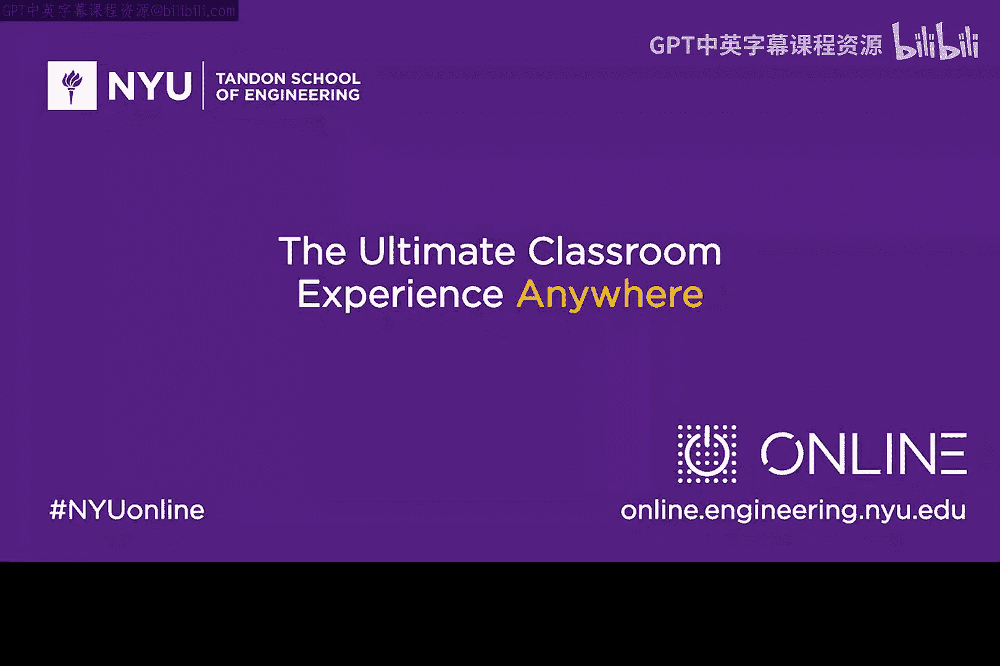

# 007：解释访谈系列 🎙️

在本节课中，我们将了解本课程为何以及如何引入一系列访谈内容。这些访谈旨在平衡技术理论的学习，通过行业实践者的分享，为大家提供更全面的视角。

## 访谈系列的引入目的

作为学习社群，我们将花费大量时间在技术、架构和安全概念上。我们希望用一些与实践者的讨论来平衡这些理论学习。我们认为大家会乐于听取这些分享。

我们将邀请一些安全公司的CEO或创始人类型的人物，让大家听到他们的见解，同时也会邀请一些一线从业者。

## 访谈内容的特点与学习方法

以下是访谈内容可能呈现的特点：

*   **术语使用**：你可能会发现，他们有时会使用一些行话或术语，这些术语可能与我们课程讲座中讨论的内容不完全一致。
*   **视角平衡**：但这将为你提供一个良好的平衡。

我相信你会非常喜欢这个系列。

## 如何从访谈中学习

随着我们推进这个系列，请聆听嘉宾的分享，看看你能从他们身上吸收到什么。

在某些情况下，你可以在互联网上对他们做一些研究，了解更多关于他们的信息。

## 总结

我希望你喜欢我们的访谈系列。我们这样做是为了尝试提供一个良好的平衡。

