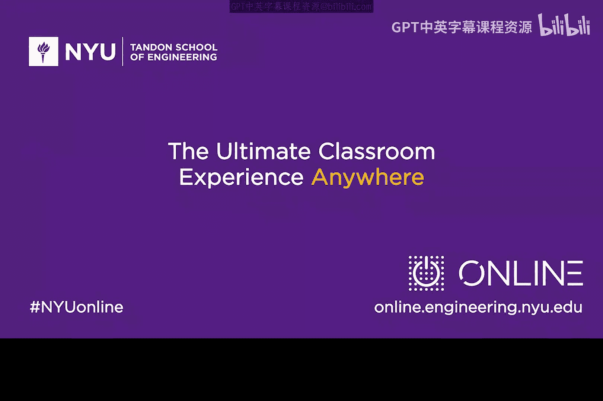

# 008：欢迎Lou Manousos（第一部分）👨‍💼

在本节课中，我们将聆听网络安全公司Risk IQ创始人兼CEO Lou Manousos的分享。他将讲述自己如何从物理学背景进入网络安全领域，以及创立一家成功的网络安全公司所需的关键要素。

---

## 从物理学到网络安全 🔄

上一节我们了解了课程的基本框架，本节中我们来看看一位行业先驱的独特职业路径。

Lou Manousos是Risk IQ的创始人兼CEO。他从小就对计算机和安全着迷，七岁起就开始接触。他最初在大学攻读物理学学位。

一位教授的话改变了他的方向。教授对他说：“我们需要像你这样既懂物理、能在实验室工作，又懂Linux和安全的人。因为物理学的未来将拥抱互联网和计算。” 这促使Lou开始致力于保护服务器，让物理学世界变得更安全。

他认为物理学思维与计算机科学有相通之处。网络安全如同**博弈论**，是一个涉及攻击者与防御者的复杂领域。这个问题几乎不可能彻底解决，因为它是一场“好人”与“坏人”之间的持续博弈。物理学也是如此，每当你向答案迈进一步，答案似乎又变得更远。这种不断出现新威胁、需要持续学习的特性，是两者共有的挑战。

---

## 创立网络安全公司的核心要素 🏗️

了解了Lou的背景后，我们来看看他对于创业的深刻见解。他认为，构建一家公司的文化主要基于以下三点：

以下是Lou强调的三个核心文化要素：

1.  **对解决客户实际问题抱有热切的好奇心**。客户即所有互联网使用者。必须拥有深入探究问题、并为客户持续创新的兴趣。
2.  **始终从客户视角出发**。许多公司并未真正考虑客户视角，试图解决一些与真实业务场景脱节的问题。成功的初创公司会发现，客户会引导你找到正确的方向。
3.  **亲身实践，换位思考**。在网络安全领域，若想了解受害者的感受，就必须与真正被攻击的目标群体一起工作。他喜欢通过亲身观察事件来解决问题。

Lou特别强调了客户的重要性。获得启动资金的前提，是拥有真实买家的用例。因此，他建议更早地将这些买家引入创业过程。许多人本末倒置，在尚未真正理解用例之前就先考虑融资。

---

## 成功创业者的品质 🤝

那么，结合客户聚焦与融资能力，成功创业者还需要哪些品质呢？

Lou认为，**激情**、**毅力**和**创新意愿**是关键。但更重要的是，找到同样相信这些品质的伙伴来组建正确的团队。如果选错了合作伙伴，事情会变得困难。创业不仅仅是达到一个终点，更是一段旅程。你必须享受每天解决新问题的过程，并确保与你并肩同行的是你愿意与之共事的人。

---

本节课中，我们一起学习了Lou Manousos从物理学跨入网络安全的经历，以及他总结的创业成功要素：对客户问题的热切好奇、坚定的客户视角、亲身实践的换位思考，以及找到志同道合的团队共同享受创业旅程。这些见解为有志于网络安全创业的初学者提供了宝贵的指导。