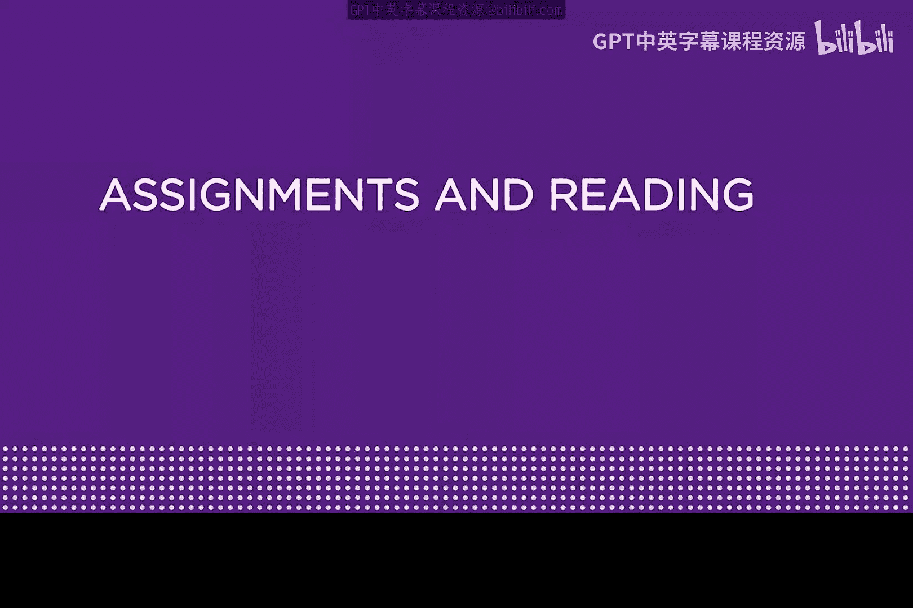
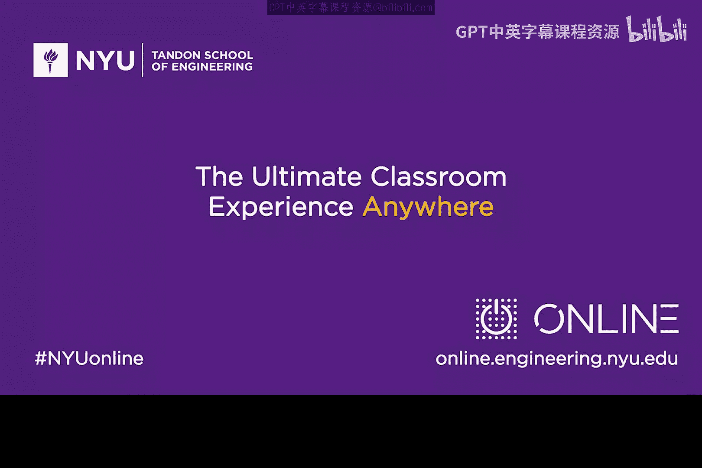

# 010：威胁建模与学习资源 📚

在本模块中，我们将介绍基础的威胁建模概念，并通过一些示例来加深理解。同时，我们将提供一系列配套的阅读材料和视频资源，帮助你从更广阔的视角理解网络安全的历史与现状。

## 概述

本节课程旨在引导你进行基础的威胁建模学习。我们将从一个简单的基本威胁问题入手，逐步展开，让你对网络安全威胁有更具体的认识。为了辅助学习，我们推荐了一些经典的论文、书籍和视频资料。

## 学习资源推荐

为了帮助你更好地理解本模块的内容，并建立更全面的知识背景，以下是一些推荐的阅读与观看材料。

### 必读论文

以下是两篇提供历史视角的重要论文，阅读它们有助于理解当前网络安全问题的根源。

1.  **《Why Cryptosystems Fail》**
    *   作者：Ross Anderson。
    *   这篇较早的论文探讨了密码系统历史上存在的一些问题，能为你当前的学习提供良好的背景知识。

2.  **《There Be Dragons》**
    *   作者：Steve Bellovin。
    *   这篇论文同样年代较早，讨论了互联网早期出现的一些安全问题。阅读这些旧论文可以提供不同于当前社交媒体上每小时都在更新的网络安全新闻的视角。

### 可选书籍

如果你希望有更系统的学习材料，以下书籍可以作为本课程的补充。

*   **《From CIA to APT: An Introduction to Cybersecurity》**
    *   作者：本课程讲师与其子 Matt。
    *   这是一本电子书，可在亚马逊获取。建议阅读第3章和第4章，它可作为本模块的配套读物。
*   **《TCP/IP Illustrated》**
    *   作者：Richard Stevens。
    *   这是一本经典的TCP/IP协议书籍。如果你的TCP背景知识较为薄弱，建议阅读该书的第3章和第4章。这本书值得放在你的专业技术书架上。

### 推荐视频

以下视频以生动的方式展示了特定的安全威胁与解决方案，相信你会感兴趣。

*   **DMARC标准白板讲解**
    *   主讲人：Pat Peterson。
    *   这个视频来自Agari公司，以白板教学的形式讲解DMARC标准。它不仅涉及当前互联网的一些威胁，也预示了一些可能对保护电子邮件有用的安全解决方案。
*   **Defcon 18演讲：Pwned By Owner**
    *   你可以在课程描述中找到相关链接。这个视频讲述了一个关于“当黑客的电脑被偷走后会发生什么”的故事，内容有趣，并能补充本模块涉及的一些知识点。

## 总结

本节课我们一起开启了威胁建模的初步学习，并为你规划了丰富的延伸学习路径。我们介绍了威胁建模的基本思路，并推荐了多份经典论文、可选书籍以及生动的视频资料，包括Ross Anderson和Steve Bellovin的论文、相关的教科书章节以及DMARC和Defcon的实践案例视频。希望你能享受本模块的学习材料，并从中获益。