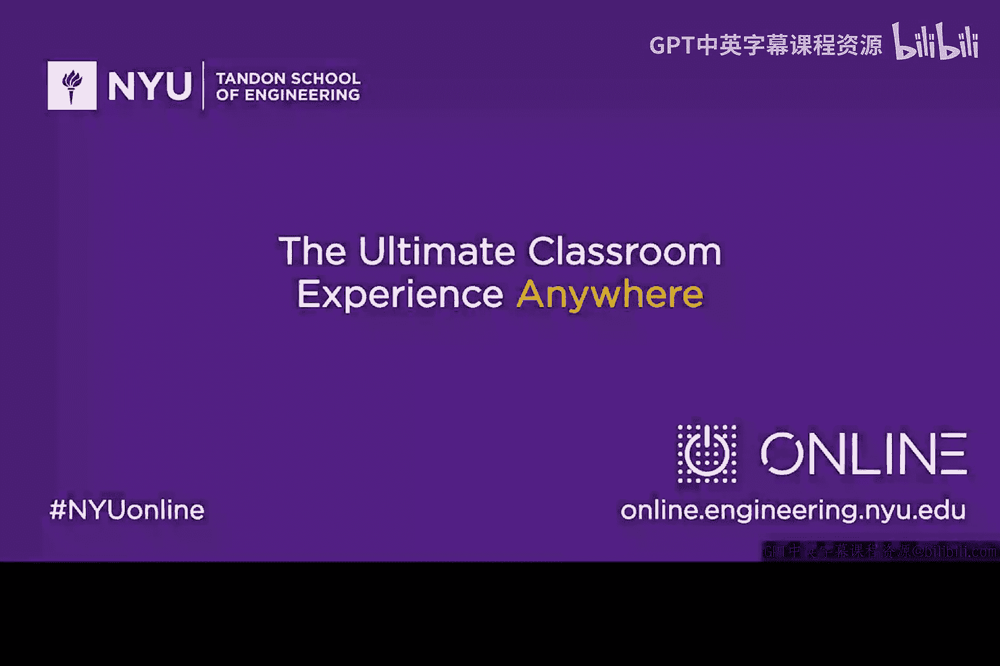

# 011：网络安全的目的


在本节课中，我们将探讨网络安全的核心目的。理解这一点对于构建清晰的知识框架至关重要，它能帮助你在深入学习具体技术后，依然能向他人清晰地解释网络安全的本质。

## 概述：网络安全的核心模型

在开始之前，我们先来思考一个根本问题：网络安全究竟是关于什么的？随着学习的深入，你可能会积累大量零散的知识点，但需要一个核心概念将它们串联起来。本节我们将一起回顾网络安全领域的一个经典思想模型，并探讨其现代意义。

## 经典模型：参考监视器概念

上一节我们提出了关于网络安全目的的疑问，本节中我们来看看一个经典的解答。早在20世纪70年代，网络安全先驱詹姆斯·安德森就在思考这个问题。他提出了一个被称为“参考监视器”的概念模型。

你可以将参考监视器想象成一个位于中间的“盒子”。盒子的一边是**主动实体**，例如用户、黑客或运行中的进程，它们试图执行某些操作。盒子的另一边是**资源或资产**，例如文件、数据库或系统，它们是访问的目标。

安德森的核心观点是：网络安全的核心目的，就是当主动实体试图访问被动资源时，由位于中间的“安全机制”（即参考监视器）根据既定的**策略**，来决定是**允许**还是**拒绝**这次访问。

用更形式化的术语来描述，这个模型被称为**主体-客体模型**：
*   **主体**：指发起访问的主动实体（如用户、程序）。
*   **客体**：指被访问的被动资源（如文件、数据）。
*   **安全策略**：决定访问是否被允许的规则集合。

这个模型可以用一个简单的决策逻辑表示：
```
if (主体请求访问 客体) {
    if (根据安全策略，访问被允许) {
        允许访问；
    } else {
        拒绝访问；
    }
}
```

## 从“否决者”到“赋能者”的思维转变

上述经典模型虽然清晰，但在实践中可能导致一种印象：网络安全团队总是说“不”。这种“否决者”的形象源于参考监视器最基本的“允许/拒绝”二元决策逻辑。

然而，现代网络安全思维已经发生了重要演变。我们更倾向于将安全视为一种**赋能者**，而非单纯的**阻碍者**。

让我们通过一个例子来理解这种转变。假设一个场景：一位顾客（主体）想用信用卡在你的网站（客体）上购物。如果只考虑风险，你可能会因为担心交易不安全而直接拒绝。但安全作为赋能者的思路是：我们可以设计并部署一套安全协议（如SSL/TLS加密、支付卡行业数据安全标准）。

以下是实现赋能的关键步骤：
1.  引入加密通道，保护数据传输。
2.  实施身份验证，确认用户身份。
3.  进行欺诈检测，评估交易风险。

通过这些安全措施，我们并没有简单地阻止交易，而是**创造了一个安全的环境**，使得原本存在风险的交易得以安全、顺利地进行。安全在这里扮演了**促成业务**的角色。

## 总结与核心要义

本节课中，我们一起学习了网络安全目的的两个关键视角。

首先，我们回顾了经典的**主体-客体模型**和**参考监视器**概念，其核心是依据策略控制对资源的访问。这为我们理解访问控制的基础提供了框架。

更重要的是，我们探讨了现代网络安全思维：**安全应作为赋能者**。这意味着网络安全的目标不是一味地阻止，而是通过设计和实施恰当的安全措施，来**保障业务活动、通信和创新的安全开展**。

请记住这个“赋能者”的视角，它将在我们后续关于风险管理、安全架构和业务连续性的所有讨论中贯穿始终。理解这一点，能帮助你在实际工作中更好地平衡安全需求与业务目标。




