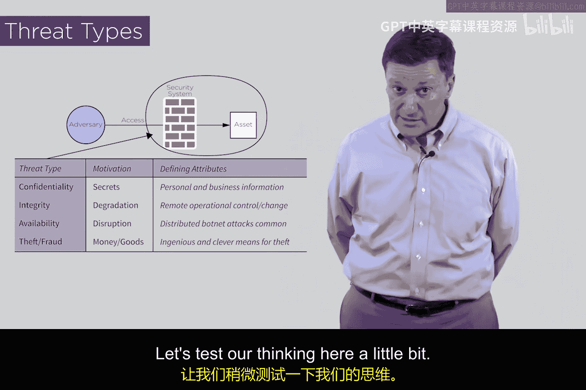

# 014：威胁类型 🛡️

在本节课中，我们将学习网络安全领域对威胁的分类。我们将了解三种主要的威胁类型，并探讨是否存在第四种类型。理解这些分类是构建有效安全策略的基础。

## 威胁与资产

首先，我们需要明确两个核心概念。**资产**是你所关心的一切事物，例如你的计算机、网络、软件、基础设施、数据、客户列表和源代码。**威胁**则是指可能对这些资产造成损害的恶意攻击。在技术语境下，威胁指的是一系列可能导致资产受损的条件。

## 三种主要威胁类型

上一节我们定义了威胁和资产，本节中我们来看看业界公认的三种主要威胁类型。它们通常被称为“CIA模型”。

### 1. 机密性

机密性威胁涉及**秘密信息的泄露**。当本应保密的信息被公开时，就会造成损害。例如，私人谈话被窃听并发布到网上。防止此类泄露的属性称为**隐私**。因此，当我们确保隐私时，就能减少对机密性或信息泄露问题的担忧。

### 2. 完整性

完整性威胁涉及对系统或数据的**恶意篡改**。攻击者不是窃取数据，而是改变系统、破坏或感染它，从而影响系统的有效性和完整性。恶意软件和病毒就是最常见的完整性威胁例子。

### 3. 可用性

可用性威胁，通常也称为**拒绝服务攻击**。在这种攻击中，恶意行为者会采取行动，阻止对网络等资源的合法访问。例如，攻击者通过向目标网络发送海量垃圾流量，制造“交通堵塞”，导致正常用户无法接入网络。

这三种威胁类型的英文首字母缩写为 **CIA**（Confidentiality, Integrity, Availability），构成了网络安全的CIA模型。

## 第四种威胁类型：欺诈

以上我们介绍了经典的CIA三要素，但有些观点认为存在第四种威胁类型：**欺诈或盗窃**。

这种威胁不涉及信息泄露（机密性）、系统篡改（完整性）或阻断服务（可用性）。它指的是**窃取服务或资源而不支付相应代价**的行为。例如，乘坐火车却逃票。这种行为构成了欺诈，是独立于CIA之外的一种威胁类型。因此，有时也会使用 **CIAF模型**（增加Fraud）来描述。不过，CIA模型在计算机安全领域已根深蒂固，两种理解都可以。

## 总结

本节课中，我们一起学习了网络安全的威胁分类。我们首先明确了**资产**和**威胁**的定义。然后，深入探讨了三种核心威胁类型：**机密性**（信息泄露）、**完整性**（恶意篡改）和**可用性**（拒绝服务），即CIA模型。最后，我们还了解了将**欺诈/盗窃**视为第四种威胁类型的观点。理解这些分类是分析具体安全风险和设计防护措施的第一步。