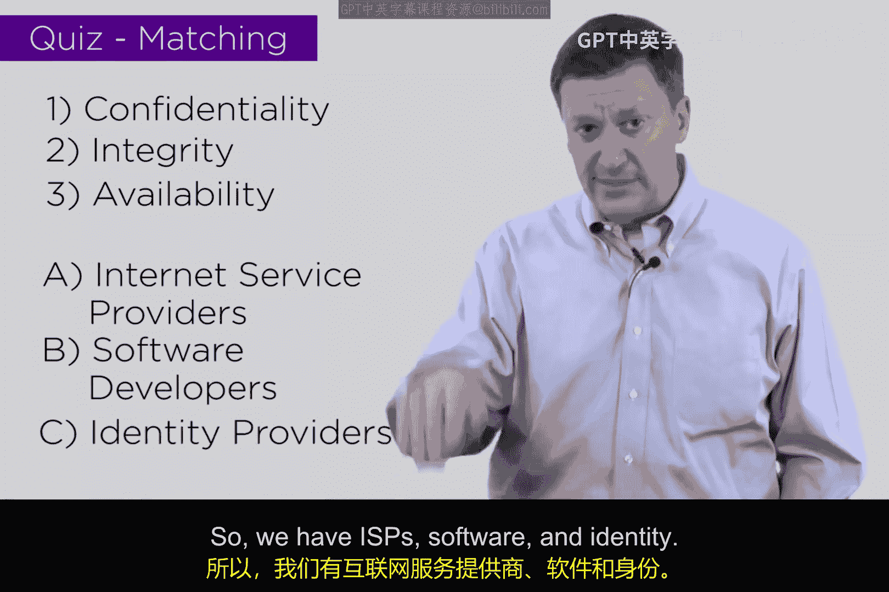

# 015：行业威胁匹配测验

在本节课中，我们将探讨不同行业面临的主要网络安全威胁。我们将基于CIA三要素（机密性、完整性、可用性），分析互联网服务提供商、软件开发商和身份提供商这三个特定行业最应关注的核心威胁类型。

## 行业威胁分析概述

上一节我们介绍了CIA三要素的基本概念。本节中，我们来看看如何将这些概念应用到具体的商业领域中。我们将思考：对于不同的行业部门，CIA中的哪一项威胁应被视为首要关切？

以下是三个需要分析的行业示例：
*   **互联网服务提供商**：提供网络连接服务的公司。
*   **软件开发商**：设计、开发和销售软件产品的公司。
*   **身份提供商**：负责验证和管理用户身份信息的机构或服务。

## 各行业首要威胁匹配

现在，我们来逐一分析每个行业，并匹配其最应关注的核心威胁。

### 互联网服务提供商的首要威胁

对于互联网服务提供商而言，其核心业务是确保用户能够持续、稳定地访问互联网。因此，他们面临的最大威胁是针对服务**可用性**的攻击。

**首要威胁：可用性**
*   **原因**：任何导致网络中断、服务降级或拒绝服务的事件，都会直接影响ISP的客户和收入。例如，大规模的DDoS攻击会使其网络瘫痪。
*   **核心关注点**：保障网络基础设施和服务的持续运行。

### 软件开发商的的首要威胁

软件开发商的产品核心在于其代码和功能的正确性与可靠性。因此，他们最需要防范的是针对产品**完整性**的威胁。

**首要威胁：完整性**
*   **原因**：如果软件代码被篡改、植入恶意功能，或者数据在处理过程中被错误修改，将导致软件失效、产生错误结果，甚至危害用户安全。这会彻底摧毁用户信任。
*   **核心关注点**：确保软件代码、更新过程和用户数据在生命周期内不被未授权更改。

### 身份提供商的首要威胁

身份提供商业务的核心是管理和验证用户的身份信息。这些信息极为敏感，一旦泄露会造成严重后果。因此，保护信息的**机密性**是其生命线。

**首要威胁：机密性**
*   **原因**：身份信息（如姓名、身份证号、生物特征数据）的泄露会导致身份盗用、欺诈等重大风险。维护用户信息的私密性是这类机构取得信任的基础。
*   **核心关注点**：防止用户身份数据在存储、传输和处理过程中被未授权访问或泄露。

## 课程总结

本节课中，我们一起学习了如何将CIA安全模型应用到具体行业场景中进行分析。我们了解到：
*   **互联网服务提供商**最关注**可用性**，以确保服务不中断。
*   **软件开发商**最关注**完整性**，以保证软件产品的正确与可信。
*   **身份提供商**最关注**机密性**，以保护用户的敏感身份信息。

这种分析思路有助于不同行业根据自身业务特点，明确安全防护的优先重点，从而更有效地分配资源，构建防御体系。