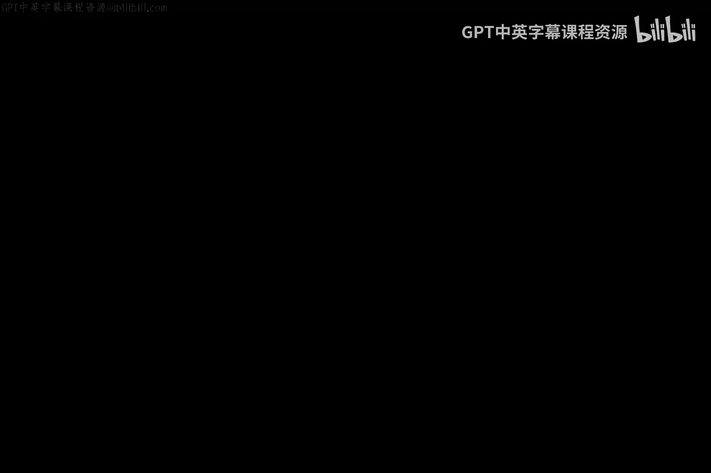
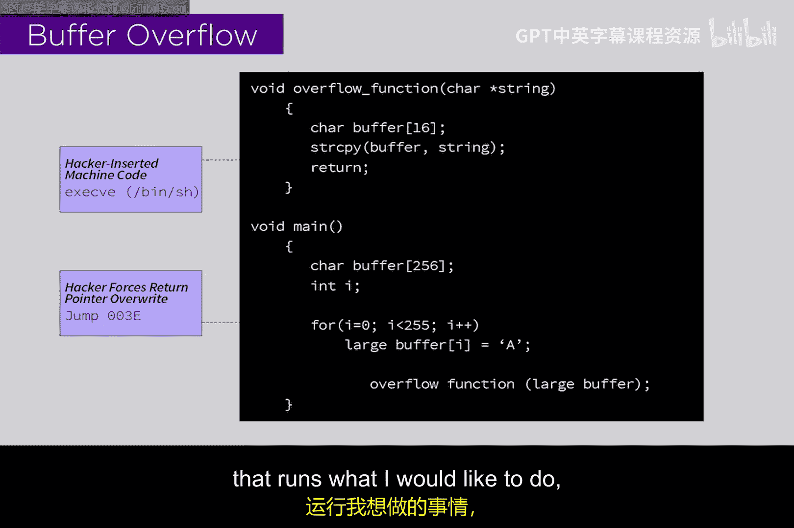

# 018：完整性威胁 🛡️

在本节课中，我们将要学习网络安全中的完整性威胁，也称为修改威胁。我们将探讨攻击者如何通过破坏软件或系统的完整性来达到恶意目的，并以恶意软件为例进行说明。同时，我们会深入了解一种常见的技术手段——缓冲区溢出攻击，并解释其工作原理。

## 完整性威胁概述

完整性威胁指的是攻击者可能出于恶意目的，破坏资产、软件或系统的完整性。一个明显的例子是恶意软件。原本具有正确性或有效性的代码，被攻击者植入恶意软件后遭到破坏。

## 计算机内存模型与完整性威胁

计算机自诞生以来，其CPU内存模型就具有高度的灵活性。这意味着我们可以通过修改和调整代码，使其执行其他操作。与硬件不同，软件具有很高的可修改性。例如，对一辆卡车进行根本性修改非常困难，因为它是硬件，组件相互连接，修改需要专业知识和技能。然而，软件则不同，我们可以轻松地对代码进行修改。

## 缓冲区溢出攻击原理

在编程中，缓冲区处理是一个常见问题。程序员经常使用内存中的临时空间来跟踪数据。例如，在栈操作中，我们可能会将值推入内存中的临时空间，然后进行弹出和计算。计算机内存通常分为程序区和数据区，这种设计使得程序和数据共存于同一内存空间，但也带来了潜在的安全隐患。

以下是缓冲区溢出攻击的基本步骤：

1.  **溢出缓冲区**：攻击者向缓冲区输入超出其容量的数据。
2.  **覆盖内存**：溢出的数据不仅填满缓冲区，还会覆盖相邻的内存区域。
3.  **控制程序流**：通过精心构造的溢出数据，攻击者可以覆盖异常处理程序的地址。
4.  **执行恶意代码**：当程序崩溃时，程序计数器会跳转到被覆盖的地址，执行攻击者预设的恶意代码。

例如，攻击者可能会用一系列无操作指令填充缓冲区，直到覆盖异常处理程序的地址，并在其后附加恶意代码。当程序崩溃并尝试执行异常处理程序时，会先执行无操作指令，然后运行恶意代码，从而控制目标机器。

## 深入学习资源

互联网上有很多关于缓冲区溢出的资源。我们建议您查阅一篇名为《Smashing the Stack for Fun and Profit》的经典论文，以更深入地理解缓冲区溢出攻击的技术细节。

## 总结

本节课我们一起学习了完整性威胁的基本概念，重点探讨了缓冲区溢出攻击的原理。完整性威胁通常涉及内存问题，因为数据和程序在内存中交织存储，攻击者可以利用这些特性破坏计算机系统的完整性。理解这些原理有助于我们更好地防范和应对此类安全威胁。