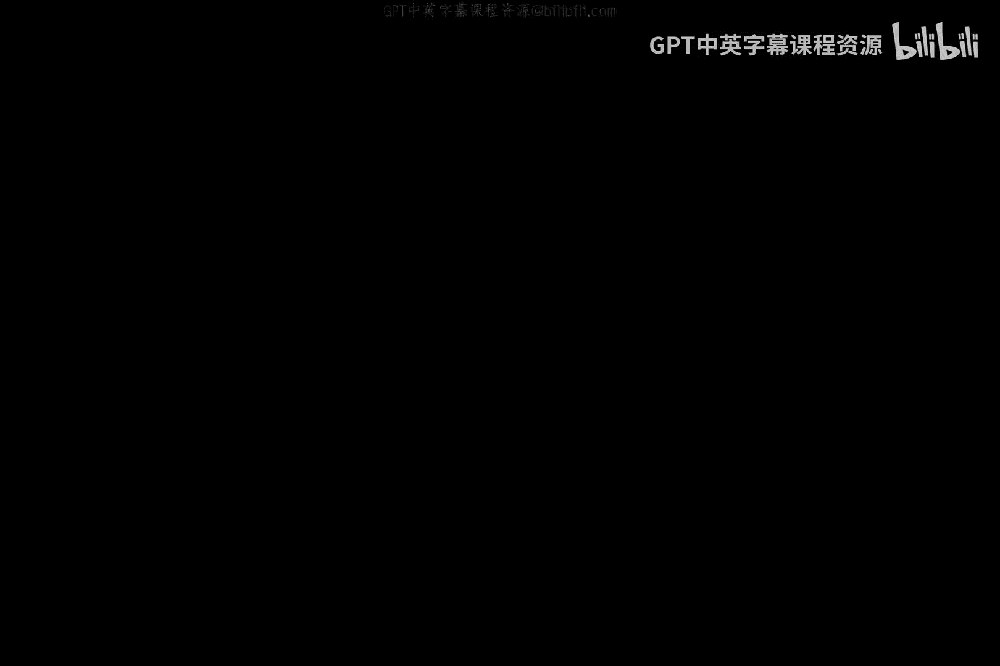
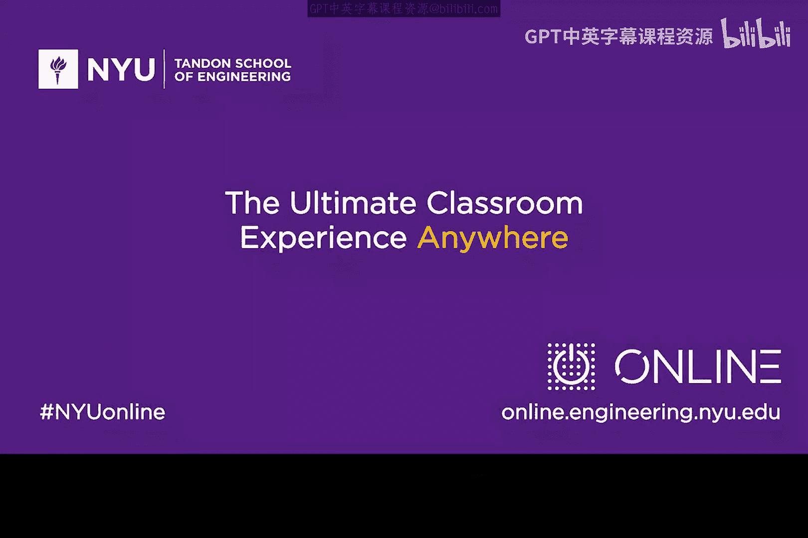

# 019：可用性威胁 🛡️

在本节课中，我们将要学习网络安全中的“可用性威胁”，特别是“拒绝服务”攻击。我们将探讨其核心概念、工作原理，并通过简单的比喻和例子帮助你理解。

## 概述

拒绝服务攻击是指攻击者通过恶意手段，堵塞或阻断授权用户访问其有权访问的资源。这就像制造大量噪音，让你无法听清真正想听的声音。

## 拒绝服务攻击的基本原理

上一节我们介绍了可用性威胁的概念，本节中我们来看看拒绝服务攻击是如何具体运作的。

攻击的核心思想是向目标系统发送大量无效或高负载的请求，使其资源（如带宽、处理能力）被耗尽，从而无法为正常用户提供服务。这类似于用噪音干扰正常的听觉。

### 关键属性：放大与反射

拒绝服务攻击的有效性依赖于两个关键属性：**放大**和**反射**。

**放大**是指一个小动作能引发巨大的后果。公式可以简单表示为：
`小查询 -> 巨大响应`

例如，你问系统“现在几点？”，它回答“2点”。这是一个简单的问答。但如果你问“请用所有语言告诉我未来三个月内每一秒的时间”，系统就会返回海量数据，这就是放大效应。

**反射**是指攻击者隐藏自己，让响应数据包去攻击另一个目标。过程如下：
1.  攻击者向某个服务器（反射器）发送一个请求，但将请求的源地址伪造成受害者的地址。
2.  服务器向这个伪造的源地址（即受害者）发送响应。
3.  受害者收到大量来自服务器的响应数据包，导致网络拥堵。

## 辨别安全事件

了解了拒绝服务攻击的原理后，我们可以用它来辨别哪些事件属于网络安全攻击。

以下是三个可能影响系统可用性的场景，请思考哪些构成了网络攻击：

1.  **闪电击中数据中心**：导致数据中心无法处理数据。
2.  **恶意软件故意瘫痪接入点**：如Wi-Fi、4G基站，使其对授权用户不可用。
3.  **非故意的编码错误**：导致系统崩溃。

我们来逐一分析：
*   **闪电事故**：这是非恶意、非故意的自然事件，虽然是个问题，但不属于安全范畴。
*   **非故意编码错误**：同样是意外，没有恶意意图，因此也不是安全攻击。
*   **恶意软件瘫痪接入点**：这是故意、恶意的行为，旨在使授权用户无法访问服务，**这正是一种拒绝服务攻击**。

关键点在于：**安全攻击意味着故意、恶意的行为**。非故意或不可避免的事件属于运行问题，而非安全问题。

## 总结

本节课中我们一起学习了：
1.  **拒绝服务攻击**的定义：恶意阻断授权用户访问资源。
2.  攻击的核心机制：通过制造大量“噪音”（无效请求）淹没目标。
3.  两个关键属性：**放大**（小动作引发大影响）和**反射**（隐藏攻击者，让服务器响应去攻击受害者）。
4.  如何辨别安全事件：关键在于是否存在**故意、恶意的意图**。

记住放大和反射的概念，在后续学习更技术性的分布式拒绝服务攻击和僵尸网络时，你会发现它们是基础。