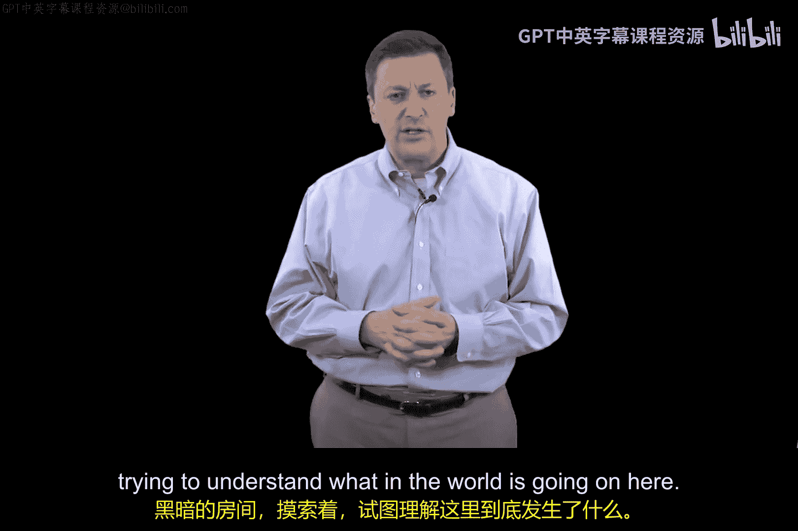

# 022：网络攻击剖析 🛡️

在本节课中，我们将要学习网络攻击的基本概念。我们将从防御者的视角出发，了解攻击是如何被组织、识别和应对的。理解攻击的阶段和特征，是构建有效防御策略的第一步。

## 攻击的视角：防御者所见

上一节我们介绍了网络安全的基础，本节中我们来看看网络攻击。我们将接触到一些技术性更强的材料。你会发现，前面的很多内容涉及分类法和一些背景故事。这些故事旨在建立一个基础，以便我们后续可以开始进行一些计算机科学层面的探讨。

目前，我希望帮助你理解一次网络攻击是如何被组织的。我们将采取防御者的视角。当防御者观察一次网络攻击时，我们看到的是被称为**指标**的东西。这意味着我们看到一些暗示或迹象，表明可能有事情正在发生。

例如，如果你坐在家里，看到一辆车驶过，你可能会想：“有车开过去了。这会不会是个问题？”你会因此报警吗？可能不会。这只是一个**指标**。如果你报警，可能会和警察有一番奇怪的对话：“你说你看到一辆车开过去了？”假设几分钟后，你又看到一辆车开过去。现在你开始觉得不对劲了。你会看到这些**指标**，它们可能让你相信你正遭受攻击，也可能不会。

这些**指标**会累积到某个阈值，此时攻击确实已经发生。之后你看到的**指标**可能伴随着实际的损害。例如，你可能注意到资产确实正在受损，出现了真正的问题。

## 攻击的阶段划分

因此，我们倾向于将攻击分为两个阶段：**早期预警阶段**和**攻击后阶段**。我们说攻击有早期阶段和后期阶段。

请记住，任何人都会说，最好在早期阶段阻止攻击。这完全合理，你希望在问题发生之前就阻止它。就像如果我因为一辆车开过去几次而报警，而那真的是罪犯，那就太棒了。我阻止了犯罪，没有等到他们闯入我家、砸坏东西、偷走财物。如果我等到他们闯入后才报警，虽然也能理解，但显然不如在他们开车经过时就报警来得好。

## 早期响应的挑战

那么，在早期阶段报警有什么问题呢？对于网络防御者来说，基于早期**指标**启动事件响应有什么问题呢？

这被称为**误报**。这意味着我对于网络攻击的大部分大惊小怪，实际上可能根本不是一次网络攻击。我可能是在为子虚乌有的事情瞎忙活。

因此，作为网络防御者，我们试图以一种有助于预防的方式来组织对网络攻击的理解，同时也要平衡我们愿意花费的时间。我们需要处理可能不断出现的各种预警**指标**，以及在不同阶段可能出现的问题，并确保我们没有浪费所有时间。

## 攻击者的视角

现在，从攻击者的角度思考网络攻击，他们会做以下事情：
以下是攻击者通常遵循的步骤：
1.  **侦察**：在最初阶段收集目标信息。
2.  **扫描**：尝试探查你的系统上正在运行什么。
3.  **获取访问权限**：以某种方式进入你的系统。
4.  **实施攻击**：进行真正的漏洞利用。
5.  **掩盖踪迹并撤离**：清除活动痕迹然后离开。

这是攻击者行为的一个概要。而防御者只看到一堆**指标**。攻击者不会给你寄送他们的行动计划地图。两者截然不同。

## 防御的核心困境

所以我希望你能这样思考：作为一名防御者，你**没有**攻击者正在做什么的地图。他们不会为你铺好道路。这就像在一个黑暗的房间里摸索。这就是在实际环境中进行网络安全工作的感觉。

这个意象非常重要：在黑暗的房间里摸索，试图理解这里到底发生了什么，正在发生什么样的事情。这本质上就是网络安全的核心问题。如果我们知道攻击者在做什么，那一切就简单了。但事实证明，我们并不知道。

本节课中我们一起学习了网络攻击的基本框架。我们从防御者的视角，认识了攻击**指标**、攻击的阶段划分（早期预警与攻击后），以及早期响应面临的**误报**挑战。同时，我们也了解了攻击者典型的行动步骤：**侦察 -> 扫描 -> 获取访问 -> 实施攻击 -> 掩盖踪迹**。最后，我们明确了防御工作的核心困境：如同在黑暗房间中摸索，缺乏攻击者的完整“地图”。理解这些是迈向有效防御的第一步。