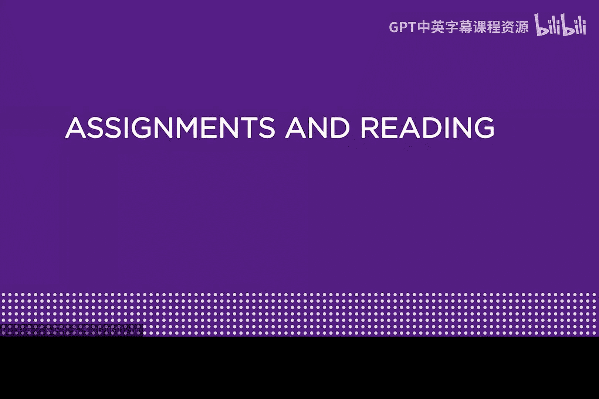
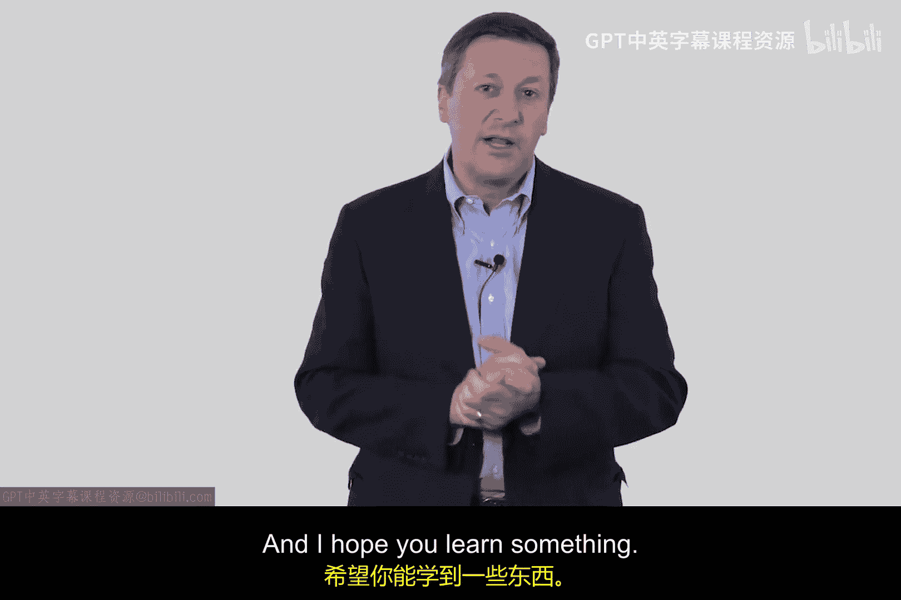
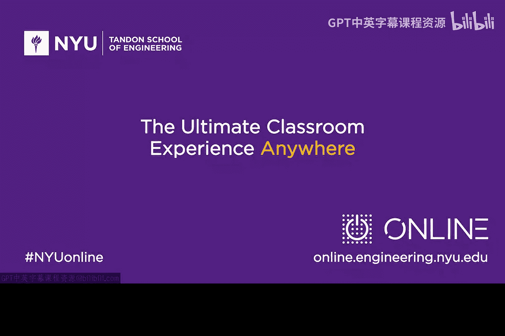

# 027：作业与阅读

在本模块中，我们将深入探讨一些更高级的网络攻击，例如蠕虫和DDoS攻击，并了解网络攻击技术的发展趋势。为了辅助学习，本模块还提供了一些推荐的阅读材料和视频资源。

## 📚 核心阅读材料

以下是本模块的核心阅读材料，旨在帮助你从不同角度理解攻击技术与网络安全行业。

*   **《连线》杂志文章**：记者安迪·格林伯格撰写了一篇关于其亲身经历的文章。他在一辆吉普车中，体验了黑客在高速公路上实时远程控制车辆的过程。这篇文章引发了关于此类实景测试安全性的讨论。
*   **HD Moore人物传记**：HD Moore是网络安全领域的先驱之一，也是Metasploit框架的重要奠基人。推荐阅读一篇简要介绍其职业生涯的文章，以了解攻击工具开发者的视角。

## 📖 可选扩展资源

如果你希望进行更深入的学习，以下资源可供参考。

*   **推荐书籍**：
    *   **《从CIA到APT：网络安全导论》**：这是一本由我与儿子合著的电子书，你可以在亚马逊找到。本模块的学习可重点参考其第5章和第6章。
    *   **TCP/IP教科书**：建议在你的书架上备一本扎实的TCP/IP参考书。理查德·史蒂文斯的《TCP/IP详解 卷1》是经典之作，其中第5章和第6章的内容对本模块的学习会有所帮助。
*   **推荐TED演讲**：
    *   **Pablos Holman的演讲**：一位顶尖黑客分享他的工作方式与方法，内容非常精彩。
    *   **Avi Rubin的演讲**：约翰斯·霍普金斯大学的教授，我的老朋友，进行了一场名为“你所有的设备都可能被黑客入侵”的演讲。该演讲内容发人深省，非常值得一看。

## 🎯 总结

本节课我们一起规划了本模块的学习路径。我们明确了将学习蠕虫和DDoS等高级攻击的目标，并介绍了配套的**核心阅读材料**（安迪·格林伯格的文章和HD Moore的传记）与**可选扩展资源**（相关书籍和TED演讲）。希望你能充分利用这些资源，享受学习过程并有所收获。