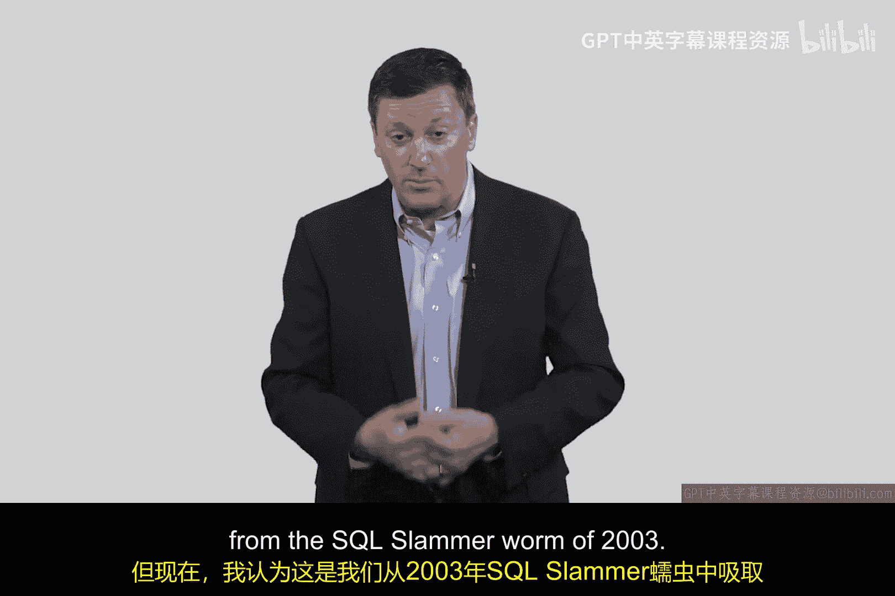

# 028：2003年SQL Slammer蠕虫 🐛

在本节课中，我们将要学习网络安全史上一个标志性事件——2003年的SQL Slammer蠕虫。我们将了解它的工作原理、造成的巨大影响，以及它如何改变了我们应对大规模网络攻击的思路。

---

我想讲述一些2003年在公共互联网上发生的问题。

让我从一个故事开始。大约在2003年1月，一个周六的早晨，我们很多人被一连串的短信、电话和通知吵醒，被告知互联网正在发疯。具体来说，是UDP端口上的数据包疯狂激增，完全呈爆炸式增长，冲击网关，瘫痪网络和系统。

在之前的课程中，我们讨论了蠕虫程序的工作原理。2003年的这个问题被称为Slammer蠕虫，它确实是首批影响整个互联网的蠕虫实例之一。

你记得蠕虫工作的三个步骤：**1. 找到一个系统；2. 将蠕虫程序复制到该系统；3. 远程执行**。然后它会像瀑布一样级联传播。2003年1月发生的情况，正是我们在互联网上目睹了这种通过UDP协议进行的级联效应。

---

上一节我们介绍了Slammer蠕虫的爆发现象，本节中我们来看看当时引发的一系列问题和观察。

许多问题随之浮现。第一个问题是：你该如何应对？当UDP数据包冲击网关时，任何安全管理员首先会问：“是什么在吸引这些数据包？为什么这些UDP数据包会涌入？它们是良性的、错误的，还是一次拒绝服务攻击？”这种混乱通常是在蠕虫攻击进行期间，防御工作所面临的特征。

人们注意到的第二点是：许多用于小规模问题的入侵检测系统和防御措施对蠕虫无效。试想一下，在小系统上，你可能非常熟悉的入侵检测防火墙（尤其是在你的个人电脑上），当海量的UDP数据包向你涌来时，它们根本不起作用。

因此，2003年是我们首次普遍意识到，必须找到在更大规模（即整个互联网范围）上进行入侵检测和入侵缓解的方法。2003年的这次Slammer蠕虫确实警醒了我们很多人。它彻底失控了。

---

关于这个蠕虫有几个有趣的地方。其中之一是，当我们回头查看与此次蠕虫及互联网UDP流量相关的元数据时，我们注意到蠕虫实际上是在1月底爆发的。从图表上可以看到，UDP流量在1月底出现了巨大的峰值。但在整个1月份更早的时候，就已经有过尝试发动的迹象，推测是编写此蠕虫的人试图更早地启动它。这是一个非常有趣的观察。

因为这给了我们相当大的希望：或许通过大规模观察互联网上的元数据，可能成为大规模入侵检测和入侵预防的关键。思考一下：与其依赖单个系统上的指标，或PC、服务器上的审计日志，问题变成了：**你能否在互联网上收集那种数据？能否在互联网网关、接入点、服务提供商可能查看公共流量的地方收集元数据，并将其用作某种攻击正在酝酿的指标？**

回想2003年，我笑了，因为我猜观看此视频的一些人那时可能还没出生。但在14年前，我们遇到了这个彻底爆炸式的事件，我们吸取了很多教训。

---

以下是本次事件带来的关键教训总结：

1.  **Slammer蠕虫是我们首次看到蠕虫的广播级联传播影响互联网基础设施。**
2.  **它证明了我们在小规模场景中使用的许多技术在大规模场景中无效，效果完全不同。**
3.  **也许在早期通过网络收集的元数据中，存在一些暗示攻击正在酝酿的线索。**

这在2003年给了我们很多希望，并促使许多公司、组织、大学和研究人员投入更多时间、精力和资金到我们现在称之为**大规模入侵检测与入侵预防**的领域。这是我们阻止其他类型服务攻击等方式之一，我们将在后续讨论中涉及。

但现在，我希望你理解，SQL Slammer蠕虫在某种程度上标志着大规模互联网服务和互联网基础设施攻击现代时代的开端。

我们将在一些额外的视频中更深入地探讨这一点，但目前，我认为这是我们从2003年SQL Slammer蠕虫中汲取的关键一课。

我们将在下一个视频中继续学习。

---

---

本节课中我们一起学习了2003年SQL Slammer蠕虫的爆发过程、其暴露的传统安全防御的局限性，以及它如何推动网络安全领域向大规模元数据监控和入侵检测预防方向发展。这次事件是网络安全演进史上的一个重要里程碑。