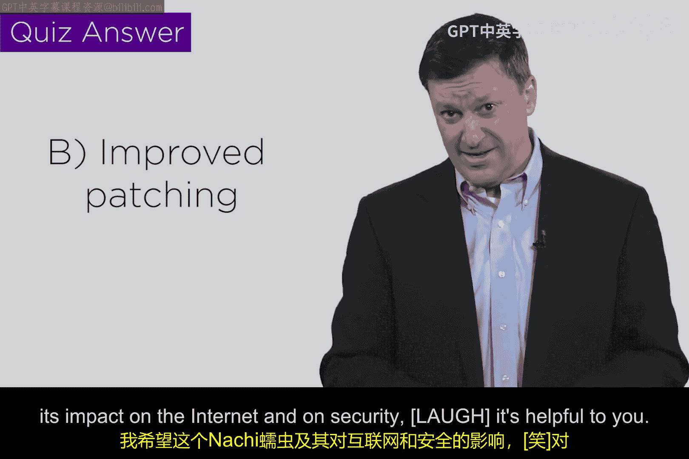

# 029：2003年Nachi蠕虫 🐛

在本节课中，我们将要学习2003年爆发的Nachi蠕虫。这是一个非常特殊的案例，它被称为“义警蠕虫”，其初衷是好的，但最终却造成了巨大的网络混乱。我们将探讨它的工作原理、造成的巨大影响，以及它给网络安全领域带来的深刻教训。

## 概述：一个“好意图”的蠕虫

上一节我们介绍了Slammer蠕虫，本节中我们来看看另一个在2003年造成重大影响的蠕虫——Nachi。这个蠕虫的独特之处在于，它是由一个“好人”编写的，旨在寻找并修复受感染系统中的漏洞。然而，这种“义警”行为最终导致了灾难性的后果。

## 工作原理：利用Ping进行“普查”

Nachi蠕虫的核心机制是利用了大家非常熟悉的**Ping**命令。Ping是一个使用**ICMP**（互联网控制消息协议）的请求-响应协议，用于检测网络连通性。

该蠕虫的作者利用Ping来扫描互联网，寻找潜在可以“清理”的系统。你可以把它想象成向整个互联网发送大量的Ping请求，试图清点所有在线设备，然后再进行后续操作。

## 灾难性影响：Ping洪流瘫痪互联网

正如你可能预料的，这种海量的Ping流量彻底失控了，并最终导致了互联网的瘫痪。在2003年，互联网已经拥有庞大的基础设施，而Ping流量能够引发级联效应，这正说明了互联网蠕虫的威力。

如果你当时在互联网服务提供商、研究机构或大学的网络运营中心工作，你可能会进行一种叫做“分析”的工作。你可能会监控并绘制各种流量的图表，其中就包括通过你所有监控点的ICMP流量。

在Nachi蠕虫爆发之前，ICMP流量通常非常平稳，因为它不是一个像HTTP或电子邮件那样主导互联网流量的协议。然而，在某个时间点，图表上会开始出现一个被圈出的区域，显示ICMP流量逐渐上升。

以下是当时网络管理员面临的挑战：

*   **何时行动？** 流量刚开始轻微上升时，你是否应该采取行动？还是等到它显著增加？行动的阈值在哪里？
*   **采取何种行动？** 你应该关闭ICMP协议吗？这意味着在你的网络或特定网关上禁止Ping请求。但这会带来另一个问题：许多网络管理工具依赖ICMP协议来发现需要更新的设备或进行网络监控。采取行动的影响可能非常重大。

## 惊人的数据：占据40%的互联网会话

如果你持续观察，在最初的五到六个小时内，ICMP流量会从无到有，最终演变成一场巨大的爆炸。当Nachi蠕虫达到顶峰时，它产生了一个令人震惊的指标：在2003年下半年，Nachi蠕虫产生的、四处弹跳的Ping垃圾流量，**占据了公共互联网上高达40%的会话**（会话可以理解为一个源-目的地址对的流量）。这个数字至今看来都令人难以置信。

## 核心教训：阈值困境与“义警”的失败

Nachi蠕虫事件给我们上了重要的一课。

首先，**“义警”行为是一个糟糕的主意**。即使初衷是好的，未经授权和不受控制的自动化修复行为也会造成不可预见的、大规模的破坏。

其次，它凸显了网络安全中的**“阈值困境”**。我们应在何时采取行动？阈值设定在哪里？这就像在生活中，有人走上你家车道时你是否报警？有人砸碎窗户闯入时你肯定会报警，但问题在于，我们是否等待了太久？是否一定要等到后果发生才行动？

在2003年，整个网络安全界都在努力应对这些问题。好消息是我们意识到了问题；坏消息是，这么多年过去了，我们仍未完全解决它。我们仍然面临着这些遗留问题：当出现攻击预警时，行动的阈值在哪里？采取什么样的具体行动才是合理的？

## 知识检验：如何防御此类蠕虫？

为了检验我们的理解，这里有一个简短的小测验。请思考以下哪种方法最能降低此类蠕虫带来的风险？

以下是三种常见的网络安全措施：

1.  **防火墙**：能提供一定的风险降低，可能不是最主要的手段，但确有贡献。
2.  **系统补丁**：事实证明，及时打补丁对减少蠕虫感染有显著影响。因为大多数蠕虫都是通过利用未修补的漏洞进入系统的。
3.  **流量加密**：可能不是显著降低风险的方法。因为对于蠕虫传播而言，流量是加密的明文还是密文，通常并不重要。

因此，最好的答案可能是：**确保你的系统及时打补丁，并辅以防火墙等措施**。安全没有绝对单一的答案，通常是多种措施共同作用的结果。

## 总结

本节课中我们一起学习了2003年的Nachi蠕虫。我们了解到，即使出于“修复”目的编写的“义警”蠕虫，也会因为失控的扫描流量（ICMP Ping）而对互联网造成严重破坏，甚至一度占据了40%的互联网会话。这一事件深刻揭示了在网络安全响应中设定行动阈值的困难，以及未经协调的自动化“修复”行为所带来的巨大风险。其核心教训在于，防御此类蠕虫最有效的方法之一是**及时为系统安装安全补丁**，以消除蠕虫赖以传播的漏洞。