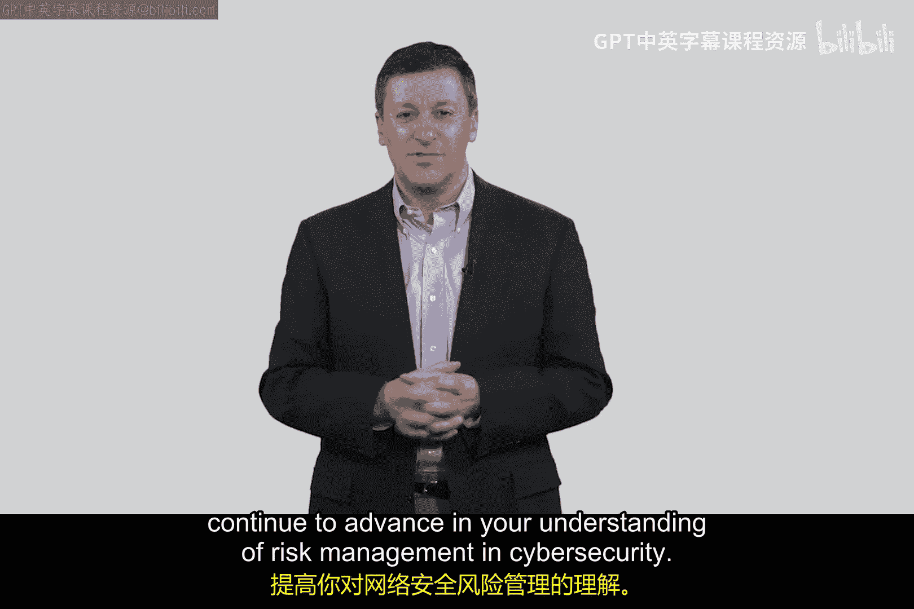

# 034：风险计算 📊

在本节课中，我们将要学习网络安全中一个核心概念：**风险**。我们将探讨如何量化风险，理解其两个关键组成部分，并通过生活中的例子来类比网络环境中的风险变化。

---

## 概述

风险在网络安全中并非一个模糊的定性概念，而是一个可以量化的术语。它主要关注两个维度：**事件发生的可能性**和**事件发生后的后果**。我们将通过类比和计算实例，清晰地阐述这个概念。

---

## 风险的定义与核心维度

上一节我们介绍了风险在网络安全中的重要性，本节中我们来看看如何具体定义和衡量它。

在网络安全领域，风险（Risk）被定义为一个与潜在攻击相关的量化指标。它由两个核心因素决定：

*   **攻击发生的概率（Probability）**
*   **攻击成功后的影响或后果（Consequence）**

我们可以用一个简单的公式来概括这个关系：

**风险 ≈ 概率 × 后果**

这意味着，风险值会随着事件发生可能性的增加或事件后果严重性的增加而上升。

---

## 通过生活实例理解风险变化

为了更好地理解这两个维度如何影响风险，让我们看两个生活中的例子。

### 示例一：改变概率（路面结冰）

想象你独自一人驾驶汽车。初始状态下，发生严重事故的风险有一个基准值。

现在，假设天气突变，路面结冰打滑。

*   **概率变化**：发生事故的**可能性**显著增加了。
*   **后果变化**：事故的**后果**（对你个人造成的伤害）没有改变。
*   **风险变化**：由于概率上升，整体**风险**增加了。

### 示例二：改变后果（车内有婴儿）

现在回到初始的驾驶状态，路况良好。但这次，你的汽车后座上有一个坐在安全座椅里的婴儿。

*   **概率变化**：发生事故的**可能性**没有改变。
*   **后果变化**：事故的**后果**变得严重得多，因为涉及到了婴儿的安全。
*   **风险变化**：由于后果的严重性上升，整体**风险**增加了。

这两个例子说明，系统中任何改变都可能通过影响**概率**或**后果**来改变整体风险水平。

---

## 将概念应用于网络安全

理解了风险的基本原理后，现在让我们将其应用到网络安全的实际场景中。

在网络安全中，我们通过一个称为 **“基线化（Baselineing）”** 的过程来量化风险。我们为系统在某个时间点的风险设定一个基准数值。这个数值本身的大小并不具备绝对意义，其意义在于衡量后续变化是使风险“上升”还是“下降”。

以下是两个改变系统配置如何影响风险的例子：

**场景A：连接互联网（改变概率）**

假设你有一个存储了100条客户记录的服务器，最初位于一个不与互联网连接的私有网络中。

1.  **建立基线**：此时的风险值我们设为 **R1**。
2.  **进行改变**：你决定将这个服务器连接到互联网，以便进行维护。
3.  **风险分析**：
    *   **攻击概率**：由于暴露在公共网络中，遭受攻击的**可能性**急剧上升。
    *   **攻击后果**：泄露100条客户记录的**后果**严重性没有改变。
4.  **风险变化**：由于概率大幅增加，新的风险值 **R2** 远高于基线 **R1**。

**场景B：增加数据量（改变后果）**

回到初始状态，服务器仍在私有网络中，未连接互联网。

1.  **建立基线**：存储100条记录时的风险值为 **R1**。
2.  **进行改变**：你将服务器上的客户记录从100条增加到100万条。
3.  **风险分析**：
    *   **攻击概率**：系统并未更暴露，攻击**可能性**基本不变。
    *   **攻击后果**：泄露100万条记录的**后果**严重性远超泄露100条记录。
4.  **风险变化**：由于后果严重性大幅增加，新的风险值 **R3** 远高于基线 **R1**。

---

## 风险管理中的主观判断与平衡

在实际的网络安全决策中，情况往往更加复杂，需要管理者进行主观判断。

一个常见的难题是：当一个维度的风险上升，而另一个维度的风险下降时，整体风险如何变化？

例如，如果将服务器数据从100万条减少到10条（**后果降低**），但同时将其连接到互联网（**概率升高**）。整体风险是保持不变、升高还是降低？

以下是网络安全实践中的关键点：

*   **定性 vs. 定量**：网络安全风险管理混合了定量数据和定性判断，并非纯粹的数字计算。
*   **依赖经验**：做出好的安全决策往往依赖于经验、对业务的了解以及承担可控风险的意愿。
*   **管理决策**：最终，如何平衡概率与后果，做出降低整体风险的选择，是一项关键的管理技能。

为了加深理解，建议进行以下思考练习：

思考你个人生活或工作中的场景，识别哪些行为会增加事件的概率或后果，从而导致风险上升。反过来，思考哪些措施可以降低概率或后果，从而管理风险。

---

## 总结

本节课中我们一起学习了网络安全中风险计算的核心概念。

1.  风险是一个由 **概率** 和 **后果** 两个维度决定的量化概念。
2.  通过改变系统的配置或状态，可以影响攻击发生的可能性或成功后的影响，从而改变整体风险水平。
3.  我们通过建立风险基线来衡量这些变化。
4.  实际的风险管理涉及复杂的判断，需要在概率与后果之间进行权衡，这依赖于经验和管理决策。

理解风险的这一框架，是后续学习制定安全策略和控制措施的基础。我们将在下一个视频中继续深入。