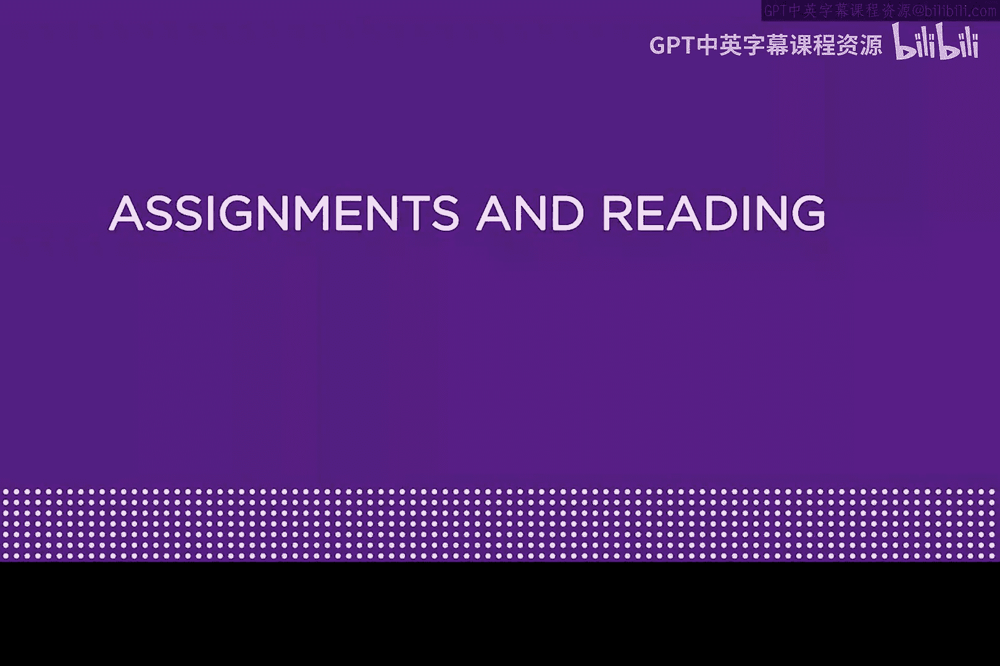
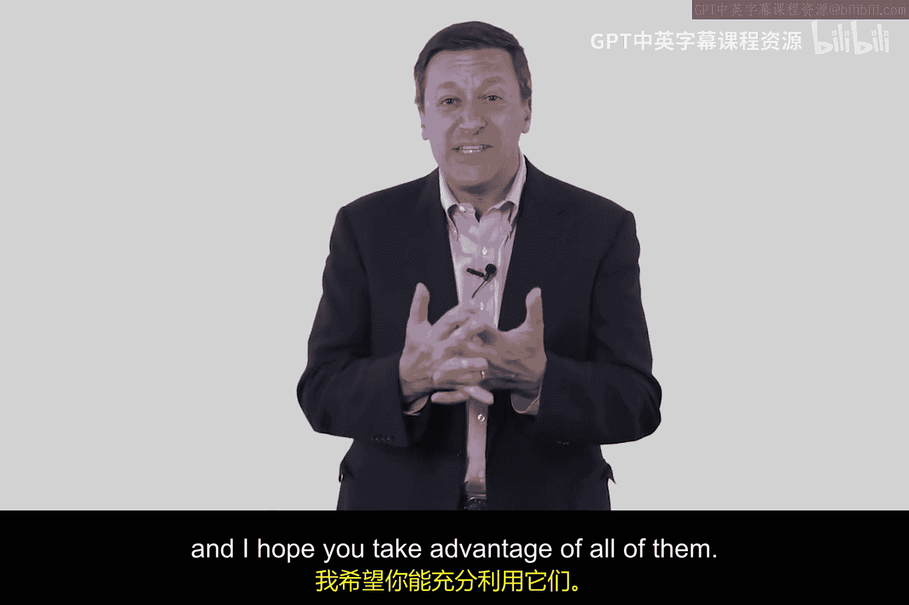
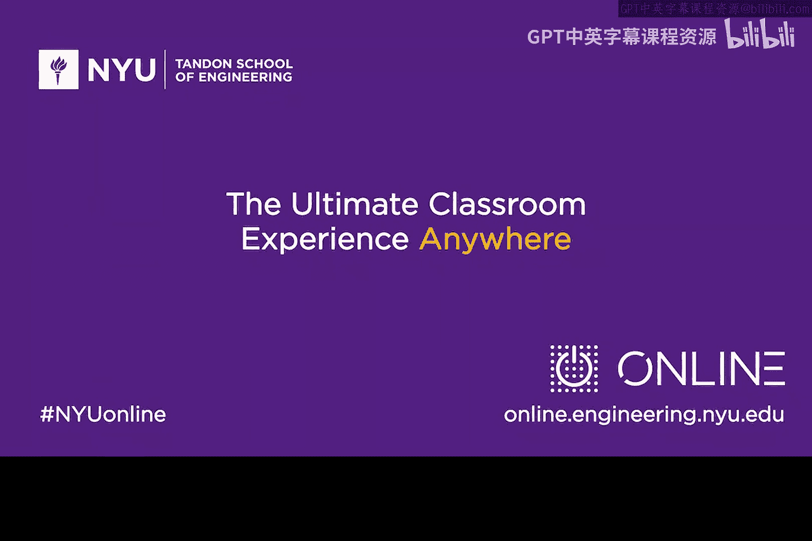

# 037：课程概述与学习资源 📚

在本模块中，我们将学习网络安全防御中一项非常重要的技术：**将资产映射到威胁**。我们将理解互联网上出现的问题与我们构建防御、降低风险的方法之间的交集。本模块将提供一些非常有用的论文和材料来辅助学习。

## 核心概念与学习目标

我们的目标是掌握如何分析威胁与资产的关联，并开始思考如何构建防御体系以降低风险。这涉及到理解攻击原理和防御策略。

上一节我们介绍了本模块的核心目标，本节中我们来看看完成学习所需的具体材料和资源。

## 推荐阅读材料 📄

以下是本模块推荐阅读的两篇重要论文：

*   **论文1：《UMTS网络中的中间人攻击》**
    *   作者：Meyer 和 Wetzel。
    *   简介：这篇论文探讨了一种无线技术（UMTS）上的攻击方式，你将学习到如何在一定意义上对无线通信进行窃听。Suzanne Wetzel是我在史蒂文斯理工学院的一位同事。
*   **论文2：《是计算机入侵还是闯入计算机？伦理思考》**
    *   作者：Gene Spafford（我们常称他为“Spaf”）。
    *   简介：这是网络安全领域大师级人物Spafford的一篇优秀论文，你会在文中感受到他的个人风格。他是普渡大学的教授。

## 可选参考书籍 📚

除了必读论文，这里还有两本可供选读的书籍，它们能帮助你更深入地理解课程内容。

以下是两本可供选择的参考书：

*   **书籍1：《从CIA到APT：网络安全导论》**
    *   作者：Ed（本人）与我的儿子Matt合著。
    *   简介：这是一本与课程配套的电子书，内容可选。但有些学员可能喜欢在听课的同时有一本书可以翻阅，你可以在亚马逊下载它。
*   **书籍2：《TCP/IP详解》**
    *   作者：Richard Stevens。
    *   简介：如果你想从事网络安全行业，必须像化学家熟悉元素周期表一样精通TCP/IP。我建议你的书架上应该有一本扎实的TCP/IP教材。如果你觉得有必要，在学习本模块时，可以重点阅读Stevens书中第7和第8章。

## 拓展学习视频 🎥

理论学习之外，观看行业专家的演讲也能获得宝贵见解。这里推荐两个相关的TED演讲。

以下是两个推荐的TED演讲：

*   **演讲1：《你的密码出了什么问题？》**
    *   演讲者：Lori Faith Krause（我曾在AT&T的同事）。
    *   简介：这是一个非常精彩的演讲。Lori富有感染力的个性和热情能让你受益匪浅，建议你听一下。
*   **演讲2：《对抗病毒，捍卫网络》**
    *   演讲者：Mikko Hypponen（来自F-Secure公司）。
    *   简介：Mikko是网络安全领域的杰出思想家之一，这个视频值得一看。

## 总结

本节课中我们一起学习了本模块的核心目标——**资产与威胁映射**，并详细介绍了配套的学习资源，包括两篇必读论文、两本可选书籍以及两个拓展视频。希望你能充分利用所有这些资料，它们将很好地辅助你完成本模块的学习。祝你学习愉快！