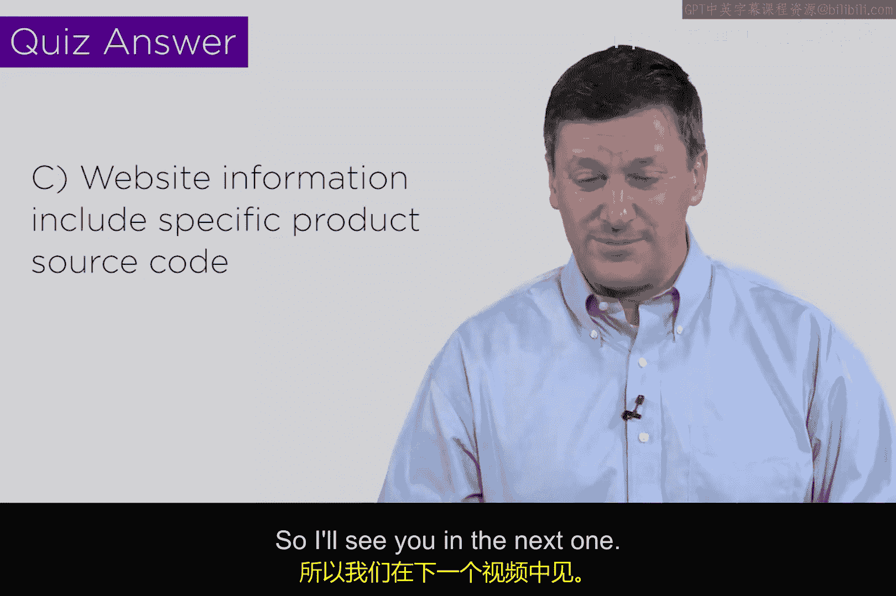

# 041：矩阵示例第2部分 🔐

在本节课中，我们将基于上一节视频中建立的示例网络，继续构建威胁资产矩阵。我们将逐一审视矩阵中的各个单元格，解释风险评估背后的理由，并理解如何为不同资产在机密性、完整性和可用性三个维度上分配优先级。

上一节我们介绍了如何为一个典型网络识别出七种关键资产。本节中，我们将看看如何将这些资产映射到三种威胁类型上，并完成风险评估矩阵。

以下是我们的威胁资产矩阵示例：

我已经预先完成了每个单元格的风险评估。现在，我将尝试解释其中一些评级的理由，帮助你理解这个过程如何进行。请注意，风险评估没有绝对正确的答案，关键在于你的结论是否**合理且可论证**。就像在之前的讨论中，不同的人从着火的房子里抢救出的最重要物品可能不同，但只要选择能自圆其说即可。

---

### 逐行分析风险评估

我们将逐行查看矩阵，并解释部分评级背后的思考过程。

**1. 移动设备**
*   **机密性、完整性、可用性评级：低**
*   **理由**：在现代企业中，移动设备本身存储的关键信息可能较少，它更像是一个访问其他资产（如云端服务）的窗口。因此，设备本身的风险评级较低。然而，通过它访问的内容可能风险很高。

**2. 个人电脑**
*   **机密性、完整性评级：中；可用性评级：低**
*   **理由**：与移动设备相比，个人电脑通常存储着大量敏感文件（如税务表格、个人文档）。对于攻击者而言，PC往往是更有价值的目标。因此，其机密性和完整性的风险更高。

**3. 局域网**
*   **机密性、完整性、可用性评级：低**
*   **理由**：虽然存在邻居窃用Wi-Fi或监听流量的风险，但对于大多数企业而言，局域网基础设施本身的风险相对较低，并非核心业务资产。

**4. 存储系统**
*   **机密性评级：中；完整性评级：高；可用性评级：低**
*   **理由**：假设我们的示例公司是一家软件公司，其存储在系统中的软件代码是核心知识产权。因此，确保代码不被篡改（**完整性**）至关重要。虽然代码泄露（**机密性**）也是问题，但防止被恶意修改通常优先级更高。

**5. 电子邮件/日历**
*   **机密性、完整性、可用性评级：中**
*   **理由**：电子邮件中包含大量商业机密和敏感通信，需要保护。历史事件（如邮件被黑影响选举）也证明了其重要性。但对于大多数公司，它可能不是最顶级的风险资产，因此评为中等。

**6. 业务支持系统**
*   **机密性评级：中；完整性评级：高；可用性评级：中**
*   **理由**：此类系统包含财务数据、客户列表等。**财务数据的完整性绝对关键**，不允许被随意篡改。客户列表的泄露（机密性）也很严重，但相比之下，确保数据准确无误更为根本。

**7. 公司网站**
*   **机密性、完整性评级：高；可用性评级：中**
*   **理由**：网站是公司的对外门户。对于电商公司，它就是业务平台。网站被篡改（破坏完整性）或敏感数据泄露（破坏机密性）会直接导致重大商业损失和声誉损害，因此评级最高。

---

### 风险评估的尺度与严谨性

请注意，本例中我们使用了**低、中、高**的简单评级尺度。在实际操作中，你可以根据需要的精确度选择不同尺度，例如1到10分，甚至1到1000分。

风险评估的严谨程度应与资产的重要性匹配。例如：
*   **对于普通企业**：使用简单的低/中/高尺度，由小型团队评估可能已足够。
*   **对于核电站等关键设施**：则需要极其精细的评分尺度（如1-1000），并由大型专家团队对矩阵中的每个单元格进行深入分析并达成共识。

**这就是在关键基础设施中实施安全的方法**。它可能看起来不那么“技术”，但却是所有安全决策的基石。

---

### 从分析到行动

完成这个矩阵后，下一步就是根据优先级采取行动。我们的安全措施（如部署加密、防火墙）将直接由这个风险评估驱动。

例如，基于我们的矩阵：
*   我们不会盲目地在所有移动设备上加密，因为其评级为“低”。
*   我们会将资源和预算集中在保护**网站**和**存储系统**的完整性上，因为它们的评级是“高”。

**公式：安全决策 ≈ 风险驱动**
安全控制措施的选择和投资，应优先针对风险矩阵中评级最高的资产-威胁组合。

---

### 知识小测验

根据刚才的分析，以下哪项最能证明将“公司网站”的机密性评为“高”，而将“移动设备”评为“低”是合理的？

A. 黑客根本不关心移动设备。
B. 移动设备只是信息信标，而网站可能包含重要的产品或服务信息。
C. 网站包含对公司影响重大的信息，而移动设备本身存储的关键数据较少。

**答案：C**
理由：风险评估的核心在于资产所承载信息的**业务影响**。网站通常直接关联公司的核心业务和声誉，因此其机密性和完整性风险更高。这个选择是**可论证的**。如果你的网站只是一个无足轻重的宣传页，那么你完全可以给它评“低”分。

---

### 总结

本节课中我们一起学习了如何为威胁资产矩阵中的各个单元格进行风险评估。关键要点包括：
1.  风险评估没有唯一正确答案，但结论必须**合理且可论证**。
2.  评级反映了特定资产在机密性、完整性和可用性方面对组织的**相对重要性**。
3.  评估的精细度（如评分尺度）应与组织的风险承受能力和资产关键性相匹配。
4.  最终形成的风险矩阵是指导我们下一步部署具体安全防护措施的**决策蓝图**。

在下一节视频中，我们将探讨如何将安全防护措施与这个风险分析活动联系起来，开始将理论转化为实际行动。

