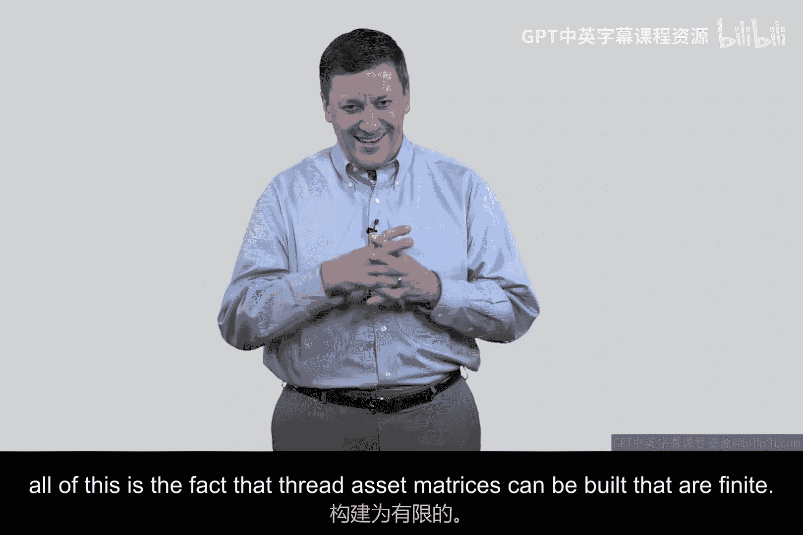
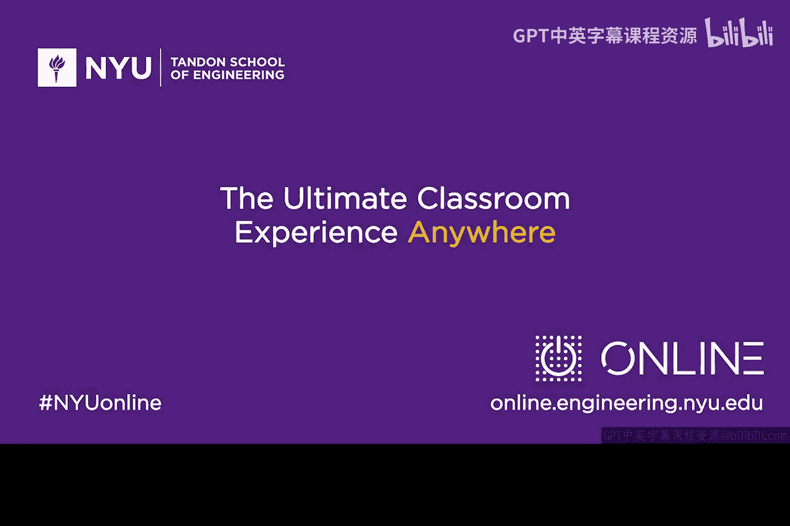

# 042：案例研究矩阵示例第3部分 🔐

在本节课中，我们将要学习如何将威胁资产矩阵的分析结果转化为实际行动，并了解首席信息安全官（CISO）在组织安全决策中的核心作用。我们将探讨从风险识别到实施安全措施的完整流程。

---

上一节我们介绍了如何构建威胁资产矩阵并进行风险评估。本节中我们来看看如何根据评估结果制定具体的行动方案。

在行业、商业和学术界，存在一个被称为首席信息安全官的职位。这个职位有CISO、CiISO等多种称呼。我认为我可能是历史上第二位担任此职的人。上世纪90年代中期，我在纽约市金融服务行业的好友史蒂夫·卡茨向我展示了他的名片，上面印着“首席信息安全官”。当时我在美国大型电信公司AT&T工作。我看到后觉得“CISO”这个头衔很酷。我回到公司后询问是否也能担任此职，他们回答“随你便”。于是我开始使用CiISO这个头衔，我想我可能是第二个这样做的人。

这个职位的核心工作内容，正是我们在这些视频中一直在做的事情：对组织进行风险分析和结构化处理，然后决定采取何种措施。我曾有一位上司，他总是对我说：“埃德，你已经向我展示了‘是什么’，现在告诉我‘所以呢’？” 我总是对“所以呢”这部分稍显薄弱。任何人都能说：“老板，看，我们有一大堆问题。”但关键在于知道如何处理这些问题。

这正是我们开始讨论使用威胁资产矩阵的地方。威胁资产矩阵是决策的基础，用于决定我们将实施何种安全技术、流程或策略来实际解决问题。同样，CISO是组织中做出这一决策的主要负责人。

早期的CISO有点像后台的IT人员。渐渐地，这个职位在典型公司的层级中开始上升。这让我想起了大多数公司50年前的人事部门。如果你回头读一些旧的商业书籍，比如我最喜欢的一本是由多年经营通用汽车的阿尔弗雷德·斯隆所著的《我在通用汽车的岁月》。在他的书里，特别是书末，有一系列像1960年通用汽车的组织结构图。翻阅这些图表非常有趣，你会看到在最后一页的底部，有一个叫做“人事部”的小组，你可能会想象成两个用打字机为新员工打印工牌的人。那么，从那时起的50年里，这个职位发生了什么变化？人事部变成了人事组，然后是人力资源组，再到HR团队。现在，你还能找到哪家公司没有向CEO汇报的人力资源或人事高管？这个职位已被公认为至关重要，因此地位得到了提升。信息安全正在经历类似的过程：从后台几个输入防火墙规则的小IT安全组，到做防病毒和防火墙的IT小组，再到为CIO服务的更大团队，最后成为与CIO平级的CISO。我认为，最终你将会看到首席风险官或首席安全官出现在最高层，很可能直接向CEO汇报。

他们的工作内容是什么？他们将资产映射到威胁，在每个案例中进行风险管理项目。风险管理的输出将是行动——你打算做什么。基于这些行动，项目得以建立，大型系统得以部署，团队被雇佣来维护它们。这就是一个组织、公司、企业、政府或国家保护自己免受网络攻击的方式。这不仅仅是部署一个防火墙来阻止对某个小东西的威胁。那是“微观安全”。对于那些坚持学习并继续观看后续视频的同学，我们将花一些时间深入探讨一些非常具体的技术细节。但我认为，理解这个背景对你很重要。

所以，我们接下来要做的是：这里有一张图表，展示了我们之前案例研究中的矩阵。你可以看到我画了一些箭头指向高风险区域，这意味着如果你现在有预算并打算采取行动，你将重点关注这些高风险活动，并实施一种叫做“安全措施”的东西。我们将在后续课程中深入探讨安全措施的定义、类别、工作原理、功能性以及如何嵌入系统。但你应该在脑海中形成这样一个概念：风险管理活动的输出，实际上就是行动。如果没有行动，你就做错了。想想看，如果我向你展示一个问题，却没有相应的解决方案，那你可能是在浪费我的时间。

让我们在此总结一下：
我们说过威胁资产矩阵是组织我们思路的好方法。这很有道理，有限集合对有限集合。
然后我们说，矩阵中的每个不同格子基本上都是一个风险管理活动。这也有道理。
接着我们说，风险管理应该以一种完整的方式进行，比如使用威胁树和层次化分解，而不是随意地进行结构化头脑风暴和猜测。你更希望有一个更结构化的流程。
然后，基于此，你对风险做出某种准定量判断，比如1到10的等级，高、中、低，任何符合你所处理系统重要性的敏感度标准都可以。
最后，团队将基于可用资金和资源来决定采取什么行动。

这就是进行风险管理的完整视角。在后续视频中，我们将简要探讨一个相关的理论基础，我希望你能理解。但现在，请记住所有这一切的基础是：可以构建有限的威胁资产矩阵。

---

本节课中我们一起学习了如何将威胁资产矩阵的分析转化为具体的安全行动，理解了CISO角色的演变及其在组织安全战略中的核心地位。我们明确了风险管理的最终目标是产生可执行的方案，而不仅仅是识别问题。下一节，我们将探讨支撑这一过程的理论基础。