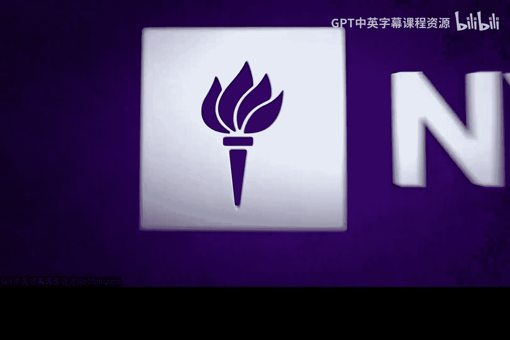
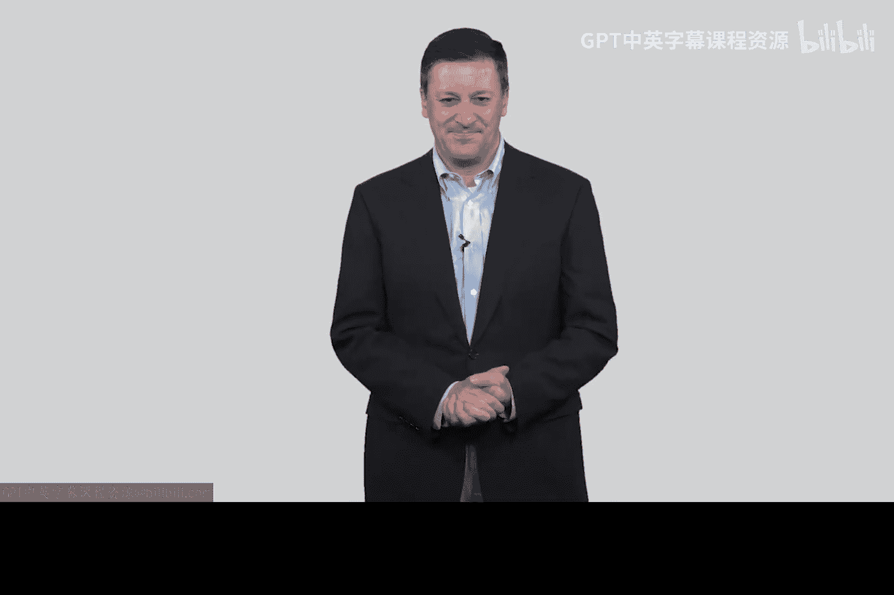

# 045：你将学到什么 🛡️

在本节课中，我们将介绍《网络安全导论》这门课程的核心目标、内容结构以及学习价值。课程将重点探讨网络防御的基础知识，特别是控制措施和密码学的应用。

大家好，我是 Ed Ammarosso，欢迎来到我们的《网络防御导论》课程。

我认为这门课程对你们来说会非常有趣且实用。在网络安全领域，我个人认为目前过于强调网络攻击，比如黑客行为和入侵技术。我理解这些活动可能很有趣且富有挑战性，但为了真正有效地防御或阻止这类攻击，我们需要理解一些非常基础的问题。这正是我们将在本课程中花时间探讨的内容。

这是一门侧重于控制措施的网络防御入门课程。我们将学习大量密码学知识。你们会看到经典的“爱丽丝（Alice）”和“鲍勃（Bob）”来回发送消息的场景。到课程结束时，你们可能会听腻关于爱丽丝和鲍勃的故事，但你们将学到相当多的知识。

以下是本课程的三个主要目标：

首先，介绍最重要的功能性措施。你们稍后会看到，这些措施与策略、流程等保障措施有关。我们会在后续视频中讨论这些，但真正奠定计算机安全、网络安全和计算机科学基础的是功能性机制。这是我们的第一个目标。

其次，阐述实际应用。我们确实注重这门课程的实践性，希望它能成为可以应用的知识。这不仅仅是建立理论基础，尽管我会花一些时间来构建理论基础，因为我认为这是必要的。但课程始终会回归到实际应用上。这是我们的第二个目标。

第三，我希望尝试激励你们投身于网络防御事业。目前有太多的黑客，而防御者却不足。希望在本课程结束时，你们会受到鼓舞，并希望真正投身于成为一名“好人”，去阻止攻击，而不是设计新的攻击方式。当然，我是在开玩笑。我理解我们必须了解黑客是如何工作的。在之前的课程中，我们花了一些时间讨论这一点。

我希望你们能坚持学习完所有的讲座和视频，阅读所有材料。我相信你们会学到很多。

再次欢迎来到我们的《网络防御导论》课程，谢谢。😊

---

本节课中，我们一起学习了《网络防御导论》课程的整体框架。课程旨在平衡理论与实践，重点介绍功能性防御措施和密码学基础，并鼓励学习者将知识应用于实际场景，最终目标是培养更多的网络防御专业人才。