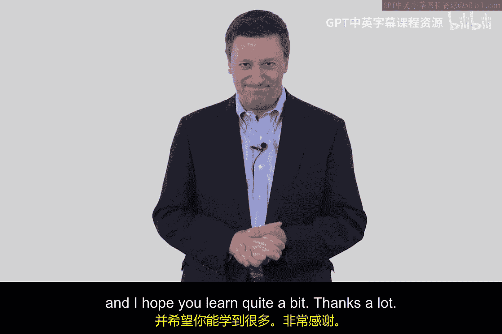

# 046：基础网络防御与资源导览 🛡️

在本模块中，我们将学习如何在建模的背景下理解基础的网络防御。我们将围绕如何通过策略、流程和功能安排来降低网络风险，创建抽象概念。本模块会涉及一些数学技巧，并为你提供一系列推荐的论文、视频和资源，以辅助你的学习。

## 课程概述

上一段我们介绍了本模块的核心目标。接下来，我们将具体了解为帮助你掌握这些概念而推荐的阅读材料和视频资源。

以下是本模块的核心推荐阅读材料：

*   **《Hook-up Theorem》论文**：这篇由数学家Darl McCullough于1990年撰写的论文，虽然有些复杂但非常有趣。它将与本模块中的一个视频内容相匹配，有助于你深入理解相关概念。
*   **Morris & Thompson的密码安全论文**：这篇由两位Unix系统大师撰写的优秀论文，几乎是一部历史综述。它能帮助你理解当今我们视为理所当然的密码与身份验证技术的许多源头。阅读这篇论文将会是一次愉快的体验。

除了必读论文，这里还有一些可选的扩展书籍：

*   **《From CIA to APT: An Introduction to Cybersecurity》**：这是一本由我与我的儿子Matt合著的电子书。在学习本模块时，你可以选择性阅读第9章和第10章。这本书可以作为你跟进学习的补充材料。
*   **《TCP/IP Illustrated, Volume 1》**：这是一本由Richard Stevens撰写的关于TCP/IP的优秀教材。虽然并非必需，但如果你想深入了解，我建议阅读其中的第9章和第10章。这本书完全是可选资源。

阅读材料之后，我们来看看推荐的视频资源。

以下是两个极具启发性的视频，它们从更广阔的视角探讨了安全与验证的本质：

*   **理查德·费曼关于检验理论的演讲**：这位诺贝尔物理学奖得主在网络安全概念出现之前，就阐述了检验理论的方法。他的观点与我们今天在网络安全领域的工作高度相关。
*   **布鲁斯·施奈尔的TED演讲《安全幻象》**：布鲁斯·施奈尔是网络安全领域真正的先驱和领导者之一。你应该完整观看他的这个TED演讲。如果你有机会在会议上见到他，一定要去听，他的分享非常精彩。

## 总结

本节课中，我们一起学习了本模块“基础网络防御”的学习目标，并详细浏览了为辅助学习而推荐的各类资源，包括核心论文、可选书籍以及拓展视野的专家视频。希望你能充分利用这些优质资源，并在本模块中学有所获。