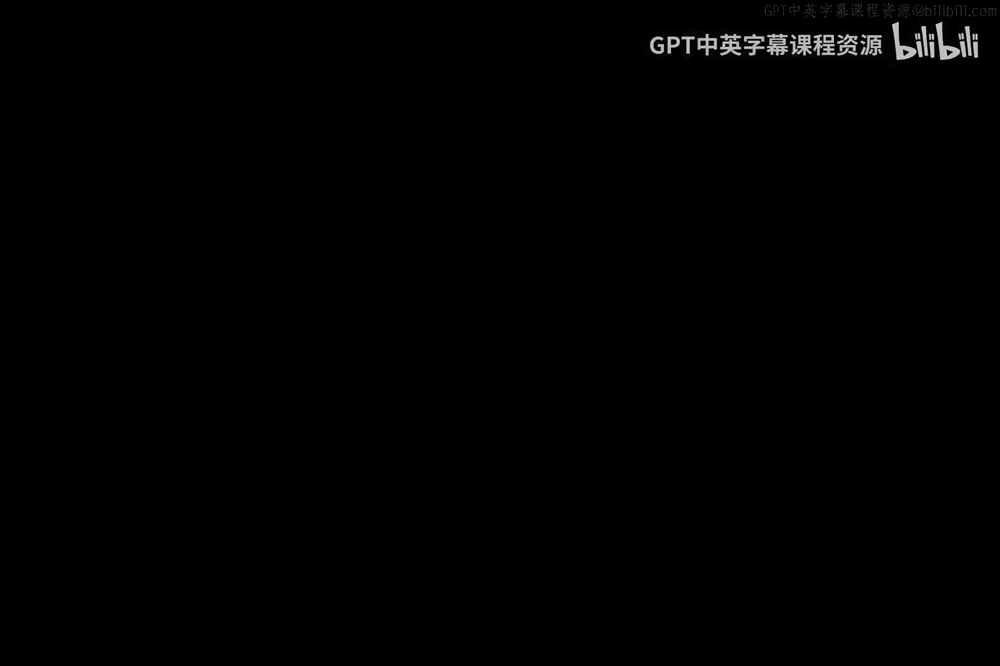

# 047：安全措施与对策

在本节课中，我们将学习一个核心概念：**安全措施**。我们将探讨三种主要的安全措施类型，理解它们如何共同作用以降低网络安全风险。

很多人喜欢为“安全措施”这个词赋予特定含义。它通常被视为一种预防性措施，旨在事件发生前进行阻止。有时，你会看到“对策”这个词，用来描述攻击发生后采取的行动。我们不会在语义上花费过多时间，网络安全领域的术语已经够多了。因此，我们将聚焦于“安全措施”这个术语，将其视为你为降低风险而采取的实际安全防御手段。

在之前的课程中，我们详细讨论了风险管理。这里不再深入，但需要指出，你可以通过三种不同的方式来运用安全措施以降低风险。

以下是这三种主要类型：

## 1. 功能性措施

我们将花大量时间讨论这类措施。这包括我们的防火墙、加密技术、入侵检测系统、恶意软件行为分析等。所有不同的功能性计算控制、协议、系统，以及实实在在的硬件和软件，都属于这个范畴。我们称之为**功能性措施**。

## 2. 程序性措施

这类措施涉及将所有人组织起来，并规定：“嘿，这就是我们的行为准则。”这包括我们将遵循的管理程序、配置程序。作为用户，这是我们承诺的行为方式。例如，我们承诺不点击看起来可疑的链接，承诺不以某种方式保存文件。这些程序性措施有时难以强制执行，但很多时候我们别无选择。如果你有选择，你可能会希望一切都是功能性的，然后告诉每个人可以随心所欲，因为不可能造成问题。但现实并非如此。因此，有时我们必须遵循程序性机制、控制措施或逐步的管理协议来进行风险缓解。随着课程深入，我们会看到一些例子。所以，程序性/管理性措施是第二类。

## 3. 策略性措施

这一类比较特殊，因为它形式多样。有时它可能是一条规则，违反就会产生后果。例如，规定“任何人在这里做坏事都会被解雇”。这是功能性的吗？不是。是程序性的吗？也不是。但它有后果吗？是的。我们制定的这些策略有时确实能降低风险。你可能记得在之前的课程中，我展示过一个苏打水机的例子，我们破解了它。最后我们得出的一个强有力的解决方案，就是简单地贴一张纸条在机器上说：“听着，你最好停止破解这台机器，因为如果我们抓到你，你会有大麻烦。”这不是功能性控制，也不是程序性控制。事实上，这正是网络安全独特的一点，作为一名实际的网络安全工程师，你必须记住：与其他工程分支不同，有时仅仅依靠一项策略，可能比功能性控制更有效。

让我举个例子，我们稍后会花更多时间讨论。以**欺骗**为例。假设我有一个功能性陷阱，如果你掉进去就会被抓住并惹上大麻烦。这是一个我部署的功能性机制，我可以到处设置，就像地雷区一样。那么，一个替代方案就是简单地告诉每个人你设置了陷阱，你有这些能抓住黑客的“地雷区”，并且你的策略是允许这样做。有趣的是，这可能和真正部署功能性控制一样有效。你明白吗？如果你认为它们存在，我可能就已经影响了你的行为。因此，拥有策略有时可以补充程序和功能。

再次强调，三个主要组成部分是**功能性**、**程序性**和**策略性**措施，它们协同工作。在本课程中，我们将花时间逐一探讨。

希望这对你有用，也希望你在学习过程中花时间思考它们。谢谢。

