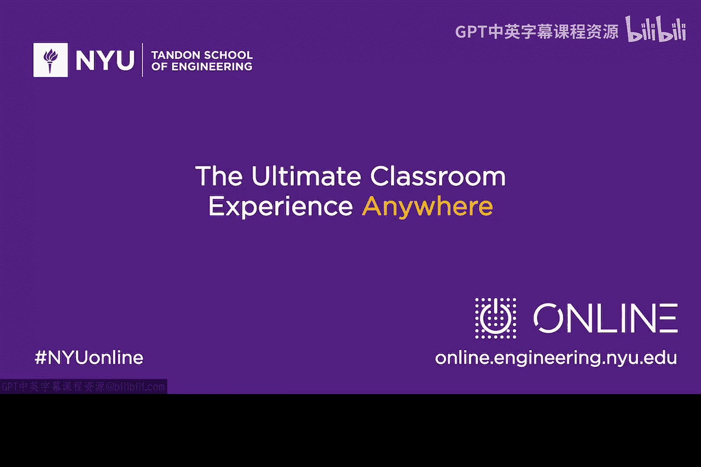

# 048：参考模型 🔐


在本节课中，我们将要学习网络安全领域一个基础且重要的概念——**参考监视器**。这个概念虽然简单，却像牛顿的万有引力定律一样，为整个领域奠定了基石。我们将了解它的起源、核心思想及其在现代安全机制中的体现。

## 创新与基础观察

在深入具体概念之前，我们先谈谈创新与发明。回顾任何科学的发展史，总有一些早期的观察为后续工作奠定了基础。这些基础概念在事后看来往往“显而易见”，但在当时却可能是革命性的洞见。

## 参考监视器的诞生

上世纪70年代，计算机安全领域的早期研究者**詹姆斯·安德森**提出了一个概念，称为**参考监视器**。在早期的计算时代，操作系统常被称为“监视程序”，这或许为他的想法提供了背景。

安德森试图为计算机安全建立一个理论模型。他认为，安全的核心在于在**主动实体**（主体）和**被动存储库**（客体）之间放置**安全措施**。

## 核心模型：仲裁与中介

参考监视器的核心思想是一个**仲裁模型**。它像一个中间人，位于试图执行操作的主体和接受操作的客体之间。

*   **仲裁**：参考监视器直接参与交互过程，实时审查每一个访问请求。
*   **裁决**：与之相对的是“裁决”模式，即安全机制在旁观察，仅在发现问题后才介入处理。

参考监视器采用的就是**仲裁**模式。它检查每一个访问请求，判断其是否符合安全策略。

## 参考监视器的工作原理

参考监视器的运作遵循一个清晰的逻辑流程，可以用以下伪代码描述其核心决策过程：

```
if (请求是授权的 && 条件满足) {
    允许访问;
} else {
    执行安全措施; // 例如：拒绝访问、记录日志、发出警报
}
```

它的职责是确保：
1.  发出请求的实体拥有**适当的授权**。
2.  允许此次访问的**所有条件都已满足**。
3.  如果上述任何一点不成立，则触发负面响应（如阻止、记录或告警）。

## 模型的深远影响与现代表现

詹姆斯·安德森的参考监视器概念对网络安全社区产生了深远共鸣，至今仍是基础思想之一。它之于计算机安全，犹如牛顿的观察之于物理学。

每天，当我们在系统中部署安全机制时，无论是安装**防火墙**、**入侵检测系统**还是其他安全控制措施，本质上都是在实现安德森原始模型的思想。这些现代网络安全机制都是参考监视器理念的具体化身。

## 延伸思考：模型的演变与挑战

理解基础概念后，我们可以进一步思考其在实际中的演变。例如，考虑防火墙与参考监视器之间的共生关系。

从图示看，参考监视器位于一个主体和一个客体之间。但在复杂的现实世界中，我们会面临许多设计考量：

以下是当主体和客体数量增多、位置分散时，引发的一些关键问题：
*   参考监视器是一个单一的实体吗？
*   它可以是**有形的**还是**虚拟的**？
*   它能否被**分布式**部署？
*   它能否被**虚拟化**？
*   它能否成为客体、主体或网络的一部分？

这些设计问题正是从一个像参考监视器这样简单而优雅的概念中衍生出来的。在您学习后续材料时，可以花些时间思考这些问题。

## 总结




本节课中，我们一起学习了网络安全的基础模型——**参考监视器**。我们回顾了詹姆斯·安德森提出的这一仲裁模型，它通过在主体和客体之间充当仲裁者来执行安全策略。我们理解了其“检查-授权-执行”的核心逻辑，并看到了这一思想如何体现在防火墙等现代安全设备中。最后，我们探讨了该模型在复杂系统设计中引发的延伸思考。这个历经半个世纪依然有效的简单模型，为我们理解和构建安全系统提供了坚实的基础。