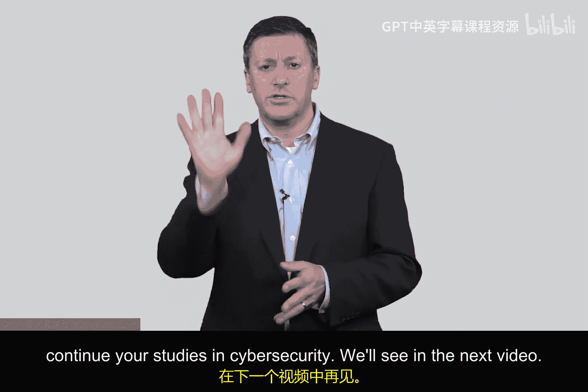
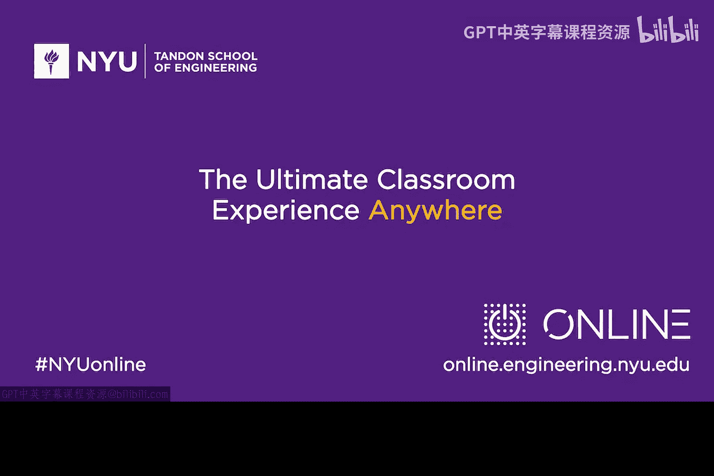

# 049：橙皮书合规性 🍊

在本节课中，我们将学习网络安全早期发展中的一个重要里程碑——**《可信计算机系统评估准则》**，俗称“橙皮书”。我们将了解它如何基于“参考监视器”概念，为系统安全设计提供了一套结构化的要求框架，并探讨其核心概念对现代安全的影响。

---

上一节我们介绍了“参考监视器”的概念。本节中，我们来看看如何将这种理论转化为实际系统的安全要求。

故事要从20世纪80年代初说起。当时，我在贝尔实验室工作。那里是技术的圣地，Unix操作系统的诞生地。然而，早期的Unix系统并未内置强大的安全机制。于是，一个由Bob Morris Sr.领导的团队开始思考：**如何为Unix系统添加安全性？**

这是一个普遍问题：面对一个现有系统，你该如何系统地为其增强安全，而不是零散地“这里加一点，那里补一点”？幸运的是，当时美国政府正在编写一份文件，它提供了一个绝佳的框架。

这份文件的封面是橙色的，因此被称为 **“橙皮书”**。它的正式名称是“可信计算机系统评估准则”。尽管以今天的眼光看，它存在局限（例如对网络安全的考虑不足），但在当时，它是一份极具前瞻性的政府报告。

橙皮书的核心思想是：它为系统安全定义了一套分级的要求标准。

以下是其核心结构：
*   **分级评估**：它将系统安全能力分为不同的等级。从几乎无安全措施的“基础级”开始，随着等级提升，对访问控制、审计等机制的要求也逐级增强。
*   **功能与保证并重**：它不仅要求系统**具备**安全功能（如访问控制），更强调必须提供**证据**来证明这些功能被正确实现且有效。这种对“正确性”的证明被称为 **“保证”**。

---

上一节我们提到了橙皮书的框架。本节中，我们深入探讨其中一个影响深远的核心概念：**可信计算基**。

TCB是一个极其优雅的概念。它指的是系统中**必须被高度信任**的那部分最小功能集合。其理念是：当系统其他部分可能出错或被攻破时，我依然可以信赖TCB能正确执行其核心安全功能。

这个概念至今仍在现代计算中回响，例如：
*   **可信执行环境**：在移动设备中，TEE提供了一个隔离的安全区域来执行敏感操作。
*   **可信平台模块**：TPM是一种硬件芯片，为系统提供基于硬件的根信任，用于密钥存储等安全功能。

这些现代技术的思想根源，正是橙皮书在约40年前提出的TCB概念。

---

那么，橙皮书的后续发展如何？它曾是80年代至21世纪初计算机安全的重要基础。然而，其严格的合规性评估过程逐渐变得冗长、昂贵且官僚化。与此同时，计算世界的发展轨迹开始转向“更快、更多功能”。

这就引出了一个根本性的分歧：
*   **一条路是“做对、做稳”**，强调严谨的设计与保证。
*   **另一条路是“做快、做多”**，追求快速的迭代与功能扩展。

**这两条路径之间的差距，正是当今许多网络安全问题滋生的空间。** 攻击者往往利用我们在追求速度时引入的漏洞和薄弱环节。这也是为什么理解橙皮书这类历史基础如此重要——技术行业常常忽视历史，导致相同的错误一再重演。

我们无法改变对“快速创新”的追求，但我们必须清醒地认识到，许多网络安全问题正是因为我们脱离了像TCB这样的基础安全原则。

---

本节课中我们一起学习了“橙皮书”的历史、其分级评估框架、以及“可信计算基”这一核心概念。我们认识到，在追求功能与速度的同时，坚守严谨的安全设计与保证原则，是缓解当前网络安全挑战的关键。理解这些历史基础，将有助于你在网络安全领域进行更深入的思考和学习。

我们将在下一个视频中继续探索。