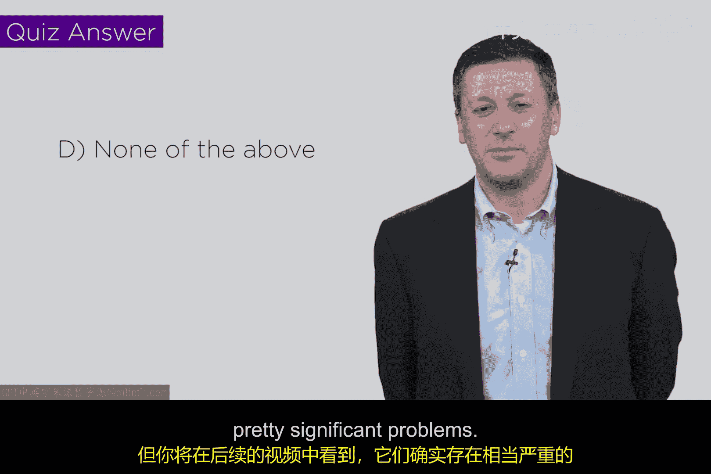

# 051：Biba完整性模型 🔐

在本节课中，我们将要学习Biba完整性模型。这个模型与之前介绍的Bell-LaPadula（BLP）保密性模型相对应，它关注的是如何在一个系统中维护信息的完整性。我们将探讨其核心规则、与BLP模型的对比，以及它在实际系统安全中的意义。

---

上一节我们介绍了Bell-LaPadula模型如何通过“不上读，不下写”的规则来保护信息保密性。本节中我们来看看Biba模型如何以类似但相反的逻辑来保护信息完整性。

Biba模型由Ken Biba提出。他思考的问题是：在一个系统中，如何像Bell和LaPadula保护保密性那样，来保护和维持信息的完整性属性。

他提出了一个与军事保密等级类似，但用于衡量完整性的等级体系。在这个体系中：
*   **高完整性**对象或主体：代表可信、未经篡改、内容准确。
*   **低完整性**对象或主体：代表可能包含错误、垃圾信息或恶意代码，不可信。

基于这个等级体系，Biba模型的核心规则是确保高完整性实体不被低完整性实体污染。以下是其两条核心安全公理：

1.  **简单完整性公理**：主体不能读取完整性级别低于它的客体（**不下读**）。这防止了高完整性进程（如系统内核）被低完整性数据（如不可信的应用程序数据）所污染。
2.  **完整性星号公理**：主体不能写入完整性级别高于它的客体（**不上写**）。这防止了低完整性进程（如用户应用程序）去修改高完整性数据（如系统关键文件）。

我们可以用简单的规则来总结Biba模型：**“不下读，不上写”**。这与Bell-LaPadula模型的 **“不上读，不下写”** 规则正好相反。

---

那么，如何在系统中实现这些规则呢？其核心思想与BLP模型类似，是为所有主体（用户、进程）和客体（文件、数据）分配完整性标签，并在每次访问操作时进行强制检查。

Biba模型在网络安全中有很好的实际意义。例如：
*   操作系统内核可以被标记为**高完整性**，而用户应用程序被标记为**较低完整性**。Biba规则能防止应用程序篡改内核，这有助于将病毒等威胁隔离在外。
*   以高权限（如root）运行的管理员进程（**高完整性**）应避免读取来源不可信的低完整性数据，以防被恶意代码利用。

---

然而，无论是Bell-LaPadula模型还是Biba模型，在实际应用中都存在一些显著的问题。过于严格的访问控制可能会影响系统的可用性和灵活性。在后续的视频中，我们将花一些时间探讨这些模型在实践中遇到的问题及其对安全建模的启示。

在进入下一部分之前，让我们通过一个简单的测验来检验对Biba和Bell-LaPadula模型的理解。题目是：以下哪些选项符合Biba模型的属性？根据Biba的“不下读，不上写”原则进行判断，你会发现所有给定的选项都违反了至少一条规则，因此没有一个是Biba可接受的。这有助于巩固你对这两个模型区别的理解。

---

本节课中我们一起学习了Biba完整性模型。我们了解到，它是Bell-LaPadula保密性模型的“镜像”，通过 **“不下读，不上写”** 的规则来保护系统免受低完整性信息的污染。这些模型的理论在多年间深刻影响了网络安全的设计思路，但我们也认识到它们并非完美。在接下来的课程中，我们将探讨这些经典模型面临的挑战。