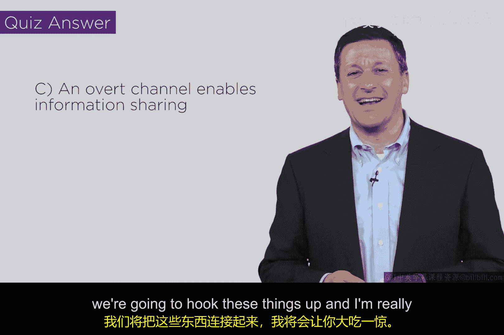

# 054：信息流模型与Hook Up定理（第一部分）

## 概述
在本节课中，我们将学习信息流模型中的一个核心概念——可推断安全性。我们将通过两个理论系统示例，理解如何通过引入“噪声”来关闭系统中的隐蔽信道，从而防止信息从用户A流向用户B。

---

## 公开信道与隐蔽信道
在之前的课程中，我们讨论了公开信道与隐蔽信道的区别。公开信道是预期的通信方式，而隐蔽信道则是一种共享的、可用于向他人传递信号的机制。

## 系统Y：一个简单的信号模型
现在，我们来看一个名为“系统Y”的理论模型。这个系统的工作原理如下：
*   左侧是用户A，右侧是用户B。
*   用户A向系统Y发送一系列消息。
*   在发送完这些消息后，系统会计算所发送消息的总数，并将总数的奇偶性（奇数或偶数）发送给用户B。

**工作原理示例**：
*   如果用户A发送了偶数条消息，系统就向用户B发送“偶数”。
*   如果用户A发送了奇数条消息，系统就向用户B发送“奇数”。

显然，用户A可以通过控制发送消息的数量（奇数或偶数）来向用户B传递信号，这就在两者之间建立了一个隐蔽信道。

## 系统Y‘：引入噪声以关闭信道
接下来，我们对系统Y进行修改，得到系统Y‘。关键的变化在于，系统本身现在会随机生成一些消息（在图中表示为a0）。

以下是系统Y‘的工作流程：
1.  用户A向系统发送消息。
2.  系统自身也会随机生成消息。
3.  用户B收到的奇偶性结果，是基于**用户A发送的消息**和**系统随机生成的消息**的总数来计算的。

**核心影响**：
由于系统引入了不可控的随机“噪声”，用户A无法再可靠地控制用户B最终看到的奇偶性结果。例如：
*   用户A想发送“偶数”信号，但系统随机生成了奇数条消息，导致总数为奇数，用户B看到“奇数”。
*   用户A想发送“奇数”信号，但系统也随机生成了奇数条消息，奇数加奇数等于偶数，用户B看到“偶数”。

在这种情况下，从A到B的隐蔽信道被成功关闭了。

## 可推断安全性的定义
系统Y‘所展现的这种属性，被称为**可推断安全性**。其定义是：在系统中，**用户A无法以任何方式向用户B传递信号**。这是信息流理论中的一个关键安全属性。

信息流理论关注的是**信息本身能否从一点流向另一点**，而不拘泥于具体的通信协议或路径（如TCP数据包如何传输）。我们认为这是一个更本质的安全模型。

显然，系统Y‘符合可推断安全性的定义。

## 系统Z：另一个安全示例
让我们看另一个例子——系统Z。这个系统的结构略有不同：
*   用户A完全无法向系统Z发送任何信号（即没有输入路径）。
*   系统的所有输入和输出都是随机产生的。
*   用户B只能看到这些随机事件的奇偶性。

由于用户A根本无法影响系统，因此系统Z显然也是可推断安全的。这进一步印证了我们的概念。

## 本节小结
本节课我们一起学习了信息流模型的基础。我们通过系统Y和系统Z两个例子，了解了如何通过设计（如引入随机噪声或切断输入路径）来实现“可推断安全性”，从而阻断潜在的隐蔽信道。这两个系统都展示了如何从信息流动的角度来思考和增强系统的安全性。

在下一节中，我们将把这些系统“连接”起来，探讨一个非常有趣的现象——Hook Up定理，它将揭示这些安全组件组合时可能发生的意外情况。