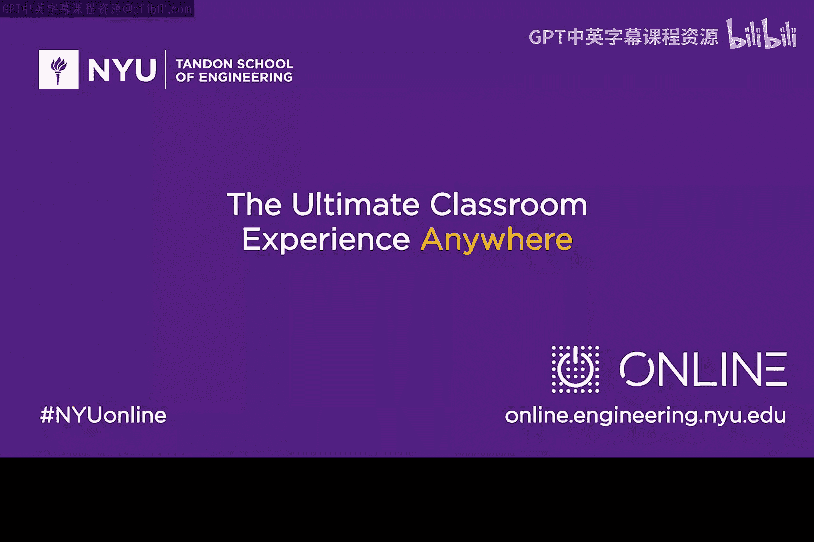

# 056：与Kirsten Bay的对话


## 概述
在本节课中，我们将跟随网络安全公司CyAdapt的总裁兼CEO Kirsten Bay，了解她独特的职业旅程、公司的核心技术理念以及她对行业新人的建议。我们将学习到网络安全领域如何融合多学科知识，以及一家创新型公司如何应对动态变化的威胁环境。

---

## 从文学到网络安全的跨界旅程 🧭

Kirsten Bay的背景并非典型的科技行业路径。她主修的是英语和德国文学，辅修德国语文学。她自己坦言，如果多年前有人告诉她未来会运营一家网络安全公司，她会认为这很疯狂。

然而，她将自己描述为一个“连续学习者”。这种对学习的热爱，以及之前在金融服务业和制造业的多样化商业经验，为她进入网络安全领域奠定了基础。大约12年前，她接触到一个关于数据损失经济计量学的项目，这让她看到了将商业策略、政策理解与新兴的网络安全风险问题相结合的巨大机会。她被这个需要解决复杂难题、且从业者都充满求知欲的领域深深吸引。

**核心驱动公式可以概括为：**
`对学习的热爱 + 跨领域商业经验 + 解决复杂问题的热情 = 进入网络安全领域的契机`

---

## CyAdapt公司的价值主张 🛡️

上一节我们了解了Kirsten进入行业的背景，本节中我们来看看她所领导的CyAdapt公司的核心理念。

CyAdapt的基本前提是**检测**。虽然网络流量分析是一个蓬勃发展的领域，但CyAdapt的独特之处在于其**以威胁为中心的方法**。这源于团队在威胁情报领域的背景。他们发现，尽管威胁情报数据本身很有价值，但客户很难快速地将这些数据整合到自身环境中并有效部署。

因此，CyAdapt看到了一个机会：将外部“野生”环境中的实时攻击数据，与客户内部网络数据相结合，从而回答客户最核心的问题——“这对我意味着什么？”以及“我需要多快解决这个问题？”

为了实现全面的可见性，CyAdapt还收购了一家移动安全公司。因为传统的网络流量分析依赖于内部网络可见性，而现代办公环境中，大量设备（如笔记本电脑、平板电脑、手机）都在公司网络之外（如家中、咖啡馆）使用。CyAdapt的目标是为这些离站设备提供与内部网络解决方案同等的可见性，实现内外网络的全数据包捕获，并结合威胁情报提供快速响应。

**公司的技术整合目标可以表示为以下代码逻辑：**
```python
# 伪代码：CyAdapt的可见性与响应逻辑
def provide_visibility_and_response():
    internal_traffic = capture_packets(on_premise_network) # 捕获内部网络流量
    external_traffic = capture_packets(off_premise_devices) # 捕获外部设备流量
    all_traffic = integrate(internal_traffic, external_traffic) # 整合内外流量
    threats = analyze_with_threat_intelligence(all_traffic) # 用威胁情报分析
    rapid_response = generate_response(threats) # 生成快速响应
    return rapid_response
```

---

## 运营科技公司的挑战与收获 ⚖️

在了解了公司的技术理念后，我们自然会好奇运营这样一家前沿公司是怎样的体验。Kirsten将其描述为充满挑战、困难，但也非常精彩。

对她而言，能够实现童年时“成为CEO”的梦想是激动人心的。但这也伴随着压力，尤其是在事情进展不如预期时，会产生自我怀疑。关键在于学会平衡内心的信念，在需要时屏蔽疑虑，专注于解决问题。

领导力中那些无形的部分同样重要：帮助团队成员实现潜能，让他们看到自己以及公司愿景的潜力，并共同致力于解决一个难题。Kirsten认为，这是她职业生涯中最好的礼物。

网络安全行业的动态性加剧了挑战。威胁不断演变，这使得制定战略方向和产品路线图变得异常困难。公司必须持续进行技术研发（如构建能存储两年元数据以关联事件的数据库），并让研究团队不断评估如何整合数据（用户行为分析、流量分析、情报产品等）。这是一个需要不断确定优先级、有时甚至会经历失败和重新尝试的持续过程。

---

## 对行业新人的建议 🔍

基于以上充满挑战与创新的环境，Kirsten分享了她在招聘年轻人时最看重的特质。

以下是她在面试中寻找的关键品质：
1.  **好奇心与求知欲**：这是最重要的驱动力。
2.  **坚韧与耐心**：愿意为解决难题尝试三到四次，能够接受过程中会碰壁，并有耐心据此进行调整。
3.  **理解差异化**：不仅理解网络分析或入侵指标等技术，还要对对手的动机和意图有好奇心，并思考如何将这些整合以更快地响应。同时，需要从宏观层面理解这些技术对政府或公司业务的影响，以及如何帮助客户确定处理风险的优先级。

---



## 总结
本节课中，我们一起学习了Kirsten Bay从人文学科跨界到网络安全领域的独特经历。我们了解了她的公司CyAdapt如何通过以威胁为中心的方法，整合内外网络的全流量可见性与威胁情报，为客户提供快速检测与响应。我们也看到了运营一家应对动态威胁的科技公司所面临的挑战与收获。最后，Kirsten为有志进入该领域的年轻人指出了**好奇心、坚韧和对业务影响的宏观理解**是成功的关键特质。网络安全不仅是一项技术工作，更是一个需要持续学习、跨学科思维并致力于解决复杂问题的领域。