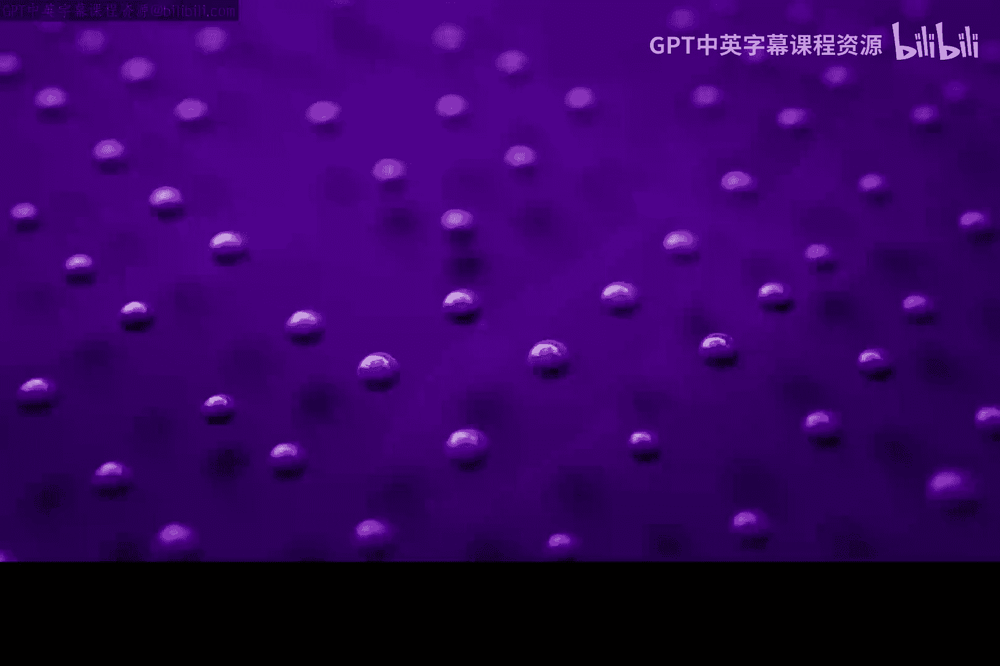
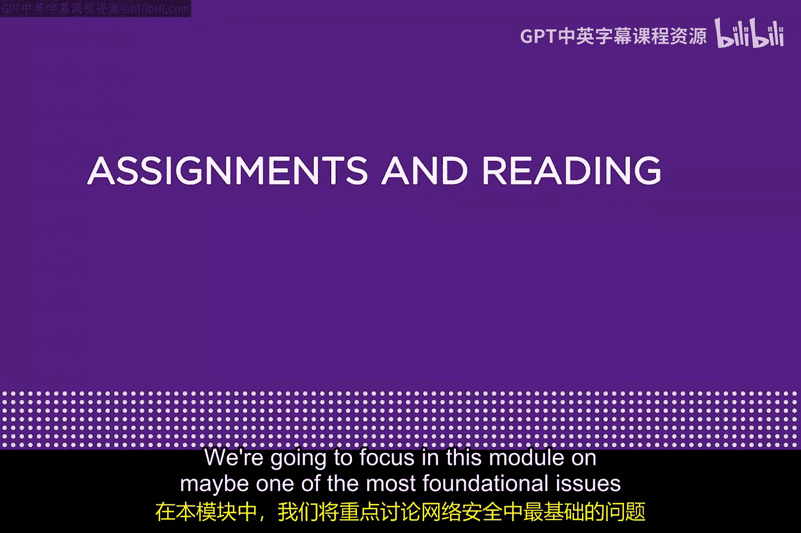
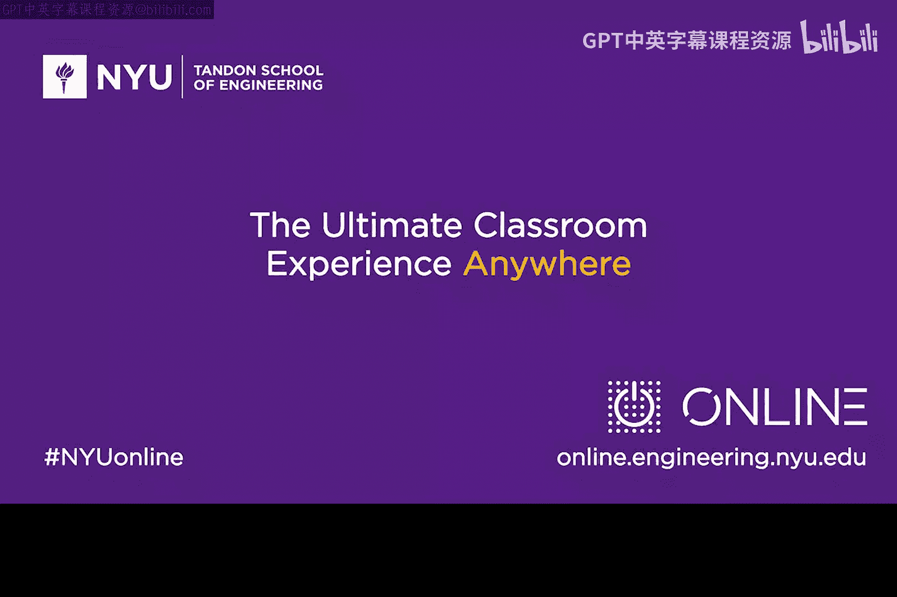

# 057：身份识别与认证 🔐

在本模块中，我们将聚焦于网络安全中最基础的问题之一：身份识别与认证。你将学习其核心概念、历史背景以及比单纯输入密码更优的现代方法。

大家好，我是Ammarosso。欢迎来到本模块。

我们将重点关注网络安全中最基础的问题之一：身份识别与认证。你每天在互联网上使用各种应用和服务时，都会进行十几次这样的操作：先提供用户身份，然后证明你没有撒谎，可能会用到密码或其他方式。我们将学习比单纯输入密码好得多的方法。

现在，有一些很好的资源，我认为你在学习本模块时应该加以利用。包括一些论文、可选书籍和一些视频。我会向你介绍它们。

以下是几篇推荐的论文。我在这里挑选了两篇非常古老的论文。我强烈主张回顾历史，那些能帮助我们理解当前工作的历史文献。所以，这两篇1973年的论文，一篇来自Saltzer和Schroeder，名为《计算机系统中的信息保护》。这是一篇老论文，但我认为你需要看一看。我们在网络安全领域，甚至在整个计算机科学领域，都花太少时间去回顾历史了。第二篇来自伟大的先驱之一Butler Lampson，他写了一篇名为《关于限制问题的说明》的论文。这是一篇非常重要的论文，它某种程度上预测了当今虚拟基础设施中使用的许多技术。请看看这两篇老论文。

以下是两本可选书籍。一本是可选的电子书，你可以在亚马逊上找到，由我和我的儿子Matt合著。书名为《从CIA到APT：网络安全入门》。在某种意义上，它是本模块和本课程的配套电子书。如果你喜欢边学边读点什么，可以下载这本书，但它是可选的。另一本可选书籍是关于TCP/IP的非常好的书。我认为Stevens写的书是最好的之一，有他与合著者共同完成的版本。你只需要找一本好的TCP/IP书籍。如果你要学习第11和12章，Stevens的书会是你在学习本模块时很好的参考资料。

以下是一些推荐的视频。有一个Chris Domas做的很棒的TED演讲，名为《网络战中的0与1》。这个标题有点挑衅性，但内容非常好。还有一篇Ron Rivest关于密码学发展的论文。如果你听说过RSA，Ron Rivest就是RSA中的“R”。他非常了不起，是网络安全领域的瑰宝之一。你应该确保观看Ron Rivest的一个视频。

我希望你在学习本模块时能利用这些资源，并希望你能学到很多东西。非常感谢。

---

**本节课中我们一起学习了**：身份识别与认证这一网络安全基石的重要性，回顾了相关的经典历史文献（如Saltzer和Schroeder、Lampson的论文），并获得了进一步学习的资源指引，包括可选书籍和推荐视频，为深入理解后续内容奠定了基础。