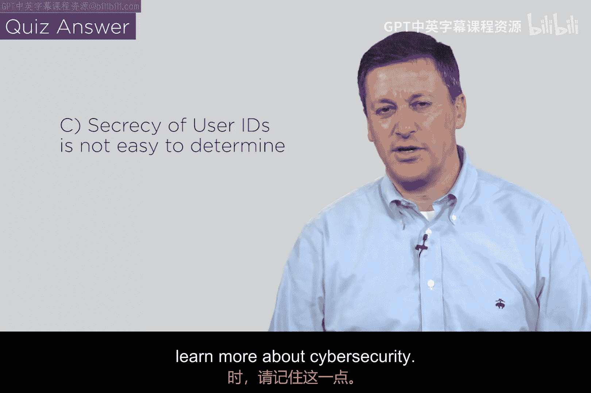
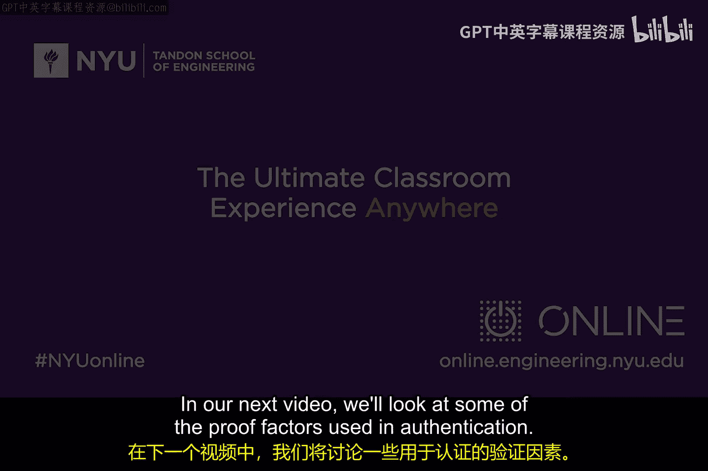

# 058：识别与认证 🔐

在本节课中，我们将学习网络安全中最核心的基础概念之一：认证。我们将探讨什么是身份识别，以及如何验证一个报告的身份是真实可信的。

---

## 识别：我是谁？

在开始讨论认证之前，我们首先需要理解身份识别。在日常生活中，我们如何向他人证明自己是谁？

例如，当我遇见你时，我可以说“你好，我是Ed”。你通过观察我的面容、聆听我的声音以及我们相遇的上下文环境，来识别我的身份。这个过程相对直观。

然而，一个关键问题是：我的名字、邮箱地址或电话号码是**秘密**吗？答案并不绝对。你的电话号码可能印在名片上，因此并非完全保密；但在某些情境下，你又不希望它被陌生人获取。同样，在计算机系统中，用户名（User ID）也面临类似的困境。虽然它本身可能不是密码，但攻击者如果知道了你的用户名，就可以尝试进行暴力破解，甚至通过多次错误尝试将你的账户锁定。因此，用户名是否应该保密，在网络安全领域是一个开放性问题。

## 认证：如何证明你是你？

上一节我们介绍了身份识别，本节中我们来看看如何验证这个身份的真实性。这就是**认证**。

认证的定义是：**验证一个报告身份的过程**。当爱丽丝（Alice）声称自己是爱丽丝时，鲍勃（Bob）需要采取一些步骤来验证这个声明的真实性。

在人类交流中，我们可以通过面容、声音或提出挑战性问题（例如“我们上次见面聊了什么？”）来验证身份。但在数字世界中，双方可能隔着一堵“墙”（网络），无法直接使用这些生物特征。这时，我们就需要设计更严谨的认证协议。

## 认证的方向：谁验证谁？

在数字通信中，认证可以有不同的方向。以下是几种主要类型：

*   **客户端认证**：服务器要求客户端证明其身份。例如，你登录网站时，网站服务器会要求你输入密码。
*   **服务器认证**：客户端要求服务器证明其身份。例如，在进行网上银行交易前，你的浏览器需要确认访问的确实是银行的真实服务器，而不是一个仿冒网站。
*   **对等认证与相互认证**：在点对点通信中，双方互相验证身份。例如，在某些移动通信协议（如4G/5G）中，手机和基站会进行双向认证，以确保连接双方都是可信的。

## 核心概念小测验

为了确保我们理解了基本概念，请看以下哪个选项最好地描述了用户ID的隐私和保密性？

A. 用户ID必须始终是最高机密。
B. 用户ID完全不需要保密。
C. 用户ID的保密性取决于具体情境，并非总是黑白分明。

**答案：C**

这个答案反映了网络安全中的一个常见现实：许多事情并非绝对，其重要性和处理方式往往由**上下文**决定。这种不确定性在安全领域是正常的。

---

## 总结

本节课中我们一起学习了网络安全的基础——识别与认证。我们明确了身份识别是声明“我是谁”，而认证是验证“你真的是你”的过程。我们还了解了认证的不同方向：客户端认证、服务器认证和相互认证。最后，我们认识到像用户名这类标识符的保密性是一个需要根据具体场景权衡的问题。

在接下来的视频中，我们将深入探讨用于实现认证的各种**验证因素**。