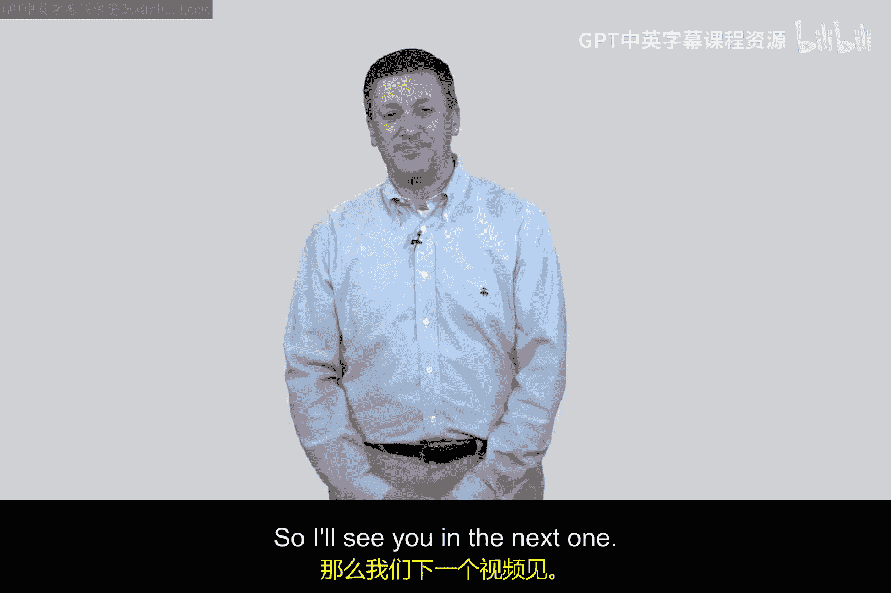

# 060：认证协议架构与区域 🔐

在本节课中，我们将学习认证协议的基本架构。认证是验证用户身份的过程，我们将通过爱丽丝（客户端）和鲍勃（服务器）之间的交互来理解其核心步骤。课程还将分析攻击者夏娃可能从哪些区域发起攻击，以破坏这个认证过程。

## 认证协议的基本步骤

上一节我们介绍了认证的基本概念，本节中我们来看看认证协议的具体交互流程。一个典型的认证过程包含六个核心步骤。

**步骤一：身份声明**
在每次认证中，第一步都涉及爱丽丝向鲍勃报告一个身份。这被称为身份声明步骤。通常，这就像是说“你好鲍勃，我是爱丽丝”。声明的内容可能是一个用户ID、电子邮件或手机号码等。我们之前讨论过，这个标识符是否是秘密的取决于具体情境。它可能是秘密的，也可能不是，但通常不是。

**步骤二：质询**
在第二步，鲍勃会向爱丽丝返回一个质询。这是一个挑战步骤，鲍勃会说：“好的，请证明你的身份。你说你是爱丽丝，我需要验证这一点，请提供一些证据。”这个质询步骤是整个认证概念的基础，因为这就是我们在做的事情——要求对方进行验证。

**步骤三：计算**
第三步有些特别。我们不会在第三步直接提供答案，而是称之为计算步骤。在此步骤中，你实际上是在创建、推导或执行某些操作来建立证明。这可能简单到只是在大脑中查找你的密码，也可能更复杂，比如需要解决某个谜题或执行某个运算。你受到了挑战，现在正在计算响应。同样，这可能简单到只是查找密码。

**步骤四：响应**
第四步是响应步骤。爱丽丝在此向鲍勃提供证明。爱丽丝对鲍勃说：“你要求我证明，我通过计算找到了答案，现在我将它提供给你。”步骤二和步骤四有着特殊的关系，因为这是一个质询与响应的过程。很多时候，我们将认证称为一种质询-响应活动，这体现了这两个步骤的基础性质。

**步骤五：验证**
第五步是验证步骤。鲍勃将检查爱丽丝提供的证明。鲍勃会判断：“这个证明有效吗？它合理吗？还是不合理？你给了我什么？”

**步骤六：通知**
最后，在第六步，鲍勃将告知爱丽丝她是否通过验证，即鲍勃相信或不相信她的身份。这个验证步骤有些微妙，因为鲍勃需要查看、检查某些东西，核对你的质询响应，以判断你是否做对了，然后在第六步通知你。

所有的认证都遵循这个基本框架。多因素认证可能会多次执行这个过程。但这是认证工作原理的骨架视图。对于学习认证和网络安全的学生来说，在脑海中拥有这个基本框架，并思考单因素认证及其他方式如何具体实现它，是非常重要的。不过，大部分情况下，我们将使用单因素认证，并且许多例子也会使用单因素来演示这个过程。

## 攻击区域分析

上一节我们梳理了认证的六个步骤，本节中我们来看看攻击者可能从哪些位置破坏这个流程。在图表中，我们绘制了一个旁观者，我们称她为夏娃，代表窃听者。在密码学和网络安全中，通常用夏娃来代表坏人（Eve 取自 Eavesdropper，即窃听者）。

夏娃可以尝试在三个地方破坏这个认证方案。破坏方案意味着说谎或欺骗。例如，如果我能让鲍勃相信我是爱丽丝，而实际上我并不是，那么我就欺骗了系统，成功地撒了谎，破坏了认证过程。这就是对此的攻击。

以下是夏娃可能发起攻击的三个主要区域：

1.  **区域一：客户端**
    夏娃能否在客户端（即爱丽丝这一侧）进行攻击？我们倾向于将客户端、网络和服务器视为这个过程中的不同区域。在图表中，我们将它们标记为区域1、2和3。在区域1，夏娃能做什么来破坏认证？她可以窃取证明。假设爱丽丝使用她的手机作为认证方式，如果我偷了你的手机，我就可以冒充你。因此，许多成功的真实认证攻击都涉及客户端区域。

2.  **区域二：网络**
    夏娃能否在协议上下文中读取信息？她能否收集、读取正在传输的信息，并以此作为攻击的基础？这当然是一种可能性。

3.  **区域三：服务器**
    夏娃能否查看服务器？她能否在服务器端做些什么，例如读取或重新计算证明，或进行某种攻击？

你会发现，在认证中，在区域1和区域3进行攻击往往比在网络区域更容易。因为我们在认证中将使用一种称为密码学的技术，而这种密码学技术是专门设计来增加夏娃在网络中收集信息以冒充爱丽丝身份（当她向鲍勃验证其声明的身份时）的难度。

这个概念听起来有些复杂，但当我们深入学习时，你会明白。有些协议非常脆弱，比如密码认证几乎是个笑话。但随着我们进入更多基于密码学的实现，它们会变得非常有趣且强大。有些协议对于黑客来说极难欺骗，无论是在区域1、2还是3，都非常强大。但这并不意味着它们总是易于使用或成本低廉，但它们确实非常强大。

在后续的视频中，我们将以密码为例，深入探讨这个认证框架。我们下节课再见。