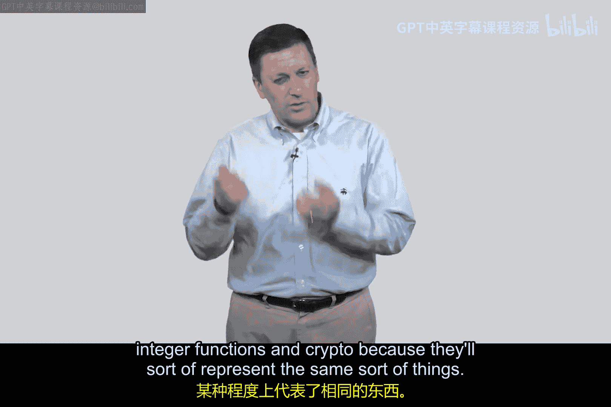
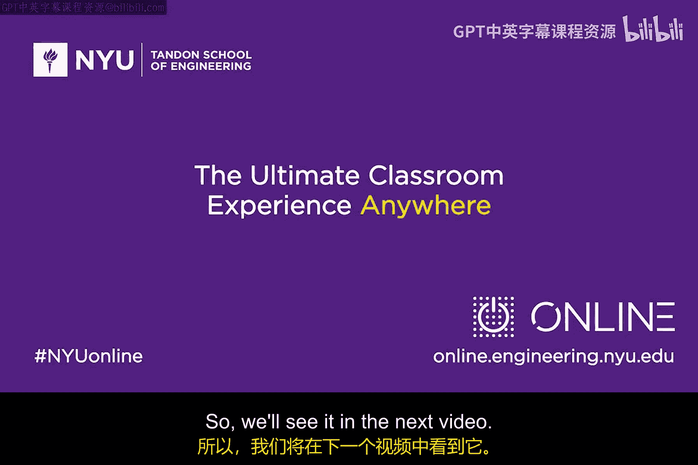

# 062：实现 🧮


在本节课中，我们将要学习一种被称为“手持认证协议”的身份验证方法。我们将探讨其工作原理，并思考它在实际商业应用中的潜力与挑战。

上一节我们介绍了身份验证的基本概念，本节中我们来看看一个具体的协议实现。

## 协议背景与商业思考

在深入讲解手持认证协议之前，有必要先讨论一下网络安全领域的商业现实。预测一项技术、方案或协议能否在市场上取得成功并盈利是非常困难的。许多学习网络安全基础知识的人，同时也花费大量时间思考商业、创业以及如何盈利等问题。

本视频将要展示的这个协议，**没有赚到任何钱**。我认为这是一个相当不错的协议，但至今仍不清楚人们为何不接受它。在了解其机制后，你可以思考它是否本应获得成功或被广泛使用。

## 协议核心机制

该协议涉及一个类似计算器的设备。用户需要从该设备上读取一个数字，输入到某个地方，然后根据响应再输入另一个数字。你可能会觉得随身携带一个物理计算器很麻烦。

但请思考一下：如今所有的计算器本质上都是软件定义的。你最后一次购买实体计算器是什么时候？很可能你不再需要，因为你的手机、电脑上都有计算器应用。硬件已经软件化、虚拟化，这是计算技术发展的大方向。

## 协议流程详解

让我们来具体看看这个协议。假设爱丽丝（Alice）和鲍勃（Bob）需要进行通信，爱丽丝的客户端需要向鲍勃证明自己的身份。

以下是协议的核心步骤：

1.  **预共享秘密**：爱丽丝和鲍勃事先约定，爱丽丝将携带一个内置了特定函数 **`F`** 的小型计算设备。每个用户的设备都有一个独一无二的函数 **`F`**（可以理解为使用不同的加密密钥实现的相同算法，但目前我们只需将其视为不同的函数）。
2.  **发起认证**：爱丽丝向鲍勃声明：“我是爱丽丝”。
3.  **发起挑战**：鲍勃回应：“请证明”。然后，鲍勃生成一个随机数 **`λ`**（例如 237）发送给爱丽丝。
4.  **计算响应**：爱丽丝在她的设备上输入 **`λ`**（237）。设备计算 **`F(λ)`**，得出结果（例如 881）。
5.  **返回响应**：爱丽丝将计算结果（881）发送回鲍勃。
6.  **验证身份**：鲍勃自己也拥有爱丽丝的函数 **`F`**。他使用收到的 **`λ`**（237）计算 **`F(λ)`**，得到预期结果（881）。然后，他将自己计算的结果与爱丽丝返回的结果进行比对。
7.  **认证结果**：如果两者匹配，则认证成功；否则，失败。

这个流程可以用以下伪代码概括：
```python
# 爱丽丝端
challenge = receive_from_bob() # 例如 237
response = handheld_device.compute_F(challenge) # 例如 881
send_to_bob(response)

# 鲍勃端
expected_response = known_function_F(challenge) # 计算 F(237)
if received_response == expected_response:
    authentication_successful()
else:
    authentication_failed()
```

## 协议评价与思考

这个协议听起来相当不错，对吧？那么，为什么我们没有广泛使用它呢？

一个可能的原因是，在该协议被发明时，随身携带一个物理计算器设备显得有些不方便。然而，正如之前讨论的，在当今软件定义一切的时代，这个障碍本应被消除。

对于网络安全领域的创业者和从业者而言，判断一项技术方案能否盈利是一个极其复杂的问题。目前网络安全产业充满活力，有众多有趣的初创公司。你们中的许多人可能正在或梦想在初创公司工作，甚至创立自己的公司。你们所采用的技术方案能否成功，是一个巨大的未知数。

## 过渡到下一部分

这个协议是我们学习的起点。在接下来的视频中，我们将深入分析这个协议的一些特性，并揭示一个非常有趣的现象。这个现象或许能为我们提供线索，解释为什么这个密码学协议没有被更多人采用。

在此上下文中，函数 **`F`** 的作用类似于加密：**`λ`** 是明文，**`F(λ)`** 是密文。因此，我们将逐渐熟悉这种在整数函数和密码学概念之间来回切换的思考方式，因为它们本质上代表了相似的东西。





本节课中我们一起学习了一种基于手持设备的认证协议，了解了其工作流程，并对其商业应用前景进行了初步探讨。我们看到了一个技术上看似可行但未被市场广泛接受的案例，这引出了关于技术、产品与市场契合度的深刻思考。在下一节，我们将深入分析该协议的安全属性。