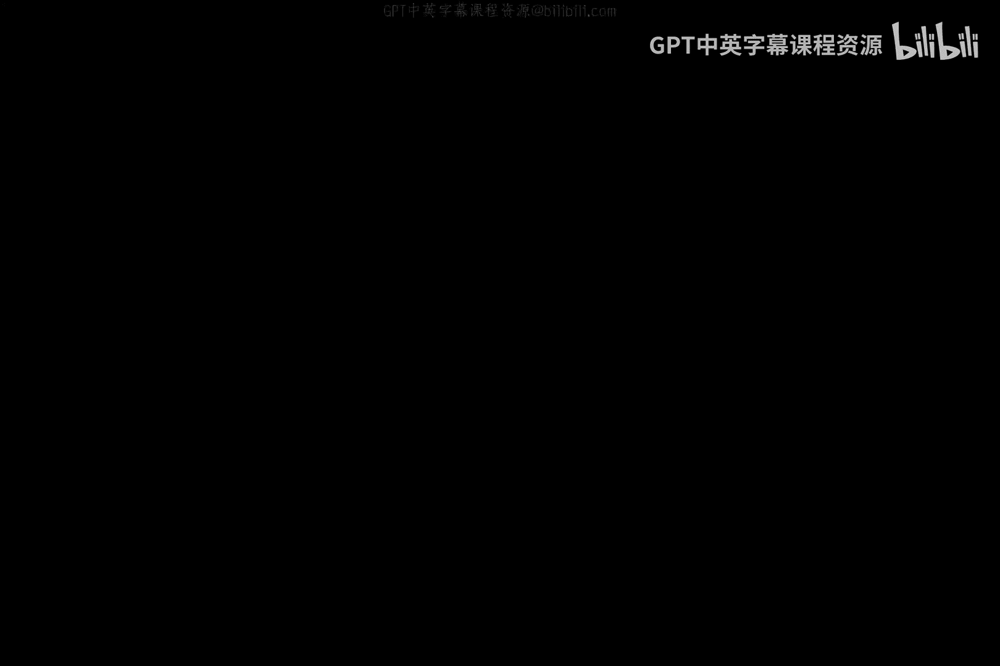
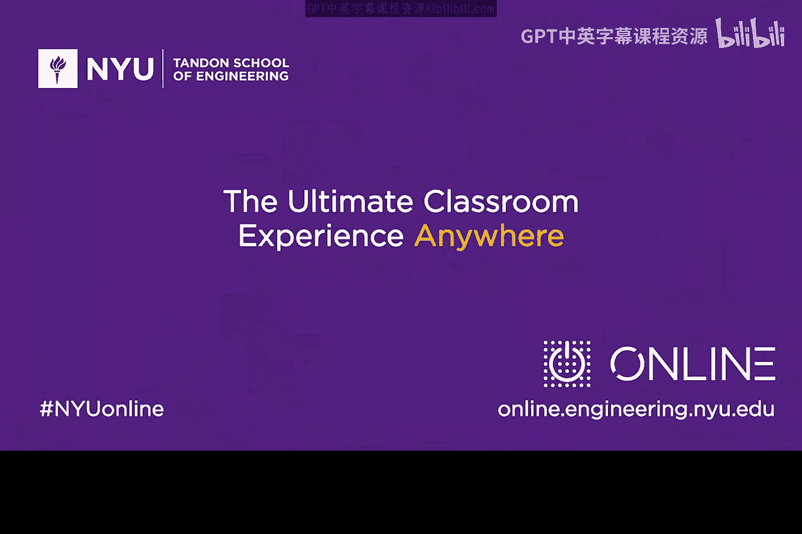

# 064：专访Lior Frenkel 🎙️

在本节课中，我们将跟随纽约大学的Ed Ammarosso，一起了解他的朋友、Waterfall Security公司的创始人兼CEO——Lior Frenkel的故事。我们将探讨他如何进入科技与安全领域，以及他的公司如何解决工业网络安全的关键问题。

---

## 从兴趣到事业：Lior的科技之路

上一节我们介绍了本期的嘉宾。本节中，我们来看看Lior Frenkel是如何对科技产生兴趣并最终投身网络安全领域的。

Lior Frenkel来自以色列。他形容自己的经历是一个经典的故事。他在8岁时接触到了第一台电脑，尽管那原本是他哥哥的。从那天起，他就坐在电脑前，再也没有离开过。

在那个时代的以色列，学校并不教授编程，甚至没有计算机实验室。因此，Lior通过书籍和不断的试错来自学编程。他回忆说，自己会通宵达旦地编写和尝试代码，以至于第二天在学校里努力保持清醒。这种热情源于编写代码，尤其是底层代码时，对结果拥有的惊人控制力。这种能够创造并让想法真正实现的感觉，一旦获得，就会让人欲罢不能。

关于如何对网络安全产生兴趣，Lior认为，有些人喜欢操作和使用事物，而另一些人则喜欢拆解事物以了解其构造。他自认为属于后者。从拆解事物到网络安全、黑客技术，这是一个自然而然的过程。他认为，**理解计算机底层工作原理**和**尝试将事物分解成更小的部分**，是学习如何优化操作的最佳途径。

---

## Waterfall Security：守护工业网络

上一节我们了解了Lior的个人历程。本节中，我们来深入了解他创立的公司及其使命。

Waterfall Security Solutions公司成立于2007年，总部位于以色列，业务遍布全球，并在美国华盛顿特区设有全资子公司。公司的创立使命是为了更好地保护工业站点和控制物理过程的网络，使其免受外部世界的威胁。

公司认识到，通常有充分的需求需要从远程站点发送数据。然而，人们绝不希望将发电厂的涡轮机或制药厂的生产站点直接连接到互联网上。Waterfall Security正是为了解决这个问题而存在。

作为一家技术公司，他们拥有多项尖端技术。其旗舰技术被称为**单向安全网关**。这项技术目前已部署在全球数百个关键站点，如核电站、海上平台、供水系统以及常规制造工厂等。它实现了工业侧、业务侧与互联网之间的连接与集成，同时确保了控制网络的安全。

“单向”这个词容易让人联想到数据二极管。Lior指出，这个称呼过于简化了其技术的功能。公司取名“Waterfall”（瀑布），是因为瀑布中的水只能朝一个方向流动，这形象地比喻了其技术原理：它在外部世界（下游）和内部控制网络（上游）之间建立了一道物理屏障。数据只能像水流一样，从控制网络（上游）单向流向外部（下游），而无法逆流而上。

---

## 应对挑战：协议与招聘

上一节我们介绍了公司的核心技术。本节中，我们来看看他们面临的技术与人才挑战。

工业环境中存在大量非标准的协议和遗留技术，这无疑是一个巨大的挑战。Waterfall Security投入了数百人年的研发精力来应对。他们深入学习这些协议和系统，构建正确的接口并进行验证。在许多情况下，他们会与产品供应商合作，确保从两端都能提供支持。确保能够连接到所有现有系统及其变体，甚至是专有系统，是公司业务的重要组成部分，尽管这十分棘手。

对于许多正在准备第一份工作或梦想进入网络安全公司的学习者，Lior分享了Waterfall的招聘哲学。他们招聘时更看重人的素质，而非仅仅填补某个职位。他们寻找具有高度诚信、成功驱动力以及在困难面前不轻言放弃的人。然后，他们会根据应聘者的经验或意愿，将其安排到合适的现有岗位上。

在Waterfall，员工的发展路径是多元的。许多初创时期的员工已工作六七年，这在初创公司中并不常见。公司鼓励内部成长，例如有员工从研发转岗，有人从市场营销转向业务开发，也有人从质量保证晋升到运营和客户接口的高级职位。这种模式与美国许多公司的做法有所不同。

---

## 总结

本节课中，我们一起学习了Lior Frenkel从编程爱好者到网络安全公司创始人的历程。我们了解到他的公司Waterfall Security如何利用**单向安全网关**等核心技术，为工业控制网络建立物理安全屏障。同时，我们也看到了应对工业环境复杂协议所需的巨大投入，以及一家成功公司所看重的员工品质：诚信、驱动力和韧性。