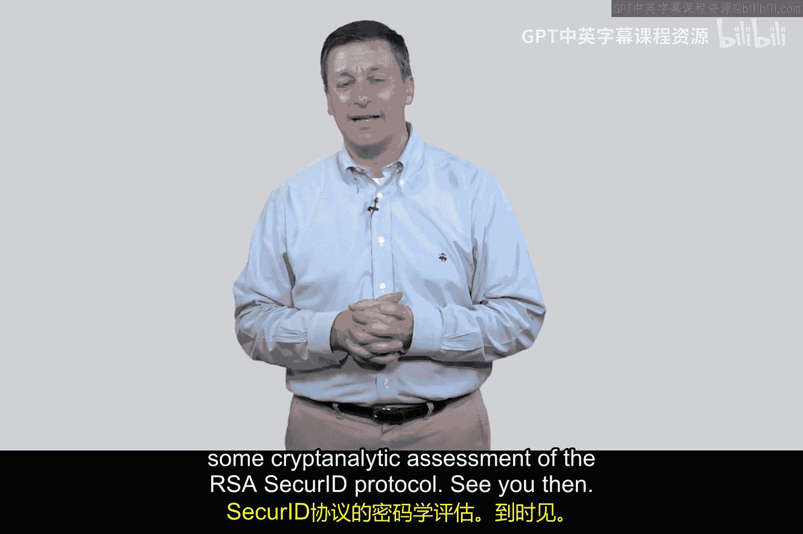

# 065：实现 🔐

在本节课中，我们将要学习一个在实际应用中取得了巨大成功的身份认证协议——RSA公司的SecureID协议。我们将了解它的工作原理、核心组件以及它如何通过一个物理或虚拟的令牌设备来实现安全的身份验证。

## 协议概述

RSA SecureID是一种广泛部署的身份认证协议。它并非指RSA加密算法，而是由RSA公司（以Ron Rivest、Adi Shamir和Leonard Adleman三位密码学家命名）推出的一款产品。该协议的核心是一个被称为“令牌”的小设备，它可以是物理的（如挂在钥匙链上），也可以是虚拟的（如手机应用或工具栏插件）。

## 协议工作原理

上一节我们介绍了协议的基本概念，本节中我们来看看它的具体工作流程。该协议依赖于服务器和用户持有的令牌之间共享的秘密和同步的时间。

### 核心组件与初始化

在协议开始前，需要进行以下初始化步骤：

以下是协议初始化时涉及的三个核心要素：
1.  **共享种子值（λ）**：一个随机生成的秘密数字。服务器将其存储在数据库中，同时也预先植入到发放给用户的令牌中。公式表示为：`λ = RandomInteger()`。
2.  **加密函数（F）**：一个确定的加密函数。服务器和令牌都知晓并使用同一个函数 `F`。
3.  **同步时钟**：服务器和令牌内部都维护着一个同步的时钟，将时间划分为固定的间隔（例如每15秒一个周期）。

### 认证过程

当用户（例如Alice）尝试登录时，认证过程按以下步骤进行：

以下是身份验证的具体步骤列表：
1.  **声明身份**：用户向服务器声明“我是Alice”。
2.  **挑战请求**：服务器回应“请证明你的身份”。
3.  **生成动态码**：用户查看自己的SecureID令牌。令牌会根据当前的时间周期数 `n`，使用共享种子值 `λ` 和函数 `F` 计算出一个一次性密码。计算过程可以表示为：`Code = F^n(λ)`，其中 `n` 代表从初始时间 `T_initial` 开始已经过去了多少个时间周期。
4.  **提交验证**：用户将这个动态码输入系统并发送给服务器。
5.  **服务器验证**：与此同时，服务器也使用数据库中存储的Alice的 `λ` 值和相同的函数 `F`，基于同步的时钟计算当前周期应有的动态码 `F^n(λ)`。
6.  **结果判定**：服务器比较自己计算出的码和用户提交的码。如果两者匹配，则认证成功；否则，认证失败。

### 时间同步与用户体验

协议的成功极度依赖于时钟同步。令牌通常会有一个视觉指示器（如逐渐消失的进度条），来显示当前动态码的有效期剩余时间。有经验的用户会在动态码刚刷新时使用它，以避免因微小的时钟漂移而落在两个周期的边缘导致验证失败。

## 总结

本节课中我们一起学习了RSA SecureID协议的基本实现。我们了解到，它通过“共享种子λ + 加密函数F + 同步时钟”这个组合，让服务器和用户令牌能够独立生成相同的、随时间变化的一次性密码，从而实现了强身份认证。该协议因其设计简单、易于使用而得到了数十亿次的部署，取得了巨大的商业成功。在下一节课中，我们将对RSA SecureID协议进行密码学分析，并探讨它相较于其他认证协议可能更具优势的原因。