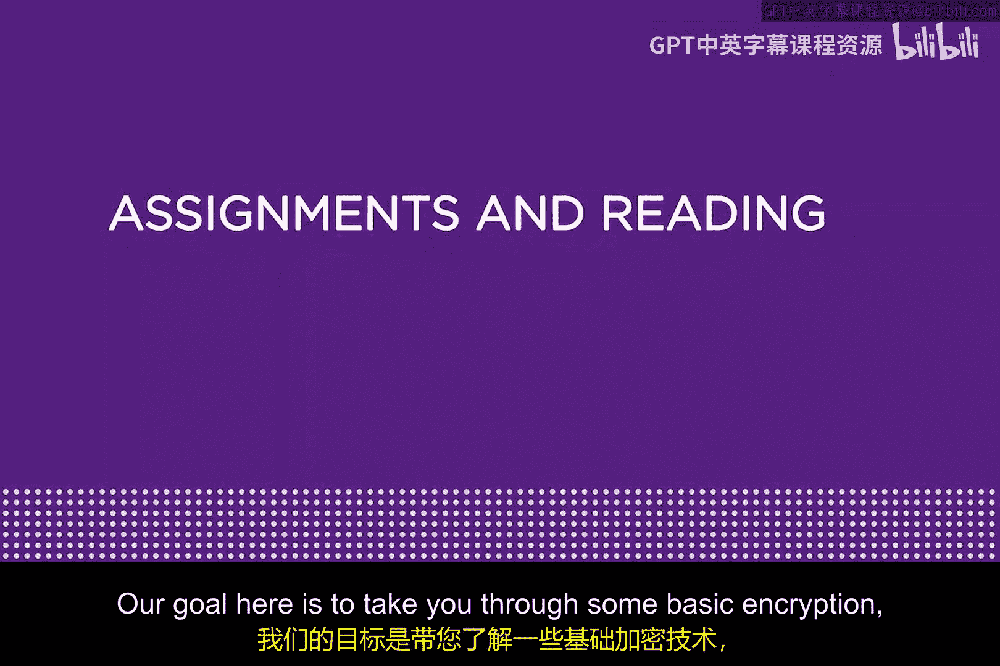
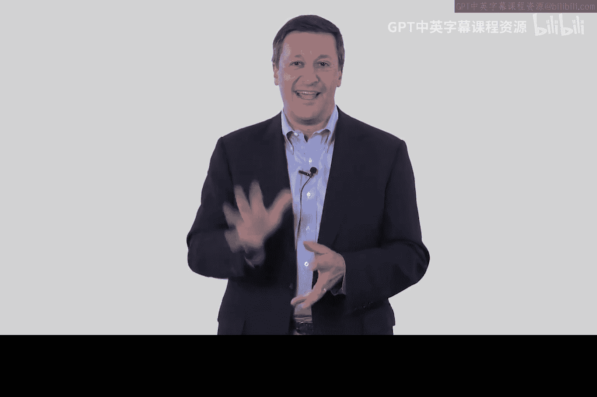
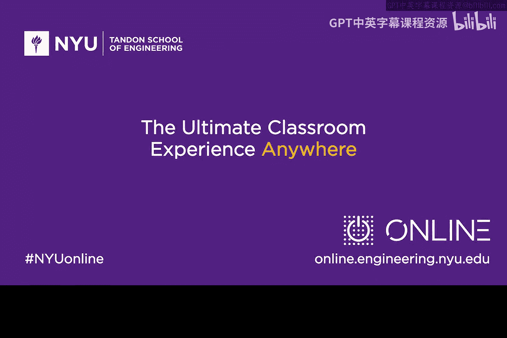

# 067：作业与阅读 📚

在本模块中，我们将学习基础的加密技术与密码学，并深入了解Kerberos协议。这是一种基于密码学的出色方案，能够将密码从网络中移除。为了辅助你的学习，本教程将介绍一些推荐的阅读材料和视频资源。

## 推荐阅读与学习材料

以下是本模块的补充学习材料，包括一篇专利、两本可选书籍和一个视频访谈。

### 专利阅读

首先，我推荐大家阅读一篇专利。虽然专利文件通常包含大量法律术语，阅读体验可能不佳，但尝试阅读专利本身是一次宝贵的经历。这篇专利的标题是：

**《数据加密标准的降低计算量实现方法》**

请尽力阅读它。你可能会发现其中一些内容看起来不直接相关，但请尽量理解其核心思想。未来你很可能需要撰写或阅读专利，因此这是一次很好的练习。

### 可选参考书籍

接下来是两本可选的参考书籍，它们可以作为本模块学习的有效资源。

1.  **《从CIA到APT》**
    这是一本我与儿子Matt合著的电子书，你可以在亚马逊上找到。本书的第13章和第14章在某种程度上与本模块的内容相辅相成。虽然它是可选资料，但可能对你的学习有所帮助，是一本有用的配套读物。

2.  **《TCP/IP详解 卷1：协议》**
    作者Richard Stevens的这本书是学习TCP/IP协议的经典之作，对于网络安全领域的任何工作都大有裨益。我建议你重点阅读该书的第13章和第14章，相信它们会助你更好地理解本模块的知识。

### 推荐观看视频

最后，有一个视频访谈推荐给大家。视频采访的是我在思科系统公司工作多年的好友John Stewart。这个访谈于2013年在RSA安全大会上录制，题为“与John Stewart探讨网络安全”。我希望你能通过这个视频感受John的智慧、幽默与渊博知识，相信你会喜欢它。

---

希望你能享受整个模块的学习过程，并充分利用这些优质的学习资源。祝你学习愉快！