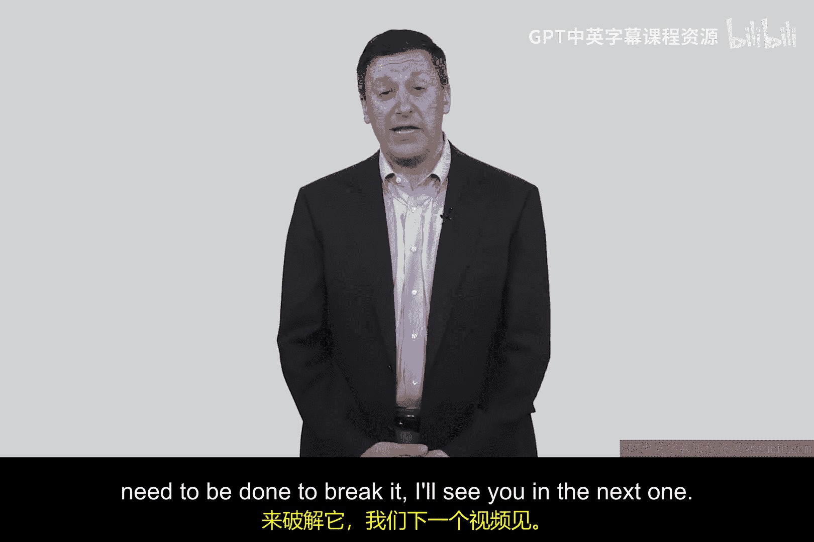
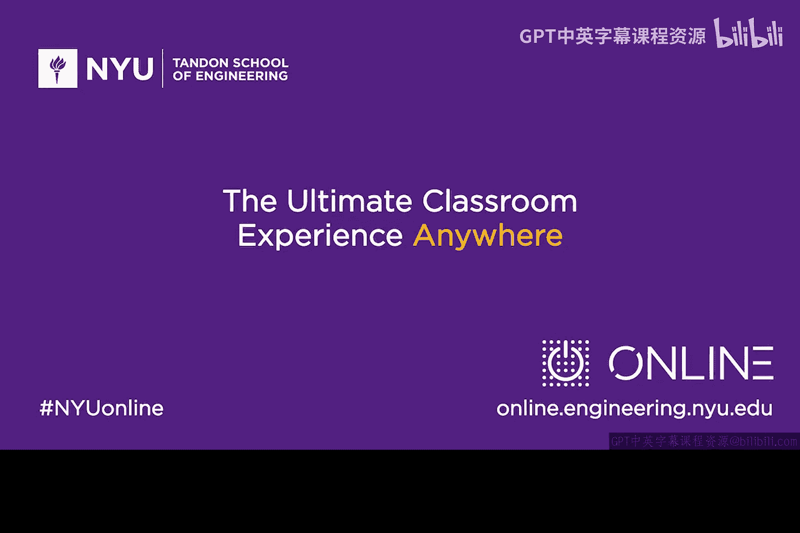

# 068：实现 🔑

## 概述
在本节课中，我们将要学习一个由著名计算机科学家Leslie Lamport提出的、非常有趣的认证协议——S/Key协议。我们将了解其核心工作原理、实现步骤，并探讨其独特的设计思想。

---

## 协议背景与核心思想

在20世纪80年代，Leslie Lamport发表了一篇仅有三页的简短论文，描述了一种认证方案。这个方案的核心思想非常巧妙，旨在让客户端（Alice）向服务器（Bob）证明自己的身份。

其核心机制基于一个**种子值**和一个**加密函数**。服务器并不存储原始的密码或种子，而是存储该种子被加密了N次后的结果。这是一种“一次性”递减的认证方式。

---

## 协议工作原理详解

上一节我们介绍了协议的基本概念，本节中我们来看看其具体的工作步骤。整个过程可以分为初始设置和循环认证两个阶段。

### 初始设置阶段
在系统初始化时，服务器和客户端需要共同确定一些参数。

以下是初始设置的具体步骤：
1.  选择一个随机数作为种子（Seed），记作 **λ**。
2.  确定一个较大的整数 **N**（例如10000），作为认证总次数。
3.  选择一个加密函数，记作 **F**。
4.  服务器计算 **F^N(λ)**，即对种子λ连续加密N次。
5.  服务器保存加密函数 **F** 和最终的计算结果 **F^N(λ)**。客户端则保存种子 **λ**、次数 **N** 和加密函数 **F**。

此时，服务器的存储状态可以表示为：`存储 = (F, F^N(λ))`

### 认证过程（第1轮）
当客户端Alice第一次需要向服务器Bob认证时，遵循以下流程。

以下是第一次认证的步骤：
1.  服务器向客户端发起挑战，要求证明身份。
2.  客户端计算 **F^(N-1)(λ)**，即对种子加密（N-1）次。
3.  客户端将 **F^(N-1)(λ)** 发送给服务器。
4.  服务器收到后，利用自己存储的加密函数 **F** 对其再加密一次，得到 **F( F^(N-1)(λ) )**，即 **F^N(λ)**。
5.  服务器将计算得到的 **F^N(λ)** 与自己存储的 **F^N(λ)** 进行比较。
6.  如果两者匹配，认证成功，服务器回应“Hello, Alice”。
7.  认证成功后，服务器**丢弃**旧的 **F^N(λ)**，转而存储本次收到的 **F^(N-1)(λ)**。同时，客户端也将N的值减1。

### 认证过程（后续轮次）
理解了第一轮认证后，后续的流程就变得清晰了。每一次成功的认证都会使计数器递减。

以下是后续认证的步骤：
1.  下一次认证时，服务器存储的值已更新为 **F^(N-1)(λ)**。
2.  客户端计算并发送 **F^(N-2)(λ)**。
3.  服务器收到后，加密一次得到 **F^(N-1)(λ)**，与存储值比对。
4.  匹配成功后，服务器更新存储为 **F^(N-2)(λ)**。
5.  此过程循环，直到N递减至0。

---

## 协议特点与思考

这个协议的设计非常精妙，它避免了在服务器端存储明文密码或可重复使用的密钥，从而提升了安全性。然而，它也有一个显著特点：认证次数是有限的。

你可能会问，如果N次用完了怎么办？例如，设N=10000，每天认证两次，大约可以使用13年。这在实际系统中是合理的。即使次数用尽，也只需重新执行一次初始设置流程即可“重置”系统。

尽管这个协议非常有趣，但它在实际中并未被广泛采用。一个有趣的轶事是，很多人（包括讲述者本人）最初无法读懂Lamport那篇简洁的论文，反而是通过一份防火墙工具包的源代码注释才真正理解了其原理。

---

## 总结
本节课中我们一起学习了Lamport S/Key一次性密码协议的核心机制。我们了解了它如何通过存储**F^N(λ)**、客户端提交**F^(N-1)(λ)**、服务器验证并更新存储的方式，实现一种无需存储秘密、且每次认证凭证都不同的安全方案。这种设计体现了“向前保密”的思想，即即使某一次认证凭证被截获，也无法用于推导出下一次的凭证。在下一节课中，我们将对这个协议进行密码学分析，探讨其可能存在的弱点。